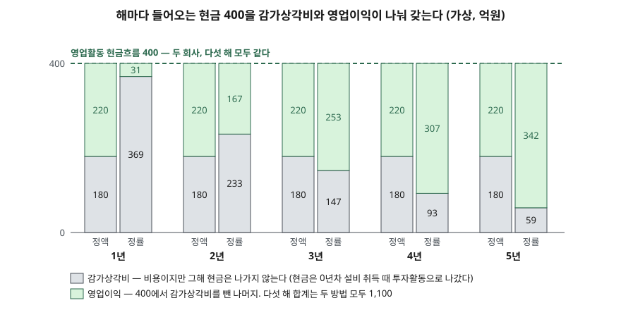

> 예제의 회사 `거너정밀`·`더러정밀`과 모든 숫자는 계산 원리를 보이려고 만든 가상 값이다. 실제 기업과 관계가 없다.

## 들어가며

가게를 열며 1,000만 원짜리 장비를 들여놓은 사람이 첫해 장부를 정리하다 보면 한 가지에서 막힌다. 그해 통장에서 1,000만 원이 나갔으니 첫해 비용으로 전부 잡으면 첫해는 큰 적자, 이듬해부터는 장비 값이 한 푼도 안 들어간 흑자가 된다. 장비는 5년을 쓰는데 이익은 첫해에만 무너지는 것이다. 그래서 대부분은 "5년 쓰니 해마다 200씩"처럼 나눠 적는데, 그렇게 나누고 나면 이번에는 해마다 200씩 비용이 잡히는데 통장에서는 아무것도 안 나가는 해가 네 번 이어진다. 이 어긋남이 감가상각이고, 현금흐름표가 이익에 감가상각비를 다시 더하는 이유다.

## 개념

유형자산 기준서는 감가상각을 "자산의 감가상각대상금액을 그 자산의 내용연수에 걸쳐 체계적으로 배분하는 것"으로 정의한다(K-IFRS 제1016호 문단 6). 정의에 나오는 말은 셋이다.

| 용어 | 기준서 정의 (문단 6) | 예제 값 |
|---|---|---|
| 감가상각대상금액 | 원가에서 잔존가치를 뺀 금액 | 1,000 − 100 = 900 |
| 내용연수 | 기업이 자산을 쓸 수 있을 것으로 예상하는 기간(또는 생산량) | 5년 |
| 잔존가치 | 내용연수가 끝났다고 가정하고 지금 처분하면 받을 금액에서 처분 부대원가를 뺀 추정치 | 100 |

정의의 핵심은 **배분**이다. 감가상각은 설비의 시장 가치가 얼마나 떨어졌는지 재는 절차가 아니라, 이미 쓴 원가를 쓰는 기간에 나눠 비용으로 옮기는 절차다. 그래서 감가상각비가 잡히는 해에는 현금이 움직이지 않는다. 현금은 설비를 산 해에 한꺼번에 나갔고, 현금흐름표는 그것을 투자활동 유출로 이미 적었다.

얼마씩 나누는지는 회사가 고른다. 기준서는 방법이 자산의 미래경제적효익이 소비될 것으로 예상되는 형태를 반영해야 한다고만 정하고(문단 60), 정액법·체감잔액법·생산량비례법을 예로 든다(문단 62).

- **정액법**: 내용연수 동안 해마다 같은 금액
- **체감잔액법**: 앞쪽 해에 많고 뒤로 갈수록 줄어드는 금액. 기초 장부금액에 같은 비율을 곱하는 정률법이 이 방식의 하나다
- **생산량비례법**: 예상 생산량에 비례한 금액

기준서는 정률법의 상각률을 식으로 정하지 않는다. 이 글은 해마다 기초 장부금액에 같은 비율을 곱해 내용연수 끝에 정확히 잔존가치가 남게 하는 비율, 1 − (잔존가치 ÷ 원가)^(1/내용연수)를 썼고, 5년차 말 장부금액이 100이 되는지 코드로 확인했다.

## 구조



> **출처**: [K-IFRS 제1016호 유형자산 — 문단 6 감가상각 정의, 50 체계적 배분, 62 감가상각방법](https://accountingwiki.co.kr/standards/1016) (제3자 전재) · [K-IFRS 제1007호 현금흐름표 — 문단 20 간접법 조정 항목](https://www.samili.com/acc/IfrsKijun.asp?bCode=1978-1007) (제3자 전재)

막대 하나의 높이는 그해 영업활동 현금흐름 400이고, 열 개 모두 같다. 달라지는 것은 그 400 안에서 회색(감가상각비)과 초록(영업이익)이 나뉘는 자리뿐이다. 정액법 막대는 다섯 해 모두 같은 자리에서 나뉘고, 정률법 막대는 첫해에 회색이 거의 다를 차지했다가 해마다 초록에 자리를 내준다. 어느 방법이든 다섯 해 회색을 모두 더하면 900, 초록을 더하면 1,100이다.

## 동작 원리

### 이익은 비용을 나누는 방식에 따라 움직인다

감가상각비는 당기손익으로 인식한다(문단 48). 매출원가나 판매관리비에 들어가 영업이익을 줄인다. 방법이 다르면 해마다 줄이는 몫이 다르므로 해마다 영업이익이 다르다. 그러나 전 기간에 걸쳐 배분할 총액은 감가상각대상금액 900으로 정해져 있으므로, 내용연수 전체의 이익 합계는 방법과 무관하게 같다.

### 현금은 설비를 산 해에 한 번 움직인다

설비 대금 1,000은 0년차에 투자활동 현금흐름 유출로 나간다. 1~5년차에 감가상각비를 적을 때는 현금이 움직이지 않는다. 간접법은 당기순이익에서 출발하므로, 이익을 줄였지만 현금은 안 나간 감가상각비를 다시 더해 영업활동 현금흐름을 구한다(제1007호 문단 20). 그래서 감가상각방법을 바꿔도 영업활동 현금흐름은 그대로다.

### 장부금액은 방법이 만든 숫자다

재무상태표의 설비 금액은 원가에서 그때까지의 감가상각누계액을 뺀 장부금액이다. 같은 날 같은 설비라도 정률법을 쓴 회사의 장부금액이 더 작다. 이 차이는 설비를 팔 때 처분손익으로 드러난다.

## 실습 예제

거너정밀과 더러정밀은 0년차 말에 똑같은 설비를 1,000에 사고 5년 동안 해마다 감가상각 전 영업이익 400을 번다. 법인세는 두지 않았고, 400은 전부 그해 현금으로 받는다고 뒀다. 다른 것은 감가상각방법뿐이다. 금액 단위는 억원이다.

전체 소스: [`code/`](code/) · 수행 기록: [`code/output.txt`](code/output.txt)

```text
[2] 더러정밀(정률법) — 연도별
  연도  감가상각비  기말 장부금액  영업이익  영업CF(간접법)
   1년       369.0          631.0      31.0          400.0
   2년       232.9          398.1     167.1          400.0
   3년       146.9          251.2     253.1          400.0
   4년        92.7          158.5     307.3          400.0
   5년        58.5          100.0     341.5          400.0
  합계       900.0                   1100.0         2000.0

[4] 1년차 이익 차이
  영업이익  정액 220.0  정률 31.0  차이 189.0  (정률 쪽 이익이 정액의 14%)

[5] 2년차 말에 설비를 500에 판다면
  거너정밀(정액법)  장부금액 640.0  처분손익 -140.0  2년 감가상각비 360.0 − 처분손익 = 설비가 이익에서 뺀 총액 500.0
  더러정밀(정률법)  장부금액 398.1  처분손익 +101.9  2년 감가상각비 601.9 − 처분손익 = 설비가 이익에서 뺀 총액 500.0
  두 회사 모두 원가 1,000 − 매각대금 500 = 500
```

정액법 연도별 표(해마다 180)와 `[1]`의 계산식, `[3]`의 5년 현금 합계는 [`code/output.txt`](code/output.txt)에 있다.

정률 상각률은 0.3690이다. 첫해에 원가 1,000의 36.9%인 369를 비용으로 잡고, 이듬해에는 줄어든 장부금액 631에 같은 비율을 곱한다. 비율은 같지만 곱하는 대상이 줄어드므로 비용이 해마다 준다. 5년차 말 장부금액이 정확히 100으로 끝나는 것은 상각률을 그렇게 정했기 때문이다.

`[4]`가 이 글의 요점이다. 같은 설비로 같은 현금을 번 두 회사의 1년차 영업이익이 220과 31로 7배 넘게 벌어진다. 영업활동 현금흐름은 둘 다 400이다. 영업이익만 나란히 놓으면 더러정밀의 첫해 수익성이 크게 나빠 보이지만, 실제로 달라진 것은 비용을 어느 해에 몰아 적었느냐뿐이다. 3년차부터는 순서가 뒤집혀 더러정밀의 이익(253.1)이 거너정밀(220)보다 크다. 다섯 해 합계는 1,100으로 같다. `[3]`에서 보듯 설비 취득 −1,000, 영업활동 현금 +2,000, 잔존가치 회수 +100을 더한 순현금 1,100과 이익 합계 1,100도 같다. 기간을 전체로 늘리면 이익과 현금은 결국 맞아떨어진다.

`[5]`는 2년차 말에 설비를 500에 파는 경우다. 장부금액이 다르므로 거너정밀은 처분손실 140, 더러정밀은 처분이익 101.9를 적는다. 그런데 2년간 감가상각비에서 처분손익을 뺀 값은 두 회사 모두 500이다. 원가 1,000에서 매각대금 500을 뺀, 설비에 실제로 들어간 순현금과 같다. 감가상각을 덜 한 쪽은 팔 때 손실로, 더 한 쪽은 이익으로 차이를 되돌린다.

## 실무에서 주의할 점

- **감가상각방법과 내용연수는 주석에서 먼저 확인한다.** 같은 업종 두 회사의 영업이익률을 비교할 때 한쪽이 정률법이거나 내용연수를 짧게 잡았다면 이익 차이의 일부는 비용 배분 방식에서 온다. 기준서는 잔존가치·내용연수·방법을 적어도 매 회계연도 말에 재검토하고 바뀌면 회계추정의 변경으로 처리하게 한다(문단 51·61). 내용연수를 늘리는 변경이 있으면 그해부터 감가상각비가 줄어 이익이 늘어나므로, 주석에서 변경 사실과 금액을 찾는다.
- **감가상각비가 크다는 것은 과거에 설비 투자를 많이 했다는 뜻이다.** 감가상각비를 더한 영업활동 현금흐름이 이익보다 크게 나오는 회사는 흔하다. 그러나 설비는 닳으므로 결국 다시 사야 하고, 그 현금은 투자활동으로 나간다. 감가상각비와 설비 취득액을 여러 해 나란히 놓고 설비 규모를 유지하는 데 얼마가 드는지 본다.
- **처분손익은 감가상각의 정산이다.** 설비 처분이익이 크게 잡힌 해에는 그동안 감가상각을 많이 해 장부금액이 작았던 결과일 수 있다. 영업 외 일회성 이익으로 따로 떼어 읽고, 그 해 영업이익과 섞어 수익성을 판단하지 않는다.
- **이 글의 예제는 법인세를 뺐다.** 법인세가 있으면 비용이 먼저 잡히는 만큼 세금 납부 시기도 달라질 수 있어 현금흐름이 두 방법 사이에서 완전히 같지는 않다. 세금 계산에 쓰는 감가상각은 회계 기준이 아니라 세법의 규정을 따르므로, 이 부분은 이 글의 범위 밖에 두었다.

## 정리

- 감가상각은 설비에 이미 쓴 원가를 내용연수에 걸쳐 비용으로 나누는 배분 절차이고, 비용이 잡히는 해에는 현금이 움직이지 않는다.
- 정액법은 해마다 같은 금액을, 정률법은 기초 장부금액에 같은 비율을 곱해 앞쪽 해에 더 많이 배분한다.
- 방법이 달라도 해마다의 영업활동 현금흐름과 내용연수 전체의 이익 합계는 같다. 달라지는 것은 해마다의 이익과 장부금액이다.
- 중간에 설비를 팔면 처분손익이 두 방법의 감가상각 차이를 되돌린다.

## 참고 자료

- [한국회계기준원 — 시행 중인 K-IFRS 기준서 목록](https://www.kasb.or.kr/front/board/ingAccountingList.do) — 기준서 원문(PDF·HWP) 발행처. 아래 전재 사이트는 문단을 바로 열기 위한 편의 링크다
- [K-IFRS 제1016호 유형자산 — 문단 6 용어 정의, 48 당기손익 인식, 50 체계적 배분, 51·61 재검토, 60·62 감가상각방법](https://accountingwiki.co.kr/standards/1016) (제3자 전재)
- [K-IFRS 제1007호 현금흐름표 — 문단 20 간접법 조정 항목](https://www.samili.com/acc/IfrsKijun.asp?bCode=1978-1007) (제3자 전재)
- [IFRS Foundation — IAS 16 Property, Plant and Equipment](https://www.ifrs.org/issued-standards/list-of-standards/ias-16-property-plant-and-equipment/)
- [IFRS Foundation — IAS 7 Statement of Cash Flows](https://www.ifrs.org/issued-standards/list-of-standards/ias-7-statement-of-cash-flows/)
