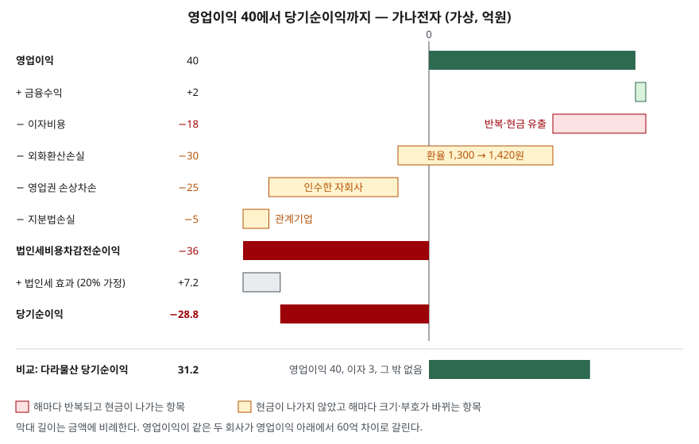

> 예제의 회사 `가나전자`·`다라물산`과 모든 숫자는 계산 원리를 보이려고 만든 가상 값이다. 실제 기업과 관계가 없다.

## 들어가며

분기 실적 공시를 보면 "영업이익 40억, 흑자 유지"와 "당기순손실 29억, 적자 전환"이 같은 회사의 같은 분기 기사 제목으로 나란히 뜰 때가 있다. 둘 중 어느 쪽을 믿어야 하나 싶어 기사를 몇 개 더 열어 보지만, 기사마다 앞세우는 숫자만 다를 뿐 둘이 왜 70억 가까이 벌어졌는지는 대개 적혀 있지 않다. 답은 손익계산서의 영업이익 줄과 법인세비용차감전순이익 줄 사이, 많아야 다섯 줄 안에 있다. 그 다섯 줄을 반복되는가, 현금이 나갔는가 두 기준으로 나누면 어느 숫자가 내년에도 이어질지가 갈린다.

## 개념

앞 글 [손익계산서 다섯 단계](../2026-09-29-income-statement-five-steps/index.md)에서 영업이익은 국내 기준이 수익 − 매출원가 − 판매비와관리비로 정의한 값이고(K-IFRS 제1001호 문단 한138.2), 그 아래는 본업 밖의 거래라고 했다. 이 글은 그 "아래"를 들여다본다.

재무제표 표시 기준서의 당기손익 표시 항목 조항(문단 82)은 금융원가, 관계기업·공동기업의 지분법 손익, 법인세비용, 중단영업 합계를 당기손익 부분에 표시하라고 정한다. 이어 중요한 수익·비용 항목은 성격과 금액을 따로 공시하라고 하고(문단 97), 그런 항목의 예로 자산 감액과 그 환입, 구조조정, 유형자산 처분, 중단영업, 소송 해결, 충당부채 환입을 든다(문단 98). 영업이익과 순이익을 크게 벌리는 것은 대부분 이 목록 안에 있다.

| 항목 | 어디서 생기나 | 근거 기준서 |
|---|---|---|
| 이자비용(금융원가) | 차입금·사채의 이자 | 제1001호 문단 82 |
| 외환차이 | 외화 부채·채권을 기말 환율로 다시 잰 차이 | 제1021호 문단 23·28 |
| 손상차손 | 자산의 회수가능액이 장부금액보다 낮아짐 | 제1036호 문단 58~64 |
| 지분법손익 | 지분을 가진 관계기업의 이익·손실 중 내 몫 | 제1001호 문단 82 |
| 중단영업손익 | 처분했거나 처분하기로 한 사업부의 손익 | 제1001호 문단 82 |

## 구조



> **출처**: [K-IFRS 제1001호 재무제표 표시 — 문단 82 당기손익 표시 항목, 97·98 중요한 항목의 별도 공시](https://accountingwiki.co.kr/standards/1001) · [K-IFRS 제1021호 환율변동효과 — 문단 23 후속 보고기간말 환산, 28 외환차이 인식](https://www.samili.com/acc/IfrsKijun.asp?bCode=1978-1021) · [K-IFRS 제1036호 자산손상 — 문단 58~64 손상차손 인식](https://www.samili.com/acc/IfrsKijun.asp?bCode=1978-1036) (기준서 원문 게재)

막대는 금액에 비례한다. 분홍은 해마다 반복되고 실제로 현금이 나간 항목, 노랑은 현금이 나가지 않았고 해마다 크기와 부호가 바뀌는 항목이다. 가나전자에서 영업이익 40을 적자로 끌어내린 76 가운데 60이 노랑이다.

## 동작 원리

### 이자비용 — 조달 방식이 매년 떼어 가는 몫

이자는 차입금이 남아 있는 한 해마다 나간다. 영업이익이 같아도 빚이 많은 회사는 이 줄에서 매년 더 많이 빠진다. 반복되고 현금이 실제로 나가는 항목이라 다섯 줄 중 내년 예측에 가장 그대로 쓰인다.

### 외화환산손실 — 현금은 그대로인데 부채가 커진다

달러로 빌린 돈은 원화 장부에 적을 때 환율을 곱한다. 환율 변동 기준서는 외화 부채 같은 화폐성 항목을 보고기간 말 환율로 다시 환산하게 하고(문단 23), 그 차이를 당기손익으로 인식하게 한다(문단 28). 갚은 돈도 받은 돈도 없는데 환율이 오르면 원화로 잰 부채가 늘어 손실이 잡힌다. 환율이 내리면 같은 부채에서 이익이 잡힌다. 부호가 해마다 바뀔 수 있다는 점이 이자와 다르다.

### 손상차손 — 과거에 치른 값을 다시 매긴다

회사를 인수하면서 순자산보다 더 준 값은 영업권이라는 자산으로 남는다. 인수한 사업이 기대만큼 벌지 못해 회수가능액이 장부금액보다 낮아지면 그 차이를 손상차손으로 당기손익에 반영한다(제1036호 문단 58~64). 돈은 인수할 때 이미 나갔고, 손상차손은 그 값을 장부에서 깎는 것이다. 영업권은 한 번 손상하면 나중에 가치가 회복돼도 되돌리지 않는다(문단 124).

### 지분법손실 — 남의 회사 실적 중 내 몫

지분을 20% 안팎 가진 관계기업이 손실을 내면 그 손실 가운데 지분율만큼이 내 손익계산서에 들어온다. 관계기업이 배당을 주지 않는 한 현금은 오가지 않는다. 내 본업과 무관하게 관계기업의 실적에 따라 크기가 바뀐다.

## 실습 예제

두 회사는 매출 500, 영업이익 40으로 같다. 가나전자에만 달러 차입금 2,500만 달러, 인수한 자회사의 영업권, 손실을 낸 관계기업이 있다. 법인세는 실제 세율과 무관하게 세전이익의 20%로 가정했고, 손실이 나도 같은 비율로 세금 효과를 잡았다. 금액 단위는 억원이다.

전체 소스: [`code/`](code/) · 수행 기록: [`code/output.txt`](code/output.txt)

```text
[1] 영업이익에서 당기순이익까지
  항목                       가나전자      다라물산
  영업이익                      40          40
  금융수익                       2           2
  이자비용                     -18          -3
  외화환산손실                   -30           0
  영업권손상차손                  -25           0
  지분법손실                     -5           0
  법인세비용차감전순이익              -36          39
  당기순이익                  -28.8        31.2

[2] 외화환산손실은 어디서 왔나 — 달러 차입금 2,500만 달러
  기초 1,300원 → 원화 325억
  기말 1,420원 → 원화 355억
  부채가 늘어난 만큼 손실 -30억 (현금은 한 푼도 안 나갔다)

[3] 가나전자 영업이익과 세전이익의 차이 76억을 성격별로 나누면
  외화환산손실         -30   환율에 따라 부호가 바뀜  현금 아님
  영업권손상차손        -25   일회성            현금 아님
  이자비용           -18   반복             현금
  지분법손실           -5   관계기업 실적에 따름    현금 아님
  금융수익             2   반복             현금
  현금이 나가지 않은 항목 합계 -60

[4] 내년 환율만 바꿔 보면 — 손상차손은 다시 안 생긴다고 두고, 나머지는 올해와 같게
  기말 환율         외화환산손익      세전이익     당기순이익
  1,300                 30          49        39.2
  1,420                  0          19        15.2
  1,540                -30         -11        -8.8
```

매출액·법인세 줄을 포함한 전체 표는 [`code/output.txt`](code/output.txt)에 있다.

`[1]`에서 두 회사는 영업이익 줄까지 같고 당기순이익은 −28.8과 31.2로 60 차이가 난다. `[3]`은 가나전자의 76이 어떤 성격인지 보여 준다. 해마다 반복되고 현금이 나간 것은 이자 18(금융수익 2를 빼면 16)뿐이고, 나머지 60은 환산손실·손상차손·지분법손실처럼 그해 현금 유출이 없었던 항목이다. 당기순손실 −28.8을 보고 "올해 현금 29억을 잃었다"고 읽으면 틀린다. 현금이 어떻게 움직였는지는 다음 글에서 볼 현금흐름표에 따로 있다.

`[4]`는 같은 달러 부채가 다음 해를 얼마나 흔드는지 보여 준다. 손상차손은 다시 안 생긴다고 두고 환율만 바꿨다. 환율이 제자리면 순이익 15.2, 1,300원으로 돌아오면 39.2, 1,540원으로 더 오르면 −8.8이다. 본업의 영업이익 40은 세 경우 모두 같다. 가나전자의 당기순이익은 영업보다 환율에 더 크게 반응하는 구조다.

코드의 `[5]`는 영업이익을 이자비용으로 나눈 값을 계산한다. 가나전자 2.2배, 다라물산 13.3배다. 이 비율은 이자보상배율이라는 이름으로 비율 분석 편에서 따로 다룬다.

## 실무에서 주의할 점

- **적자의 성격부터 나눈다.** 순손실이 났을 때 영업이익 아래 항목을 반복 여부와 현금 유출 여부로 가르면, 같은 −28.8도 매년 이어질 손실인지 올해 장부에서 한 번 깎인 값인지 구분된다. 일회성 항목을 빼고 본 값이 늘 맞는 것도 아니다. 해마다 "일회성" 손상이 나는 회사라면 그것도 반복이다.
- **외환차이가 어느 줄에 있는지는 회사마다 다르다.** 차입금에서 생긴 외환차이를 금융원가에 넣는 회사도 있고 기타손익에 넣는 회사도 있다. 예제는 따로 한 줄로 떼어 두었다. 두 회사를 비교하기 전에 주석의 금융수익·금융원가, 기타수익·기타비용 내역을 열어 같은 항목끼리 맞춘다.
- **손상차손은 과거 결정의 결과를 늦게 보여 준다.** 영업권 손상은 인수 대가를 많이 치렀다는 사실이 몇 년 뒤 장부에 반영된 것이다. 올해 현금은 나가지 않았지만, 당시 나간 현금이 기대만큼 돌아오지 않는다는 판단이 담겨 있다. 영업권은 손상을 환입하지 않으므로 이 손실이 이익으로 되돌아오는 일도 없다.
- **2027년부터 이 구간의 모양이 바뀐다.** K-IFRS 제1118호 '재무제표 표시와 공시'가 2027년 1월 1일 이후 시작하는 회계연도부터 제1001호를 대체한다. 손익을 영업·투자·재무 범주로 나누므로, 현행 영업이익 밖에 있던 항목 일부가 새 기준의 영업손익 안으로 들어올 수 있다. 2026년과 2027년의 영업이익과 순이익의 차이를 이어 볼 때는 어느 기준으로 작성된 표인지부터 확인한다.

## 정리

- 영업이익과 법인세비용차감전순이익 사이에는 금융원가, 외환차이, 손상차손, 지분법손익, 기타손익이 끼어든다.
- 이 항목들을 반복되는가, 그해 현금이 나갔는가로 나누면 순이익 가운데 내년에도 이어질 몫이 드러난다.
- 이자는 반복되고 현금이 나가며, 외화환산손실·손상차손·지분법손실은 대개 현금 유출 없이 장부 금액만 바꾼다.
- 영업이익이 같아도 부채 구조와 과거 인수 결정에 따라 당기순이익은 흑자와 적자로 갈릴 수 있다.

## 참고 자료

- [K-IFRS 제1001호 재무제표 표시 — 문단 82 당기손익 표시 항목, 97·98 중요한 항목의 별도 공시, 한138.2 영업이익](https://accountingwiki.co.kr/standards/1001) (기준서 원문 게재)
- [K-IFRS 제1021호 환율변동효과 — 문단 23 후속 보고기간말 환산, 28 외환차이 인식](https://www.samili.com/acc/IfrsKijun.asp?bCode=1978-1021) (기준서 원문 게재)
- [K-IFRS 제1036호 자산손상 — 문단 58~64 손상차손 인식, 124 영업권 손상차손 환입 금지](https://www.samili.com/acc/IfrsKijun.asp?bCode=1978-1036) (기준서 원문 게재)
- [금융위원회 보도자료 — 27년부터 K-IFRS 손익계산서가 변경 (2025-12-18)](https://www.fsc.go.kr/no010101/85886)
- [IFRS Foundation — IAS 1 Presentation of Financial Statements](https://www.ifrs.org/issued-standards/list-of-standards/ias-1-presentation-of-financial-statements/)
- [IFRS Foundation — IAS 21 The Effects of Changes in Foreign Exchange Rates](https://www.ifrs.org/issued-standards/list-of-standards/ias-21-the-effects-of-changes-in-foreign-exchange-rates/)
- [IFRS Foundation — IAS 36 Impairment of Assets](https://www.ifrs.org/issued-standards/list-of-standards/ias-36-impairment-of-assets/)
