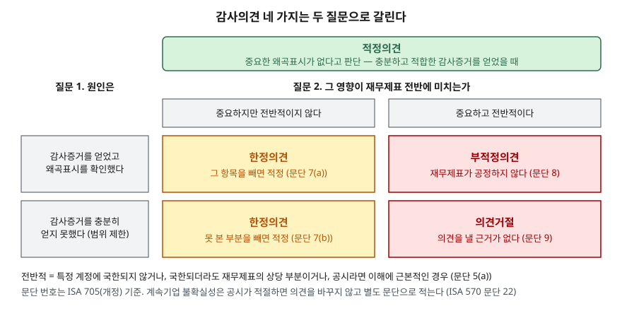

> **실행 검증 없음.** 계산이 없는 용어·제도 글이라 회계기준서, 국제감사기준, 거래소 규정의 정의를 정리했다. 예제의 회사 `마바산업`과 그 감사보고서·주석 문구는 설명을 위해 만든 가상 자료다.

## 들어가며

재무제표를 처음 펴는 사람은 대개 재무상태표와 손익계산서의 숫자부터 본다. 매출과 이익, 부채비율을 확인하고 나면 그 뒤에 수십 쪽 이어지는 주석은 넘기고, 맨 앞의 감사보고서는 형식적인 인사말로 여긴다. 그런데 회사가 소송에서 지면 수백억을 물어야 하는 사정은 재무상태표 어디에도 숫자로 나오지 않고 주석 한 문단에만 적힌다. 감사인이 숫자를 믿을 수 없다고 판단했다는 사실은 감사보고서 첫 쪽의 한 단어로 표시된다. 본문 숫자를 아무리 꼼꼼히 계산해도 이 두 자리를 건너뛰면 그 숫자를 믿어도 되는지를 모른 채 읽게 된다.

## 개념

### 주석은 재무제표의 일부다

재무제표 표시 기준서는 전체 재무제표를 재무상태표·포괄손익계산서·자본변동표·현금흐름표와 **주석**으로 구성한다(K-IFRS 제1001호 문단 10). 주석은 부록이 아니라 재무제표 그 자체다. 같은 기준서는 주석에 담을 것으로 재무제표 작성 근거와 회계정책, 기준서가 요구하지만 본문에 표시하지 않은 정보, 본문에 없지만 이해에 필요한 정보를 든다(문단 112).

본문의 숫자는 결과이고 주석은 그 숫자를 만든 방법과 숫자에 담기지 않은 사정이다. 앞의 글에서 다룬 [감가상각방법과 내용연수](../2026-09-30-depreciation-non-cash-expense/index.md), [매출채권 연령 분석과 재고 평가손실](../2026-10-01-receivables-inventory-turnover/index.md)이 전부 주석에 있다.

### 본문에 숫자가 없는 정보 — 두 가지

| 항목 | 기준서 | 본문에 나오는가 | 주석에 적는 것 |
|---|---|---|---|
| 우발부채 | 제1037호 문단 10·27·86 | 인식하지 않는다 | 성격, 추정 재무 영향, 금액·시기의 불확실성, 변제 가능성 |
| 특수관계자 거래 | 제1024호 문단 13·18 | 일반 거래와 섞여 있다 | 관계의 성격, 거래 금액, 채권·채무 잔액과 조건, 손실충당금 |

우발부채는 과거 사건에서 생겼지만 회사가 통제할 수 없는 미래 사건이 일어나야 존재가 확인되는 의무다(제1037호 문단 10). 충당부채는 현재의무가 있고, 자원이 빠져나갈 가능성이 높고, 금액을 신뢰성 있게 추정할 수 있다는 세 요건을 모두 갖춰야 재무상태표에 부채로 잡는다(문단 14). 요건을 못 갖추면 부채로 잡지 않고(문단 27), 유출 가능성이 아주 낮은 경우가 아니면 주석에 적는다(문단 28·86). 소송·지급보증이 주로 여기에 해당한다. 패소 가능성이 높다고 판단되기 전까지는 재무상태표 부채에 한 푼도 반영되지 않는다.

특수관계자는 회사를 지배하거나 유의적 영향력을 가진 자, 주요 경영진과 그 가족, 계열사 등이다(제1024호 문단 9). 이들과의 거래는 일반 거래와 같은 계정에 섞여 손익계산서에 들어가므로, 매출 가운데 얼마가 계열사에서 나왔는지는 주석을 봐야 안다. 지배·종속 관계는 거래가 없어도 공시한다(문단 13).

### 감사의견 — 숫자를 믿어도 되는지에 대한 판단

외부감사인은 재무제표가 회계기준에 따라 중요한 부분에서 공정하게 작성됐는지를 감사하고 의견을 낸다. 국제감사기준 ISA 700은 그렇다고 결론 내릴 때 적정의견을 내게 하고, ISA 705는 그렇지 않은 경우를 한정·부적정·의견거절 세 가지로 나눈다. 한국의 회계감사기준은 국제감사기준을 받아들여 같은 번호 체계를 쓴다.

## 구조



> **출처**: [IAASB, ISA 705 (Revised) — 문단 5(a) Pervasive 정의, 7 Qualified, 8 Adverse, 9 Disclaimer](https://www.ifac.org/_flysystem/azure-private/publications/files/ISA-705-Revised_0.pdf) · [IAASB, ISA 700 (Revised) — 적정의견](https://www.ifac.org/_flysystem/azure-private/publications/files/ISA-700-Revised_8.pdf)

감사의견은 두 질문으로 갈린다. 첫째는 원인이다. 감사증거를 충분히 얻었는데 왜곡표시를 찾았는가, 아니면 감사증거 자체를 충분히 얻지 못했는가(감사범위 제한). 둘째는 영향의 범위다. 중요하지만 특정 항목에 국한되는가, 아니면 재무제표 전반에 미치는가. 기준서는 "전반적"을 특정 계정에 국한되지 않거나, 국한되더라도 재무제표의 상당 부분을 차지하거나, 공시라면 재무제표 이해에 근본적인 경우로 정한다(ISA 705 문단 5(a)).

영향이 국한되면 원인이 무엇이든 한정의견이다. 전반적이면 원인에 따라 갈린다. 왜곡표시를 확인했으면 재무제표가 공정하지 않다는 부적정의견, 증거를 못 얻었으면 의견을 낼 근거가 없다는 의견거절이다.

## 동작 원리

### 감사의견이 시장에서 일으키는 일

감사의견은 거래소 규정과 바로 이어진다. 정부 법령정보 서비스의 유가증권시장 정리(2026.9.15 기준)에 따르면 감사보고서 한정의견은 관리종목 지정 사유이고, 부적정·의견거절·2년 연속 한정은 상장폐지 사유다. 2025년 7월 시행된 상장규정 개정은 감사의견 미달을 해소하지 못한 채 다음 사업연도에도 부적정·의견거절·감사범위 제한 한정을 받으면 이의신청 절차 없이 상장폐지하는 조항(제48조제1항제2호의2)을 더했다. 코스닥시장은 별도 규정을 따르므로 조건이 다르다.

### 의견이 적정이어도 읽어야 할 문단

감사보고서에는 의견 말고도 문단이 더 붙는다.

- **계속기업 관련 중요한 불확실성**: 회사가 계속 영업할 수 있을지 의심스러운 사정이 있고 경영진이 이를 주석에 적절히 공시했으면, 감사인은 의견을 바꾸지 않고 별도 문단을 둔다(ISA 570 문단 22). 공시가 적절하지 않으면 한정이나 부적정이 된다
- **핵심감사사항**: 상장회사 감사에서 감사인이 가장 유의적이라고 판단한 사항을 적는다(ISA 701). 감사인이 어느 계정을 가장 위험하게 봤는지가 드러난다

## 실습 예제 — 가상 감사보고서 읽기

마바산업(가상)의 감사보고서와 주석에서 읽을 자리를 순서대로 짚는다. 계산은 없다.

```text
[감사의견]          적정
[계속기업 관련 중요한 불확실성]
  주석 2에 기술된 바와 같이 당기 순손실이 발생하였고 유동부채가 유동자산을 초과한다
[핵심감사사항]      종속회사 대여금의 회수가능성 평가
[주석 25 우발부채]  손해배상 청구소송 피소 1건, 청구금액 120억원. 결과를 예측할 수 없어 충당부채를 인식하지 않음
[주석 28 특수관계자] 종속회사 마바물류에 대한 매출 340억원(전체 매출의 38%), 대여금 잔액 90억원
```

의견은 적정이지만 이 감사보고서가 말하는 것은 많다. 계속기업 문단은 감사인이 회사의 존속 자체에 불확실성이 있다고 봤다는 뜻이다. 핵심감사사항과 특수관계자 주석을 이으면 그 대여금 90억원의 상대가 매출의 38%를 차지하는 종속회사라는 것이 보인다. 120억원 소송은 재무상태표 부채에 들어 있지 않으므로, 부채비율을 계산할 때 이 금액이 빠져 있다는 점을 따로 적어 둬야 한다. 이 중 어느 것도 손익계산서와 재무상태표의 숫자만 보면 나오지 않는다.

## 실무에서 주의할 점

- **적정의견은 회사가 건전하다는 판정이 아니다.** 적정은 재무제표가 회계기준에 맞게 작성됐다는 뜻이다. 적자가 크거나 부채가 많아도 그 사실을 정확히 적었으면 적정이다. 의견과 별개로 계속기업 문단과 핵심감사사항을 확인한다.
- **한정의견은 사유가 두 갈래다.** 왜곡표시가 있어서인지, 감사범위 제한인지를 감사보고서의 의견근거 문단에서 확인한다. 거래소 규정도 감사범위 제한에 따른 한정을 따로 다룬다.
- **우발부채는 금액이 있어도 부채가 아니다.** 주석의 소송·지급보증 금액은 재무상태표에 없으므로 부채비율 같은 비율에 반영되지 않는다. 금액이 자기자본에 견줘 큰지는 주석을 직접 읽어 판단한다.
- **특수관계자 비중이 크면 매출의 성격이 다르다.** 계열사 매출은 거래 조건을 회사가 정할 수 있으므로, 외부 고객 매출과 같은 무게로 읽지 않는다. 주석의 거래 금액을 연도별로 놓고 비중이 갑자기 늘어난 해가 있는지 본다.
- **규정은 바뀐다.** 이 글의 거래소 규정은 2025년 7월 개정 기준이다. 적용 시점의 규정을 한국거래소 법규서비스에서 다시 확인한다.

## 정리

- 주석은 재무제표의 일부이고, 본문 숫자를 만든 방법과 숫자에 담기지 않은 사정이 여기에 있다.
- 우발부채는 부채로 잡지 않고 주석에만 적으며, 특수관계자 거래는 본문에 섞여 있어 주석을 봐야 분리된다.
- 감사의견 네 가지는 원인(왜곡표시인가, 증거 부족인가)과 범위(전반적인가) 두 질문으로 갈린다.
- 유가증권시장에서 한정은 관리종목, 부적정·의견거절은 상장폐지 사유이고, 적정이어도 계속기업 문단과 핵심감사사항을 읽는다.

## 참고 자료

- [한국회계기준원 — 시행 중인 K-IFRS 기준서 목록](https://www.kasb.or.kr/front/board/ingAccountingList.do) — 기준서 원문(PDF·HWP) 발행처. 아래 전재 사이트는 문단을 바로 열기 위한 편의 링크다
- [K-IFRS 제1001호 재무제표 표시 — 문단 10 전체 재무제표, 112 주석](https://accountingwiki.co.kr/standards/1001) (제3자 전재)
- [K-IFRS 제1037호 충당부채, 우발부채, 우발자산 — 문단 10 정의, 14 인식 요건, 27·28·86 우발부채](https://accountingwiki.co.kr/standards/1037) (제3자 전재)
- [K-IFRS 제1024호 특수관계자 공시 — 문단 9 정의, 13 지배·종속 관계, 18 거래 공시](https://accountingwiki.co.kr/standards/1024) (제3자 전재)
- [IAASB, ISA 700 (Revised) Forming an Opinion and Reporting on Financial Statements](https://www.ifac.org/_flysystem/azure-private/publications/files/ISA-700-Revised_8.pdf)
- [IAASB, ISA 705 (Revised) Modifications to the Opinion in the Independent Auditor's Report](https://www.ifac.org/_flysystem/azure-private/publications/files/ISA-705-Revised_0.pdf) — 2016년 12월 15일 이후 종료하는 회계기간부터 적용
- [IAASB, ISA 701 Communicating Key Audit Matters](https://www.ifac.org/_flysystem/azure-private/publications/files/ISA-701.pdf)
- [찾기쉬운 생활법령정보 — 관리종목 지정 및 상장폐지](https://easylaw.go.kr/CSP/CnpClsMain.laf?popMenu=ov&csmSeq=1701&ccfNo=1&cciNo=2&cnpClsNo=2) — 법제처, 2026.9.15 기준
- [한국거래소 — 유가증권시장 상장규정 일부개정규정안(2025, 감사인 의견 미달 기준 강화)](https://kind.krx.co.kr/external/dst/notice/11337/(%EB%B6%99%EC%9E%842)%20%EC%9C%A0%EA%B0%80%EC%A6%9D%EA%B6%8C%EC%8B%9C%EC%9E%A5%20%EC%83%81%EC%9E%A5%EA%B7%9C%EC%A0%95%20%EC%9D%BC%EB%B6%80%EA%B0%9C%EC%A0%95%EA%B7%9C%EC%A0%95%EC%95%88.pdf)
