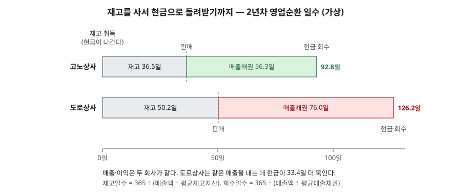

> 예제의 회사 `고노상사`·`도로상사`와 모든 숫자는 계산 원리를 보이려고 만든 가상 값이다. 실제 기업과 관계가 없다.

## 들어가며

재무상태표를 처음 읽는 사람은 자산이 늘면 좋은 소식으로 받아들인다. 회사가 가진 것이 늘었으니 그렇게 읽을 만하다. 그런데 매출이 20% 늘어난 해에 매출채권이 94%, 재고자산이 100% 늘었다면 이야기가 달라진다. 팔았지만 돈을 못 받은 것과 만들었지만 못 판 것이 쌓였다는 뜻이고, 그해 손익계산서의 이익은 그대로인데 통장에서는 현금이 빠져나간다. 이익과 자산 총액만 보면 이 차이를 찾을 수 없다. 두 항목을 매출액으로 나눠 보는 회전율이 이 차이를 숫자로 드러낸다.

## 개념

매출채권은 물건이나 용역을 넘기고 아직 받지 못한 대금이다. 재고자산은 기준서가 정상적인 영업과정에서 판매를 위해 보유하거나 생산 중이거나 생산에 쓸 원재료로 정의한다(K-IFRS 제1002호 문단 6). 둘 다 유동자산이고, 둘 다 언젠가 현금이 될 것으로 보고 자산으로 잡은 것이다.

위험은 "언젠가"에 있다. 매출채권은 거래처가 갚지 않으면 현금이 되지 않고, 재고는 안 팔리거나 값이 떨어지면 원가만큼의 현금이 되지 않는다. 기준서는 이 위험을 두 가지로 장부에 반영하게 한다.

| 항목 | 기준서 | 장부에 반영하는 방식 |
|---|---|---|
| 매출채권 | 제1109호 문단 5.5.15 | 전체기간 기대신용손실을 손실충당금으로 잡는다 |
| 재고자산 | 제1002호 문단 9·34 | 원가와 순실현가능가치 중 낮은 금액으로 측정하고, 깎은 금액은 그 기간 비용으로 잡는다 |

회전율은 이 두 자산이 1년 동안 매출로 몇 번 돌았는지를 센다. 한국은행 기업경영분석은 매출채권회전율과 재고자산회전율을 모두 **매출액 ÷ 해당 자산의 기초·기말 평균**으로 계산한다. 손익계산서 항목은 1년 동안 쌓인 값이고 재무상태표 항목은 한 시점의 값이라, 둘을 섞는 비율에서는 재무상태표 쪽을 기초와 기말의 평균으로 맞춘다는 설명이다. 회전율의 역수에 365를 곱하면 매출채권 쪽은 평균회수기간이 된다. 재고 쪽에 같은 계산을 하면 재고가 팔리기까지 걸리는 평균 일수가 된다.

## 구조



> **출처**: [K-IFRS 제1001호 재무제표 표시 — 문단 68 영업주기](https://accountingwiki.co.kr/standards/1001) (제3자 전재) · [한국은행, 『기업경영분석』 통계정보보고서(2019.12) — 계정과목 및 분석지표 해설 807 재고자산회전율, 809 매출채권회전율](https://mods.go.kr/boardDownload.es?bid=12030&list_no=379918&seq=1)

기준서는 영업주기를 영업활동에 쓸 자산을 취득한 시점부터 그 자산이 현금으로 실현되는 시점까지 걸리는 기간으로 정한다(제1001호 문단 68). 상품을 파는 회사라면 재고를 들여오는 순간 현금이 나가고, 그 재고가 팔려 매출채권이 되고, 매출채권이 회수되어야 현금이 돌아온다. 막대 하나가 그 한 바퀴다. 왼쪽 칸은 재고로 있는 기간, 오른쪽 칸은 매출채권으로 있는 기간이다. 두 칸의 길이를 더한 값이 길수록 같은 매출을 내는 데 현금이 오래 묶인다.

## 동작 원리

### 매출보다 빨리 늘면 회전율이 떨어진다

회전율의 분자는 매출액, 분모는 자산이다. 매출이 20% 늘 때 매출채권도 20% 늘면 회전율은 그대로다. 매출채권이 94% 늘면 분모가 분자보다 빨리 커지므로 회전율이 떨어지고 회수일수가 길어진다. 회전율 하락이 말하는 것은 하나다. **매출 한 단위를 만드는 데 그 자산이 전보다 더 많이 필요해졌다.**

### 이익은 그대로인데 현금이 빠진다

매출을 외상으로 잡으면 수익은 인식되지만 현금은 들어오지 않는다. 재고를 사면 현금은 나가지만 팔릴 때까지 비용이 되지 않는다. 그래서 간접법 현금흐름표는 당기순이익에서 매출채권과 재고자산의 증가액을 뺀다([현금흐름 세 갈래](../2026-09-30-cash-flow-three-activities/index.md)에서 다룬 조정이다). 두 자산이 크게 불어난 해에는 이익이 같아도 영업활동 현금흐름이 크게 줄거나 음수가 된다.

### 불어난 자산은 나중에 비용으로 돌아온다

오래 못 받은 채권일수록 못 받을 가능성이 크다. 기준서는 매출채권에 대해 실무적 간편법으로 연체 구간별 손실률을 곱하는 충당금설정률표를 쓸 수 있다고 적는다(제1109호 문단 B5.5.35). 오래 안 팔린 재고는 진부화나 가격 하락으로 순실현가능가치가 원가 밑으로 내려가기 쉽다(제1002호 문단 28). 두 경우 모두 깎은 금액이 그 기간 손익계산서에 비용으로 들어간다. 자산이 불어난 해의 이익에는 아직 이 비용이 반영되지 않았을 수 있다.

## 실습 예제

고노상사와 도로상사는 2년 동안 매출액(1,000 → 1,200), 매출원가, 영업이익(100 → 120)이 똑같다. 1년차까지는 매출채권과 재고자산도 같다. 2년차에 고노상사는 두 자산이 매출만큼 늘었고, 도로상사는 두 배 가까이 늘었다. 금액 단위는 억원이다.

전체 소스: [`code/`](code/) · 수행 기록: [`code/output.txt`](code/output.txt)

```text
[2] 회전율과 회전일수 — 평균잔액 기준 (한국은행 기업경영분석 산식)
              연도     채권평균     채권회전율     회수일수     재고평균     재고회전율     재고일수     영업순환
  고노상사         1      160     6.25회    58.4일      105     9.52회    38.3일    96.7일
  고노상사         2      185     6.49회    56.3일      120    10.00회    36.5일    92.8일
  도로상사         1      160     6.25회    58.4일      105     9.52회    38.3일    96.7일
  도로상사         2      250     4.80회    76.0일      165     7.27회    50.2일   126.2일

[5] 2년차 영업활동 현금흐름 (간접법, 법인세·감가상각·매입채무 변동 없음 가정)
  고노상사  영업이익 120 − 매출채권 증가 30 − 재고자산 증가 20 = +70
  도로상사  영업이익 120 − 매출채권 증가 160 − 재고자산 증가 110 = -150

[6] 2년차 말 손실충당금(충당금설정률표)과 재고 평가손실 — 연령 분포와 손실률은 가정
  구간                 손실률          고노상사          도로상사
  만기 전                1%     180 →  1.8     200 →  2.0
  1~30일 연체            3%      15 →  0.4      60 →  1.8
  31~90일 연체          10%       5 →  0.5      45 →  4.5
  90일 초과 연체          40%       0 →  0.0      25 → 10.0
                                합계 2.8       합계 18.3

  고노상사  장기재고 원가 10 → 순실현가능가치 9, 평가손실 1
            영업이익 120 − 손상차손 2.8 − 평가손실 1 = 116.2  (-3.1%)
  도로상사  장기재고 원가 60 → 순실현가능가치 30, 평가손실 30
            영업이익 120 − 손상차손 18.3 − 평가손실 30 = 71.7  (-40.2%)
```

두 회사의 잔액 표 `[1]`, 분자를 매출원가로 바꾼 `[3]`, 기말잔액 기준 회수일수 `[4]`는 [`code/output.txt`](code/output.txt)에 있다.

`[2]`에서 1년차 두 줄은 똑같다. 2년차에 고노상사의 회수일수는 56.3일로 오히려 조금 짧아졌고, 도로상사는 76.0일로 18일 가까이 길어졌다. 재고일수도 36.5일과 50.2일로 갈린다. 둘을 더한 영업순환은 92.8일과 126.2일이다. 도로상사는 같은 매출 1,200을 내면서 현금이 한 바퀴 도는 데 33.4일이 더 걸린다.

`[5]`가 그 결과다. 영업이익 120은 같은데 고노상사는 영업활동으로 현금 70이 들어왔고 도로상사는 150이 나갔다. 매출채권과 재고에 270이 새로 묶였기 때문이다. 이익만 보고 두 회사를 같다고 읽으면 이 차이를 놓친다.

`[6]`은 불어난 자산 일부가 비용으로 돌아오는 단계다. 연령 분포와 손실률은 설명을 위한 가정이다. 도로상사의 채권은 연체 구간에 몰려 있어 충당금이 18.3으로 고노상사(2.8)의 6배가 넘고, 1년 넘게 안 팔린 재고 60의 순실현가능가치가 30이라 평가손실 30을 잡는다. 이 둘을 반영하면 도로상사의 영업이익은 120에서 71.7로 40.2% 줄어든다. 처음 120이라는 이익은 채권을 모두 받고 재고를 원가 이상에 판다는 가정 위에 있었던 것이다.

## 실무에서 주의할 점

- **재고회전율 분자가 출처마다 다르다.** 한국은행 기업경영분석은 매출액을 쓰고, 재고가 원가로 측정된다는 점을 들어 매출원가를 쓰는 교재도 많다. `[3]`에서 같은 고노상사의 2년차 재고일수가 매출액 기준 36.5일, 매출원가 기준 52.1일로 나온다. 다른 자료의 수치와 나란히 놓을 때는 산식부터 맞춘다.
- **평균잔액은 연말에 생긴 급증을 절반만 반영한다.** `[4]`에서 도로상사 회수일수는 평균잔액 기준 76.0일, 기말잔액 기준 100.4일이다. 분기 보고서가 있으면 분기마다 잔액을 확인하고, 연말 직전에 매출을 몰아 잡은 흔적이 없는지 본다.
- **회전율이 떨어진 이유가 하나가 아니다.** 한국은행 해설도 시장점유율을 늘리려 판매 조건을 완화하면 매출채권회전율이 낮아질 수 있고, 재고를 적정 수준 아래로 줄여도 재고자산회전율이 높게 나온다고 적는다. 회전율 하나로 좋다·나쁘다를 정하지 않고, 영업활동 현금흐름과 주석의 연령 분석·평가손실 금액을 함께 본다.
- **업종이 다르면 비교하지 않는다.** 현금 판매가 많은 소매업과 납품 후 수개월 뒤 대금을 받는 장비 제조업은 회수일수가 원래 다르다. 이 글은 회수일수가 며칠 이하면 적정하다는 기준선을 제시하지 않는다. 비교는 같은 회사의 연도별 추이나 같은 업종 안에서 한다.

## 정리

- 매출채권과 재고자산은 언젠가 현금이 될 것으로 보고 잡은 자산이고, 그 "언젠가"가 늦어지거나 오지 않는 것이 위험이다.
- 회전율은 매출액 ÷ 평균잔액, 회전일수는 365 ÷ 회전율이다. 두 일수를 더하면 재고를 사서 현금을 돌려받기까지의 영업순환 일수가 된다.
- 두 자산이 매출보다 빨리 늘면 회전율이 떨어지고, 이익이 같아도 영업활동 현금흐름이 줄어든다.
- 불어난 채권과 재고는 손실충당금과 재고 평가손실을 통해 나중에 비용으로 돌아올 수 있다.

## 참고 자료

- [한국회계기준원 — 시행 중인 K-IFRS 기준서 목록](https://www.kasb.or.kr/front/board/ingAccountingList.do) — 기준서 원문(PDF·HWP) 발행처. 아래 전재 사이트는 문단을 바로 열기 위한 편의 링크다
- [K-IFRS 제1001호 재무제표 표시 — 문단 68 영업주기](https://accountingwiki.co.kr/standards/1001) (제3자 전재)
- [K-IFRS 제1002호 재고자산 — 문단 6 정의, 9 저가 측정, 28 감액 사유, 34 평가손실 인식](https://accountingwiki.co.kr/standards/1002) (제3자 전재)
- [K-IFRS 제1109호 금융상품 — 문단 5.5.15 매출채권 간편법, B5.5.35 충당금설정률표](https://accountingwiki.co.kr/standards/1109) (제3자 전재)
- [한국은행, 『기업경영분석』 통계정보보고서(2019.12) — 계정과목 및 분석지표 해설 801~810 회전율](https://mods.go.kr/boardDownload.es?bid=12030&list_no=379918&seq=1) — 통계청 정기통계품질진단 자료
- [한국은행 — 2023년 기업경영분석 결과(2024.10.22 발표)](https://www.bok.or.kr/portal/bbs/P0000599/view.do?menuNo=200455&nttId=10087575)
- [IFRS Foundation — IAS 2 Inventories](https://www.ifrs.org/issued-standards/list-of-standards/ias-2-inventories/)
- [IFRS Foundation — IFRS 9 Financial Instruments](https://www.ifrs.org/issued-standards/list-of-standards/ifrs-9-financial-instruments/)
