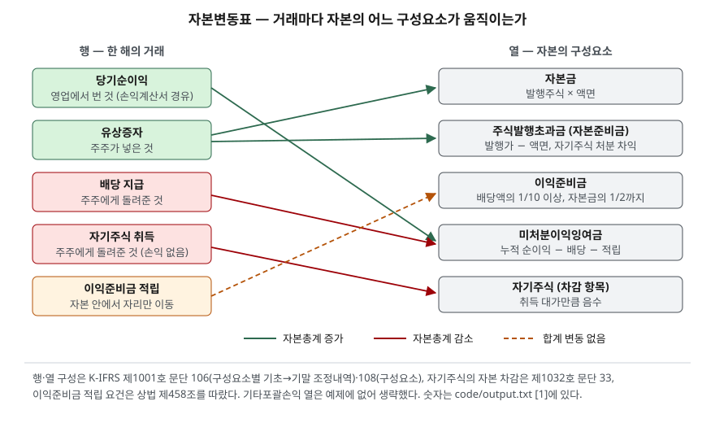

> 예제의 `가나전자`·`다라물산`과 그 숫자는 계산을 보이려고 만든 가상 자료다. 기타포괄손익과 미실현이익은 없다고 두었다.

## 들어가며

재무제표 네 장 가운데 자본변동표는 대개 건너뛰는 장이다. 증권사 앱의 재무 탭에도 재무상태표·손익계산서·현금흐름표까지만 나오는 경우가 많다. 그래서 자본총계가 작년 1,000억원에서 올해 1,100억원이 됐다는 것까지는 보고, 그 100억원이 어디서 왔는지는 재무상태표의 자본 항목을 작년치와 올해치로 나란히 놓고 빼 보는 식으로 찾는다. 항목이 여섯이면 여섯 번 빼야 하고, 한 항목 안에서 들어온 것과 나간 것이 섞여 있으면 뺄셈으로는 풀리지 않는다. 순이익 150억원이 들어왔는데 배당 50억원이 나갔으면 차이 100억원만 남는데, 그 둘은 뜻이 전혀 다른 거래다. 자본변동표는 이 뺄셈을 회사가 대신 해서 구성요소별로, 거래별로 펼쳐 놓은 표다.

## 개념

### 전체 재무제표의 한 장

재무제표 표시 기준서는 전체 재무제표에 기말 재무상태표, 기간 손익과기타포괄손익계산서, 기간 자본변동표, 기간 현금흐름표, 주석을 모두 포함하도록 한다(K-IFRS 제1001호 문단 10). 자본변동표는 선택이 아니라 필수 구성이다.

이 표에 들어가는 정보는 세 가지다(문단 106).

1. 해당 기간의 총포괄손익. 지배기업 소유주 몫과 비지배지분 몫을 나눠 표시한다
2. 자본의 각 구성요소별로 회계정책 소급적용이나 오류 소급재작성의 영향
3. 자본의 각 구성요소별 기초시점과 기말시점 장부금액의 조정내역

세 번째가 이 표의 본체다. 구성요소는 각 분류별 납입자본, 각 분류별 기타포괄손익의 누계액, 이익잉여금의 누계액 등이다(문단 108). 열에는 구성요소가, 행에는 거래가 놓이고, 기초에서 기말까지 각 칸이 얼마나 움직였는지가 적힌다. 배당은 이 표나 주석에 소유주에 대한 배분으로 인식된 금액과 주당배당금을 표시한다(문단 107).

### 자본이 움직이는 길은 둘뿐이다

보고기간 시작일과 종료일 사이 자본의 변동은 그 기간의 순자산 증가 또는 감소를 반영한다(문단 109). 순자산이 늘거나 주는 경로는 둘이다. 회사가 영업으로 벌거나 잃은 것(당기순손익과 기타포괄손익), 그리고 주주와 주고받은 것(유상증자, 배당, 자기주식 취득과 처분)이다. 자본변동표의 행은 모두 이 둘 중 하나에 속한다. 매출과 비용은 손익계산서에서 순이익 한 줄로 합쳐져 이익잉여금으로 들어오고, 주주와의 거래는 손익계산서를 거치지 않고 자본에 직접 닿는다.

| 거래 | 경로 | 움직이는 구성요소 | 자본총계 |
|---|---|---|---|
| 당기순이익·순손실 | 영업 | 이익잉여금 | + / − |
| 유상증자 | 주주 | 자본금(액면) + 주식발행초과금(액면 초과분) | + |
| 배당 | 주주 | 이익잉여금 | − |
| 자기주식 취득 / 처분 | 주주 | 자기주식(차감 항목) / 자기주식 + 주식발행초과금 | − / + |
| 이익준비금 적립 | 자본 안의 이동 | 미처분이익잉여금 → 이익준비금 | 0 |

## 구조



> **출처**: [K-IFRS 제1001호 재무제표 표시 — 문단 106 자본변동표 표시 정보, 107 배당, 108 자본의 구성요소](https://accountingwiki.co.kr/standards/1001) (제3자 전재) · [K-IFRS 제1032호 금융상품: 표시 — 문단 33 자기주식](https://accountingwiki.co.kr/standards/1032) (제3자 전재) · [상법 제458조 이익준비금](https://casenote.kr/법령/상법/제458조) (제3자 전재). 숫자는 이 글의 [`code/output.txt`](code/output.txt) `[1]`에 있다.

도식에서 녹색 화살표는 자본총계를 늘리고 붉은 화살표는 줄인다. 점선 하나만 합계를 바꾸지 않는데, 이익준비금 적립이 그것이다. 미처분이익잉여금에서 이익준비금으로 자리만 옮기므로 두 열이 반대 부호로 같은 금액만큼 움직이고 합계 열은 0이다. 표를 읽을 때 합계 열이 0인 행은 회사 안의 재분류이고, 0이 아닌 행만 밖과 주고받은 거래라는 것을 먼저 가려 두면 빠르다.

## 동작 원리

### 같은 1,100에 닿는 두 가지 길

가나전자와 다라물산은 기초 자본이 똑같다. 자본금 300, 주식발행초과금 200, 이익준비금 100, 미처분이익잉여금 400으로 합계 1,000이다. 한 해 동안 가나전자는 150을 벌어 50을 배당했고, 다라물산은 100을 잃고 유상증자로 200을 받았다. 기말 자본총계는 둘 다 1,100이다.

재무상태표만 보면 두 회사는 자본이 100 늘어난 같은 회사다. 자본변동표는 가나전자의 100이 이익잉여금 열에서, 다라물산의 100이 자본금과 주식발행초과금 열에서 생겼다는 것을 행 단위로 보여 준다. 한쪽은 회사가 번 돈이 쌓인 것이고 다른 쪽은 주주가 새로 넣은 돈이다. 손익계산서는 다라물산의 순손실 100까지만 말하고, 그 뒤 자본이 오히려 늘어난 이유는 자본변동표에만 있다.

### 구성이 다르면 배당 한도가 다르다

상법은 배당을 순자산액에서 네 가지를 뺀 금액 한도 안에서만 하도록 한다(제462조 제1항). 자본금의 액, 그 결산기까지 적립된 자본준비금과 이익준비금의 합계액, 그 결산기에 적립하여야 할 이익준비금의 액, 대통령령으로 정하는 미실현이익이다. 자본준비금은 자본거래에서 발생한 잉여금을 적립한 것이고(제459조 제1항) 주식발행초과금이 대표적이다. 이익준비금은 자본금의 2분의 1이 될 때까지 매 결산기 이익배당액의 10분의 1 이상을 적립해야 한다(제458조).

이 규정 때문에 유상증자로 들어온 돈은 자본금과 자본준비금에 묶여 배당으로 나갈 수 없다. 기말 자본총계가 같은 두 회사의 배당 한도가 495와 300으로 갈리는 이유다. 자본총계 1,100이라는 숫자 하나는 주주가 받을 수 있는 몫을 말해 주지 않고, 그 안에서 이익잉여금이 얼마인지가 말해 준다.

### 자기주식은 손익을 만들지 않는다

회사가 자기지분상품을 재취득하면 그 자기주식은 자본에서 차감하고, 자기지분상품을 매입·매도·발행·소각하는 경우의 손익은 당기손익으로 인식하지 않는다. 지급하거나 수취한 대가는 자본으로 직접 인식한다(K-IFRS 제1032호 문단 33). 보유 자기주식의 금액은 재무상태표나 주석에 별도로 공시한다(문단 34).

30에 산 자기주식을 40에 팔면 10이 남지만 이 10은 손익계산서에 나타나지 않는다. 주주와의 거래라서 회사가 영업으로 번 것이 아니기 때문이다. 자본변동표에서는 자기주식 열이 −30에서 0으로 돌아오고 주식발행초과금 열이 10 늘어난 것으로 보인다. 상법 쪽에서는 자기주식 취득가액의 총액이 직전 결산기 기준 배당가능이익을 넘지 못하고, 거래소에서 매수하거나 주주 균등 조건으로 취득해야 한다(제341조 제1항). 배당과 자기주식 취득이 같은 한도를 나눠 쓴다는 뜻이다.

## 실습 예제

두 회사의 한 해 거래를 구성요소별로 적용해 자본변동표 모양으로 찍었다. 금액 단위는 억원이다. 전체 소스: [`code/`](code/) · 수행 기록: [`code/output.txt`](code/output.txt)

```text
[1] 한 해의 자본변동표 — 거래가 구성요소 중 어디를 움직이는가 (억원)
  가나전자
                   자본금  주식발행초과금  이익준비금  미처분이익잉여금  자기주식    합계
  기초                 300         200        100          400         0   1,000
  당기순이익                                                +150              +150
  배당 지급                                                  -50               -50
  이익준비금 적립(배당의 1/10)                      +5          -5                +0
  기말                 300         200        105          495         0   1,100

  다라물산
                   자본금  주식발행초과금  이익준비금  미처분이익잉여금  자기주식    합계
  기초                 300         200        100          400         0   1,000
  당기순손실                                                -100              -100
  유상증자(액면 50, 발행가 200)   +50      +150                               +200
  기말                 350         350        100          300         0   1,100
```

가나전자의 행 세 개 가운데 합계가 0인 이익준비금 적립 행은 배당 50의 10분의 1인 5를 미처분이익잉여금에서 이익준비금으로 옮긴 것이다. 다라물산의 유상증자 행은 발행가 200이 액면 50과 액면 초과분 150으로 나뉘어 두 열에 들어간다. 발행가가 같아도 액면이 다르면 자본금과 주식발행초과금의 비율이 달라지고, 그 비율이 배당 한도에는 영향을 주지 않는다. 둘 다 배당 불가 항목이기 때문이다.

```text
[2] 기말 자본 1,100 의 구성 — 주주가 넣은 돈과 회사가 번 돈
  회사        납입자본   이익잉여금   자기주식     합계   납입자본 비중
  가나전자        500         600         0    1,100      45.5%
  다라물산        700         400         0    1,100      63.6%

[3] 배당 한도 (상법 제462조 제1항)
  가나전자     1,100 − 300 − 305 − 0 − 0 = 495
  다라물산     1,100 − 350 − 450 − 0 − 0 = 300
```

배당 한도 식의 세 번째와 네 번째 항은 0으로 두었다. 그 결산기에 적립할 이익준비금은 배당액이 정해져야 계산되고, 미실현이익은 예제에 없기 때문이다. 실제 회사에서는 두 항이 한도를 더 줄인다.

```text
[4] 가나전자가 자기주식을 샀다가 되팔면 (K-IFRS 제1032호 문단 33)
  취득 30 → 자본총계 1,070  (자본에서 차감)
  처분 40 → 자본총계 1,110  차익 10 은 자본으로 직접, 당기손익 반영 0
```

`[4]`의 자본변동표 전체는 `output.txt`에 있다. 취득한 해의 자본총계는 1,070으로 줄고, 되판 해에는 1,110으로 는다. 두 해의 손익계산서에는 이 거래가 한 줄도 없다.

## 실무에서 주의할 점

- **자본총계 증가를 실적으로 읽지 않는다.** 다라물산처럼 순손실을 내고도 유상증자로 자본이 늘 수 있다. 자본이 늘어난 행이 이익잉여금 열인지 납입자본 열인지를 먼저 본다. 유상증자가 기존 주주의 지분을 어떻게 희석하는지는 [앞 글](../../market/2026-10-06-rights-issue-dilution/index.md)에서 다뤘다.
- **이익잉여금이 크다고 배당 여력이 큰 것은 아니다.** 이익잉여금은 누적 이익의 기록이지 현금이 아니다. 이익은 나는데 현금이 없는 구조는 [현금흐름표 글](../2026-09-30-cash-flow-profit-without-cash/index.md)에서 봤다. 배당 한도는 상법 식으로 따로 계산되고, 실제 배당은 그 한도 안에서 현금이 있어야 가능하다.
- **자기주식 처분이익은 순이익에 없다.** 자기주식을 비싸게 되팔아 자본이 늘어도 PER 계산에 쓰는 순이익은 그대로다. 자본변동표의 주식발행초과금 열이 순이익 없이 늘었으면 자기주식 처분을 의심한다.
- **기타포괄손익 열을 당기순이익과 섞지 않는다.** 예제에는 없지만 실제 표에는 매도가능 금융자산 평가손익, 해외사업환산손익 같은 기타포괄손익 열이 있다. 총포괄손익은 둘을 합친 값이고(문단 106), 자본이 늘었어도 당기순이익이 아니라 평가손익 때문일 수 있다.
- **기준서 번호는 2027년에 바뀐다.** 2027년 1월 1일 이후 시작하는 회계연도부터 K-IFRS 제1118호가 제1001호를 전면 대체한다(금융위원회 보도자료, 2025-12-18). 이 글의 문단 번호는 제1001호 기준이다.

## 정리

- 자본변동표는 전체 재무제표의 필수 구성이고, 자본의 각 구성요소별 기초→기말 조정내역이 본체다.
- 자본이 움직이는 경로는 영업에서 번 것과 주주와 주고받은 것 둘뿐이며, 주주와의 거래는 손익계산서를 거치지 않는다.
- 같은 자본총계라도 이익잉여금으로 늘었는지 납입자본으로 늘었는지에 따라 상법의 배당 한도가 다르다.
- 자기주식 취득·처분의 차액은 당기손익이 아니라 자본에 직접 들어가므로, 이 거래는 자본변동표에서만 보인다.

## 참고 자료

- [한국회계기준원 — 시행 중인 K-IFRS 기준서 목록](https://www.kasb.or.kr/front/board/ingAccountingList.do) — 기준서 원문 발행처. 아래 전재 사이트는 문단을 바로 열기 위한 편의 링크다
- [IFRS Foundation — IAS 1 Presentation of Financial Statements](https://www.ifrs.org/issued-standards/list-of-standards/ias-1-presentation-of-financial-statements/)
- [K-IFRS 제1001호 재무제표 표시 — 문단 10 전체 재무제표, 106 자본변동표, 107 배당, 108 자본의 구성요소, 109 자본의 변동](https://accountingwiki.co.kr/standards/1001) (제3자 전재)
- [K-IFRS 제1032호 금융상품: 표시 — 문단 33 자기주식의 자본 차감과 손익 불인식, 34 별도 공시](https://accountingwiki.co.kr/standards/1032) (제3자 전재)
- [상법 제341조 자기주식의 취득](https://casenote.kr/법령/상법/제341조) · [제458조 이익준비금](https://casenote.kr/법령/상법/제458조) · [제459조 자본준비금](https://casenote.kr/법령/상법/제459조) · [제462조 이익의 배당](https://casenote.kr/법령/상법/제462조) (제3자 전재, 법률 제10600호, 2012-04-15 시행)
- [금융위원회 보도자료 — 27년부터 K-IFRS 손익계산서가 변경 (2025-12-18)](https://www.fsc.go.kr/no010101/85886) — 제1118호가 2027년 1월 1일 이후 시작 회계연도부터 제1001호를 대체
