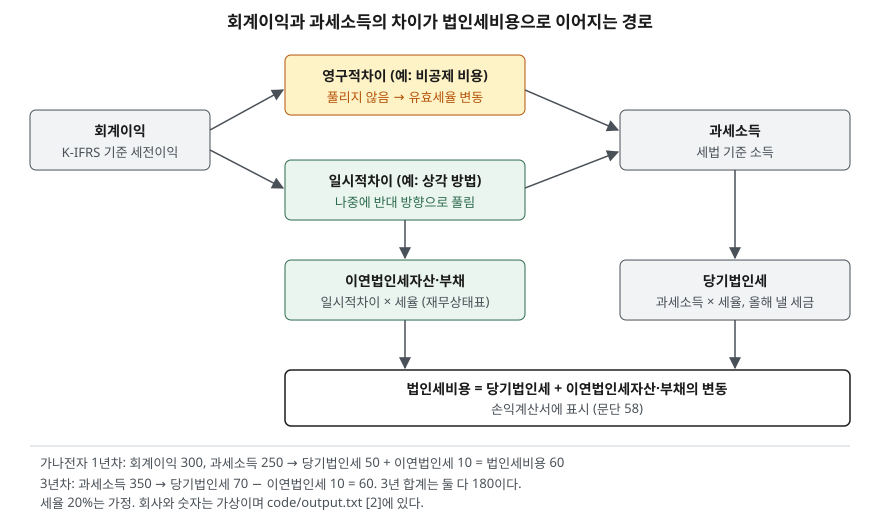

> 예제의 `가나전자`·`다라물산`과 그 숫자는 계산을 보이려고 만든 가상 자료다. 세율은 해마다 20% 단일세율로 가정했다. 실제 법인세율은 과세표준 구간별 누진 구조이고 해마다 바뀔 수 있으므로, 이 글의 세율과 세무상 상각 방법은 계산 원리를 보이기 위한 가정이다.

## 들어가며

손익계산서에서 법인세비용차감전순이익에 법정세율을 곱해 보면 법인세비용과 맞지 않는 경우가 많다. 어떤 해에는 세율이 15%처럼 낮아 보이고 어떤 해에는 30%를 넘는다. 이때 흔히 세액공제를 많이 받았거나 세무조사로 추징을 당했다고 짐작하고, 그 짐작을 확인하려고 뉴스를 찾는다. 그런데 재무상태표에 이연법인세자산·부채라는 항목이 있다면, 그 차이 상당 부분은 회계와 세법이 같은 비용을 다른 해에 인정한 데서 나온다. 어떤 차이가 나중에 풀리고 어떤 차이가 풀리지 않는지 구분하면 법인세비용이 왜 그 숫자인지 주석 한 장으로 설명할 수 있다.

## 개념

### 회계이익과 과세소득

K-IFRS 제1012호는 회계이익을 법인세비용 차감 전 회계기간의 손익으로, 과세소득을 과세당국이 제정한 법규에 따라 납부할 법인세를 산출하는 대상이 되는 이익으로 정의한다(문단 5). 회계이익은 기업회계기준을, 과세소득은 세법을 따른다. 같은 거래라도 두 규칙이 비용이나 수익으로 인정하는 시점과 금액이 다르면 두 숫자가 갈린다.

### 일시적차이와 영구적차이

일시적차이는 재무상태표상 자산·부채의 장부금액과 세무기준액의 차이다(문단 5). 세무기준액은 그 자산·부채에 세무상 귀속되는 금액이다. 회계와 세법이 감가상각을 다른 속도로 하면 해마다 비용이 다르지만 내용연수 전체 합계는 같아서, 지금 생긴 차이가 나중에 반대 방향으로 풀린다. 나중에 과세소득을 늘리는 차이가 가산할 일시적차이, 줄이는 차이가 차감할 일시적차이다.

반면 세법이 끝까지 비용으로 인정하지 않는 지출은 나중에도 풀리지 않는다. 기준서 정의에 쓰인 용어는 아니지만 실무에서 영구적차이라고 부른다. 일시적차이는 이연법인세를 만들고, 영구적차이는 만들지 않는다.

### 이연법인세부채와 이연법인세자산

이연법인세부채는 가산할 일시적차이와 관련해 미래 회계기간에 납부할 법인세다. 이연법인세자산은 차감할 일시적차이, 미사용 세무상결손금, 미사용 세액공제와 관련해 미래 회계기간에 회수될 수 있는 법인세다(문단 5). 지금 세금을 덜 냈으면 나중에 더 낼 의무가 부채로, 지금 더 냈으면 나중에 덜 낼 혜택이 자산으로 올라간다.

## 구조



> **출처**: [K-IFRS 제1012호 법인세 — 문단 5 용어의 정의, 15·24 인식, 47 세율, 58 당기손익 인식](https://accountingwiki.co.kr/standards/1012) (제3자 전재). 숫자는 이 글의 [`code/output.txt`](code/output.txt) `[2]`에 있다.

회계이익에서 과세소득으로 가는 길은 두 갈래다. 영구적차이는 과세소득만 바꾸고 끝난다. 일시적차이는 과세소득을 바꾸는 동시에 재무상태표에 이연법인세를 남긴다. 법인세비용은 올해 낼 세금(당기법인세)에 이연법인세 잔액의 변동을 더해 계산한다.

## 동작 원리

### 모든 가산할 일시적차이에 부채를 인식한다

기준서는 모든 가산할 일시적차이에 이연법인세부채를 인식하게 한다(문단 15). 예외는 영업권을 최초로 인식하는 경우와, 일정 조건을 모두 갖춘 거래에서 자산·부채를 최초로 인식하는 경우다. [영업권 글](../2026-10-10-goodwill-impairment-test/index.md)은 법인세가 없다고 두고 계산했는데, 법인세를 넣으면 영업권에서는 이 예외가 걸린다.

### 자산은 미래 과세소득이 있을 때만 인식한다

차감할 일시적차이에 대한 이연법인세자산은 그 차이를 사용할 수 있는 과세소득이 생길 가능성이 높을 때만 인식한다(문단 24). 나중에 덜 낼 세금은 나중에 낼 세금이 있어야 의미가 있기 때문이다. 이연법인세자산의 장부금액은 매 보고기간말에 검토하고, 그 가능성이 더 이상 높지 않으면 감액한다(문단 56). 부채는 무조건, 자산은 조건부로 인식한다는 비대칭이 이 항목을 읽을 때 가장 중요하다.

### 측정 — 미래 세율, 할인하지 않음

이연법인세는 보고기간말까지 제정됐거나 실질적으로 제정된 세법에 따라, 자산이 실현되거나 부채가 결제될 기간에 적용될 세율로 측정한다(문단 47). 몇 년 뒤에 풀릴 차이라도 현재가치로 할인하지 않는다(문단 53). 세율이 바뀌는 법이 제정되면 이미 쌓인 이연법인세 잔액이 다시 측정되고, 그 차이가 그해 법인세비용에 들어간다.

## 실습 예제

가나전자는 설비 300억원을 3년 동안 쓴다. 회계는 정액법으로 해마다 100씩, 세무는 150·100·50으로 상각한다고 가정한다. 감가상각 전 이익은 해마다 400이다. 전체 소스: [`code/`](code/) · 수행 기록: [`code/output.txt`](code/output.txt)

```text
[1] 설비 300 — 장부금액과 세무기준액 (제1012호 문단 5)
  연도         회계 상각     세무 상각      장부금액      세무기준액      일시적차이
  1년차         100         150         200          150           50
  2년차         100         100         100           50           50
  3년차         100          50           0            0            0
  합계         300         300   — 3년 합계는 같다
  장부금액 > 세무기준액 → 나중에 과세소득을 늘리는 가산할 일시적차이
```

1년차에 세무가 50을 더 상각해 세무기준액이 장부금액보다 50 작아진다. 3년차에는 세무 상각이 회계보다 50 작아 그 차이가 풀린다.

```text
[2] 법인세비용 = 당기법인세 + 이연법인세 (세율 20% 가정)
  연도         회계이익     과세소득      당기법인세      이연법인세부채      이연법인세      법인세비용
  1년차        300        250           50             10          +10           60
  2년차        300        300           60             10           +0           60
  3년차        300        350           70              0          -10           60
  3년 합계: 당기법인세 180, 법인세비용 180 — 낸 세금과 비용이 결국 같다
```

실제로 낸 세금은 50, 60, 70으로 늘지만 손익계산서의 법인세비용은 60으로 같다. 1년차에 덜 낸 10은 이연법인세부채로 올라가 있다가 3년차에 더 내면서 사라진다.

```text
[3] 유효세율 = 법인세비용 ÷ 회계이익
  1년차  당기법인세만 비용으로 잡으면 16.7%   이연법인세까지 잡으면 20.0%
  2년차  당기법인세만 비용으로 잡으면 20.0%   이연법인세까지 잡으면 20.0%
  3년차  당기법인세만 비용으로 잡으면 23.3%   이연법인세까지 잡으면 20.0%
```

이연법인세가 없다면 같은 사업에서 세율이 16.7%에서 23.3%까지 흔들린다. 이연법인세 회계는 세금을 낸 시점이 아니라 그 세금을 만든 이익이 생긴 시점에 비용을 맞춘다.

```text
[4] 1년차에 세법상 비용으로 인정되지 않는 비용 30 이 있으면 (영구적차이)
  회계이익 270, 과세소득 250, 법인세비용 60
  유효세율 22.2%  (법정세율 20%)
  문단 81(3)(가) 형식의 조정:
    회계이익 270 × 20%           =   54.0
    비공제 비용 30 × 20% 의 효과    =   +6.0
    법인세비용                    =   60.0
  비용 30 은 다음 해에도 공제되지 않아 이연법인세가 생기지 않는다
```

영구적차이는 이연법인세로 상쇄되지 않아 유효세율을 그대로 바꾼다. 기준서는 법인세비용과 회계이익의 관계를 회계이익에 적용세율을 곱한 금액과의 수치 조정, 또는 평균유효세율과 적용세율의 조정으로 설명하게 한다(문단 81(3)). 위 세 줄이 그 앞쪽 형식이다.

```text
[5] 제품보증충당부채 50 — 회계는 판매 연도 비용, 세무는 실제 지급 연도에 공제
  회계이익 300, 과세소득 350, 당기법인세 70
  부채 장부금액 50 > 세무기준액 0 → 차감할 일시적차이 50, 이연법인세자산 후보 10
  회사            미래 과세소득 전망       이연법인세자산       법인세비용      유효세율
  가나전자                  충분              10            60       20.0%
  다라물산                 불확실               0            70       23.3%
  다라물산은 같은 거래에서 이연법인세자산을 못 올려 법인세비용이 10 더 크다
```

예제는 보증비용을 세무상 실제 지급 연도에 공제한다고 가정했다. 두 회사의 거래와 낸 세금은 같다. 미래에 과세소득이 생길 가능성에 대한 판단만 다른데, 그 판단 때문에 법인세비용이 10 달라진다. 다라물산이 나중에 사정이 나아져 이연법인세자산을 인식하면 그해 법인세비용이 줄어든다.

## 실무에서 주의할 점

- **유효세율이 법정세율과 다르면 조정표부터 본다.** 주석의 법인세비용 조정(문단 81(3))은 차이를 비공제 비용, 비과세 수익, 세액공제, 세율 변경, 미인식 이연법인세자산 같은 항목으로 나눠 보여 준다. 어느 항목이 반복되는 것인지 가리면 내년 유효세율을 짐작할 근거가 생긴다. [주석과 감사의견 글](../2026-10-01-notes-and-audit-opinion/index.md)에서 다룬 주석 읽기가 여기서 쓰인다.
- **이연법인세자산은 회사의 미래 전망에 대한 판단이다.** [5]에서 보듯 적자가 이어져 과세소득 전망이 불확실해지면 자산을 감액하고 그만큼 법인세비용이 늘어난다(문단 56). 영업손실이 난 해에 법인세비용까지 커져 순손실이 더 커지는 일이 이렇게 생긴다. 반대로 흑자로 돌아선 해에 과거에 못 올린 자산을 인식하면 순이익이 영업 성과보다 크게 나온다.
- **이연법인세는 현금이 아니다.** [2]의 1년차 법인세비용 60 가운데 실제로 나간 현금은 50이다. 현금흐름표의 영업활동 현금흐름에는 실제 납부액이 들어가므로, [영업이익과 순이익 차이 글](../2026-09-30-operating-vs-net-income-gap/index.md)과 [현금흐름표 글](../2026-09-30-cash-flow-profit-without-cash/index.md)에서 본 이익과 현금의 차이에 이 금액도 더해진다.
- **세율 변경 해의 법인세비용은 일회성 요인을 포함한다.** 법인세율을 바꾸는 법이 제정되면 이연법인세 잔액 전체를 새 세율로 다시 측정한다(문단 47). 이연법인세부채가 큰 회사는 세율 인하가 제정된 해에 법인세비용이 크게 줄어든다. 그해 순이익으로 계산한 PER은 반복되지 않는 이익을 포함한다.
- **재무상태표의 금액은 상계된 순액일 수 있다.** 같은 과세당국에 관련되고 상계할 법적 권리가 있는 등 조건을 모두 갖추면 이연법인세자산과 부채를 상계해 표시한다(문단 74). 자산과 부채 각각의 크기는 주석에서 확인한다.

## 정리

- 회계이익과 과세소득은 규칙이 달라 갈린다. 나중에 풀리는 차이가 일시적차이, 풀리지 않는 차이가 영구적차이다.
- 일시적차이에 세율을 곱한 금액이 이연법인세자산·부채가 되고, 법인세비용은 당기법인세에 그 잔액의 변동을 더한 값이다.
- 일시적차이만 있으면 유효세율은 법정세율에 맞춰진다. 유효세율을 법정세율에서 벗어나게 하는 것은 영구적차이, 세율 변경, 이연법인세자산 인식 여부다.
- 이연법인세부채는 모든 가산할 일시적차이에 인식하지만, 이연법인세자산은 미래 과세소득이 생길 가능성이 높을 때만 인식한다.

## 참고 자료

- [한국회계기준원 — 시행 중인 K-IFRS 기준서 목록](https://www.kasb.or.kr/front/board/ingAccountingList.do) — 기업회계기준서 제1012호 법인세 원문 발행처. 아래 전재 사이트는 문단을 바로 열기 위한 편의 링크다
- [IFRS Foundation — IAS 12 Income Taxes](https://www.ifrs.org/issued-standards/list-of-standards/ias-12-income-taxes/) — 국제회계기준 원문 발행처
- [K-IFRS 제1012호 법인세 — 문단 5 용어의 정의, 15 이연법인세부채 인식, 24 이연법인세자산 인식, 47 세율, 53 할인 금지, 56 장부금액 검토, 58 당기손익 인식, 74 상계, 81(3) 법인세비용과 회계이익의 관계 설명](https://accountingwiki.co.kr/standards/1012) (제3자 전재)
