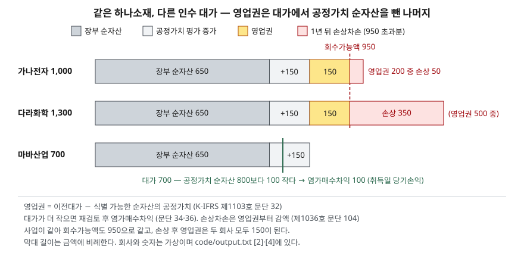

> 예제의 `하나소재`·`가나전자`·`다라화학`·`마바산업`과 그 숫자는 계산을 보이려고 만든 가상 자료다. 하나소재는 인수 부채가 없고, 법인세와 이연법인세는 없다고 두었다.

## 들어가며

인수합병을 여러 번 한 회사의 재무상태표를 보면 무형자산 안에 영업권이 자본총계의 상당 부분을 차지하는 경우가 있다. 그런데 영업권이 무엇을 산 대가인지는 표에 적혀 있지 않아서, 보통은 "브랜드 가치" 정도로 짐작하고 넘어간다. 그러다 몇 년 뒤 수백억 원의 영업권 손상차손으로 당기순이익이 적자가 되면, 그해 사업이 갑자기 나빠졌다고 읽는다. 실제로 그해 나간 현금은 없다. 영업권이 어떤 뺄셈에서 나오는지, 언제 어떤 순서로 깎이는지를 알면 그 적자가 몇 년 전 인수 가격에서 온 것인지 판단할 수 있다.

## 개념

### 대가에서 순자산을 뺀 나머지

K-IFRS 제1103호 사업결합에서 취득자는 식별 가능한 취득 자산과 인수 부채를 취득일의 공정가치로 측정한다(문단 18). 영업권은 이전대가와 비지배지분 등의 합계가 그 순액을 초과하는 금액으로 인식한다(문단 32). 핵심은 뺄셈의 기준이 피취득회사 장부의 순자산이 아니라 **취득일 공정가치로 다시 잰 순자산**이라는 점이다. 장부에 오래전 취득원가로 남아 있던 토지가 시가로 올라가면, 그만큼은 영업권이 아니라 토지 금액이 된다.

반대로 대가가 공정가치 순자산보다 작으면 염가매수다(문단 34). 이때 취득자는 바로 이익을 잡지 않고, 모든 취득 자산과 인수 부채를 정확히 식별했는지 먼저 재검토해야 한다(문단 36). 재검토 후에도 남는 차이를 염가매수차익으로 당기손익에 반영한다.

### 회사가 스스로 만든 영업권은 없다

내부적으로 창출한 영업권은 자산으로 인식하지 않는다(K-IFRS 제1038호 문단 48). 영업권은 다른 회사를 사들인 거래에서만 생긴다. 그래서 같은 업종의 두 회사가 비슷한 사업 역량을 가졌어도 인수로 큰 회사에만 영업권이 있고, 자체 성장한 회사의 재무상태표에는 같은 성격의 가치가 숫자로 나타나지 않는다.

## 구조



> **출처**: [K-IFRS 제1103호 사업결합 — 문단 18 공정가치 측정, 32 영업권, 34·36 염가매수](https://accountingwiki.co.kr/standards/1103) (제3자 전재) · [K-IFRS 제1036호 자산손상 — 문단 90 영업권 손상검사, 104 손상차손 배분](https://accountingwiki.co.kr/standards/1036) (제3자 전재). 숫자는 이 글의 [`code/output.txt`](code/output.txt) `[2]`·`[4]`에 있다.

세 막대의 앞부분 800은 같다. 하나소재라는 사업 자체는 하나이므로 공정가치 순자산도 하나다. 달라지는 것은 그 뒤에 붙는 부분, 즉 인수 회사가 얼마를 더 냈는가뿐이다. 영업권은 사업의 속성이 아니라 **인수 가격의 속성**이다.

## 동작 원리

### 영업권은 상각되지 않고 매년 검사받는다

국제회계기준은 영업권을 상각하지 않고 매년 손상검사만 하는 방식을 쓴다. IASB는 이 방식을 택하면서, 영업권도 시간이 지나며 소모되기는 하지만 그 내용연수와 감소 양상을 일반적으로 예측할 수 없어 어느 기간의 상각비든 임의의 추정치에 그친다고 봤다. 2022년 IASB 회의자료는 상각을 다시 들이자는 의견과 그 근거를 검토하고 있어, 이 방식이 논쟁 중이라는 점도 함께 알아 둘 만하다.

사업결합으로 취득한 영업권은 취득일부터 시너지 효과의 혜택을 받을 것으로 예상되는 현금창출단위(또는 그 집단)에 배분한다(제1036호 문단 80). 그 현금창출단위는 일 년에 한 번, 그리고 손상 징후가 있을 때마다 영업권을 포함한 장부금액을 회수가능액과 비교해 손상검사를 한다(문단 90). 회수가능액이 장부금액에 못 미치면 그 차이가 손상차손이고 곧바로 당기손익에 반영된다(문단 59·60). 유형자산처럼 해마다 조금씩 비용이 되는 것이 아니라, 검사에서 걸린 해에 한꺼번에 비용이 된다.

### 손상은 영업권부터 깎는다

손상차손은 먼저 그 현금창출단위에 배분한 영업권의 장부금액을 줄이고, 남으면 단위 안의 다른 자산에 각 장부금액에 비례해 배분한다(문단 104). 영업권이 손실을 먼저 흡수하는 구조다. 영업권이 클수록 회수가능액이 조금만 내려가도 손상이 생기고, 영업권이 0이 될 때까지는 토지나 설비 같은 다른 자산 금액은 그대로다.

### 한 번 깎은 영업권은 돌아오지 않는다

영업권에 인식한 손상차손은 후속 기간에 환입하지 않는다(문단 124). 회수가능액이 다음 해 회복돼도 영업권은 손상 후 금액에 머문다. 손상차손은 일회성 비용처럼 보이지만, 그 결과는 재무상태표에 영구히 남는다.

## 실습 예제

하나소재의 장부 순자산은 650억원이고, 토지와 설비를 취득일 공정가치로 다시 재면 800억원이다. 전체 소스: [`code/`](code/) · 수행 기록: [`code/output.txt`](code/output.txt)

```text
[2] 100% 인수 — 대가별 영업권 (문단 32·34)
  인수 회사           이전대가      공정가치 순자산       영업권      염가매수차익
  가나전자             1,000             800         200             0
  다라화학             1,300             800         500             0
  마바산업               700             800           0           100
  장부 순자산 650 이 아니라 공정가치 800 에서 뺀다 — 차이 150 은 토지·설비 평가 증가분
```

```text
[3] 80% 인수, 대가 800 — 비지배지분 측정 방법에 따른 영업권 (문단 19)
  비지배지분 = 순자산 비례 몫    160  →  영업권 = 800 + 160 − 800 = 160
  비지배지분 = 공정가치        220  →  영업권 = 800 + 220 − 800 = 220
  비례 몫 방식은 지배기업 몫의 영업권만, 공정가치 방식은 비지배지분 몫까지 올린다
```

지분 일부만 사면 기준서가 비지배지분 측정에 두 방법 중 하나를 고르게 한다(문단 19). 피취득회사의 순자산 중 비례적 몫으로 재면 비지배지분은 160이고, 나머지 20% 지분의 공정가치(예제에서 220으로 가정)로 재면 220이다. 같은 거래에서 영업권이 160과 220으로 갈린다. 차이 60은 비지배주주 몫의 영업권을 장부에 올리느냐다. [연결재무제표 글](../../disclosure/2026-10-07-consolidated-vs-separate/index.md)에서 다룬 비지배지분이 여기서 영업권 금액에도 영향을 준다.

```text
[4] 1년 뒤 손상검사 — 하나소재 사업의 회수가능액 950 (제1036호 문단 90·104)
  인수 회사          영업권      장부금액     회수가능액      손상차손      손상 후 영업권         당기순이익
  가나전자             200       1,000         950          50           150    300 →  250
  다라화학             500       1,300         950         350           150    300 →  -50
  마바산업               0         800         950           0             0    300 →  300
  손상 전 당기순이익은 셋 다 300 으로 둔다 (마바산업의 인수 연도 염가매수차익 100 은 전년도 손익)
```

1년 뒤 하나소재 사업의 회수가능액은 950으로 누가 샀든 같다. 그런데 손상차손은 0, 50, 350으로 갈리고 다라화학만 적자가 된다. 사업 성과는 세 회사에서 똑같으므로, 이 차이는 전부 인수 가격에서 나온다. 손상 후 가나전자와 다라화학의 영업권은 똑같이 150이 된다. 많이 낸 쪽이 그 차이를 손상차손으로 한꺼번에 비용 처리한 결과다.

```text
[5] 다라화학, 회수가능액이 700 까지 떨어지면 (문단 104 배분 순서)
  장부금액 1,300 − 회수가능액 700 = 손상차손 600
  ① 영업권           500 →     0   (500 감액)
  ② 토지             200 →    175.0   (25.0 감액, 장부금액 비례)
  ② 건물·설비          600 →    525.0   (75.0 감액, 장부금액 비례)
```

손상차손 600 가운데 500은 영업권이 먼저 흡수하고, 남은 100이 토지와 설비에 장부금액 비율(200 대 600)로 나뉜다. 예제는 단순화를 위해 비례 배분만 했다. 실제로는 개별 자산의 장부금액을 처분부대원가를 뺀 공정가치, 사용가치, 0 가운데 가장 큰 금액 아래로 줄이지 못한다(문단 105). 예제 숫자에서는 이 하한이 걸리지 않는다고 두었다.

```text
[6] 그 다음 해 회수가능액이 1,300 으로 회복되면 (문단 124)
  다라화학 영업권: 인수 시 500 → 1년 뒤 손상 후 150 → 회복 후에도 150
  영업권에 인식한 손상차손은 후속 기간에 환입하지 않는다
```

## 실무에서 주의할 점

- **영업권 손상을 그해 영업 부진으로 바로 읽지 않는다.** [4]에서 세 회사의 사업 성과는 같았다. 손상차손의 크기는 그해 실적보다 인수 당시 얼마를 더 냈는지에 좌우된다. 손상이 크면 그 회사의 인수 이력과 취득 당시 영업권 금액부터 주석에서 찾는다. [영업이익과 순이익 차이 글](../../statements/2026-09-30-operating-vs-net-income-gap/index.md)에서 본 대로 손상차손은 현금이 나가지 않는 비용이다.
- **영업권이 자본에서 차지하는 비중을 본다.** 영업권은 회수가능액이 조금 떨어져도 먼저 깎이는 자산이다. 자본총계에서 영업권을 뺀 금액이 얼마인지 보면, 손상이 났을 때 자본이 얼마나 줄 수 있는지 범위가 잡힌다. [PBR 글](../../valuation/2026-10-03-pbr-below-book-value/index.md)에서 다룬 것처럼 시가총액이 순자산보다 작은 상태는 손상 징후의 하나이므로, 그런 회사의 영업권은 다음 결산에서 줄어들 수 있다.
- **영업권이 없다고 인수 경쟁력이 없는 것은 아니다.** 자체 성장한 회사는 기준서상 영업권을 인식할 수 없다(제1038호 문단 48). 영업권 유무로 두 회사의 무형 가치를 비교하면 인수로 큰 회사만 자산이 많아 보인다.
- **비지배지분 측정 방법을 확인한다.** 같은 거래라도 비례 몫 방식과 공정가치 방식에 따라 영업권과 비지배지분이 함께 달라진다. 영업권 대비 자본 비율을 회사끼리 비교할 때는 주석에서 측정 방법이 같은지 본다.
- **염가매수차익은 반복되지 않는 이익이다.** 인수 연도에 당기손익으로 들어오지만 사업에서 번 돈이 아니고 다음 해에 다시 생기지도 않는다. 그해 순이익을 기준으로 PER을 계산하면 이익이 부풀려진 값이 나온다.

## 정리

- 영업권은 이전대가(와 비지배지분)에서 피취득회사 순자산의 취득일 공정가치를 뺀 나머지다. 대가가 더 작으면 재검토 뒤 염가매수차익이 된다.
- 영업권은 사업이 아니라 인수 가격에 붙은 숫자다. 같은 사업을 비싸게 산 회사일수록 영업권이 크다.
- 영업권은 매년 현금창출단위 단위로 손상검사를 받고, 손상차손은 영업권부터 깎으며, 한 번 깎인 영업권은 환입하지 않는다.
- 손상차손은 그해 현금 유출이 아니라 과거 인수 대가에 대한 판단이 늦게 장부에 반영된 것이다.

## 참고 자료

- [한국회계기준원 — 시행 중인 K-IFRS 기준서 목록](https://www.kasb.or.kr/front/board/ingAccountingList.do) — 기업회계기준서 제1103호 사업결합, 제1036호 자산손상, 제1038호 무형자산 원문 발행처. 아래 전재 사이트는 문단을 바로 열기 위한 편의 링크다
- [IFRS Foundation — IFRS 3 Business Combinations](https://www.ifrs.org/issued-standards/list-of-standards/ifrs-3-business-combinations/) — 국제회계기준 원문 발행처
- [K-IFRS 제1103호 사업결합 — 문단 18 공정가치 측정, 19 비지배지분 측정, 32 영업권, 34·36 염가매수](https://accountingwiki.co.kr/standards/1103) (제3자 전재)
- [K-IFRS 제1036호 자산손상 — 문단 59·60 손상차손 인식, 80 영업권 배분, 90 영업권 손상검사, 104·105 손상차손 배분, 124 환입 금지](https://accountingwiki.co.kr/standards/1036) (제3자 전재)
- [K-IFRS 제1038호 무형자산 — 문단 48 내부적으로 창출한 영업권](https://accountingwiki.co.kr/standards/1038) (제3자 전재)
- [IASB, Goodwill and Impairment — Subsequent accounting for goodwill: possible ways forward (Agenda Paper 18B, 2022-10)](https://www.ifrs.org/content/dam/ifrs/meetings/2022/october/iasb/ap18b-goodwill-and-impairment-subsequent-accounting-for-goodwill-possible-ways-forward.pdf) — 손상검사만 하는 방식을 택한 이유(문단 27), 상각 재도입 의견 검토
