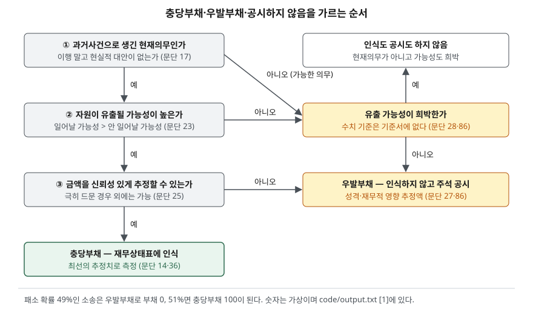

> 예제의 `가나전자`·`다라물산`과 그 숫자는 계산을 보이려고 만든 가상 자료다. 단위는 백만원이다. 확률과 할인율도 계산 원리를 보이기 위한 가정이다.

## 들어가며

어느 회사가 소송에 걸렸다는 기사가 나오면 재무상태표에서 그 금액을 찾아보게 된다. 그런데 부채 항목 어디에도 그 숫자가 없고, 주석 깊은 곳에 "결과를 예측할 수 없다"는 문장만 있는 경우가 많다. 이때 흔히 회사가 숨겼다고 생각하거나 반대로 아무 일도 없다고 읽고 넘어간다. 실제로는 기준서가 정한 세 가지 질문에 답한 결과로 그 금액이 부채가 되기도 하고 주석에만 남기도 한다. 그 질문을 알면 부채가 없는 이유와, 다음 해에 갑자기 큰 비용이 잡힐 수 있는지를 주석 몇 줄로 가늠할 수 있다.

## 개념

### 충당부채 — 시기나 금액이 불확실한 부채

K-IFRS 제1037호는 충당부채를 지출하는 시기 또는 금액이 불확실한 부채로 정의한다(문단 10). 매입채무처럼 금액과 날짜가 정해진 부채와 달리, 얼마를 언제 낼지 추정해서 잡는다. 판매보증, 소송 배상, 구조조정, 원상복구 의무가 대표적이다.

### 우발부채 — 인식하지 않는 의무

우발부채는 두 경우를 말한다(문단 10). 과거사건으로 생겼지만 회사가 통제할 수 없는 미래 사건이 일어나야 존재가 확인되는 잠재적 의무, 그리고 현재의무이긴 하지만 자원이 유출될 가능성이 높지 않거나 금액을 신뢰성 있게 추정할 수 없어 인식 요건을 채우지 못한 의무다. 우발부채는 재무상태표에 올리지 않고(문단 27), 유출 가능성이 희박하지 않으면 주석에 공시한다(문단 86).

### 우발자산 — 더 엄격한 쪽

반대 방향으로 회사가 받을 수도 있는 금액은 우발자산이다. 실현되지 않을 수도 있는 이익을 미리 인식하는 일을 막으려고 우발자산은 인식하지 않는다(문단 31·33). 실현이 거의 확실해지면 그때는 우발자산이 아니라 통상의 자산으로 인식한다(문단 33). 유입 가능성이 높을 때만 공시한다(문단 34). 받을 수 있는 돈보다 낼 수 있는 돈을 먼저 장부에 올리는 비대칭이 이 기준서 전체에 깔려 있다.

## 구조



> **출처**: [K-IFRS 제1037호 충당부채, 우발부채, 우발자산 — 문단 10 정의, 14 인식 요건, 17 의무발생사건, 23 가능성이 높음, 25 신뢰성 있는 추정, 27·28 우발부채, 86 공시](https://accountingwiki.co.kr/standards/1037) (제3자 전재). 숫자는 이 글의 [`code/output.txt`](code/output.txt) `[1]`에 있다.

세 질문에 모두 예라고 답해야 충당부채가 된다(문단 14). 하나라도 아니오면 부채로 올리지 않고, 그다음은 유출 가능성이 희박한지에 따라 공시할지가 갈린다.

## 동작 원리

### 현재의무 — 피할 수 없는가

의무발생사건은 그 의무를 이행하는 것 말고는 현실적인 대안이 없는 사건이다(문단 17). 회사가 미래에 어떻게 행동하느냐와 상관없이 존재해야 한다(문단 19). 공장을 계속 돌리려면 내년에 설비를 고쳐야 한다는 사정은 공장을 닫으면 피할 수 있으므로 현재의무가 아니다. 같은 이유로 미래의 영업손실은 충당부채로 잡지 않는다(문단 63).

### 가능성이 높다 — 50%를 넘는가

기준서는 가능성이 높다는 말을 일어날 가능성이 일어나지 않을 가능성보다 높은 경우로 정의한다(문단 23). 이 문턱 하나로 부채가 있고 없음이 갈린다. 반면 공시를 생략할 수 있는 희박하다는 말에는 수치 기준이 없어 회사의 판단이 들어간다(문단 28).

### 측정 — 최선의 추정치

인식한 충당부채는 보고기간말에 의무를 이행하는 데 드는 지출의 최선의 추정치로 측정한다(문단 36). 많은 항목이 걸린 의무는 가능한 결과에 확률을 곱해 더한 기댓값으로 잡는다(문단 39). 소송 같은 단일 의무는 가장 가능성이 높은 결과가 최선의 추정치가 될 수 있지만, 다른 결과도 함께 고려한다(문단 40). 화폐의 시간가치가 중요하면 현재가치로 할인하고(문단 45), 할인율은 그 부채의 고유 위험을 반영한 세전 이율을 쓴다(문단 47). 할인한 충당부채는 시간이 지나면서 장부금액이 늘고, 그 증가분은 차입원가로 인식한다(문단 60).

### 매 보고기간말 다시 본다

충당부채는 보고기간말마다 검토해 현재의 최선의 추정치로 조정하고, 더 이상 유출 가능성이 높지 않으면 환입한다(문단 59). 처음 설정한 목적의 지출에만 쓸 수 있다(문단 61).

## 실습 예제

전체 소스: [`code/`](code/) · 수행 기록: [`code/output.txt`](code/output.txt)

```text
[1] 소송 1건, 지면 100 을 배상 — 패소 확률에 따른 처리 (문단 14·23·27·28·40)
     패소 확률  처리                          재무상태표 부채
        3%  가능성 희박 — 공시도 안 함               0
       30%  우발부채 — 주석 공시만                  0
       49%  우발부채 — 주석 공시만                  0
       51%  충당부채 인식                      100
       80%  충당부채 인식                      100
  49% 와 51% 사이에서 부채가 0 에서 100 으로 바뀐다 — 확률을 곱한 49 나 51 로 잡지 않는다
```

예제는 희박함의 기준을 5% 미만으로 가정했다. 단일 소송에 확률을 곱한 49를 부채로 잡지 않는 것은 실제로 나갈 돈이 0이거나 100이지 49가 되는 경우는 없기 때문이다. 패소 확률 판단이 2%포인트 바뀌면 부채가 0에서 100으로 뛴다.

```text
[2] 판매보증 — 많은 항목이 걸린 의무는 기댓값으로 (문단 39)
  결함 없음    확률  80%  대당 수리비   0  →  0.0
  작은 결함    확률  15%  대당 수리비  10  →  1.5
  큰 결함     확률   5%  대당 수리비  50  →  2.5
  대당 기대 수리비 4.0  → 1,000 대 판매 시 충당부채 4,000
```

제품 1,000대가 각각 결함을 일으킬 수 있으므로, 이번에는 확률을 곱한 기댓값이 실제 지출에 가깝다. 단일 의무와 다수 의무의 측정 방법이 다른 이유가 여기에 있다.

```text
[3] 같은 제품·같은 실제 수리비(대당 4), 1년차 추정만 다른 두 회사
    가나전자: 1년차부터 대당 4 로 추정  /  다라물산: 1년차 대당 6, 2년차부터 4 로 수정
  가나전자
    연도       기초 잔액      사용      환입     신규 설정      보증비용     기말 잔액
    1년차         0         0         0      4,000      4,000      4,000
    2년차     4,000     4,000         0      4,000      4,000      4,000
    3년차     4,000     4,000         0      4,000      4,000      4,000
  다라물산
    연도       기초 잔액      사용      환입     신규 설정      보증비용     기말 잔액
    1년차         0         0         0      6,000      6,000      6,000
    2년차     6,000     4,000     2,000      4,000      2,000      4,000
    3년차     4,000     4,000         0      4,000      4,000      4,000
  연도별 보증비용 차이 (다라물산 − 가나전자): 1년차 +2,000 / 2년차 -2,000 / 3년차 +0
  3년 합계: 가나전자 12,000, 다라물산 12,000
```

보증기간은 1년이고 그해 판매분의 수리비는 다음 해에 나간다고 가정했다. 두 회사가 판 제품과 실제로 쓴 수리비는 같다. 다라물산은 1년차에 대당 6으로 넉넉히 잡아 비용이 2,000 컸고, 2년차에 실제로 4,000만 쓰이자 남은 2,000을 환입했다. 그 결과 2년차 보증비용은 2,000으로 가나전자의 절반이다. 3년 합계는 같다. 추정이 바뀐 해의 이익은 영업 성과와 무관하게 움직인다.

```text
[4] 5년 뒤 원상복구 1,000 — 현재가치로 측정하고 해마다 할인을 푼다 (문단 45·47·60)
  할인율 5% 가정, 최초 인식액 783.53
  연도        기초 잔액      이자비용     기말 잔액
  1년차      783.53     39.18      822.70
  2년차      822.70     41.14      863.84
  3년차      863.84     43.19      907.03
  4년차      907.03     45.35      952.38
  5년차      952.38     47.62    1,000.00
  5년 동안의 이자비용 합계 216.47 — 영업비용이 아니라 차입원가로 잡힌다
```

5년 뒤에 나갈 1,000은 처음에 783.53으로 잡히고, 해마다 이자비용이 붙어 5년차 말에 1,000이 된다. 이 이자비용은 영업이익 아래에서 금융원가로 나타나므로, 영업이익만 보면 이 의무의 비용 일부가 보이지 않는다.

## 실무에서 주의할 점

- **충당부채 변동표에서 환입을 찾는다.** 기준서는 충당부채 종류별로 기초·기말 장부금액, 추가 설정액, 사용액, 환입액, 할인 상각액을 공시하게 한다(문단 84). [3]의 다라물산처럼 환입이 큰 해는 비용이 줄어 이익이 커 보인다. 그해 이익률이 오른 이유가 영업인지 추정 변경인지를 이 표로 가른다.
- **사용액과 설정액을 비교한다.** 해마다 설정한 금액보다 실제 사용액이 꾸준히 적으면 추정이 보수적인 것이고, 많으면 앞으로 추가 비용이 생길 수 있다. 몇 해치를 나란히 놓아야 보인다.
- **우발부채 주석은 금액이 없을 수 있다.** 재무적 영향의 추정액은 실무적으로 가능할 때만 공시하고, 분쟁 상대방과의 관계에서 회사의 입장을 크게 불리하게 할 수 있는 극히 드문 경우에는 일부 정보를 생략하고 그 사실과 이유만 공시할 수 있다(문단 92). [주석 읽기 글](../2026-10-01-notes-and-audit-opinion/index.md)에서 본 소송 주석을 읽을 때 금액이 없다는 것이 영향이 작다는 뜻은 아니다.
- **부채비율에 들어가는 것과 빠지는 것을 구분한다.** 충당부채는 부채비율에 들어가지만 우발부채는 들어가지 않는다. [1]처럼 확률 판단 하나로 부채가 생기거나 사라지므로, [안정성 비율 글](../../ratios/2026-10-01-leverage-and-current-ratio/index.md)의 부채비율을 비교할 때 큰 소송이 걸린 회사는 주석의 우발부채를 함께 본다.
- **충당부채 증감은 현금이 아니다.** 설정한 해에는 비용만 잡히고 현금은 나중에 나간다. [현금흐름표 글](../2026-09-30-cash-flow-profit-without-cash/index.md)의 간접법에서 충당부채 전입액이 다시 더해지는 이유다. [이연법인세 글](../2026-10-10-deferred-tax-temporary-difference/index.md)의 판매보증 예제도 이 시차에서 이연법인세자산이 생긴 경우다.

## 정리

- 충당부채는 시기나 금액이 불확실한 부채이고, 현재의무·유출 가능성 높음·신뢰성 있는 추정의 세 요건을 모두 채워야 인식한다.
- 요건을 못 채운 의무는 우발부채로 주석에만 공시하고, 유출 가능성이 희박하면 공시도 하지 않는다.
- 많은 항목이 걸린 의무는 기댓값으로, 단일 의무는 가장 가능성이 높은 결과를 중심으로 측정하며, 시간가치가 중요하면 할인하고 그 상각은 차입원가가 된다.
- 충당부채는 매 보고기간말 다시 추정하므로, 추정이 바뀐 해에는 환입이나 추가 설정이 그해 이익을 움직인다.

## 참고 자료

- [한국회계기준원 — 시행 중인 K-IFRS 기준서 목록](https://www.kasb.or.kr/front/board/ingAccountingList.do) — 기업회계기준서 제1037호 충당부채, 우발부채, 우발자산 원문 발행처. 아래 전재 사이트는 문단을 바로 열기 위한 편의 링크다
- [IFRS Foundation — IAS 37 Provisions, Contingent Liabilities and Contingent Assets](https://www.ifrs.org/issued-standards/list-of-standards/ias-37-provisions-contingent-liabilities-and-contingent-assets/) — 국제회계기준 원문 발행처
- [K-IFRS 제1037호 — 문단 10 정의, 14 인식 요건, 17·19 의무발생사건, 23 가능성이 높음, 25 신뢰성 있는 추정, 27·28 우발부채, 31·33·34 우발자산, 36·39·40 최선의 추정치, 45·47 현재가치와 할인율, 59 재검토, 60 할인 상각, 61 사용 제한, 63 미래 영업손실, 84 변동 공시, 86 우발부채 공시, 92 공시 생략](https://accountingwiki.co.kr/standards/1037) (제3자 전재)
