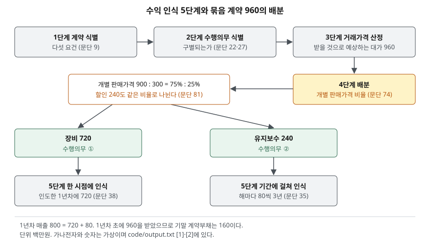

> 예제의 `가나전자`와 그 숫자는 계산을 보이려고 만든 가상 자료다. 단위는 백만원이다. K-IFRS 제1115호는 2018년 1월 1일 이후 시작하는 회계연도부터 적용됐다.

## 들어가며

장비 회사의 사업보고서를 보면 매출은 작년과 비슷한데 영업활동 현금흐름이 매출보다 훨씬 크게 찍힌 해가 있다. 이때 흔히 매출채권을 많이 회수했겠거니 하고 넘어가거나, 반대로 매출이 줄었으니 사업이 꺾였다고 읽는다. 그런데 이 회사가 장비에 몇 년짜리 유지보수를 묶어 팔고 대금을 미리 받는다면, 받은 돈 가운데 상당 부분은 아직 매출이 아니다. 3년 계약 하나의 매출이 첫해에 얼마, 다음 해에 얼마로 나뉘는지 계산할 줄 알면 매출과 현금이 왜 다른지를 재무상태표의 계약부채 한 줄로 설명할 수 있다.

## 개념

### 수익은 통제가 넘어갈 때 인식한다

K-IFRS 제1115호의 핵심 원칙은 고객에게 약속한 재화나 용역을 이전하는 것을 나타내도록, 그 대가로 받을 것으로 예상하는 금액으로 수익을 인식하는 것이다(문단 2). 돈을 받은 때도, 계약서에 서명한 때도 아니고 약속한 것을 고객에게 넘긴 때가 기준이다. 넘긴다는 것은 고객이 그 자산의 사용을 지시하고 효익을 얻을 수 있게 되는 것, 곧 통제가 이전되는 것을 말한다(문단 31).

### 수행의무 — 계약 안의 약속 하나하나

계약 하나에 약속이 여럿 들어 있을 수 있다. 기준서는 구별되는 재화나 용역을 이전하기로 한 약속 각각을 수행의무로 본다(문단 22). 구별된다는 것은 두 조건을 모두 갖춘 것이다. 고객이 그것만으로 또는 쉽게 구할 수 있는 다른 자원과 함께 효익을 얻을 수 있어야 하고, 계약 안의 다른 약속과 따로 식별될 수 있어야 한다(문단 27). 장비와 유지보수는 고객이 각각 따로 사거나 다른 업체에 맡길 수 있으므로 보통 별개의 수행의무가 된다.

## 구조



> **출처**: [K-IFRS 제1115호 고객과의 계약에서 생기는 수익 — 문단 9 계약 식별, 22·27 수행의무, 47 거래가격, 74·81 배분, 35·38 수익 인식 시기](https://accountingwiki.co.kr/standards/1115) (제3자 전재). 숫자는 이 글의 [`code/output.txt`](code/output.txt) `[1]`·`[2]`에 있다.

다섯 단계 가운데 앞의 셋은 무엇을 얼마에 팔았는지 정하고, 뒤의 둘은 그 금액을 어느 약속에 얼마씩, 언제 매출로 옮길지 정한다. 매출의 시점이 갈리는 곳은 4단계와 5단계다.

## 동작 원리

### 배분 — 개별 판매가격의 비율로

거래가격은 각 수행의무의 상대적 개별 판매가격을 기준으로 나눈다(문단 74). 개별 판매가격은 그 재화나 용역을 고객에게 따로 팔 때의 가격이다(문단 77). 따로 파는 가격을 직접 관측할 수 없으면 시장평가 조정, 예상원가 이윤 가산, 잔여접근법 가운데 하나로 추정한다(문단 79). 잔여접근법은 판매가격이 매우 다양하거나 아직 정해지지 않은 경우에만 쓸 수 있다.

묶음으로 팔면서 깎아 준 금액, 곧 개별 판매가격 합계와 계약가격의 차이는 원칙적으로 모든 수행의무에 비례해 나눈다(문단 81). 다만 회사가 그 구성품 일부를 정기적으로 묶어 할인해 팔고 그 할인 폭이 이 계약의 할인과 거의 같다는 등의 요건을 모두 갖추면, 할인을 특정 수행의무에만 붙인다(문단 82).

### 인식 시기 — 한 시점인가, 기간에 걸쳐서인가

수행의무마다 통제가 한 시점에 넘어가는지 기간에 걸쳐 넘어가는지를 정한다. 다음 셋 가운데 하나에 해당하면 기간에 걸쳐 인식한다(문단 35). 고객이 회사의 수행에서 나오는 효익을 동시에 얻고 소비하는 경우, 회사의 수행으로 고객이 통제하는 자산이 만들어지거나 가치가 높아지는 경우, 만들어진 자산을 다른 용도로 쓸 수 없고 지금까지 수행한 부분의 대가를 받을 권리가 있는 경우다. 유지보수는 고객이 서비스를 받는 동안 바로 효익을 소비하므로 첫째 조건에 해당한다. 장비는 어느 것에도 해당하지 않아 인도 시점에 인식한다(문단 38).

### 계약부채 — 받은 돈이 매출을 앞설 때

고객이 대가를 먼저 냈는데 회사가 아직 수행하지 않았으면 그 차이를 계약부채로 표시한다(문단 106). 반대로 회사가 먼저 수행했는데 대가를 받을 권리가 시간 경과 외의 조건에 달려 있으면 계약자산이다(문단 107). 계약부채는 돈을 돌려줄 의무가 아니라 앞으로 용역을 제공할 의무라는 점에서 차입금과 다르다.

## 실습 예제

가나전자는 장비(개별 판매가격 900)와 3년 유지보수(연 100, 합계 300)를 960에 묶어 판다. 1년차 초에 장비를 인도하고 대금 960을 한 번에 받는다. 전체 소스: [`code/`](code/) · 수행 기록: [`code/output.txt`](code/output.txt)

```text
[1] 5단계 적용 — 장비 + 3년 유지보수 묶음 계약 (단위: 백만원)
  1단계 계약 식별      문단 9의 다섯 요건을 충족한다고 가정
  2단계 수행의무 식별  장비 / 유지보수 — 고객이 각각 따로 효익을 얻을 수 있다 (문단 27)
  3단계 거래가격 산정  960 (변동대가·유의적 금융요소 없음으로 가정)
  4단계 배분          개별 판매가격 합계 1200, 계약가격 960 → 할인 240 을 비율대로 나눈다
      장비     개별 판매가격   900  비중 75.0%  배분액    720
      유지보수   개별 판매가격   300  비중 25.0%  배분액    240
  5단계 인식          장비는 인도 시점, 유지보수는 3년에 걸쳐
```

할인 240은 장비와 유지보수에 75:25로 나뉜다. 장비는 900짜리를 720에, 유지보수는 300짜리를 240에 판 셈이 된다.

```text
[2] 연도별 매출과 계약부채 — 대금 960 은 1년차 초에 전액 받음
  연도         장비 매출     유지보수 매출     매출 합계     받은 현금     계약부채 기말
  1년차         720            80         800         960           160
  2년차           0            80          80           0            80
  3년차           0            80          80           0             0
  합계                                   960         960

  비교: 인도 시점에 960 을 전부 매출로 잡으면 (기준서와 다른 처리)
    1년차 매출 960  2년차 0  3년차 0  — 1년차 매출이 160 크고 이후 2년은 0
```

1년차에 현금 960이 들어오지만 매출은 800이다. 남은 160은 아직 제공하지 않은 2년치 유지보수이므로 계약부채로 남고, 해마다 80씩 매출로 옮겨 간다. 3년 합계는 현금과 매출이 같다. 이 처리가 바꾸는 것은 매출의 총액이 아니라 시점이다.

```text
[3] 할인을 어디에 붙이느냐 — 문단 81(비례 배분)과 문단 82(특정 수행의무에 배분)
  연도         비례 배분      장비에 전부      차이
  1년차         800           760       -40
  2년차          80           100       +20
  3년차          80           100       +20
  3년 합계 960 과 960 — 합계는 같고 시점만 다르다
```

문단 82의 요건을 모두 갖춰 할인 240 전부가 장비에 속한다는 증거가 있다고 가정하면, 유지보수는 개별 판매가격 300을 그대로 받고 장비는 660이 된다. 1년차 매출이 40 줄고 뒤의 두 해로 넘어간다. 같은 계약이라도 배분 판단에 따라 연도별 매출이 달라진다.

```text
[4] 계약 건수가 늘다가 멈출 때 — 1~5년차에 10·15·20·20·20 건 체결
  연도        체결     받은 현금        매출     현금-매출     계약부채 기말
  1년차      10        9600      8000       +1600          1600
  2년차      15       14400     12800       +1600          3200
  3년차      20       19200     18000       +1200          4400
  4년차      20       19200     18800        +400          4800
  5년차      20       19200     19200          +0          4800
```

계약이 늘어나는 동안에는 해마다 받은 현금이 매출보다 크고 계약부채가 쌓인다. 체결 건수가 유지보수 기간인 3년 동안 같아진 5년차에는 새 계약에서 미리 받는 금액과 과거 계약에서 풀려나는 금액이 같아져 현금과 매출이 일치한다. 들어가며에서 본 "매출보다 큰 현금"은 이 구조에서 나온다.

## 실무에서 주의할 점

- **계약부채 증가는 매출이 뒤에 따라온다는 뜻이다.** [4]에서 계약부채 잔액은 이미 대금을 받고 아직 매출로 옮기지 않은 금액이다. 같은 해 매출만 보면 성장 속도를 낮게 읽는다. 기준서는 기말에 아직 수행하지 않은 수행의무에 배분된 거래가격과 그것이 언제 수익이 될지를 주석에 공시하게 한다(문단 120). 매출과 함께 이 주석을 봐야 계약 흐름이 보인다.
- **매출과 현금의 차이를 한 방향으로만 해석하지 않는다.** 계약부채가 늘면 현금이 매출보다 크고, 계약자산이나 매출채권이 늘면 반대가 된다. [현금흐름표 글](../2026-09-30-cash-flow-profit-without-cash/index.md)에서 본 운전자본 변동에 계약부채와 계약자산도 들어간다는 점을 함께 본다.
- **배분과 인식 시기에는 판단이 들어간다.** [3]처럼 할인을 어디에 붙이느냐, 개별 판매가격을 어떻게 추정하느냐에 따라 같은 계약에서 연도별 매출이 달라진다. 기준서는 수행의무 이행 시기와 거래가격 배분에 쓴 판단을 공시하게 하므로(문단 123) 회계정책 주석에서 회사의 방법을 확인한다. [주석 읽기 글](../2026-10-01-notes-and-audit-opinion/index.md)의 방법이 여기서도 쓰인다.
- **선수금 기간이 1년을 넘으면 금융요소를 따진다.** 대금을 받는 시점과 수행 시점 사이가 1년 이내로 예상되면 유의적 금융요소를 반영하지 않아도 되지만(문단 63), 이 예제처럼 3년치를 미리 받으면 그 편의를 쓸 수 없다. 이 글은 금융요소가 유의적이지 않다고 가정했다. 유의적이면 거래가격을 조정하고 이자비용이 따로 잡힌다(문단 60·61).
- **회사 간 매출을 바로 비교하지 않는다.** 묶음 판매 비중, 선수금 관행, 배분 방법이 다르면 같은 사업 규모에서도 매출의 시점이 다르다. 매출 성장률을 나란히 놓기 전에 계약부채 잔액의 추이를 같이 놓는다.

## 정리

- 수익은 돈을 받은 때가 아니라 약속한 재화·용역의 통제가 고객에게 넘어갈 때 인식한다.
- 5단계는 계약 식별 → 수행의무 식별 → 거래가격 산정 → 배분 → 인식이고, 매출 시점이 갈리는 곳은 배분과 인식이다.
- 묶음 할인은 원칙적으로 개별 판매가격 비율로 나누고, 요건을 갖추면 특정 수행의무에만 붙인다.
- 받은 현금이 매출을 앞서면 그 차이가 계약부채로 남고, 계약이 늘어나는 동안 현금이 매출보다 크게 찍힌다.

## 참고 자료

- [한국회계기준원 — 시행 중인 K-IFRS 기준서 목록](https://www.kasb.or.kr/front/board/ingAccountingList.do) — 기업회계기준서 제1115호 고객과의 계약에서 생기는 수익 원문 발행처. 아래 전재 사이트는 문단을 바로 열기 위한 편의 링크다
- [IFRS Foundation — IFRS 15 Revenue from Contracts with Customers](https://www.ifrs.org/issued-standards/list-of-standards/ifrs-15-revenue-from-contracts-with-customers/) — 국제회계기준 원문 발행처
- [K-IFRS 제1115호 — 문단 2 핵심 원칙, 9 계약 식별, 22·27 수행의무, 31·35·38 수익 인식 시기, 47 거래가격, 60~63 유의적 금융요소, 74·76·77·79 배분과 개별 판매가격, 81·82 할인 배분, 105~107 계약부채·계약자산, 120·123 공시](https://accountingwiki.co.kr/standards/1115) (제3자 전재)
