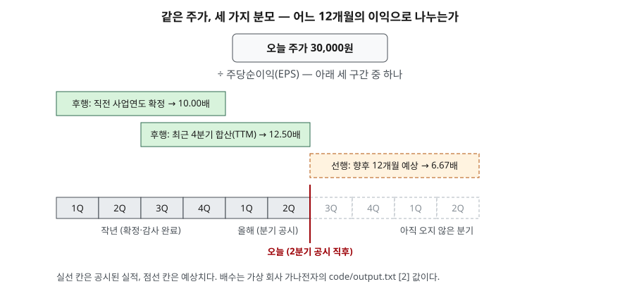

> 예제의 회사 `가나전자`·`다라물산`과 그 숫자는 계산 원리를 보이려고 만든 가상 값이다. 실제 기업과 관계가 없다. 예상 이익도 설명용 가정값이다.

## 들어가며

같은 종목의 PER을 두 곳에서 찾아보면 숫자가 다르게 나오는 일이 흔하다. 한 화면은 10배, 다른 화면은 12.5배, 증권사 자료에는 6.7배가 적혀 있다. 대개는 어느 한쪽이 틀렸거나 갱신이 늦었다고 생각하고 가장 최근에 본 숫자를 믿는다. 그런데 세 숫자는 주가가 같고 분모만 다를 수 있다. 아래 예제의 가나전자는 주가 30,000원 하나로 PER이 세 가지 나온다. 분모가 무엇인지 확인하지 않고 두 회사의 PER을 나란히 놓으면 서로 다른 잣대로 잰 값을 비교하게 된다.

## 개념

PER(주가수익비율, Price Earnings Ratio)은 주가를 주당순이익(EPS)으로 나눈 값이다. 한국은행 경제용어 해설은 이것을 기업의 수익성 측면에서 주가를 판단하는 지표로 설명하고, 기획재정부 시사경제용어사전은 주가가 주당순이익의 몇 배인지를 나타낸다고 적는다. 분자와 분모에 주식수를 곱하면 시가총액 ÷ 순이익이 되므로, 회사 전체를 지금 가격에 사면 지금 이익으로 몇 년 치를 치르는지로도 읽힌다.

분모인 EPS는 회계기준이 정한다. K-IFRS 제1033호 주당이익에 따르면 기본주당이익은 다음과 같이 계산한다(문단 10).

| 구성 | 기준서가 정한 것 |
|---|---|
| 분자 | 지배기업의 보통주에 귀속되는 당기순손익 |
| 분모 | 그 기간에 유통된 보통주식수를 가중평균한 주식수 |
| 가중평균 | 기초 유통주식수에 기중 발행·취득 주식을 유통 기간만큼 가중해 조정(문단 20) |
| 손실일 때 | 주당손실도 표시한다(문단 69) |

손익계산서에 찍히는 EPS는 이 규칙으로 계산한 확정치다. PER을 계산하는 쪽은 이 확정 EPS를 그대로 쓸 수도 있고, 분기 실적을 이어 붙이거나 예상치를 쓸 수도 있다. 이 선택이 PER의 종류를 가른다.

| 구분 | 분모 | 성격 |
|---|---|---|
| 후행 PER (확정 연간) | 직전 사업연도 EPS | 감사를 마친 숫자. 대신 시간이 지날수록 오래된 이익이 된다 |
| 후행 PER (TTM) | 최근 4개 분기 EPS 합 | 공시된 실적 중 가장 최근 12개월 |
| 선행 PER | 향후 12개월 또는 다음 연도 예상 EPS | 아직 일어나지 않은 이익. 누가 추정했는지에 따라 값이 다르다 |

## 구조



> **출처**: [K-IFRS 제1033호 주당이익 — 문단 10 기본주당이익, 문단 20 가중평균유통보통주식수](https://accountingwiki.co.kr/standards/1033) (제3자 전재) · [한국은행 경제용어 — 주가수익비율(2011.9.26 등록)](https://www.bok.or.kr/portal/bbs/P0000795/view.do?nttId=173407&menuNo=200559&searchBbsSeCd=z19&pageIndex=62) — 산식. 배수는 이 글의 [`code/output.txt`](code/output.txt) `[2]`에서 옮겼다.

세 막대는 모두 12개월 길이지만 놓인 자리가 다르다. 오늘이 2분기 실적 공시 직후라면 확정 연간 이익은 이미 6개월 넘게 지난 기간의 숫자다. TTM은 그중 오래된 두 분기를 올해 두 분기로 바꿔 끼운다. 선행 PER의 분모는 오늘 오른쪽, 아직 공시되지 않은 칸에 있다.

## 동작 원리

### 분모의 순이익은 지배주주 몫이다

연결재무제표의 당기순이익에는 자회사의 다른 주주 몫(비지배지분)이 섞여 있다. 기준서는 EPS의 분자를 지배기업 보통주에 귀속되는 순손익으로 정하므로, 연결 순이익 전체로 PER을 계산하면 분모가 부풀고 PER이 낮게 나온다. 예제에서 연결 순이익 440억 전체를 쓰면 7.50배, 지배주주 몫 330억을 쓰면 10.00배다.

### 주식수는 기말이 아니라 가중평균이다

기중에 주식이 늘었으면 늘어난 주식은 그 이후 기간의 이익에만 기여한다. 기준서가 유통 기간만큼 가중하라고 정한 이유다(문단 20). 7월 1일에 200만 주를 발행한 가나전자의 가중평균 주식수는 1,100만 주이고, 기말 주식수 1,200만 주로 나누면 EPS가 3,000원에서 2,750원으로 내려가 PER이 10.91배가 된다. 반대로 주식분할이나 무상증자는 자원 유입 없이 주식수만 바꾸므로 비교 기간까지 소급해 조정한다(문단 64). 분할 전후 EPS를 그대로 이어 붙이면 이익이 갑자기 줄어든 것처럼 보인다.

### 이익이 0에 가까우면 PER은 읽을 수 없다

PER은 이익을 분모에 둔다. 이익이 줄면 PER은 비례가 아니라 반비례로 커진다. 순이익이 300억에서 30억으로 10분의 1이 되면 PER은 10배에서 100배가 되고, 3억이면 1,000배가 된다. 이때 1,000배는 회사가 비싸다는 뜻이라기보다 분모가 0에 가깝다는 신호다. 순이익이 0이면 나눗셈이 정의되지 않고, 적자로 넘어가면 PER은 음수가 된다. −100배와 10배를 같은 축에 놓고 크기를 비교할 수 없다. 그래서 적자 회사의 PER은 대개 표시되지 않거나 의미 없는 값으로 취급된다.

분자와 분모를 뒤집은 **이익수익률**(E/P = EPS ÷ 주가)은 이 문제가 없다. 이익이 줄면 10% → 5% → 1% → 0.1% → 0% → −1%로 같은 방향으로 이어진다. 적자 회사가 섞인 목록을 정렬할 때 PER 대신 E/P를 쓰는 이유다.

## 실습 예제

가나전자의 주가를 30,000원으로 고정하고 분모만 바꿨다. 순이익 단위는 억원이다.

전체 소스: [`code/`](code/) · 수행 기록: [`code/output.txt`](code/output.txt)

```text
[2] 주가 30,000원 고정, 분모만 바꾼 PER (순이익 단위: 억원)
  분모                                 순이익    EPS(원)      PER
  후행 — 직전 사업연도 확정 이익                 330     3,000   10.00배
  후행 — 최근 4분기 합산(TTM)                264     2,400   12.50배
  선행 — 향후 12개월 예상 이익(가정)              495     4,500    6.67배

[3] 연결 순이익 전체를 쓰면 (직전 사업연도)
  연결 당기순이익 전체           440억  EPS   4,000원  PER   7.50배
  지배기업 소유주 귀속분          330억  EPS   3,000원  PER  10.00배

[4] 같은 이익 330억, 주식수 기준만 다르면
  가중평균 주식수      11,000,000주  EPS   3,000원  PER  10.00배
  기말 주식수        12,000,000주  EPS   2,750원  PER  10.91배

[5] 일회성 이익이 섞이면 — 다라물산 (주가 20,000원, 주식 500만 주)
  보고 순이익(처분이익 포함)         100억  EPS   2,000원  PER  10.00배
  처분이익을 뺀 순이익              50억  EPS   1,000원  PER  20.00배

[6] 주가 30,000원 고정, 이익이 0을 지나 적자로 갈 때 (주식 1,000만 주)
      순이익(억)    EPS(원)         PER       이익수익률 E/P
         300     3,000       10.0배          10.00%
          30       300      100.0배           1.00%
           3        30    1,000.0배           0.10%
           0         0       계산 불가           0.00%
         -30      -300     -100.0배          -1.00%
```

`[0]` 산식, `[1]` 주식수 계산, `[6]`의 150억 줄은 [`code/output.txt`](code/output.txt)에 있다.

`[2]`의 세 숫자는 주가가 하나인데 6.67배에서 12.50배까지 벌어진다. TTM이 확정 연간보다 높은 것은 최근 분기 이익이 줄었다는 뜻이고, 선행이 가장 낮은 것은 추정한 쪽이 이익이 늘어난다고 봤다는 뜻이다. 어느 쪽이 맞는 PER이냐가 아니라, 세 값의 차이 자체가 이익의 방향에 대한 정보다.

`[5]`의 다라물산은 공장 부지 처분이익 50억이 순이익의 절반이다. 보고된 PER은 10.00배지만 다시 일어나지 않을 이익을 빼면 20.00배다. 영업이익과 당기순이익이 왜 갈리는지는 [영업이익과 당기순이익 사이](../../statements/2026-09-30-operating-vs-net-income-gap/index.md)에서 다뤘다.

## 실무에서 주의할 점

- **두 PER을 비교하기 전에 분모가 같은지 본다.** 한쪽은 확정 연간, 다른 쪽은 TTM이나 선행이면 비교가 성립하지 않는다. 같은 회사의 PER 추이를 볼 때도 기준이 중간에 바뀌지 않았는지 확인한다.
- **선행 PER의 분모는 추정치다.** 누가 언제 낸 추정인지에 따라 값이 다르고, 실제 이익이 공시되면 확정치로 대체된다. 예제의 6.67배는 예상 이익 495억이라는 가정 하나에서 나온 값이고, 그 가정이 바뀌면 그대로 따라 바뀐다.
- **낮은 PER의 원인은 여럿이다.** 일회성 이익으로 분모가 부풀었을 수도 있고(`[5]`), 연결 순이익 전체를 썼을 수도 있고(`[3]`), 이익이 앞으로 줄어들 것으로 시장이 보고 있을 수도 있다. PER 하나로 싸다·비싸다를 정하지 않는다. 한국은행 해설도 절대값보다 같은 산업의 평균과 비교해야 한다고 적는다.
- **적자이거나 이익이 0 근처인 회사에는 PER을 쓰지 않는다.** 이때는 PER이 이익의 크기가 아니라 분모가 0에 가깝다는 사실만 드러낸다. 이익수익률이나 이익과 무관한 지표(순자산 대비 주가 등)로 넘어간다.
- **주식분할·무상증자 전후 EPS를 그대로 잇지 않는다.** 기준서는 비교 기간 EPS를 소급 수정하게 하므로(문단 64), 과거 EPS는 최신 재무제표에 다시 표시된 값을 쓴다.

## 정리

- PER은 주가 ÷ EPS이고, EPS는 지배주주 귀속 순이익 ÷ 가중평균유통보통주식수다(K-IFRS 제1033호 문단 10).
- 분모를 직전 사업연도·최근 4분기·향후 12개월 예상 중 무엇으로 두느냐에 따라 같은 주가에서 PER이 갈린다. 세 값의 차이는 이익의 방향을 보여 준다.
- 연결 순이익 전체나 기말 주식수를 쓰면 EPS가 기준서와 다르게 계산된다.
- 이익이 0에 가까우면 PER은 끝없이 커지고 적자면 음수가 되어 비교에 쓸 수 없다. 이때는 이익수익률(E/P)이 연속으로 이어진다.

## 참고 자료

- [한국회계기준원 — 시행 중인 K-IFRS 기준서 목록](https://www.kasb.or.kr/front/board/ingAccountingList.do) — 기업회계기준서 제1033호 주당이익 원문 발행처
- [K-IFRS 제1033호 주당이익 — 문단 10·19·20·26·64·69](https://accountingwiki.co.kr/standards/1033) (제3자 전재)
- [IFRS Foundation — IAS 33 Earnings per Share](https://www.ifrs.org/issued-standards/list-of-standards/ias-33-earnings-per-share/)
- [한국은행 경제용어 — 주가수익비율, 주가순자산비율(2011.9.26 등록, 한국은행 인천본부)](https://www.bok.or.kr/portal/bbs/P0000795/view.do?nttId=173407&menuNo=200559&searchBbsSeCd=z19&pageIndex=62) — 정의, 산업 평균과 비교하라는 해설
- [기획재정부 시사경제용어사전 — PBR/PER(2020.11.3 등록)](https://mofe.go.kr/sisa/dictionary/detail?idx=191) — 정의와 산식
