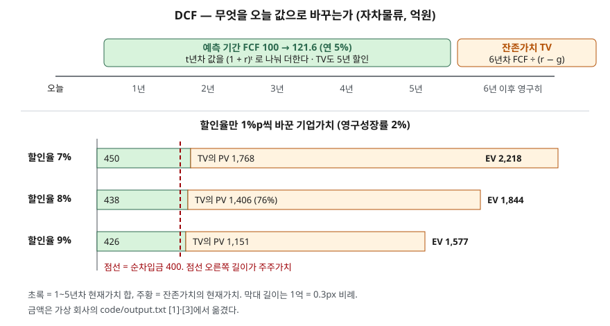

> 예제의 회사 `자차물류`와 그 숫자는 계산 원리를 보이려고 만든 가상 값이다. 실제 기업과 관계가 없다. 예측 현금흐름·성장률·할인율·순차입금은 모두 설명용 가정값이다.

## 들어가며

증권사 리포트나 인수 검토 자료에서 "DCF로 산정한 적정 주가 14,443원" 같은 문장을 볼 때가 있다. 소수점 없는 숫자라 정밀하게 계산된 값처럼 읽힌다. 그런데 같은 회사, 같은 현금흐름 예측에서 할인율 하나를 8%에서 7%로 내리면 그 값은 18,181원이 되고, 9%로 올리면 11,774원이 된다. 영구성장률 가정까지 0.5%p씩 흔들면 같은 회사의 주당가치가 10,236원에서 22,817원까지 2.2배 범위에 걸친다. 결과 숫자 하나만 받아 들면 이 범위가 보이지 않는다.

## 개념

현금흐름할인(DCF, Discounted Cash Flow)은 회사가 앞으로 만들어 낼 현금흐름을 추정하고, 각각을 할인율로 나눠 오늘 시점의 값으로 바꾼 뒤 더하는 방법이다. 오늘의 1억과 5년 뒤의 1억은 값이 다르다는 화폐의 시간가치가 출발점이다. 할인율 8%면 5년 뒤의 1억은 오늘 0.68억이다.

| 구성 | 산식 | 무엇을 정하는가 |
|---|---|---|
| 예측 기간 현금흐름 | 1~n년차 잉여현금흐름(FCF) 추정 | 사업 계획에서 나오는 숫자 |
| 할인율 r | 보통 가중평균자본비용(WACC) | 그 현금흐름을 얻으려고 감수하는 위험의 값 |
| 잔존가치 TV | (n+1)년차 FCF ÷ (r − g) | 예측 기간 뒤 영구히 g로 자란다고 본 값 |
| 기업가치 EV | 예측 기간 PV 합 + TV의 PV | 주주와 채권자 몫을 합친 값 |
| 주주가치 | EV − 순차입금 | 주식의 값. 주식 수로 나누면 주당가치 |

PER·PBR·EV/EBITDA가 다른 회사의 시장 가격과 견주는 상대가치 방법이라면, DCF는 그 회사 자체의 현금흐름에서 값을 계산하는 절대가치 방법이다. 비교 대상이 없어도 쓸 수 있지만, 그만큼 가정에 기대는 몫이 크다.

회계기준에도 같은 구조가 들어 있다. K-IFRS 제1036호 자산손상은 자산의 사용가치를 그 자산에서 얻을 미래현금흐름의 현재가치로 정의하고(문단 6), 미래현금흐름 추정과 할인율 적용 두 단계로 계산하게 한다(문단 31). 예측은 정당한 사유가 없으면 최장 5년으로 하고, 그 뒤 성장률은 고정되거나 하락한다고 가정하며 장기 평균성장률을 넘지 못한다(문단 33). K-IFRS 제1113호 공정가치 측정도 이익접근법의 하나로 현재가치기법을 든다(문단 62, B10~B11). 다만 제1036호는 손상 검사용이라 세전 할인율을 쓰게 하고(문단 55), 주식가치 평가에서 흔히 쓰는 세후 WACC와는 할인율 기준이 다르다.

## 구조



> **출처**: [K-IFRS 제1036호 자산손상 — 문단 6 사용가치 정의, 문단 31 계산 단계, 문단 33 예측 기간과 이후 성장률](https://accountingwiki.co.kr/standards/1036) (제3자 전재) · [Damodaran, Closure in Valuation: Estimating Terminal Value](https://pages.stern.nyu.edu/~adamodar/pdfiles/papers/termvalue.pdf) — 영구성장 잔존가치 산식(2차 자료, NYU Stern 워킹페이퍼). 금액은 이 글의 [`code/output.txt`](code/output.txt) `[1]`·`[3]`에서 옮겼다.

위쪽은 무엇을 할인하는지를 시간축에 놓은 것이다. 초록 상자는 해마다 따로 할인하고, 주황 상자는 6년차 이후를 5년차 말 시점의 값 하나로 묶은 뒤 다시 5년을 할인한다. 아래쪽은 할인율만 바꿨을 때 기업가치 막대다. 초록 부분은 거의 그대로이고 주황 부분이 줄어든다.

## 동작 원리

### 기업가치의 4분의 3이 5년 뒤에서 온다

할인율 8%에서 자차물류의 1~5년차 현금흐름 현재가치 합은 437.9억이다. 잔존가치는 5년차 말 시점에 2,066.4억이고, 이를 5년 할인하면 1,406.3억이다. 기업가치 1,844.3억 가운데 76.3%가 6년차 이후 현금흐름에서 나온다. 사업 계획서에 공들여 적은 5년 숫자보다, 그 뒤 영구히 연 2%로 자란다는 한 줄짜리 가정이 값의 대부분을 정한다.

### 할인율 1%p가 바꾸는 것

할인율을 7%로 내리면 5년 현금흐름의 현재가치 합은 437.9억에서 450.1억으로 2.8% 늘 뿐이다. 잔존가치의 현재가치는 1,406.3억에서 1,767.9억으로 25.7% 늘어난다. 기업가치는 합쳐서 20.3% 오른다. 9%로 올리면 반대로 14.5% 내린다.

잔존가치가 크게 흔들리는 이유는 분모에 있다. 잔존가치는 6년차 현금흐름에 1 ÷ (r − g)를 곱한 값이다. r − g가 6%면 16.7배, 5%면 20.0배다. 할인율 1%p가 이 배수를 바꾸고, 그 결과를 다시 5년 할인할 때도 할인율이 한 번 더 들어간다. 차이가 3%까지 좁아지면 배수는 33.3배가 되므로, 할인율과 영구성장률이 가까울수록 같은 1%p의 효과가 더 커진다.

### 주당가치는 더 크게 움직인다

기업가치에서 순차입금 400억을 빼야 주주가치가 된다. 순차입금은 할인율과 관계없이 고정이라, 기업가치가 20.3% 움직이면 주주가치는 그보다 큰 25.9%가 움직인다. 9% 쪽은 기업가치 −14.5%가 주당가치 −18.5%로 커진다. 빚이 많은 회사일수록 이 증폭이 커진다. EV에서 순차입금을 빼는 구조는 [EV/EBITDA — 빚까지 포함해 회사를 사는 값](../2026-10-03-ev-ebitda-debt-included/index.md)에서 다뤘다.

### 두 가정을 함께 흔들면

할인율 7~9%, 영구성장률 1~3%를 0.5%p 간격으로 놓고 주당가치를 계산하면 가장 낮은 칸(9%, 1%)이 10,236원, 가장 높은 칸(7%, 3%)이 22,817원이다. 기준값에서 두 가정을 각각 1%p씩만 위아래로 움직인 범위인데 결과는 2.2배 차이가 난다. 그래서 DCF 결과는 숫자 하나보다 이런 표로 볼 때 뜻이 있다.

## 실습 예제

1년차 FCF 100억, 5년간 연 5% 성장, 이후 영구성장 2%, 기준 할인율 8%, 순차입금 400억, 발행주식 1,000만 주는 모두 가정이다. 현금흐름은 연말에 들어온다고 보았다. 단위는 억원, 주당가치는 원이다.

전체 소스: [`code/`](code/) · 수행 기록: [`code/output.txt`](code/output.txt)

```text
[1] 자차물류 — 할인율 8% 에서 연도별 할인 (단위: 억원)
  연도         FCF      할인계수      현재가치
  1년차     100.0    0.9259      92.6
  2년차     105.0    0.8573      90.0
  3년차     110.2    0.7938      87.5
  4년차     115.8    0.7350      85.1
  5년차     121.6    0.6806      82.7
  잔존가치  2066.4    0.6806    1406.3   (5년차 말 시점 값을 5년 할인)

[3] 할인율만 1%p 바꾸면 (영구성장률 2% 고정, 단위: 억원)
  할인율      5년 PV합   TV의 PV       EV    EV 변화     주주가치     주당가치(원)    주당 변화
     7%      450.1   1767.9   2218.1   +20.3%   1818.1      18,181   +25.9%
     8%      437.9   1406.3   1844.3    +0.0%   1444.3      14,443    +0.0%
     9%      426.3   1151.1   1577.4   -14.5%   1177.4      11,774   -18.5%

[4] 주당가치 민감도 (단위: 원, 행 = 할인율, 열 = 영구성장률)
                1.0%      1.5%      2.0%      2.5%      3.0%
     7.0%     15,090    16,495    18,181    20,242    22,817
     7.5%     13,596    14,763    16,142    17,797    19,819
     8.0%     12,316    13,297    14,443    15,796    17,421
     8.5%     11,206    12,042    13,006    14,130    15,459
     9.0%     10,236    10,954    11,774    12,720    13,824
  표의 양 끝: 10,236원 ~ 22,817원 (2.2배)
```

`[0]` 산식, `[2]` 기업가치 구성, `[5]` r − g 배수 표는 [`code/output.txt`](code/output.txt)에 있다.

`[1]`의 잔존가치 줄은 할인계수가 5년차와 같다. 5년차 말 시점의 값이기 때문이다. `[3]`에서 5년 PV합 열은 426~450억 사이에 머물고 TV의 PV 열이 1,151~1,768억으로 크게 움직인다. `[4]`는 오른쪽 위로 갈수록, 즉 할인율이 낮고 영구성장률이 높을수록 값이 빠르게 커진다. 두 값의 차이가 좁아지는 방향이다.

## 실무에서 주의할 점

- **결과보다 잔존가치 비중을 먼저 본다.** 기업가치의 70~80%가 잔존가치라면 그 평가는 사실상 영구성장률과 할인율 두 가정에 대한 평가다. 비중이 클수록 민감도 표를 함께 봐야 한다.
- **영구성장률은 할인율보다 충분히 낮아야 한다.** g가 r에 가까워지면 잔존가치가 발산하고, r 이상이면 산식이 뜻을 잃는다. K-IFRS 제1036호도 예측 기간 이후 성장률이 장기 평균성장률을 넘지 못하게 한다(문단 33). Damodaran도 어느 회사도 속한 경제보다 영구히 빨리 자랄 수는 없다는 이유로 같은 상한을 둔다.
- **할인율 기준을 현금흐름과 맞춘다.** 기업 전체 현금흐름(FCFF)은 WACC로 할인해 EV를 얻고 순차입금을 뺀다. 주주 몫 현금흐름(FCFE)은 자기자본비용으로 할인해 바로 주주가치를 얻는다. 둘을 섞으면 빚을 두 번 빼거나 한 번도 안 빼게 된다. 세전·세후 기준도 맞춘다.
- **예측 현금흐름의 근거를 따라간다.** 5년간 연 5% 성장은 숫자 한 줄이지만, 그 뒤에는 매출·마진·설비투자·운전자본 가정이 있다. 현금흐름표의 영업활동과 투자활동 실적과 비교해 예측이 과거 추세에서 얼마나 벗어나는지를 본다. 세 활동은 [현금흐름표 세 가지 활동](../../statements/2026-09-30-cash-flow-three-activities/index.md)에서 다뤘다.
- **DCF 값을 다른 방법과 함께 놓는다.** 결과로 나온 EV를 EBITDA로 나눠 같은 업종의 EV/EBITDA와 비교하면, 가정이 시장의 눈높이에서 얼마나 떨어져 있는지 드러난다. 어느 한쪽이 맞는다고 정하는 것이 아니라 차이의 이유를 찾는 데 쓴다.

## 정리

- DCF는 미래 현금흐름을 할인율로 나눠 오늘 값으로 바꾼 뒤 더한다. 예측 기간 뒤는 잔존가치 하나로 묶는다.
- 예제에서 기업가치의 76.3%가 잔존가치였다. 값의 대부분이 영구성장률과 할인율 가정에서 나온다.
- 할인율 1%p로 기업가치가 +20.3%·−14.5%, 순차입금 때문에 주당가치는 +25.9%·−18.5% 움직였다.
- 할인율과 영구성장률의 차이가 좁을수록 같은 1%p의 효과가 커진다. 결과는 숫자 하나가 아니라 민감도 표로 본다.

## 참고 자료

- [한국회계기준원 — 시행 중인 K-IFRS 기준서 목록](https://www.kasb.or.kr/front/board/ingAccountingList.do) — 기업회계기준서 제1036호 자산손상, 제1113호 공정가치 측정 원문 발행처
- [K-IFRS 제1036호 자산손상 — 문단 6·31·33·55](https://accountingwiki.co.kr/standards/1036) (제3자 전재)
- [K-IFRS 제1113호 공정가치 측정 — 문단 62, B10~B11](https://accountingwiki.co.kr/standards/1113) (제3자 전재)
- [IFRS Foundation — IAS 36 Impairment of Assets](https://www.ifrs.org/issued-standards/list-of-standards/ias-36-impairment-of-assets/) — 사용가치 산정 원문
- [IFRS Foundation — IFRS 13 Fair Value Measurement](https://www.ifrs.org/issued-standards/list-of-standards/ifrs-13-fair-value-measurement/) — 이익접근법·현재가치기법 원문
- [Damodaran, Closure in Valuation: Estimating Terminal Value](https://pages.stern.nyu.edu/~adamodar/pdfiles/papers/termvalue.pdf) — 영구성장 잔존가치 산식과 성장률 상한 논의(2차 자료, NYU Stern 워킹페이퍼)
