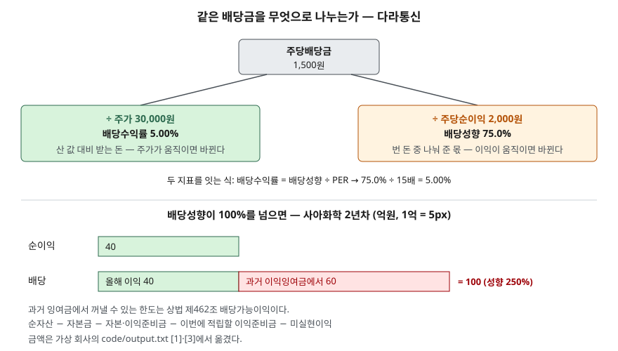

> 예제의 회사 `가나식품`·`다라통신`·`마바유통`·`사아화학`과 그 숫자는 계산 원리를 보이려고 만든 가상 값이다. 실제 기업과 관계가 없다.

## 들어가며

배당을 받으려고 종목을 고를 때 증권사 화면에서 배당수익률 순으로 정렬하는 일이 흔하다. 맨 위에 수익률 8%대 종목이 보이고, 예금 금리의 두세 배라 눈이 간다. 그런데 그 회사가 작년에 배당을 늘린 것이 아니라 주가가 40% 떨어져 수익률이 5%에서 8.33%로 올라간 것일 수 있다. 또 순이익의 250%를 배당으로 나눠 주고 있어서, 쌓아 둔 잉여금이 몇 해 안에 바닥나는 회사일 수도 있다. 수익률 하나만 보면 이 둘이 화면에서 구별되지 않는다.

## 개념

두 지표는 분자가 같다. 회사가 주주에게 나눠 주는 배당금이다. 다른 것은 분모다.

| 지표 | 산식 | 분모가 뜻하는 것 | 움직이는 원인 |
|---|---|---|---|
| 배당수익률 | 주당배당금 ÷ 주가 | 주주가 주식을 사려고 낸 값 | 배당 변화, 주가 변화 |
| 배당성향 | 배당금총액 ÷ 당기순이익 | 회사가 그해 번 돈 | 배당 변화, 이익 변화 |

배당수익률은 **주주 쪽에서** 본 값이다. 지금 가격에 사서 지금 수준의 배당을 받으면 투자한 돈의 몇 %가 현금으로 돌아오는지를 잰다. 배당성향은 **회사 쪽에서** 본 값이다. 번 돈 가운데 얼마를 나눠 주고 얼마를 회사 안에 남기는지를 잰다.

한국거래소 KIND의 배당 통계는 배당성향을 배당금총액을 연결 당기순이익으로 나눈 값으로 적는다. 연결재무제표가 없는 회사는 개별 당기순이익을 쓴다. 공시에서 배당수익률은 시가배당률이라는 이름으로 나온다. 한국거래소 현금·현물배당 결정 공시 서식은 배당기준일 2매매거래일 전일부터 과거 1주일간 종가의 산술평균을 분모로 쓴다. 증권사 화면의 배당수익률은 현재 주가로 다시 계산한 값이 많아 공시의 시가배당률과 다를 수 있다.

두 지표는 PER을 거쳐 이어진다. 주당배당금 ÷ 주가를 주당배당금 ÷ EPS와 EPS ÷ 주가로 쪼개면 **배당수익률 = 배당성향 ÷ PER** 이 된다. PER은 [PER — 지난 이익과 예상 이익](../2026-10-02-per-trailing-vs-forward/index.md)에서 다뤘다.

## 구조



> **출처**: [한국거래소 KIND 배당정보 — 배당성향 산식](https://kind.krx.co.kr/disclosureinfo/dividendinfo.do?method=searchDividendInfoMain) · [한국거래소 KIND 현금·현물배당 결정 공시 서식 — 시가배당율 산정 기준](https://kind.krx.co.kr/external/2024/02/29/000339/20240229000359/71500.htm) · [상법 제462조 이익의 배당 제1항](https://casenote.kr/%EB%B2%95%EB%A0%B9/%EC%83%81%EB%B2%95/%EC%A0%9C462%EC%A1%B0) (제3자 전재). 금액은 이 글의 [`code/output.txt`](code/output.txt) `[1]`·`[3]`에서 옮겼다.

위쪽은 같은 1,500원을 두 분모로 나눈 결과다. 왼쪽은 주가가 바뀌면 움직이고, 오른쪽은 이익이 바뀌면 움직인다. 아래쪽은 배당이 이익보다 큰 해에 그 차이가 어디서 메워지는지를 보인다.

## 동작 원리

### 수익률이 같아도 성향은 다르다

예제의 다라통신과 마바유통은 주가 30,000원, 주당배당금 1,500원으로 배당수익률이 둘 다 5.00%다. 그런데 EPS가 다라통신 2,000원, 마바유통 10,000원이다. 다라통신은 번 돈의 75%를 나눠 주고, 마바유통은 15%만 나눠 주고 85%를 회사에 남긴다. 다라통신은 이익이 조금만 줄어도 같은 배당을 이어가기 어렵고, 마바유통은 이익이 절반으로 줄어도 배당성향이 30%가 될 뿐이다. 수익률 화면에서는 두 회사가 같은 줄에 선다.

반대로 가나식품과 다라통신은 PER이 15배로 같고 배당성향이 30%와 75%로 다르다. 위 식대로 수익률은 2.00%와 5.00%로 갈린다. 시장이 이익에 같은 배수를 매긴 두 회사라면, 수익률 차이는 곧 이익 중 얼마를 나눠 주느냐의 차이다.

### 주가가 떨어지면 수익률이 오른다

다라통신의 주가가 30,000원에서 18,000원으로 40% 떨어지고 배당은 그대로라면 수익률은 5.00%에서 8.33%로 오른다. 배당성향은 75.0%로 움직이지 않는다. 회사가 더 나눠 준 것이 없는데 수익률만 올라간 것이다. 주가가 떨어진 이유가 이익 전망 악화라면, 다음 해 배당이 줄어 그 8.33%가 실제로는 받지 못하는 숫자가 될 수 있다. 수익률이 높아진 원인이 분자인지 분모인지를 먼저 가린다.

### 배당성향이 100%를 넘으면

사아화학은 3년 동안 주당배당금 1,000원, 총 100억을 유지했다. 순이익은 125억, 40억, −30억으로 줄었다. 배당성향은 80%, 250%가 되고, 3년차에는 순손실이라 비율이 음수가 되어 뜻을 잃는다.

번 돈보다 많이 나눠 준 차이는 재무상태표의 이익잉여금에서 나간다. 2년차는 40억을 벌고 100억을 나눠 줬으니 잉여금이 60억 줄었다. 3년차는 손실 30억과 배당 100억이 겹쳐 130억이 줄었다. 3년 동안 잉여금은 400억에서 235억이 되었다.

이 돈을 얼마까지 꺼낼 수 있는지는 상법이 정한다. 상법 제462조 제1항은 재무상태표의 순자산에서 자본금, 이미 쌓은 자본준비금과 이익준비금, 그 결산기에 쌓아야 할 이익준비금, 미실현이익을 뺀 금액을 배당 한도로 둔다. 상법 제458조는 자본금의 2분의 1이 될 때까지 매 결산기 이익배당액의 10분의 1 이상을 이익준비금으로 쌓게 한다. 사아화학은 이익준비금이 자본금 50억의 절반인 25억에 이미 도달했으므로 더 쌓을 금액이 없다. 그래서 한도는 준비금을 뺀 잉여금과 같아지고, 1~3년차에 525억, 465억, 335억이다. 한도 안이므로 세 해 모두 배당이 가능했다. 같은 손실과 배당이 반복된다고 가정하면 남은 235억은 1.8년 치다.

배당성향 100% 초과가 곧 문제라는 뜻은 아니다. 일회성 손실로 한 해 이익이 줄었을 때 배당을 유지하는 회사도 있다. 다만 그 해가 몇 년 이어지면 배당의 재원이 이익이 아니라 과거 잉여금이라는 점은 숫자로 드러난다.

## 실습 예제

단위는 `[1]`·`[2]`가 원, `[3]`이 억원이다. 사아화학의 배당은 그해 결산 잔액에서 나간다고 단순화했다.

전체 소스: [`code/`](code/) · 수행 기록: [`code/output.txt`](code/output.txt)

```text
[1] 주당배당금 1,500원으로 같은 세 회사 (단위: 원)
                  주가     EPS     주당배당금     PER     배당수익률     배당성향    성향÷PER
  가나식품        75,000   5,000     1,500   15.0배     2.00%    30.0%     2.00%
  다라통신        30,000   2,000     1,500   15.0배     5.00%    75.0%     5.00%
  마바유통        30,000  10,000     1,500    3.0배     5.00%    15.0%     5.00%

[2] 다라통신 — 배당은 그대로, 주가만 40% 떨어지면 (단위: 원)
                  주가     주당배당금     배당수익률     배당성향
  하락 전        30,000     1,500     5.00%    75.0%
  하락 후        18,000     1,500     8.33%    75.0%

[3] 사아화학 — 순이익이 줄어도 주당배당금 1,000원을 유지한 3년 (단위: 억원)
  자본금 50 · 자본준비금 100 · 이익준비금 25(한도 도달) · 미실현이익 0
  연도        순이익    배당      배당성향     연말 순자산      배당가능 한도     배당 후 잉여금
  1년차     125   100       80%        700          525          425
  2년차      40   100      250%        640          465          365
  3년차     -30   100     산출 불가        510          335          235
```

`[0]` 산식과 각 절 끝의 설명 줄은 [`code/output.txt`](code/output.txt)에 있다.

`[1]`의 마지막 열은 배당성향을 PER로 나눈 값이 배당수익률 열과 정확히 같음을 보인다. `[2]`는 배당성향 열이 그대로인데 수익률 열만 움직인다. `[3]`은 배당 열이 세 해 내내 100인데 순이익 열이 줄면서 배당성향이 뛰고, 마지막 열의 잉여금이 줄어드는 속도가 빨라진다.

## 실무에서 주의할 점

- **어느 주가로 나눈 수익률인지 확인한다.** 공시의 시가배당률은 배당기준일 직전 1주일 평균가를 쓰고, 화면의 배당수익률은 현재가를 쓰는 경우가 많다. 주가가 크게 움직인 뒤에는 두 값이 다르다.
- **수익률이 오른 원인을 가린다.** 배당이 늘어서인지 주가가 떨어져서인지에 따라 뜻이 정반대다. 주당배당금의 연도별 추이를 함께 본다.
- **배당성향은 연결 기준인지 개별 기준인지 확인한다.** KIND 통계는 연결 당기순이익을 쓰고, 지주회사처럼 개별 이익과 연결 이익이 크게 다른 회사는 기준에 따라 성향이 크게 달라진다.
- **배당성향의 "적정 수준"은 일률적으로 정할 수 없다.** 설비투자가 계속 필요한 회사는 이익을 남겨야 하고, 투자처가 적은 회사는 더 나눠 줄 수 있다. 근거 없는 기준선으로 판단하지 않고, 같은 회사의 연도별 추이와 현금흐름표의 투자활동을 함께 본다. 현금흐름은 [현금흐름표 세 가지 활동](../../statements/2026-09-30-cash-flow-three-activities/index.md)에서 다뤘다.
- **배당은 순이익이 아니라 현금으로 나간다.** 배당가능이익 한도 안이라도 손에 현금이 없으면 차입으로 배당을 하게 된다. 현금흐름표의 재무활동에서 배당금 지급과 차입을 같이 본다.

## 정리

- 배당수익률은 주당배당금을 주가로, 배당성향은 배당금총액을 순이익으로 나눈다. 분자는 같고 분모가 다르다.
- 두 지표는 배당수익률 = 배당성향 ÷ PER로 이어진다. 수익률이 같은 두 회사도 성향은 75%와 15%로 다를 수 있다.
- 배당이 그대로여도 주가가 떨어지면 수익률이 오른다. 원인이 분자인지 분모인지 먼저 가린다.
- 배당성향이 100%를 넘는 해의 차액은 과거 이익잉여금에서 나가고, 그 한도는 상법 제462조의 배당가능이익이다.

## 참고 자료

- [한국거래소 KIND — 배당정보](https://kind.krx.co.kr/disclosureinfo/dividendinfo.do?method=searchDividendInfoMain) — 배당성향 = 배당금총액 ÷ 연결 당기순이익(연결이 없으면 개별)
- [한국거래소 KIND — 현금·현물배당 결정 공시 서식 예](https://kind.krx.co.kr/external/2024/02/29/000339/20240229000359/71500.htm) — 시가배당율 산정 기준
- [국가법령정보센터 — 상법](https://www.law.go.kr/법령/상법) — 제462조 이익의 배당, 제458조 이익준비금 원문 발행처(2012-04-15 시행)
- [상법 제462조 이익의 배당](https://casenote.kr/%EB%B2%95%EB%A0%B9/%EC%83%81%EB%B2%95/%EC%A0%9C462%EC%A1%B0) (제3자 전재)
- [상법 제458조 이익준비금](https://casenote.kr/%EB%B2%95%EB%A0%B9/%EC%83%81%EB%B2%95/%EC%A0%9C458%EC%A1%B0) (제3자 전재)
