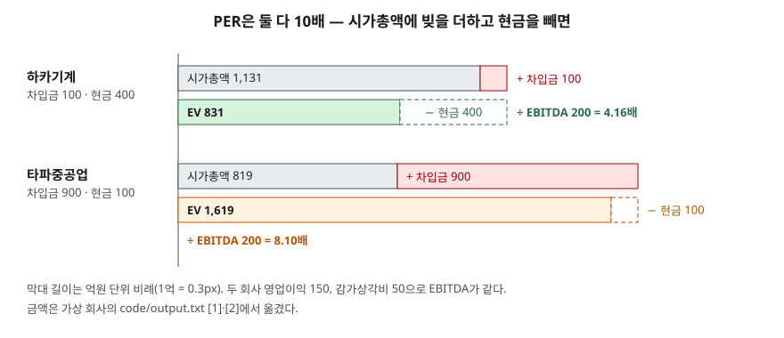

> 예제의 회사 `하카기계`·`타파중공업`·`라마소프트`·`바사제철`과 그 숫자는 계산 원리를 보이려고 만든 가상 값이다. 실제 기업과 관계가 없다. 이자율·세율·리스 금액은 설명용 가정값이다.

## 들어가며

같은 업종의 두 회사를 PER로 나란히 놓고 둘 다 10배라서 비슷한 값이라고 정리하는 일이 흔하다. 시가총액은 한 회사가 1,131억, 다른 회사가 819억이니 두 번째 회사가 더 싸게 보이기도 한다. 그런데 두 번째 회사는 차입금이 900억이고 현금은 100억뿐이다. 회사를 통째로 산다고 하면 주식 대금만 내고 끝나는 것이 아니라 그 빚도 함께 넘겨받는다. 빚과 현금까지 넣어 다시 계산하면 두 회사의 값은 831억과 1,619억으로 순서가 뒤집힌다. PER은 이 차이를 보여 주지 않는다.

## 개념

EV/EBITDA는 기업가치(EV, Enterprise Value)를 EBITDA로 나눈 배수다. 두 숫자 모두 회계기준이 재무제표에 표시하라고 정한 항목이 아니라, 재무제표 숫자로 분석하는 쪽이 조립하는 값이다.

| 구성 | 산식 | 성격 |
|---|---|---|
| EV | 시가총액 + 차입금 − 현금및현금성자산 | 주주 몫과 채권자 몫을 합친, 회사 전체의 값 |
| EBITDA | 영업이익 + 감가상각비 + 무형자산상각비 | 이자·세금·상각을 빼기 전 이익 |
| EV/EBITDA | EV ÷ EBITDA | 회사 전체 값이 상각 전 이익의 몇 배인가 |

PER은 분자가 시가총액(주주 몫)이고 분모가 순이익(이자를 낸 뒤 주주에게 남는 몫)이다. EV/EBITDA는 분자에 채권자 몫인 차입금을 더하고, 분모도 이자를 빼기 전 이익으로 올린다. 분자와 분모가 둘 다 **주주와 채권자를 합친 범위**로 맞춰지기 때문에, 자본 구조가 다른 회사끼리 비교할 때 차입 규모가 배수를 흔드는 정도가 PER보다 작다.

EV에서 빼는 현금은 K-IFRS 제1007호 현금흐름표가 정한 현금및현금성자산을 쓰는 것이 보통이다. 현금성자산은 유동성이 매우 높고 가치변동 위험이 경미한 단기 투자자산이고(문단 6), 대개 취득일부터 만기가 3개월 이내인 것이다(문단 7). EV 산식은 기준서가 정한 것이 아니어서, 쓰는 곳에 따라 비지배지분·우선주·리스부채를 더하는지가 다르다. 한경 경제용어사전처럼 차입금 대신 총부채에서 현금성자산을 뺀 순부채를 더한다고 적는 곳도 있다. 이 글은 이자를 내는 차입금만 더한다. 두 회사의 EV/EBITDA를 비교하기 전에 산식이 같은지부터 확인한다.

EBITDA도 현행 K-IFRS에 정의된 항목이 아니다. 2027년 1월 1일 이후 시작하는 회계연도부터 적용되는 K-IFRS 제1118호 재무제표 표시와 공시(IFRS 18 반영)는 회사가 공시하는 자체 성과지표에 산출근거와 조정내역을 주석으로 공시하게 한다. 회계법인 해설에 따르면 IFRS 18은 감가상각·상각·손상 전 영업손익을 기준서가 정한 소계로 보아 이 공시 대상에서 제외한다. 원문 문단은 이 글에서 직접 확인하지 못했다.

## 구조



> **출처**: [K-IFRS 제1007호 현금흐름표 — 문단 6 현금성자산 정의, 문단 7 단기 기준](https://accountingwiki.co.kr/standards/1007) (제3자 전재) · [한경 경제용어사전 — EV/EBITDA](https://dic.hankyung.com/apps/economy.view?seq=2892) — EV 산식(2차 자료, 이 사전은 차입금 대신 총부채 기준). 금액은 이 글의 [`code/output.txt`](code/output.txt) `[1]`·`[2]`에서 옮겼다.

위쪽 막대는 시가총액에 차입금을 붙인 것이고, 아래쪽 막대는 거기서 현금을 뺀 EV다. 하카기계는 현금이 차입금보다 많아 EV가 시가총액보다 짧아지고, 타파중공업은 차입금이 커서 EV가 시가총액의 두 배 가까이로 늘어난다. 분모인 EBITDA는 두 회사가 200억으로 같으므로 막대 길이 차이가 그대로 배수 차이가 된다.

## 동작 원리

### 회사를 통째로 사는 쪽에서 보면

지분 100%를 시가총액에 산다고 하자. 하카기계를 사면 주식 대금 1,131억을 내고 차입금 100억을 넘겨받지만 현금 400억도 손에 들어온다. 실제로 치르는 값은 831억이다. 타파중공업은 주식 대금이 819억으로 더 싸지만 차입금 900억을 갚아야 하고 들어오는 현금은 100억이다. 실제로 치르는 값은 1,619억이다. EV는 이 계산을 그대로 산식으로 옮긴 것이다. 그래서 인수·합병에서 회사 가치를 매길 때 흔히 쓰인다.

### PER이 같아도 EV/EBITDA가 갈리는 이유

두 회사는 영업이익 150억, 감가상각비 50억으로 EBITDA가 200억씩 같다. 차이는 영업이익 아래에서 생긴다. 차입금에 이자율 5%를 적용하면 이자비용이 하카기계 5억, 타파중공업 45억이고, 법인세를 뗀 순이익은 113.1억과 81.9억이다. 시장이 둘 다 PER 10배를 매겼다면 시가총액은 순이익을 따라 1,131억과 819억이 된다. 이미 이자를 낸 뒤의 이익으로 값을 매겼으니, PER만 보면 빚의 무게가 시가총액 안에 녹아 들어가 보이지 않는다. EV/EBITDA는 그 빚을 분자로 다시 꺼내 놓는다. 결과는 4.16배와 8.10배다.

### EBITDA가 빼놓는 것

EBITDA는 감가상각비를 다시 더한 값이다. 감가상각은 현금이 나가지 않는 비용이지만([감가상각 — 현금이 나가지 않는 비용](../../statements/2026-09-30-depreciation-non-cash-expense/index.md)), 그 설비를 살 때는 현금이 이미 나갔고 다 쓰면 다시 사야 한다. 예제의 라마소프트와 바사제철은 EBITDA 200억과 EV 1,600억이 같아 EV/EBITDA가 둘 다 8.00배다. 그런데 바사제철은 감가상각비가 150억이고 매년 설비투자로 160억이 나간다. EBITDA에서 설비투자를 빼면 라마소프트 150억, 바사제철 40억이다. 감가상각을 뺀 영업이익(EBIT)으로 나누면 10.67배와 32.00배로 벌어진다.

### 리스 회계가 바꾼 EBITDA

2019년 1월 1일 이후 시작하는 회계연도부터 적용된 K-IFRS 제1116호 리스는 리스이용자가 대부분의 리스를 사용권자산과 리스부채로 재무상태표에 올리게 했다. 그 전에는 건물 임차료가 영업비용으로 EBITDA 위에서 빠졌지만, 이후에는 사용권자산 감가상각비와 리스부채 이자비용으로 바뀌어 둘 다 EBITDA 아래로 내려간다. 같은 회사라도 EBITDA가 임차료만큼 커진다.

예제의 하카기계는 연간 임차료 40억이 빠지면서 EBITDA가 200억에서 240억이 된다. 이때 리스부채 200억을 EV에 넣지 않으면 분모에만 리스 효과가 들어가 배수가 3.46배로 낮게 나온다. 리스부채도 차입금처럼 EV에 넣으면 4.30배다. 리스 회계 전후의 숫자를 섞어 비교하거나, 리스부채를 넣는 곳과 넣지 않는 곳의 배수를 나란히 놓으면 이 차이가 그대로 비교 오차가 된다.

## 실습 예제

이자율 5%, 법인세율 22%는 단일 세율로 단순화한 가정이다. 단위는 억원이다.

전체 소스: [`code/`](code/) · 수행 기록: [`code/output.txt`](code/output.txt)

```text
[1] PER 10배로 같은 두 회사 (단위: 억원)
                  영업이익  EBITDA    차입금    현금    이자     순이익    시가총액      EV     PER  EV/EBITDA
  하카기계             150     200    100   400     5   113.1    1131     831   10.0배      4.16배
  타파중공업            150     200    900   100    45    81.9     819    1619   10.0배      8.10배

[2] 지분 100% 를 시가총액에 산다면 실제로 치르는 값 (단위: 억원)
  하카기계       지분 대가 1,131 + 떠안는 차입금  100 − 손에 들어오는 현금  400 =   831
  타파중공업      지분 대가   819 + 떠안는 차입금  900 − 손에 들어오는 현금  100 = 1,619
  시가총액은 하카기계가 312억 크지만, 빚과 현금까지 넘겨받으면 타파중공업이 788억 비싸다

[3] EBITDA 가 같아도 감가상각·설비투자가 다르면 (EV 1,600억으로 같다, 단위: 억원)
              EBITDA    감가상각    영업이익    설비투자     EBITDA−설비투자  EV/EBITDA  EV/EBIT
  라마소프트          200      50     150      50             150      8.00배   10.67배
  바사제철           200     150      50     160              40      8.00배   32.00배

[4] 리스 회계(K-IFRS 1116, 2019-01-01 시행) 전후 — 하카기계, 연간 건물 임차료 40억 (단위: 억원)
  조합                                           EV  EBITDA  EV/EBITDA
  이전 기준: 임차료가 영업비용                            831     200      4.16배
  1116 이후 EBITDA, 리스부채는 EV 에서 뺌               831     240      3.46배
  1116 이후 EBITDA, 리스부채도 EV 에 넣음              1031     240      4.30배
```

`[0]` 산식과 각 절 끝의 설명 줄은 [`code/output.txt`](code/output.txt)에 있다.

`[1]`에서 PER 열은 두 줄이 같고 EV/EBITDA 열만 두 배 가까이 갈린다. `[2]`는 그 차이를 인수하는 쪽의 지출로 다시 쓴 것이다. `[3]`은 반대 방향의 함정이다. EV/EBITDA가 같아도 설비를 계속 새로 사야 하는 회사는 손에 남는 현금이 적다. `[4]`는 같은 회사, 같은 주가에서 분자와 분모의 기준만 어긋나도 배수가 3.46배에서 4.30배까지 움직이는 것을 보인다.

## 실무에서 주의할 점

- **EV 산식을 먼저 맞춘다.** 차입금에 리스부채·사채·비지배지분·우선주를 넣는지, 현금에 단기금융상품까지 넣는지가 데이터를 내는 곳마다 다르다. 다른 출처의 EV/EBITDA를 나란히 놓으면 산식 차이가 배수 차이로 보인다.
- **EBITDA는 설비투자를 보여 주지 않는다.** 설비 비중이 큰 업종은 EBITDA가 영업이익보다 훨씬 크고, 그 차이만큼 매년 설비투자로 현금이 나간다. 현금흐름표의 유형자산 취득액을 함께 보고, 필요하면 EV/EBIT나 EBITDA − 설비투자로 다시 계산한다. 현금흐름표의 세 갈래는 [현금흐름표 세 가지 활동](../../statements/2026-09-30-cash-flow-three-activities/index.md)에서 다뤘다.
- **리스 회계 전후 숫자를 섞지 않는다.** K-IFRS 제1116호 이후 EBITDA는 임차료만큼 커졌다. 리스부채를 EV에 넣었는지, 2018년 이전 숫자와 비교하는지를 확인한다.
- **회사가 공시한 EBITDA·조정 EBITDA는 산식을 확인한다.** 기준서가 정한 항목이 아니라 회사가 정의한 값이라 일회성 비용을 빼는 범위가 회사마다 다르다. K-IFRS 제1118호가 적용되는 2027년 이후에는 이런 자체 지표의 조정내역이 주석에 나오므로 그것을 대조한다.
- **배수 하나로 결론짓지 않는다.** EV/EBITDA가 낮은 이유는 현금이 많아서일 수도, 설비투자 부담이 커서 시장이 낮게 매겼을 수도 있다. 같은 업종 안에서, 같은 산식으로 계산한 값끼리 비교한다.

## 정리

- EV는 시가총액 + 차입금 − 현금으로, 주주 몫과 채권자 몫을 합친 회사 전체의 값이다. 분모 EBITDA도 이자를 빼기 전 이익이라 범위가 맞춰진다.
- PER이 같아도 차입금과 현금 구성이 다르면 EV/EBITDA가 갈린다. 예제에서는 10배 대 10배가 4.16배 대 8.10배가 되었다.
- EBITDA는 감가상각을 더한 값이라 설비투자 부담을 보여 주지 않는다. EV/EBIT나 설비투자 차감 값을 함께 본다.
- K-IFRS 제1116호(2019년 시행) 이후 EBITDA가 임차료만큼 커졌으므로 리스부채를 EV에 넣는지 분자·분모를 맞춘다.

## 참고 자료

- [한국회계기준원 — 시행 중인 K-IFRS 기준서 목록](https://www.kasb.or.kr/front/board/ingAccountingList.do) — 기업회계기준서 제1007호 현금흐름표, 제1116호 리스 원문 발행처
- [K-IFRS 제1007호 현금흐름표 — 문단 6·7](https://accountingwiki.co.kr/standards/1007) (제3자 전재)
- [IFRS Foundation — IFRS 16 Leases](https://www.ifrs.org/issued-standards/list-of-standards/ifrs-16-leases/) — 2019년 1월 1일 이후 시작하는 회계연도부터 적용
- [IFRS Foundation — IFRS 18 Presentation and Disclosure in Financial Statements](https://www.ifrs.org/issued-standards/list-of-standards/ifrs-18-presentation-and-disclosure-in-financial-statements/) — 2027년 1월 1일 이후 시작하는 회계연도부터 적용, 경영진 정의 성과측정치 공시
- [금융위원회 보도자료 — K-IFRS 손익계산서 개편('27년 적용)(2025.12.18)](https://www.fsc.go.kr/no010101/85886) — K-IFRS 제1118호 제정, 자체 성과지표 주석공시 의무화
- [RSM UK — IFRS 18: understanding management-defined performance measures](https://www.rsmuk.com/insights/bridging-the-gaap/ifrs-18-understanding-management-defined-performance-measures) — 감가상각·상각·손상 전 영업손익을 경영진 정의 성과측정치에서 제외하는 해설(2차 자료, 발행일 표기 없음)
- [한경 경제용어사전 — EV/EBITDA](https://dic.hankyung.com/apps/economy.view?seq=2892) — EV 산식(2차 자료, 차입금 대신 총부채에서 현금성자산을 뺀 순부채를 더한다)
