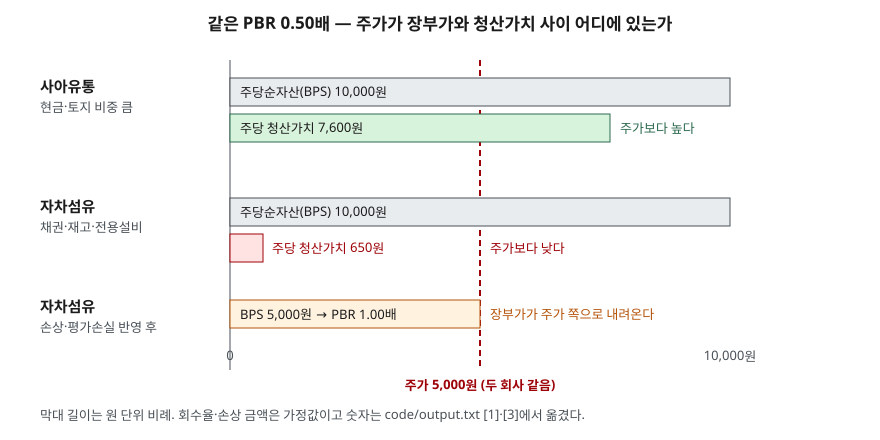

> 예제의 회사 `사아유통`·`자차섬유`와 그 숫자는 계산 원리를 보이려고 만든 가상 값이다. 실제 기업과 관계가 없다. 청산 시 회수율과 손상 금액은 설명용 가정값이다.

## 들어가며

종목 검색 화면에서 PBR 0.5배라는 숫자를 보면 회사를 지금 문 닫고 자산을 팔아도 주가의 두 배가 남는다는 설명이 먼저 떠오른다. 그래서 PBR이 낮은 순으로 정렬해 위에서부터 훑어보는 방식이 흔하다. 그런데 이 설명은 장부에 적힌 자산이 장부 금액 그대로 팔린다는 가정 위에 서 있다. 아래 예제의 두 회사는 PBR이 똑같이 0.50배인데, 자산을 실제로 처분한다고 계산하면 주당 남는 금액이 7,600원과 650원으로 열 배 넘게 차이 난다. PBR 숫자만으로는 이 둘을 구분할 수 없다.

## 개념

PBR(주가순자산비율, Price Book-value Ratio)은 주가를 주당순자산(BPS)으로 나눈 값이다. 한국은행 경제용어 해설은 이것을 주가가 1주당 순자산의 몇 배로 매매되는지를 나타내는 지표로 설명하고, 기획재정부 시사경제용어사전도 같은 산식을 적는다. 분자·분모에 주식수를 곱하면 시가총액 ÷ 자본총계가 된다.

| 구성 | 무엇 |
|---|---|
| 분자 | 주가 (또는 시가총액) |
| 분모 | 주당순자산 = 자본총계 ÷ 발행주식수 |
| 1배 | 시장이 매기는 값과 장부상 순자산이 같다 |
| 1배 미만 | 시가총액이 장부상 순자산보다 작다 |

분모인 자본총계는 자산에서 부채를 뺀 **장부 금액**이다. 재무상태표가 어떻게 자산·부채·자본으로 나뉘는지는 [재무상태표 — 부채와 자본](../../statements/2026-09-29-balance-sheet-debt-vs-equity/index.md)에서 다뤘다. 장부 금액은 대부분 취득원가에서 출발해 감가상각과 평가를 거친 값이고, 지금 팔면 받을 수 있는 값과는 다르다.

**청산가치**는 회사를 정리한다고 가정하고 자산을 처분해 받을 금액에서 부채와 정리 비용을 뺀 값이다. 회계기준이 재무제표에 표시하라고 정한 숫자가 아니라 분석하는 쪽이 계산하는 추정치다. 그래서 같은 회사라도 회수율을 어떻게 잡느냐에 따라 값이 달라진다.

## 구조



> **출처**: [K-IFRS 제1036호 자산손상 — 문단 12 손상 징후, 문단 18 회수가능액](https://accountingwiki.co.kr/standards/1036) (제3자 전재) · [한국은행 경제용어 — 주가순자산비율(2011.9.26 등록)](https://www.bok.or.kr/portal/bbs/P0000795/view.do?nttId=173407&menuNo=200559&searchBbsSeCd=z19&pageIndex=62) — 산식과 손상 징후. 금액은 이 글의 [`code/output.txt`](code/output.txt) `[1]`·`[3]`에서 옮겼다.

두 회사 모두 BPS 막대 길이가 같고 주가 선도 같은 자리에 있다. 차이는 그 아래 청산가치 막대에 있다. 사아유통은 청산가치가 주가 선을 넘고, 자차섬유는 주가 선에 한참 못 미친다. 맨 아래 막대는 자차섬유가 손상을 반영해 장부가를 낮춘 뒤의 BPS로, 주가 선과 같은 자리까지 내려온다.

## 동작 원리

### 장부 금액이 처분 금액과 갈리는 자리

자산 항목마다 장부와 실제 처분 금액이 벌어지는 정도가 다르다. 현금은 장부 금액 그대로다. 토지는 취득원가로 적혀 있어 오래 보유했으면 오히려 장부보다 비싸게 팔릴 수 있다. 반면 매출채권은 받지 못할 몫이 섞여 있고, 재고자산은 유행이 지나면 원가에 팔리지 않는다. 특정 제품만 만드는 전용 설비는 그 제품을 만들 다른 회사가 없으면 고철 값에 가깝게 처분된다.

예제의 사아유통은 자산 1,200억 중 현금과 토지가 700억이다. 회수율을 적용해도 1,010억이 회수되고 부채와 청산 비용을 빼면 760억이 남는다. 자차섬유는 자산 총액이 같지만 장기 미회수 채권, 유행 지난 원단, 전용 생산설비가 1,150억이다. 회수액은 315억이고 부채와 비용을 빼면 65억만 남는다. 장부상 순자산 1,000억은 두 회사가 같은데 처분 가치는 760억과 65억이다.

### PBR = PER × ROE

주가 ÷ BPS는 (주가 ÷ EPS) × (EPS ÷ BPS)로 나눌 수 있다. 앞은 PER이고 뒤는 순이익 ÷ 자본, 곧 ROE다. 사아유통은 ROE가 2.0%이고 PER이 25.0배라 PBR이 0.50배다. 자산은 단단하지만 그 자산으로 버는 이익률이 낮아 시장이 순자산의 절반 값을 매긴 것으로 읽을 수 있다. 같은 식을 E/P(이익수익률 = 1/PER)로 다시 쓰면 PBR = ROE ÷ E/P이므로, PBR이 1배 아래라는 것은 ROE가 이익수익률보다 낮다는 뜻이다. PER과 이익수익률은 [PER — 이익 대비 주가를 재는 법](../2026-10-02-per-trailing-vs-forward/index.md)에서 다뤘고, ROE 분해는 [듀폰 분석](../../ratios/2026-10-02-dupont-roe-three-factors/index.md)에서 다뤘다.

자차섬유는 순손실이라 PER을 계산할 수 없지만 PBR은 0.50배로 계산된다. 적자 회사에도 PBR이 나온다는 점 때문에 PER을 쓸 수 없는 회사를 PBR로 보게 되는데, 이때 분모가 정말 그 값인지를 따로 확인해야 한다.

### 시가총액이 순자산보다 작으면 손상 검토가 시작된다

K-IFRS 제1036호 자산손상은 보고기간 말마다 손상 징후를 검토하고, 징후가 있으면 회수가능액을 추정하게 한다(문단 9). 징후 목록에는 **순자산 장부금액이 시가총액보다 많은 경우**가 들어 있다(문단 12). PBR이 1배 아래라는 것은 바로 이 상태다. 회수가능액은 처분 시 받을 금액과 계속 사용해 얻을 가치 중 큰 쪽이고(문단 18), 이것이 장부보다 낮으면 차이를 손상차손으로 인식해 장부 금액을 줄인다.

재고자산도 같은 방향이다. 제1002호 재고자산은 재고를 취득원가와 순실현가능가치 중 낮은 금액으로 측정하게 한다(문단 9). 순실현가능가치는 예상 판매가격에서 추가 완성원가와 판매비용을 뺀 금액이다(문단 6).

예제에서 자차섬유가 생산설비 손상차손 300억과 재고자산 평가손실 200억을 인식하면 자본이 1,000억에서 500억으로 줄어든다. 주가는 5,000원 그대로인데 BPS가 5,000원으로 내려가 PBR이 1.00배가 된다. 0.50배라는 숫자는 주가가 싸서가 아니라, 시장이 장부에 아직 반영되지 않은 손실을 먼저 가격에 넣은 결과였을 수 있다.

## 실습 예제

두 회사 모두 주가 5,000원, 주식 1,000만 주, 부채 200억, 자본 1,000억이다. 회수율과 청산 부대비용 50억은 가정값이다. 단위는 억원이다.

전체 소스: [`code/`](code/) · 수행 기록: [`code/output.txt`](code/output.txt)

```text
[1] 주가 5,000원, 주식 10,000,000주, 부채 200억으로 같은 두 회사 (단위: 억원)
  사아유통
    항목                          장부     회수율     회수액
    현금및현금성자산                   300    100%     300
    매출채권                       100     90%      90
    재고자산                       100     70%      70
    토지                         400    100%     400
    건물·설비                      300     50%     150
    자본총계(장부) 1,000억  BPS 10,000원  PBR 0.50배
    청산가치       760억  주당 7,600원  주가 ÷ 주당 청산가치 0.66배
  자차섬유
    항목                          장부     회수율     회수액
    현금및현금성자산                    50    100%      50
    매출채권(장기 미회수 포함)            300     40%     120
    재고자산(유행 지난 원단)             350     20%      70
    전용 생산설비                    500     15%      75
    자본총계(장부) 1,000억  BPS 10,000원  PBR 0.50배
    청산가치       65억  주당 650원  주가 ÷ 주당 청산가치 7.69배

[3] 자차섬유가 기준서대로 장부가를 낮추면 (주가는 그대로, 세금 효과 무시)
  시가총액 500억 < 순자산 장부금액 1,000억 → K-IFRS 1036 문단 12 의 손상 징후
  단계                                              자본    BPS(원)     PBR
  손상 전                                         1,000    10,000   0.50배
  생산설비 손상차손 300억 (회수가능액 200억, 가정)                700     7,000   0.71배
  재고자산 평가손실 200억 (순실현가능가치 150억, 가정)              500     5,000   1.00배
```

`[0]` 산식과 `[2]` PBR = PER × ROE 표는 [`code/output.txt`](code/output.txt)에 있다.

`[1]`에서 주가 ÷ 주당 청산가치는 사아유통 0.66배, 자차섬유 7.69배다. PBR은 같지만 청산가치를 기준으로 보면 한 회사는 주가가 처분 가치보다 낮고 다른 회사는 일곱 배 넘게 높다. `[3]`에서 손상을 반영한 뒤에도 자차섬유의 주당 청산가치 650원은 그대로다. 장부가가 내려와 PBR이 1배가 되었을 뿐 처분 가치가 바뀐 것은 아니다.

## 실무에서 주의할 점

- **PBR이 낮은 이유를 자산 구성에서 찾는다.** 현금·투자부동산·토지 비중이 큰 회사와 매출채권·재고·전용 설비 비중이 큰 회사는 같은 PBR이라도 처분 가치가 전혀 다르다. 재무상태표 항목별 금액과 주석의 대손충당금·재고 평가 내역을 함께 본다.
- **회수율은 추정이다.** 예제의 40%·20%·15%는 가정이고, 실제 처분 금액은 시장 상황과 처분 방식에 따라 달라진다. 청산가치를 하나의 숫자로 단정하지 말고, 어느 항목의 회수율에 결과가 민감한지를 본다.
- **PBR 1배 미만은 손상 검토의 출발점이기도 하다.** K-IFRS 제1036호 문단 12가 시가총액이 순자산보다 작은 상태를 손상 징후로 든다. 다음 결산에서 손상차손이 인식되면 주가가 그대로여도 BPS가 내려가 PBR이 올라간다.
- **ROE를 같이 본다.** PBR = PER × ROE이므로 ROE가 낮은 회사는 자산이 단단해도 PBR이 낮게 나온다. 사아유통의 0.50배는 자산이 부실해서가 아니라 자산 대비 이익률이 2%라서 나온 값이다.
- **자본이 음수면 PBR을 쓰지 않는다.** 누적 손실로 자본총계가 0 아래로 내려가면(자본잠식) BPS가 음수가 되어 PBR의 부호가 뒤집힌다. 이때 PBR은 크기를 비교할 수 있는 숫자가 아니다.
- **업종마다 PBR 수준이 다르다.** 설비와 재고가 많은 업종과 자산 대부분이 무형인 업종은 장부 순자산이 담는 범위가 다르다. 한국은행 해설은 PER을 같은 산업의 평균과 비교하라고 적는데, PBR도 같은 이유로 업종 안에서 비교한다. 업종 평균을 쓰려면 한국거래소가 공표하는 업종별 집계를 출처로 든다.

## 정리

- PBR은 주가 ÷ BPS이고 BPS는 장부상 자본총계 ÷ 발행주식수다. 분모는 처분 가치가 아니라 장부 금액이다.
- 청산가치는 항목별 회수율을 적용해 분석하는 쪽이 추정하는 값이다. 같은 PBR 0.50배라도 자산 구성에 따라 주당 7,600원과 650원으로 갈린다.
- PBR = PER × ROE이므로 PBR이 1배 아래인 것은 ROE가 이익수익률보다 낮다는 뜻이기도 하다.
- 시가총액이 순자산보다 작으면 K-IFRS 제1036호가 정한 손상 징후에 해당한다. 손상이 인식되면 주가가 그대로여도 PBR이 올라간다.

## 참고 자료

- [한국회계기준원 — 시행 중인 K-IFRS 기준서 목록](https://www.kasb.or.kr/front/board/ingAccountingList.do) — 기업회계기준서 제1036호 자산손상, 제1002호 재고자산 원문 발행처
- [K-IFRS 제1036호 자산손상 — 문단 9·12·18](https://accountingwiki.co.kr/standards/1036) (제3자 전재)
- [K-IFRS 제1002호 재고자산 — 문단 6·9](https://accountingwiki.co.kr/standards/1002) (제3자 전재)
- [IFRS Foundation — IAS 36 Impairment of Assets](https://www.ifrs.org/issued-standards/list-of-standards/ias-36-impairment-of-assets/)
- [한국은행 경제용어 — 주가수익비율, 주가순자산비율(2011.9.26 등록, 한국은행 인천본부)](https://www.bok.or.kr/portal/bbs/P0000795/view.do?nttId=173407&menuNo=200559&searchBbsSeCd=z19&pageIndex=62) — 정의, 업종 평균과 비교하라는 해설
- [기획재정부 시사경제용어사전 — PBR/PER(2020.11.3 등록)](https://mofe.go.kr/sisa/dictionary/detail?idx=191) — 정의와 산식
