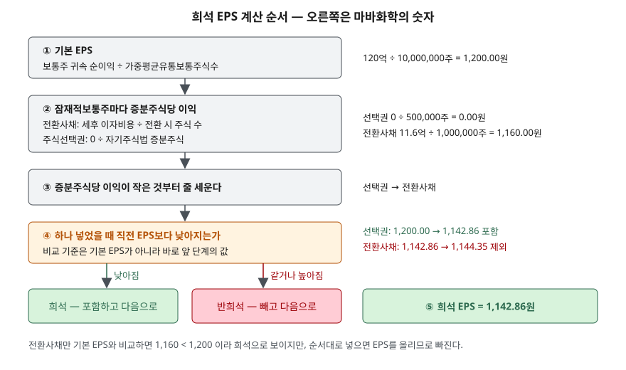

> 예제의 회사 `가나전자`·`다라물산`·`마바화학`·`사바산업`과 그 숫자는 계산 원리를 보이려고 만든 가상 값이다. 실제 기업과 관계가 없다. 법인세율 20%도 계산을 보이려고 정한 가정이다.

## 들어가며

PER을 직접 계산해 보려고 사업보고서의 손익계산서를 열면 맨 아래에 주당이익이 두 줄 있다. 기본주당이익 1,200원, 희석주당이익 1,053원 같은 식이다. 대부분은 위 줄만 보고 넘어가거나, 시가총액을 순이익으로 나눈 값과 주가를 EPS로 나눈 값이 왜 다른지 한참 맞춰 본다. 두 줄의 차이가 12%라면 같은 주가에서 PER이 13.3배인지 15.2배인지가 갈린다. 희석 EPS는 장부에 아직 없는 주식까지 세어 넣은 값이고, 무엇을 얼마나 세어 넣는지는 기준서가 순서까지 정해 두었다.

## 개념

주당이익은 보통주 한 주에 돌아가는 그 기간의 이익이다. 기업회계기준서 제1033호는 두 가지를 계산하게 한다.

| 구분 | 분자 | 분모 | 근거 |
|---|---|---|---|
| 기본주당이익 | 보통주에 귀속되는 당기순손익 | 가중평균유통보통주식수 | 문단 10, 19 |
| 희석주당이익 | 위 금액 + 희석성 잠재적보통주 관련 세후 이자·배당 | 위 주식수 + 희석성 잠재적보통주가 전환·행사됐다고 볼 때 늘어날 주식 수 | 문단 31~33, 36 |

**잠재적보통주**는 지금은 보통주가 아니지만 보유자가 권리를 쓰면 보통주가 되는 증권이나 계약이다. 전환사채, 전환우선주, 주식선택권, 신주인수권이 여기에 든다. 기본 EPS는 이미 유통되는 주식만 세고, 희석 EPS는 이것들이 주식이 됐을 때를 가정해 한 주에 돌아가는 몫이 얼마나 줄어드는지를 보인다.

기준서는 두 값을 보통주 종류별로 포괄손익계산서에 표시하게 하고(문단 66), 금액이 음수인 주당손실이어도 표시하게 한다(문단 69).

## 구조



> **출처**: [K-IFRS 제1033호 주당이익 — 문단 10 기본주당이익, 31~33 희석주당이익의 분자, 41~44 희석성 판단과 순서, 45~46 옵션과 주식매입권](https://accountingwiki.co.kr/standards/1033) (제3자 전재) · 원문 발행처 [한국회계기준원](https://www.kasb.or.kr/front/board/ingAccountingList.do). 숫자는 이 글의 [`code/output.txt`](code/output.txt) `[2]`에서 옮겼다.

그림에서 갈림길은 ④ 하나뿐이다. 이 비교의 기준이 기본 EPS가 아니라 **바로 앞 단계의 EPS**라는 점이 결과를 바꾼다.

## 동작 원리

### 분모는 기말 주식 수가 아니라 가중평균이다

기간 중에 주식 수가 바뀌면 각 주식이 유통된 기간만큼만 센다. 기준서는 기초 유통보통주식수에 기중 취득한 자기주식수와 신규 발행한 보통주식수를 유통기간에 따른 가중치로 조정하게 하고(문단 20), 그 기산일은 원칙적으로 주식발행일이다(문단 21).

사바산업은 기초 1,000만 주에서 4월 1일 유상증자로 120만 주를 발행하고 10월 1일 자기주식 30만 주를 사들였다. 4월 1일에 늘어난 주식은 365일 중 275일만 유통됐고, 10월 1일에 사들인 주식은 그날부터 유통주식에서 빠진다. 일할로 가중평균하면 10,828,493주이고, 순이익 120억원을 나눈 기본 EPS는 1,108.19원이다. 기말 주식 수 1,090만 주로 나누면 1,100.92원이 되어 다른 값이 나온다. 연중에 들어온 증자 대금은 연중 일부 기간만 이익을 만드는 데 쓰였으므로, 주식도 그 기간만큼만 세는 것이 분자와 분모의 기간을 맞추는 방법이다.

무상증자·주식분할처럼 대가 없이 주식 수만 바뀌는 사건은 다르게 다룬다. 그 사건이 기중에 있었더라도 기초부터 있었던 것으로 보고 비교 기간까지 소급해 고친다(문단 26, 64). 자원이 들어오지 않았으니 이익을 만드는 바탕은 그대로이고 주식만 잘게 나뉘었기 때문이다.

### 전환사채 — 분자와 분모가 함께 움직인다

전환사채가 주식으로 바뀌면 주식 수가 늘어나는 동시에, 그동안 내던 이자가 사라져 이익이 는다. 그래서 희석 EPS의 분자에는 그 기간에 인식한 이자비용에서 법인세효과를 뺀 금액을 되돌려 더한다(문단 33). 잠재적보통주는 기초에 전환됐다고 보되 당기에 발행된 것은 발행일에 전환됐다고 본다(문단 36).

가나전자의 전환사채는 액면 200억원, 표면이자율 4%, 전환가격 10,000원이다. 전환되면 200만 주가 늘고, 이자 8억원에서 세금 20%를 뺀 6.4억원이 이익에 돌아온다. 늘어나는 주식 1주당 이익은 320원이다. 기본 EPS 1,200원보다 훨씬 작은 이익을 가진 주식이 섞이니 평균이 내려가 희석 EPS는 1,053.33원이 된다.

예제는 표면이자를 이자비용으로 두었다. 실제 전환사채는 부채와 자본 요소로 나뉘고 부채 요소에 유효이자율법을 적용하므로, 손익계산서의 이자비용은 표면이자보다 큰 경우가 많다. 분자에 되돌리는 금액은 **인식한 이자비용**이므로 공시된 희석 EPS를 다시 계산할 때는 주석의 이자비용을 써야 한다.

### 주식선택권 — 자기주식법

주식선택권은 행사되면 회사에 행사대금이 들어온다. 기준서는 이 대금으로 회계기간 평균시장가격에 보통주를 발행한 것으로 보고, 행사로 발행되는 주식 중 그 수를 넘는 부분만 대가 없이 발행한 주식으로 다룬다(문단 45~46). 실무에서 자기주식법이라 부르는 방식이다.

다라물산의 선택권 100만 주는 행사가격이 8,000원이고 평균시장가격은 16,000원이다. 행사대금 80억원으로 평균시장가격에 살 수 있는 주식은 50만 주이므로, 나머지 50만 주가 무상으로 늘어난 주식이 된다. 분자에 더할 이자는 없으므로 늘어난 주식 1주당 이익은 0원이고, 희석 EPS는 120억원을 1,050만 주로 나눈 1,142.86원이다.

행사가격이 평균시장가격 이상이면 되사는 주식 수가 행사 주식 수와 같거나 많아 증분주식이 0이 된다. 예제에서 행사가격을 12,000원으로 올리면 증분주식이 25만 주로 줄고, 16,000원이 되면 희석 효과가 사라진다. 주식선택권과 그 밖의 주식기준보상약정은 행사가격에 앞으로 제공받을 용역의 공정가치를 포함해 계산한다(문단 47A).

### 반희석 — EPS를 올리는 것은 넣지 않는다

잠재적보통주는 보통주로 바뀌었을 때 주당계속영업이익을 줄이거나 주당계속영업손실을 늘리는 경우에만 희석성으로 본다(문단 41). 반대로 주당이익을 올리는 것은 반희석성이며 전환·행사가 없다고 가정한다(문단 43). 전환사채라면 전환으로 늘어나는 1주당 세후 이자가 기본 EPS를 넘을 때 반희석이다(문단 50). 희석 EPS는 그래서 기본 EPS보다 클 수 없다.

### 순서 — 희석효과가 큰 것부터

잠재적보통주가 여러 종류면 하나씩 따로 보되, 희석효과가 가장 큰 것부터 순서대로 넣는다(문단 44). 희석효과가 크다는 것은 늘어나는 주식 1주당 이익이 작다는 뜻이다.

마바화학은 다라물산과 같은 선택권에 더해 액면 200억원, 표면이자율 7.25%, 전환가격 20,000원인 전환사채를 갖고 있다. 전환사채의 주당 증분이익은 1,160원으로 기본 EPS 1,200원보다 작아서, 혼자 놓고 보면 희석성이다. 그러나 증분이익 0원인 선택권을 먼저 넣으면 EPS는 1,142.86원으로 내려가 있고, 여기에 1,160원짜리 주식을 섞으면 평균이 1,144.35원으로 오른다. 순서대로 판정하면 전환사채는 빠지고 희석 EPS는 1,142.86원이다. 기준서가 순서를 정한 이유는 가장 낮은 희석 EPS, 곧 가장 보수적인 값을 표시하게 하려는 것이다.

## 실습 예제

전체 소스: [`code/`](code/) · 수행 기록: [`code/output.txt`](code/output.txt)

```text
[2] 순이익 120억원, 가중평균유통보통주식수 10,000,000주가 같은 세 회사 — 기본 EPS 1,200.00원, 평균시장가격 16,000원
  가나전자
    전환사채  액면 200억·표면 4.00%·전환가 10,000원      증분주식   2,000,000  주당 증분이익    320.00   1,200.00 →  1,053.33  희석 — 포함
  다라물산
    주식선택권 1,000,000주·행사가 8,000원             증분주식     500,000  주당 증분이익      0.00   1,200.00 →  1,142.86  희석 — 포함
  마바화학
    주식선택권 1,000,000주·행사가 8,000원             증분주식     500,000  주당 증분이익      0.00   1,200.00 →  1,142.86  희석 — 포함
    전환사채  액면 200억·표면 7.25%·전환가 20,000원      증분주식   1,000,000  주당 증분이익  1,160.00   1,142.86 →  1,144.35  반희석 — 제외

  회사            기본 EPS      희석 EPS       희석률
  가나전자        1,200.00    1,053.33    12.22%
  다라물산        1,200.00    1,142.86     4.76%
  마바화학        1,200.00    1,142.86     4.76%

[3] 순서와 반희석 — 마바화학의 전환사채를 기본 EPS 하고만 비교하면
  전환사채 주당 증분이익 1,160.00원 < 기본 EPS 1,200.00원 → 단독으로는 희석
  둘 다 넣으면       (120억 + 11.6억) / 11,500,000주 = 1,144.35원
  순서대로 판정하면  선택권만 포함 = 1,142.86원   ← 더 작은 쪽이 희석 EPS(문단 44)

  같은 조건에서 전환사채 표면이자율만 바꾸면 (선택권은 그대로)
       표면이자율       주당 증분이익       단독 판정       순서 판정      희석 EPS
       4.00%        640.00          희석          포함    1,099.13
       6.00%        960.00          희석          포함    1,126.96
       7.25%      1,160.00          희석          제외    1,142.86
       9.00%      1,440.00         반희석          제외    1,142.86
```

사바산업의 가중평균 계산(`[1]`)과 선택권 행사가격별 결과는 [`code/output.txt`](code/output.txt)에 있다.

`[2]`의 세 회사는 순이익과 유통주식 수가 같아 기본 EPS가 모두 1,200원이지만 희석 EPS는 둘로 갈린다. 마바화학은 잠재적보통주가 가장 많은데도 희석률이 다라물산과 같다. `[3]`의 표에서 표면이자율 7.25% 줄이 단독 판정과 순서 판정이 엇갈리는 자리다. 이자율이 높을수록 전환으로 아끼는 이자가 커지므로 전환사채는 희석 쪽에서 멀어진다.

## 실무에서 주의할 점

- **PER의 분모가 어느 EPS인지 확인한다.** 같은 주가라도 기본 EPS로 나누면 가나전자의 PER이 낮게, 희석 EPS로 나누면 높게 나온다. 데이터 제공처마다 쓰는 값이 다를 수 있다. PER 계산은 [PER — 이익 대비 주가를 재는 법](../2026-10-02-per-trailing-vs-forward/index.md)에서 다뤘다.
- **희석 EPS는 주가와 함께 움직인다.** 자기주식법의 평균시장가격이 오르면 선택권의 증분주식이 늘어난다. 이익이 그대로여도 주가가 오른 해에 희석 EPS가 더 내려갈 수 있다.
- **반희석으로 빠진 증권도 사라진 것이 아니다.** 마바화학의 전환사채는 올해 희석 EPS에서 빠졌지만 전환권은 남아 있다. 이익이 늘어 기본 EPS가 1,160원을 넘으면 그 해에는 희석성이 된다. 주석에 반희석이라 계산에서 뺀 잠재적보통주를 따로 적게 되어 있으므로(문단 70) 함께 읽는다.
- **전환가격이 조정되는 사채가 있다.** 주가가 내려가면 전환가격을 낮추는 조건이 붙으면 전환으로 늘어날 주식 수가 바뀐다. 계약 조건은 증권신고서와 주석에서 확인한다.
- **분자는 보통주 귀속 이익이다.** 우선주 배당처럼 보통주 몫이 아닌 금액은 기본 EPS 단계에서 이미 빠진다. 연결재무제표에서는 지배기업 소유주 귀속 순이익을 쓴다.

## 정리

- 기본 EPS는 보통주 귀속 순이익을 가중평균유통보통주식수로 나눈 값이고, 기중 발행·취득 주식은 유통 기간만큼만 센다.
- 희석 EPS는 잠재적보통주가 보통주가 됐다고 보고 분자와 분모를 함께 고친다. 전환사채는 세후 이자를 더하고, 선택권은 자기주식법으로 증분주식만 센다.
- 주당이익을 올리는 잠재적보통주는 반희석이라 넣지 않으므로 희석 EPS는 기본 EPS보다 클 수 없다.
- 여러 종류는 증분주식당 이익이 작은 것부터 넣고, 비교 기준은 직전 단계의 EPS다.

## 참고 자료

- [한국회계기준원 — 기업회계기준서 제1033호 주당이익](https://www.kasb.or.kr/front/board/ingAccountingList.do) — 원문 발행처
- [K-IFRS 제1033호 주당이익](https://accountingwiki.co.kr/standards/1033) (제3자 전재) — 문단 10·19~21 기본주당이익과 가중평균, 26·64 소급수정, 31~33·36 희석주당이익, 41~44 희석성 판단과 순서, 45~47A 옵션과 자기주식법, 49~50 전환금융상품, 66·69 표시, 70 반희석 잠재적보통주 공시
- [IFRS Foundation — IAS 33 Earnings per Share](https://www.ifrs.org/issued-standards/list-of-standards/ias-33-earnings-per-share/) — K-IFRS 제1033호의 원문
