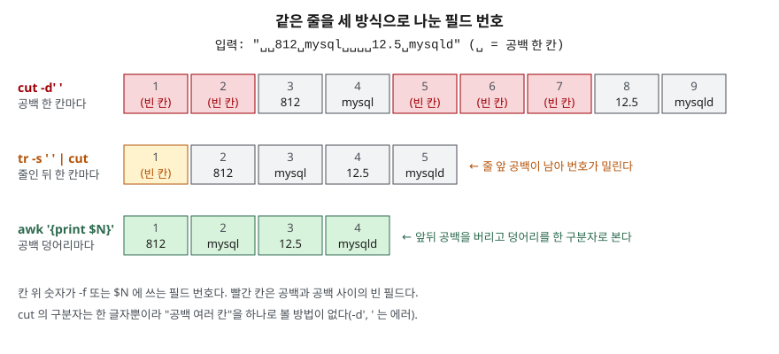

## 들어가며

장애 대응 중에 `ps aux`에서 사용자 이름 칸만 뽑아 세고 싶어진다. 칸을 자르는 명령이라길래
`ps aux | cut -d' ' -f2`를 치는데, 화면에 빈 줄만 수십 개가 나온다. `-f3`, `-f4`로 번호를 바꿔 가며
다시 쳐 보지만 줄마다 나오는 칸이 제각각이다. 결국 눈으로 표를 훑어 세거나, 복사해 스프레드시트에
붙인다. 원인은 번호가 아니라 구분자에 있다. `cut`은 공백 여러 칸을 하나로 보지 않는다.

## 개념

셋은 모두 **줄 단위 텍스트를 칸 단위로 다루는** 필터다.

- **`cut`** — 줄마다 정해진 바이트·글자·필드만 뽑는다. 필드는 구분자 **한 글자**로 나눈다
- **`paste`** — 여러 파일의 같은 번째 줄을 옆으로 붙인다. `-s`면 한 파일의 줄을 한 줄로 잇는다
- **`tr`** — 표준 입력의 글자를 다른 글자로 바꾸거나(`tr a-z A-Z`), 지우거나(`-d`), 연속된 것을 하나로 줄인다(`-s`)

`awk`로도 다 할 수 있지만 셋은 옵션이 적어 틀릴 자리가 적고, POSIX에 들어 있어 어느 서버에나 있다.
대신 **어떤 입력을 전제로 하는가**가 분명하다. 그 전제를 벗어나면 에러 없이 틀린 값을 낸다.

## 구조



> **출처**: 구분자가 한 글자이고 구분자 없는 줄을 그대로 내보낸다는 것은 [The Open Group Base Specifications Issue 8 — cut: OPTIONS](https://pubs.opengroup.org/onlinepubs/9799919799/utilities/cut.html),
> `-s`가 연속된 글자를 하나로 줄인다는 것은 [The Open Group Base Specifications Issue 8 — tr: OPTIONS](https://pubs.opengroup.org/onlinepubs/9799919799/utilities/tr.html)를 따랐다.
> 칸 안의 값은 아래 실습 1·2장의 실제 출력이다.

## 동작 원리

**`cut -f`는 구분자가 나올 때마다 칸을 끊는다.** 공백 네 칸이 이어지면 그 사이에 빈 필드 세 개가 생긴다.
POSIX가 `-d`에 한 글자만 받게 정해 두어서 "공백 한 칸 이상"을 구분자로 줄 수도 없다. `-d', '`는 에러다.

**`tr -s ' '`는 공백을 하나로 줄이지만 지우지는 않는다.** 줄 앞에 공백이 있으면 하나가 남는다.
그 한 칸 앞이 1번 필드(빈 칸)가 되어 번호가 하나씩 밀린다. `awk`는 기본 구분자일 때 앞뒤 공백을
버리고 공백 덩어리를 하나의 구분자로 보므로 이 문제가 없다.

**뽑는 순서는 입력 순서다.** POSIX는 목록을 어떤 순서로 적든 입력에 나온 순서로 쓴다고 정한다.
`-f3,1`은 `-f1,3`과 같다. 칸 순서를 바꾸는 명령이 아니다.

## 실습 예제

샘플 파일을 스크립트가 만들고 끝나면 지운다. 전체 소스: [`code/cut_paste_tr.sh`](code/cut_paste_tr.sh),
실행 기록: [`code/output.txt`](code/output.txt). 이 환경은 `LANG`이 비어 있어 기본 로케일이 `C`다.
`ps.txt`는 `ps` 출력 모양을 흉내 낸 4줄(PID·USER·%CPU·COMMAND)이고, 칸을 공백 여러 개로 맞췄다.

### cut 옵션 — 세 갈래

`cut --help`의 목록을 하는 일로 묶었다. POSIX 옵션은 `-b -c -f -d -s -n`이고 나머지는 GNU 확장이다.

| 갈래 | 옵션 | 하는 일 | 장 |
|---|---|---|---|
| **무엇 단위로 자르는가** | `-f` / `--fields` | 구분자로 나눈 필드 | 1~6 |
| | `-b` / `--bytes` | 바이트 | 7 |
| | `-c` / `--characters` | 글자. **이 판에서는 바이트와 같다** | 7 |
| | `-n` | POSIX에서는 `-b`가 글자를 쪼개지 않게 함. 이 판은 무시 | — |
| **필드를 어떻게 나누는가** | `-d` / `--delimiter` | 구분자 한 글자. 기본은 탭 | 1·5 |
| | `-s` / `--only-delimited` | 구분자가 없는 줄을 버림 | 4 |
| | `-z` / `--zero-terminated` | 줄 끝을 NUL로 봄 | 8 |
| **무엇을 내보내는가** | `N`, `N-`, `-M`, `N-M` | 범위. 적은 순서와 무관하게 입력 순서 | 3 |
| | `--complement` | 고른 것을 뺀 나머지 | 3·7 |
| | `--output-delimiter` | 출력 구분자를 바꿈 | 3·5 |

### 공백 여러 칸에서 cut이 틀린다

```text
$ cut -d' ' -f2 ps.txt


1034
$ tr -s ' ' < ps.txt | cut -d' ' -f2
PID
1
812
1034
$ sed 's/^ *//' ps.txt | tr -s ' ' | cut -d' ' -f2
USER
root
mysql
www-data
```

첫 줄은 빈 줄 셋과 `1034`가 나왔다. `1034` 줄만 앞 공백이 한 칸이라 2번 필드에 숫자가 걸렸다.
`tr -s`로 줄여도 USER가 아니라 PID가 나왔다. **예상과 달랐던 결과다.** 줄 앞 공백 한 칸이 남아서다.
`sed`로 앞 공백을 지운 뒤에야 USER가 나왔다. `awk '{print $2}'`는 한 번에 같은 결과를 냈다.
`cut -d', '`는 `the delimiter must be a single character`로 종료 코드 1이다.

### 목록 순서, 구분자 없는 줄, 따옴표

```text
$ cut -d, -f3,1 users.csv
# 사용자 목록 — 이 줄에는 쉼표가 없다
id,dept
1,dev
$ cut -d, -f2 -s users.csv | head -2
name
kim
$ cut -d, -f2 quoted.csv
city
"Seoul
```

`-f3,1`이 `id,dept` 순서로 나왔다. 주석 줄은 쉼표가 없어 **통째로** 나왔고, `-s`를 붙이자 빠졌다.
`"Seoul, KR"`은 따옴표 안의 쉼표에서 잘렸다. `cut`은 따옴표를 모른다. `--complement -f2`는
`id,dept,email`을, `--output-delimiter=' | '`는 `id | name`을 냈다. 탭 파일은 `-d` 없이 잘렸다.

### -c가 바이트를 센다

```text
$ LC_ALL=en_US.UTF-8 cut -c1-3 hangul.txt | od -An -tx1
 ed 95 9c 0a
$ LC_ALL=en_US.UTF-8 cut -c1-2 hangul.txt | od -An -tx1
 ed 95 0a
```

`한글로그`에서 세 글자를 달라고 했는데 3바이트(`한` 한 글자)가 나왔다. `-c1-2`는 `한`의 앞 2바이트만
잘라 깨진 글자를 냈다. POSIX는 `-c`를 글자 단위로 정하지만 이 판은 UTF-8 로케일에서도 `-b`와 같았다.
다른 판의 동작은 확인하지 않았다.

### paste 옵션

| 옵션 | 하는 일 | 장 |
|---|---|---|
| (없음) | 파일들의 같은 번째 줄을 탭으로 이음 | 9 |
| `-d` / `--delimiters=LIST` | 구분자 목록. 다 쓰면 처음부터 다시 씀 | 9 |
| `-s` / `--serial` | 한 파일의 줄 전부를 한 줄로 | 9 |
| `-z` / `--zero-terminated` | NUL로 끝나는 줄 | 9 |
| `-` (파일 자리) | 표준 입력. 여러 번 적으면 한 줄씩 돌아가며 읽음 | 9 |

```text
$ paste -d',;' names.txt depts.txt pays.txt
kim,dev;700
lee,ops;450
park,;500
$ paste -sd+ pays.txt
700+450+500
$ paste -d, - - - < letters.txt
a,b,c
d,e,f
```

부서 파일이 두 줄뿐이라 셋째 줄은 빈 칸이 됐다. POSIX는 먼저 끝난 파일을 빈 줄로 본다고 정한다.
`-d',;'`는 첫 틈에 `,`, 둘째 틈에 `;`를 썼다. `- - -`는 한 입력을 세 칸씩 접는다.

### tr 옵션

| 옵션·표기 | 하는 일 | 장 |
|---|---|---|
| `SET1 SET2` | SET1의 n번째 글자를 SET2의 n번째로 | 10 |
| `-t` / `--truncate-set1` | SET1을 SET2 길이로 자름 | 10 |
| `-d` / `--delete` | SET1의 글자를 지움 | 11 |
| `-s` / `--squeeze-repeats` | 마지막 SET의 글자가 이어지면 하나로 | 11 |
| `-c` / `-C` / `--complement` | SET1의 여집합 | 11 |
| `a-z`, `[:digit:]`, `[x*]`, `\t`·`\r`·`\NNN` | 범위, 문자 클래스, 반복, 이스케이프 | 10·11 |

```text
$ echo 'abcabc' | tr abc x
xxxxxx
$ echo 'abcabc' | tr -t abc x
xbcxbc
$ echo 'phone 010-1234-5678' | tr 0-9 '[#*]'
phone ###-####-####
$ tr -d '\r' < crlf.txt | od -An -c
   a   l   p   h   a  \n   b   e   t   a  \n
$ echo 'order 42 total 1,300' | tr -cd '0-9\n'
421300
$ echo 'one  two
three' | tr -s '[:space:]' '\n'
one
two
three
```

SET2가 짧으면 GNU는 마지막 글자를 되풀이해 늘린다. POSIX는 이 경우를 정하지 않았다.
`-t`는 SET1을 잘라 `a`만 바꿨다. `-cd`는 숫자와 개행을 뺀 전부를 지운다. 개행을 빼먹으면 출력이
한 줄로 붙는다. `tr a-z A-Z names.txt`는 `extra operand 'names.txt'`로 거부됐다. `tr`은 표준 입력만 읽는다.

### tr이 한글을 깨뜨린다

```text
$ printf '가 나 글\n' | od -An -tx1
 ea b0 80 20 eb 82 98 20 ea b8 80 0a
$ echo '가나다' | LC_ALL=en_US.UTF-8 tr '가' '나'
나나다
$ echo '가글' | LC_ALL=en_US.UTF-8 tr '가' '나'
나븘
$ echo '가글' | sed 's/가/나/g'
나글
```

`가나다`는 맞게 바뀌어 보였다. 그런데 `가글`은 `나븘`이 됐다. 이 판의 `tr`은 `'가' '나'`를
`ea→eb`, `b0→82`, `80→98` 세 바이트 대응으로 읽는다. `글`(`ea b8 80`)의 첫 바이트와 끝 바이트가
그 대응에 걸려 `eb b8 98`이 됐고, 그게 `븘`이다. 에러는 없다. 한글 치환은 `sed`로 한다.

## 실무에서 주의할 점

- **공백으로 줄 맞춘 출력에는 `cut`을 쓰지 않는다.** `ps`·`df`·`ls -l` 같은 출력은 `awk '{print $N}'`로 뽑는다.
  `tr -s ' '`를 끼울 거면 줄 앞 공백도 함께 지운다.
- **`cut -f`로 칸 순서를 바꿀 수 없다.** `-f3,1`은 입력 순서로 나온다. 순서를 바꾸려면 `awk`를 쓴다.
- **구분자 없는 줄이 섞인 파일은 `-s`를 붙인다.** 주석·빈 줄·머리말이 그대로 섞여 나온다.
- **따옴표가 있는 CSV는 `cut`으로 자르지 않는다.** 따옴표 안의 쉼표에서 잘린다. CSV 파서를 쓴다.
- **멀티바이트 글자에 `cut -c`와 `tr`을 쓰지 않는다.** 이 판에서는 둘 다 바이트 단위라 글자를 깨뜨린다.
  `tr`은 치환이 맞아 보이는 입력도 있어서 테스트에서 걸리지 않을 수 있다.
- **윈도우에서 온 파일은 `tr -d '\r'`부터 한다.** `\r`이 남으면 마지막 칸이 `700\r`이 되어 비교가 틀린다.

## 정리

- `cut -f`는 구분자 한 글자마다 칸을 나눠, 공백 여러 칸에서 빈 필드가 생긴다.
- `tr -s ' '`로 줄여도 줄 앞 공백이 남아 번호가 밀렸다. 공백 정렬 출력은 `awk`로 뽑는다.
- `cut`의 필드 목록은 입력 순서로 나오고, 구분자 없는 줄은 `-s` 없이는 그대로 나온다.
- `paste`는 먼저 끝난 파일을 빈 칸으로 채우고 `-d` 목록을 돌려 쓴다. `-s`와 `-`로 줄을 잇고 접는다.
- 이 판의 `cut -c`와 `tr`은 바이트 단위였다. `tr '가' '나'`가 `글`을 `븘`으로 바꿨다.

## 참고 자료

- [The Open Group Base Specifications Issue 8 — cut](https://pubs.opengroup.org/onlinepubs/9799919799/utilities/cut.html) — 구분자 한 글자, 입력 순서 출력, 구분자 없는 줄 통과와 `-s`, `-c`가 글자 단위라는 정의
- [The Open Group Base Specifications Issue 8 — paste](https://pubs.opengroup.org/onlinepubs/9799919799/utilities/paste.html) — `-d` 목록 순환, `-`의 순환 읽기, 먼저 끝난 파일을 빈 줄로 보는 규정
- [The Open Group Base Specifications Issue 8 — tr](https://pubs.opengroup.org/onlinepubs/9799919799/utilities/tr.html) — 표준 입력만 읽는다는 것, SET2가 짧을 때 결과가 정해지지 않았다는 것
- [The Open Group Base Specifications Issue 8 — awk](https://pubs.opengroup.org/onlinepubs/9799919799/utilities/awk.html) — 기본 `FS`에서 앞뒤 공백을 버리고 공백 덩어리로 필드를 나누는 규정
- 옵션 표의 원본은 설치된 GNU coreutils 8.32의 `cut --help`·`paste --help`·`tr --help` 출력이다. `info`·`man`이 없는 환경이라 온라인 매뉴얼 대신 이것을 기준으로 삼았다
