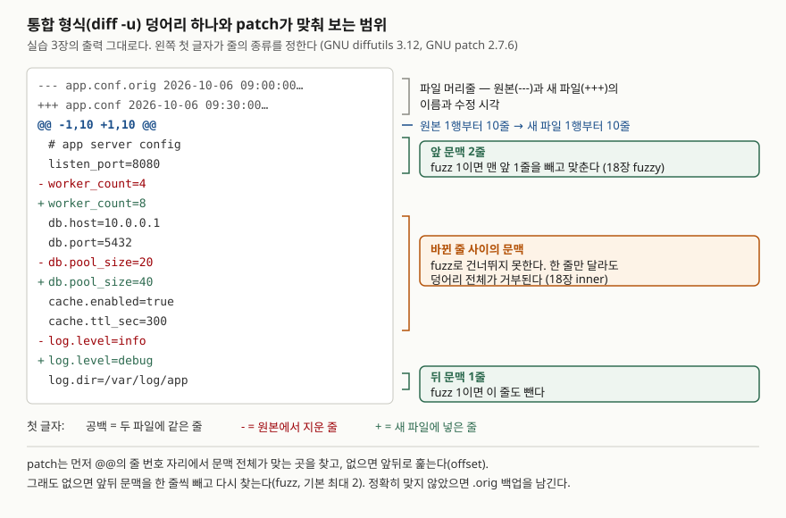

## 들어가며

장애 대응 중에 운영 서버의 설정 파일을 몇 군데 고친다. 고치기 전에 `cp app.conf app.conf.bak`을 해 두지만,
한 달 뒤 같은 폴더에는 `.bak`, `.bak2`, `.orig`, `.20260901`이 쌓여 있고 어느 것이 언제의 원본인지 아무도 모른다.
"그때 무엇을 바꿨나"를 알려면 결국 두 파일을 편집기 두 개에 띄우고 줄마다 눈으로 맞춰 본다. 200줄짜리 파일이면 200번이다.
고치기 직전과 직후를 `diff -u`로 한 번 남기면, 그 몇 줄짜리 파일이 무엇을 바꿨는지의 기록이고 `patch -R` 한 번으로 되돌리는 수단이 된다.

## 개념

`diff`는 두 파일에서 **공통인 줄들의 긴 흐름을 찾고, 그 사이에 끼어 다른 줄들의 묶음을 덩어리(hunk)로 내놓는다.**
GNU 매뉴얼은 덩어리 크기의 합이 작아지도록 공통 줄을 고르되, 빠르게 돌리려고 최적이 아닌 답을 낼 때도 있다고 적는다.
`patch`는 그 출력을 읽어 **다른 파일에 같은 변경을 다시 적용**한다. 둘이 짝을 이루므로 diff 출력은 "읽는 기록"이면서 "실행할 수 있는 변경"이다.

출력 형식은 여럿이지만, 바뀐 줄 앞뒤에 **문맥 줄**을 붙이는 문맥 형식(`-c`)과 통합 형식(`-u`)이 patch에 맞다.
patch가 문맥 줄로 적용할 자리를 찾기 때문이다. 매뉴얼은 patch가 제대로 동작하려면 보통 문맥이 두 줄 이상 필요하다고 적는다.

## 구조



> **출처**: 덩어리 머리줄과 줄 앞 글자는 [GNU diffutils 매뉴얼 — Detailed Description of Unified Format](https://www.gnu.org/software/diffutils/manual/html_node/Detailed-Unified.html),
> offset·fuzz와 문맥 줄을 빼는 순서는 [Helping patch Find Inexact Matches](https://www.gnu.org/software/diffutils/manual/html_node/Inexact.html),
> `.orig` 백업 조건은 [Backup Files](https://www.gnu.org/software/diffutils/manual/html_node/Backups.html)를 따랐다. 오른쪽 상자의 결과는 실습 18장의 실제 출력이다.

## 동작 원리

`@@ -1,10 +1,10 @@`은 "원본의 1행부터 10줄이 새 파일의 1행부터 10줄이 된다"는 뜻이다. 덩어리가 한 줄이면 `,줄수`가 빠진다(`-U0` 출력의 `@@ -3 +3 @@`).

patch는 이 덩어리를 붙일 자리를 이렇게 찾는다. 먼저 머리줄의 줄 번호 자리에서 **문맥 줄 전체**가 맞는지 본다. 안 맞으면 앞뒤로 훑어
맞는 곳을 찾는다. 이것이 offset이다. 그래도 없으면 **앞뒤 문맥을 한 줄씩 빼고** 다시 훑는다. 이것이 fuzz이고 기본 최대치는 2다.

여기서 도식의 주황색 상자가 나온다. fuzz가 빼는 것은 덩어리 **바깥쪽** 문맥뿐이다. 바뀐 줄들 사이에 낀 문맥은 빼지 않으므로,
한 줄만 달라도 덩어리 전체가 거부된다. 그리고 바뀐 곳이 가까우면 diff가 덩어리를 하나로 합친다. 이 예제는 세 군데가 두 줄씩 떨어져 있어
`-U1`에서도 한 덩어리였고 `-U0`에서야 세 덩어리로 갈렸다.

## 실습 예제

설정 파일 하나에서 세 줄(`worker_count` 4→8, `db.pool_size` 20→40, `log.level` info→debug)을 바꾼 뒤 21개 장으로 나눠 돌렸다.
전체 소스: [`code/diff_patch_options.sh`](code/diff_patch_options.sh), 실행 기록: [`code/output.txt`](code/output.txt)

### diff 옵션은 다섯 갈래로 묶인다

`diff --help` 목록을 하는 일로 묶고 실습 장 번호를 붙였다.

| 갈래 | 옵션 | 하는 일 | 실습 |
|---|---|---|---|
| **출력 형식** | (없음) / `--normal` | `3c3`처럼 줄 번호와 `<`·`>` | 2장 |
| | `-u` / `-U N` | 통합 형식, 문맥 N줄(기본 3) | 3장 |
| | `-c` / `-C N` | 문맥 형식. 바뀐 줄을 `!`로 양쪽에 | 4장 |
| | `-y` / `-W N` | 나란히 두 칸, 전체 폭 N | 5장 |
| | `--suppress-common-lines` / `--left-column` | `-y`에서 같은 줄 숨김 / 왼쪽만 | 5장 |
| | `-q` / `-s` | 다른지만 / 같을 때도 알림 | 6장 |
| | `-e` / `-n` | ed 스크립트 / RCS 형식 | 12장 |
| | `--LTYPE-line-format` / `-D 이름` | 줄마다 서식 지정 / `#ifdef`로 합친 파일 | 13장 |
| **머리줄** | `--label` | 머리줄의 파일 이름을 바꿈 | 7장 |
| | `-F 정규식` | 바뀐 곳 위에서 정규식에 맞는 가장 가까운 줄을 머리줄 뒤에 | 10장 |
| **무시할 차이** | `-Z` / `-b` / `-w` | 줄 끝 공백 / 공백의 양 / 모든 공백 | 8장 |
| | `-B` / `-i` / `-I 정규식` | 빈 줄 / 대소문자 / 정규식에 맞는 줄만 바뀐 덩어리 | 8장 |
| | `-E` / `--strip-trailing-cr` | 탭과 공백 펼침 차이 / 줄 끝 CR | 8·9장 |
| **디렉터리** | `-r` / `-N` / `-x 패턴` | 하위까지 / 없는 파일을 빈 파일로 / 제외 | 11장 |
| | `--from-file` | 한 파일을 여러 파일과 비교 | 11장 |
| **입력·표시** | `-a` | 바이너리로 보이는 파일도 텍스트로 | 14장 |
| | `-t` / `-T` / `--tabsize` | 탭 펼치기 / 줄 앞에 탭 / 탭 폭 | 15장 |
| | `-d` | 더 작은 변경을 찾으려 애씀 | 15장 |

돌리지 않은 것: `-p`(C 함수 이름을 찾는 `-F`의 고정판), `--color`(터미널 색 코드가 기록을 어지럽힘), `-l`(`pr`로 쪽 나눔), `-X`·`-S`·`--to-file`·`--unidirectional-new-file`
(11장의 `-x`·`--from-file`·`-N`과 같은 갈래), `--horizon-lines`·`--speed-large-files`(결과가 아니라 계산 방법을 바꿈).

### 종료 코드는 0·1·2다

```text
$ diff -q app.conf.orig app.conf
Files app.conf.orig and app.conf differ
(종료 코드 1)
$ diff app.conf.orig same.conf
(종료 코드 0)
$ diff app.conf.orig no_such.conf
diff: no_such.conf: No such file or directory
(종료 코드 2)
```

매뉴얼대로 0은 같음, 1은 다름, 2는 문제다. **다르다는 것이 1**이므로 `set -e` 스크립트에서 `diff`를 그냥 부르면 차이를 찾은 순간 스크립트가 멈춘다.
"다름"과 "실패"를 가르려면 1과 2를 따로 본다.

### 무시 옵션은 한 단계씩 넓어진다

줄마다 다른 종류의 차이를 하나씩 넣었다. 공백 삽입(1행), 공백 양(2행), 빈 줄, 줄 끝 공백(`db.host`), 대소문자, 주석 날짜다.

아무것도 안 주면 다섯 줄 전부가 한 덩어리(`1,5c1,6`)로 나온다. 옵션을 하나씩 더하면 덩어리에서 빠지는 줄이 늘어난다.

```text
$ diff -b ws_old.conf ws_new.conf
1c1
< listen_port=8080
---
> listen_port = 8080
2a3
> 
4,5c5,6
< log.level=info
< # edited 2026-10-01
---
> LOG.LEVEL=info
> # edited 2026-10-06
(종료 코드 1)
$ diff -w -B -i -I '^# edited' ws_old.conf ws_new.conf
(종료 코드 0)
```

`-Z`는 줄 끝 공백이 붙은 `db.host` 줄만 덩어리에서 뺐다. `-b`는 거기에 더해 `worker_count = 4`와 `worker_count   =   4`도 같게 봤지만,
위처럼 `listen_port=8080`과 `listen_port = 8080`은 다르게 봤다. 공백이 **없던 자리에 생긴 것**은 양의 변화가 아니기 때문이고,
이것까지 지우려면 `-w`다. 그 뒤로 `-B`가 빈 줄을, `-i`가 대소문자를, `-I`가 날짜 주석을 지워 종료 코드가 0이 됐다. 단계별 출력은 실행 기록 8장에 있다.

윈도에서 저장한 CRLF 파일은 열 줄이 전부 바뀐 것으로 나왔고(`1,10c1,10`), `--strip-trailing-cr`을 붙이자 종료 코드 0이었다.

### 디렉터리 패치와 -p

```text
$ head -3 dir.patch
diff -ruN conf_old/app.conf conf_new/app.conf
--- conf_old/app.conf	2026-10-06 09:00:00.000000000 +0900
+++ conf_new/app.conf	2026-10-06 09:30:00.000000000 +0900
$ patch -d live -p1 -i ../dir.patch
patching file app.conf
patching file limits.conf
patching file log.conf
```

`-p1`은 경로 앞의 `conf_new/` 한 토막을 떼고 `live/` 아래에서 찾는다. `-p0`으로 돌리자 파일을 못 찾아 `File to patch:`라고 **물었고**,
입력이 없어 그 패치를 건너뛰었다. 무인 작업에서는 이 질문이 그대로 실패가 된다.
`-N`으로 만든 새 파일(`limits.conf`)은 원본 쪽 시각이 `1970-01-01`로 찍혀 "없던 파일"임을 나타내고, `-R`로 되돌리자 patch가 그 파일을 지웠다(20장).

### patch 옵션

| 갈래 | 옵션 | 하는 일 | 실습 |
|---|---|---|---|
| **적용 방향과 미리보기** | `--dry-run` | 파일을 바꾸지 않고 결과만 알림 | 16장 |
| | `-R` | 거꾸로 적용 = 되돌리기 | 16장 |
| | `-N` / `-t` / `-f` | 이미 적용된 듯하면 건너뜀 / 묻지 않고 거꾸로 / 묻지 않고 그대로 | 17장 |
| **맞추는 정도** | `-F N` | 앞뒤 문맥을 최대 N줄 빼고 맞춤(기본 2) | 18장 |
| | `-l` | 공백 차이를 무시하고 맞춤 | 21장 |
| | `--merge` | 거부 대신 충돌 표시를 파일에 넣음 | 18장 |
| **결과와 거부 파일** | `-o 파일` / `-r 파일` | 결과 / 거부된 덩어리를 다른 파일로 | 18·19장 |
| | `--reject-format` | 거부 파일을 `context` 또는 `unified`로 | 18장 |
| **백업** | `-b` / `-z 접미사` / `-V numbered` | 늘 백업 / 접미사 / `.~1~` 번호 | 19장 |
| **경로와 입력** | `-p N` / `-d 디렉터리` / `-i 패치` | 경로 앞 N토막 제거 / 먼저 이동 / 패치 파일 | 20장 |
| | `-E` | 적용 뒤 빈 파일을 지움 | 20장 |
| | `-s` / `--verbose` | 조용히 / 자세히 | 20장 |

`-c`·`-u`·`-n`·`-e`(패치 형식 지정)는 쓰지 않았다. `--verbose` 출력의 `Looks like a unified diff to me`처럼 patch가 형식을 스스로 알아냈다.
`-D`·`-B`·`-Y`·`-g`·`-Z`·`-T`·`--posix`·`--read-only`도 돌리지 않았다.

### 예상과 달랐던 결과 — 실패해도 .orig가 남고, 거부 파일은 통합 형식이다

```text
$ patch shifted.conf app.conf.patch
Hunk #1 succeeded at 3 (offset 2 lines).
$ patch fuzzy.conf app.conf.patch
Hunk #1 succeeded at 1 with fuzz 1.
$ ls fuzzy.conf*
fuzzy.conf
fuzzy.conf.orig
$ patch inner.conf app.conf.patch
Hunk #1 FAILED at 1.
1 out of 1 hunk FAILED -- saving rejects to file inner.conf.rej
$ patch --merge inner2.conf app.conf.patch
Hunk #1 merged at 3, NOT MERGED at 6-12,15.
```

`-b`를 주지 않았는데 offset·fuzz로 성공한 파일에도, 실패한 파일에도 `.orig`가 생겼다. 매뉴얼은 패치가 **정확히 맞지 않으면** 백업을 남기는 것이
POSIX 모드가 아닐 때의 기본이라고 적는다. 정확히 맞지 않은 파일은 `-R`로 되돌려도 원래대로 돌아온다는 보장이 없기 때문이다.

`inner.conf`는 `db.port` 한 줄만 달랐는데 덩어리 전체가 거부됐다. 같은 파일에 `--merge`를 주자 `worker_count`·`log.level`은 적용하고
`db.port`·`db.pool_size` 부분만 `<<<<<<<`·`=======`·`>>>>>>>`로 감쌌다.

또 하나. GNU 매뉴얼의 이 절은 거부된 덩어리를 **입력 형식과 상관없이 문맥 형식으로** 쓴다고 적지만, patch 2.7.6은 통합 형식 패치의
거부 파일을 통합 형식으로 썼다(17장 `target.conf.rej`, 18장 `fuzzy2.conf.rej`). 문맥 형식이 필요하면 `--reject-format=context`를 준다.
매뉴얼과 설치된 판이 다른 지점이다.

## 실무에서 주의할 점

- **고치기 전에 원본을 복사하고, 고친 뒤 `diff -u`로 패치를 남긴다.** `--label`로 머리줄을 `a/app.conf`·`b/app.conf`처럼 고정하면
  `-p1`로 어느 서버에서나 같은 경로로 적용된다.
- **같은 패치를 두 번 적용하지 않는다.** 이미 적용된 파일에 다시 돌리면 patch가 "거꾸로 된 패치"로 보고 묻는다. 입력이 없으면 기본값
  `n`으로 건너뛰고 `.rej`를 남겼고(17장), `-t`는 묻지 않고 **되돌려 버렸다.** 자동화에서는 `-N`을 쓴다.
- **`--dry-run`을 먼저 돌린다.** offset·fuzz 메시지가 나오면 원본이 패치를 만든 때와 다르다는 뜻이다. 매뉴얼도 큰 offset이나 fuzz가 쓰였으면
  잘못된 자리에 붙었을 수 있으니 의심하라고 적는다.
- **문맥을 줄이지 않는다.** 매뉴얼은 patch가 제대로 동작하려면 보통 문맥이 두 줄 이상 필요하다고 적는다. `-U0` 대신 기본 3줄을 쓴다.
- **스크립트에서는 종료 코드 1을 실패로 다루지 않는다.** diff의 1은 "다름"이다. patch는 덩어리가 하나라도 실패하면 1을 돌려줬다(17·18장).
- **CRLF 파일은 `--strip-trailing-cr`로 먼저 확인한다.** 줄 끝 문자만 다른 파일이 "전부 바뀜"으로 나와 진짜 변경을 덮는다.

## 정리

- `diff -u`의 덩어리는 머리줄 `@@ -시작,줄수 +시작,줄수 @@`와 공백·`-`·`+`로 시작하는 줄로 이뤄진다. 종료 코드 1은 "다름"이다.
- patch는 문맥 줄로 자리를 찾고, 어긋나면 offset, 그래도 안 되면 바깥 문맥을 빼는 fuzz를 쓴다. 바뀐 줄 사이의 문맥은 빼지 않는다.
- 정확히 맞지 않게 적용·실패하면 `.orig`가 남는다. 2.7.6의 거부 파일은 입력과 같은 형식이었다.
- 되돌리기는 `patch -R`, 미리보기는 `--dry-run`, 자동화에서 중복 적용 방지는 `-N`이다.

## 참고 자료

- [GNU diffutils 매뉴얼 — Hunks](https://www.gnu.org/software/diffutils/manual/html_node/Hunks.html) — 공통 줄과 덩어리, 최적이 아닐 수 있는 일치
- [GNU diffutils 매뉴얼 — Context Format](https://www.gnu.org/software/diffutils/manual/html_node/Context-Format.html) — 문맥 기본 3줄, patch에는 보통 두 줄 이상 필요
- [GNU diffutils 매뉴얼 — Detailed Description of Unified Format](https://www.gnu.org/software/diffutils/manual/html_node/Detailed-Unified.html) — 머리줄의 시작·줄수, 줄 앞 글자의 뜻
- [GNU diffutils 매뉴얼 — Invoking diff](https://www.gnu.org/software/diffutils/manual/html_node/Invoking-diff.html) — 종료 코드 0·1·2
- [GNU diffutils 매뉴얼 — Applying Reversed Patches](https://www.gnu.org/software/diffutils/manual/html_node/Reversed-Patches.html) — 이미 적용한 패치를 거꾸로 된 패치로 보는 동작
- [GNU diffutils 매뉴얼 — Helping patch Find Inexact Matches](https://www.gnu.org/software/diffutils/manual/html_node/Inexact.html) — offset, fuzz 기본 2와 문맥을 빼는 순서, 거부 파일
- [GNU diffutils 매뉴얼 — Backup Files](https://www.gnu.org/software/diffutils/manual/html_node/Backups.html) — 정확히 맞지 않을 때 백업이 기본, POSIX 모드에서는 아님
