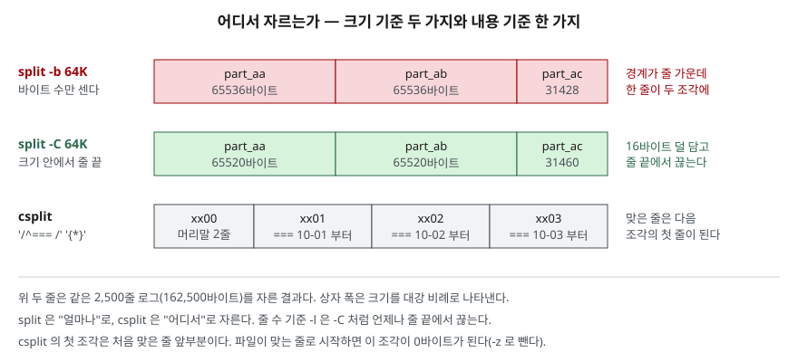

## 들어가며

장애 분석을 맡은 동료에게 어제 로그를 보내려는데 파일이 4GB다. 메일 첨부도, 사내 메신저도
한도가 수백 MB라 걸린다. 그래서 편집기로 열어 앞부분을 복사해 새 파일에 붙이고, 다음 부분을 또
복사하는 일을 몇 번 하다가 편집기가 멈춘다. 날짜별로 나눠 달라는 요청이면 더 곤란하다. 머리줄
위치를 눈으로 찾아 열 번 넘게 잘라야 한다. 이 일은 명령 두 개가 한 줄로 끝낸다. 대신 **어디서
자르는지**를 모르고 쓰면 줄이 반으로 갈리거나, 조각 일부가 소리 없이 사라진다.

## 개념

- **`split`** — 입력을 **크기**로 나눈다. 줄 수(`-l`), 바이트(`-b`), 줄을 지키는 바이트(`-C`),
  조각 개수(`-n`) 중 하나를 기준으로 삼는다. 이름은 `접두어 + 접미사`(`xaa`, `xab`, …)다
- **`csplit`** — 입력을 **내용**으로 나눈다. 줄 번호나 정규식에 맞는 줄에서 자르고, 조각마다
  바이트 수를 표준 출력에 찍는다. 이름은 `xx00`, `xx01`, …이다

둘 다 POSIX에 있다. POSIX `split`에는 `-a -b -l`만 있고 `-C -n -d --filter` 같은 것은 GNU 확장이다.
다시 합치는 명령은 따로 없다. `cat`으로 이으면 된다. 그래서 **조각 이름이 정렬되는 순서**가 중요하다.

## 구조



> **출처**: `-b`·`-l`과 접미사 규칙은 [The Open Group Base Specifications Issue 8 — split](https://pubs.opengroup.org/onlinepubs/9799919799/utilities/split.html),
> `/rexp/`가 맞은 줄 앞까지를 한 조각으로 만든다는 것은 [The Open Group Base Specifications Issue 8 — csplit](https://pubs.opengroup.org/onlinepubs/9799919799/utilities/csplit.html)의 OPERANDS를 따랐다.
> 칸 안의 값은 아래 실습 3·13장의 실제 출력이다.

## 동작 원리

**`-b`는 바이트만 센다.** 65,536바이트째에서 줄이 끝나지 않으면 그 줄은 두 조각에 걸친다.
`-C`는 "줄 단위 레코드를 SIZE바이트까지" 담으므로, 다음 줄이 들어가지 않으면 그 앞에서 끊는다.
한 줄이 SIZE보다 길면 그 줄만은 쪼갠다.

**접미사는 정해진 길이의 알파벳 카운터다.** 기본 길이 2면 `aa`~`zz`로 676개다. POSIX는 접미사가
모자라면 "마지막으로 유효한 이름까지 만들고 실패하며, 만든 파일은 지우지 않는다"고 정한다.
**남은 입력은 어디에도 쓰이지 않는다.** GNU는 `-a`를 주지 않았을 때만 이것을 피한다.
첫 글자가 `z`에 닿기 직전에 지금까지의 `z`를 접두어로 넘기고 접미사를 두 칸 늘린다(`yz` 다음이
`zaaa`). `z`로 시작하는 이름은 앞의 모든 이름보다 뒤에 정렬되므로 `cat x*`의 순서가 유지된다.
coreutils 소스 `split.c`의 `suffix_auto` 처리가 이 일을 한다.

**csplit은 패턴을 차례로 소비한다.** 각 패턴이 "현재 줄부터 맞은 줄 앞까지"를 한 조각으로 떼고,
맞은 줄은 다음 조각의 첫 줄이 된다. `{N}`은 앞 패턴을 N번 더 되풀이한다. 하나라도 못 찾으면
기본 동작은 **이미 만든 조각을 모두 지우는 것**이다. POSIX가 그렇게 정했고 `-k`가 이를 끈다.

## 실습 예제

전체 소스: [`code/split_csplit.sh`](code/split_csplit.sh), 실행 기록: [`code/output.txt`](code/output.txt).
스크립트가 임시 폴더에 2,500줄 접근 로그 `app.log`(162,500바이트)와, 머리말 2줄 뒤에 날짜마다
`=== 2026-10-0N ===` 머리줄과 본문 3줄이 붙은 14줄 로그 `days.log`를 만든다. 옵션 표는 이 환경의
`split --help`·`csplit --help` 출력을 갈래로 묶은 것이다.

### split 옵션 — 네 갈래

| 갈래 | 옵션 | 하는 일 | 장 |
|---|---|---|---|
| **무엇을 기준으로 자르는가** | `-l` / `--lines=N` | N줄씩. 기본 1000 | 1·2 |
| | `-b` / `--bytes=SIZE` | SIZE바이트씩. 줄을 무시 | 3·12 |
| | `-C` / `--line-bytes=SIZE` | SIZE바이트 안에서 줄 끝까지 | 3·4 |
| | `-n` / `--number=CHUNKS` | `N`, `l/N`, `r/N`, `K/N`, `l/K/N`, `r/K/N` | 5·6 |
| | `-t` / `--separator=SEP` | 줄 대신 SEP를 레코드 끝으로 | 10 |
| **이름을 어떻게 붙이는가** | `PREFIX` (두 번째 인자) | 접두어. 기본 `x` | 2 |
| | `-a` / `--suffix-length=N` | 접미사 길이 고정. 기본 2 | 2·7 |
| | `-d`, `--numeric-suffixes[=FROM]` | 숫자 접미사, 시작값 | 2 |
| | `-x`, `--hex-suffixes[=FROM]` | 16진 접미사 | 2 |
| | `--additional-suffix=S` | 접미사 뒤에 붙일 확장자 | 2 |
| **어디로 쓰는가** | `--filter=CMD` | 조각마다 CMD의 표준 입력으로. 이름은 `$FILE` | 9 |
| | `-e` / `--elide-empty-files` | `-n`에서 빈 조각을 만들지 않음 | 6 |
| | `-u` / `--unbuffered` | `-n r/...`에서 바로 내보냄 | — |
| **확인** | `--verbose` | 파일을 열 때마다 이름을 찍음 | 11 |

SIZE는 `K`·`M`이 1024 단위, `KB`·`MB`가 1000 단위다. `-u`는 출력 모양이 같아 실습에서 뺐다.

### -b는 줄을 가르고 -C는 지킨다

```text
$ split -b 64K app.log part_
part_aa         1008줄   65536바이트
part_aa 마지막 줄 : h=/api/items status=200
2026-10-01T00:16|
part_ab 첫 줄     : :49 INFO req=1009 path=/api/items/42/reviews status=200
$ split -C 64K app.log part_
part_aa         1008줄   65520바이트
part_aa 마지막 줄 : 2026-10-01T00:16:48 INFO req=1008 path=/api/items status=200
```

`-b`의 첫 조각은 `2026-10-01T00:16`에서 끝났고 다음 조각은 `:49 INFO`로 시작했다. `wc -l`은 개행 수만
세서 둘 다 1008줄로 보이지만, 그중 한 줄은 반쪽이다. `-C`는 16바이트를 덜 담고 줄 끝에서 끊었다.
300바이트 한 줄에 `-C 100`을 주면 100바이트 조각 셋으로 갈렸다. `-C`도 긴 줄은 지키지 못한다.

### -n — 개수로 나누기

```text
$ split -n 3 app.log part_
part_ab 첫 줄 : 13:54 INFO req=0834 path=/health status=200
$ split -n l/3 app.log part_
part_ab 첫 줄 : 2026-10-01T00:13:55 INFO req=0835 path=/api/orders?page=3 status=200
$ split -n r/3 app.log rr_
rr_aa            834줄   54213바이트
$ split -n l/2/3 app.log | wc -l
l/2/3 를 표준 출력으로 받은 줄 수 : 833
```

`-n 3`은 바이트로 3등분해서 줄을 갈랐다. `l/3`은 줄을 지켰다. `r/3`은 한 줄씩 돌아가며 나눠서,
`rr_ab`에는 `req=0002`, `0005`가 들어갔다. 시간 순서가 조각 안에서 끊긴다. `l/2/3`은 파일을 만들지
않고 둘째 조각만 표준 출력으로 낸다. 두 줄짜리 파일에 `-n l/4`를 주자 `aa`·`ac`에 한 줄씩, `ab`·`ad`는
빈 파일이 됐다. `-e`를 붙이면 빈 것을 빼고 **이름을 당겨** `aa`·`ab`만 남는다.

### 접미사가 모자라면 — 예상과 달랐던 결과

3,000줄을 100줄씩 자르면 30조각이 필요한데 `-a 1`은 26개(`a`~`z`)까지만 이름을 만든다.

```text
$ split -l 100 -a 1 lines.txt part_
split: output file suffixes exhausted
종료 코드 1
$ ls part_* | wc -l
26
```

`part_a`~`part_z` 26개가 남았고 **2,601~3,000번 줄은 어디에도 없다.** 실패하면 아무것도 안 남거나
전부 남을 줄 알았는데, 일부만 남았다. 종료 코드를 보지 않는 스크립트는 2,600줄짜리 결과를 정상으로 받는다.
정확히 26조각(2600줄)이면 종료 코드 0이었다.

`-a` 없이 700줄을 한 줄씩 자르면 이렇게 됐다.

```text
$ split -l 1 lines.txt x
$ ls x* | sed -n '1p;675,678p;$p'
xaa
xzaay
xzaaz
xzaba
xzabb
xzabx
700개 / 조각을 glob 순서로 이은 첫 줄과 마지막 줄 : 1 700
cmp: 원본과 같다
```

650개(`xaa`~`xyz`) 뒤에 `xzaaa`부터 네 글자가 이어졌다. 650조각이면 마지막 이름이 `xyz`였다.
`-a`를 지정하면 이 확장이 꺼지므로, **길이를 고정하면 넘칠 때 자료를 잃는다.**

### 이름 바꾸기, 필터, 다시 합치기

```text
$ split -l 1000 -d -a 3 --additional-suffix=.log app.log part_
part_000.log
part_001.log
part_002.log
$ split -l 1000 --numeric-suffixes=7 app.log part_
part_07
part_08
part_09
$ split -l 1000 --filter='gzip > $FILE.gz' app.log part_
part_aa.gz
part_ab.gz
part_ac.gz
$ zcat part_*.gz | cmp - app.log && echo 'cmp: 원본과 같다'
cmp: 원본과 같다
$ split -b 50K app.log part_
$ cat part_* > joined.log
$ sha256sum app.log joined.log | cut -c1-16,65-
5c2d11f155ee5202 *app.log
5c2d11f155ee5202 *joined.log
```

`--filter`는 조각을 디스크에 쓰지 않고 명령에 넘긴다. `$FILE`은 작은따옴표로 감싸야 split이 넣은
값이 쓰인다. `-t ';' -l 2`는 `r1;r2;`, `r3;r4;`, `r5;`로 나눴다. `-`를 주면 표준 입력을 읽는다.

### csplit 옵션

| 갈래 | 옵션·패턴 | 하는 일 | 장 |
|---|---|---|---|
| **어디서 자르는가** | `N` | N번 줄 앞까지 | 13 |
| | `/RE/[+N\|-N]` | 맞은 줄(에서 N줄 옮긴 곳) 앞까지 | 13·16 |
| | `%RE%[+N\|-N]` | 같은 곳까지 **버린다** | 15 |
| | `{N}`, `{*}` | 앞 패턴을 N번 / 끝까지 되풀이 | 13·18 |
| **이름** | `-f` / `--prefix` | 접두어. 기본 `xx` | 14 |
| | `-n` / `--digits` | 번호 자릿수. 기본 2 | 14 |
| | `-b` / `--suffix-format` | printf 형식. `%02d.log` 등 | 14 |
| **내용** | `--suppress-matched` | 맞은 줄을 조각에서 뺀다 | 15 |
| | `-z` / `--elide-empty-files` | 빈 조각을 지운다 | 17 |
| **실패와 출력** | `-k` / `--keep-files` | 실패해도 만든 조각을 남김 | 18 |
| | `-s` / `--quiet` | 조각별 바이트 수를 찍지 않음 | 14 |

```text
$ csplit days.log '/^=== /' '{*}'
59
76
76
76
$ csplit -s -f day_ -b '%02d.log' days.log '/^=== /' '{*}'
day_00.log
day_01.log
day_02.log
day_03.log
$ csplit -s -f sec_ days.log '%^=== %' '/^=== /' '{*}'
sec_00             4줄      76바이트
sec_01             4줄      76바이트
sec_02             4줄      76바이트
=== 2026-10-01 ===
$ csplit -s -f sec_ days.log '/^=== 2026-10-02/-1'
sec_00             5줄     119바이트
sec_01             9줄     168바이트
WARN slow query day 01
```

첫 조각 `xx00`은 머리말 두 줄이다. `%…%`로 시작하면 그 부분을 버리고 3조각만 남는다.
`--suppress-matched`는 머리줄을 지워 날짜 조각이 4줄에서 3줄로 줄었다. `-1`은 맞은 줄 한 줄 앞에서
잘라, 10-01 조각의 마지막 줄 `INFO end day 01`이 다음 조각으로 넘어갔다. 머리말을 뗀 파일처럼
맞는 줄로 시작하면 첫 조각이 0바이트가 되고, `-z`가 그것을 뺐다.

```text
$ csplit -f sec_ days.log '/^=== /' '{5}'
59
76
76
76
csplit: '/^=== /': match not found on repetition 3
종료 코드 1
ls: cannot access 'sec_*': No such file or directory
```

바이트 수 네 줄을 찍은 뒤 실패했고, **그 네 조각은 지워졌다.** `-k`를 붙이면 `sec_00`~`sec_03`이 남는다.
없는 패턴 `/^ERROR/`는 전체 크기 `287`을 찍고 실패했다. split은 실패해도 남기고, csplit은 지운다.

## 실무에서 주의할 점

- **로그·CSV는 `-b`로 자르지 않는다.** 경계 줄이 반으로 갈려 조각별로 처리하면 두 레코드가 깨진다.
  크기를 맞춰야 하면 `-C`, 아니면 `-l`이나 `-n l/N`을 쓴다.
- **`-a`로 길이를 고정했으면 종료 코드를 반드시 본다.** 접미사가 모자라면 앞부분만 남기고 실패한다.
  넉넉히 잡거나 `-a`를 빼서 자동 확장을 쓴다.
- **다시 합칠 때는 이름 순서에 기대는 것을 확인한다.** `cat part_*`은 glob 정렬 순서로 잇는다.
  `-n r/N`으로 나눈 조각은 줄을 돌아가며 나눈 것이라 `cat`해도 원래 순서가 아니다.
  합친 뒤 `sha256sum`·`cmp`로 원본과 비교한다.
- **csplit 패턴의 반복 횟수를 정확히 모르면 `{*}`를 쓴다.** `{N}`이 하나라도 모자라면 다 지운다.
  지우지 않길 원하면 `-k`를 쓰되, 그때는 조각이 일부만 있다는 뜻이다.
- **`--filter`의 `$FILE`은 작은따옴표 안에 쓴다.** 큰따옴표면 내 셸이 먼저 빈 값으로 바꾼다.

## 정리

- `split`은 크기로, `csplit`은 내용으로 자른다. 다시 합치는 것은 `cat`이다.
- `-b`는 줄 가운데를 가르고, `-C`는 줄 끝에서 끊되 SIZE보다 긴 줄은 가른다.
- `-a`로 접미사 길이를 고정하면 넘칠 때 앞부분만 남기고 실패했다. `-a`가 없으면 `xzaaa`로 늘어나 순서가 유지됐다.
- `csplit`은 패턴을 하나라도 못 찾으면 만든 조각을 지운다. `-k`·`{*}`·`-z`·`--suppress-matched`로 동작을 고른다.

## 참고 자료

- [The Open Group Base Specifications Issue 8 — split](https://pubs.opengroup.org/onlinepubs/9799919799/utilities/split.html) — `-a -b -l`, 접미사가 모자라면 마지막 유효 이름까지 만들고 실패하며 만든 파일을 지우지 않는다는 규정
- [The Open Group Base Specifications Issue 8 — csplit](https://pubs.opengroup.org/onlinepubs/9799919799/utilities/csplit.html) — `/rexp/`·`%rexp%`·`{num}`, 오류 시 만든 파일을 지우고 `-k`가 남긴다는 규정, 바이트 수 출력 형식
- [GNU coreutils `src/split.c`](https://cgit.git.savannah.gnu.org/cgit/coreutils.git/plain/src/split.c) — `-a`가 없을 때 접미사를 늘리는 `suffix_auto` 처리와 `output file suffixes exhausted` 오류. 저장소 최신판이며 실행한 8.32와 판이 다르다
- 옵션 표의 원본은 설치된 GNU coreutils 8.32의 `split --help`·`csplit --help` 출력이다. gnu.org 매뉴얼은 이 회차에 접속이 거부되어 보지 못했다
