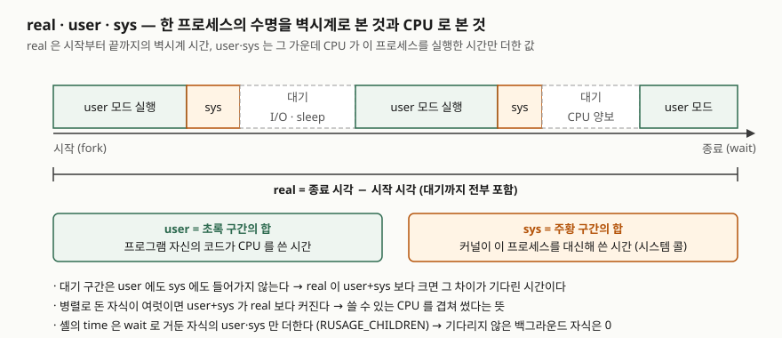

## 들어가며

야간 배치가 느려졌다는 말을 듣고 명령 앞에 `time`을 붙여 돌린다. `real 40s`. 여기서 많은 사람이
"CPU가 모자라다"고 결론을 내고 코어를 늘려 달라고 하거나, 코드에서 반복문을 찾아 최적화를 시작한다.
그런데 같은 출력의 다음 두 줄이 `user 1.8s`, `sys 0.3s`였다면 그 40초 가운데 38초는 **CPU가 이 작업을
돌리지 않은 시간**이다. 디스크나 네트워크를 기다렸거나, 락을 기다렸거나, 다른 프로세스에 CPU를 내줬다.
코어를 두 배로 늘려도 이 배치는 빨라지지 않는다. 세 숫자의 관계를 읽을 줄 알면 어디부터 볼지가 정해진다.

## 개념

리눅스 매뉴얼 time(7)은 세 시간을 이렇게 나눈다. **실제 시간**(real)은 어느 시점부터 흐른 벽시계 시간이고,
프로세스에 대해서는 시작부터 끝까지의 경과 시간이다. **프로세스 시간**은 그 프로세스가 쓴 CPU 시간이고,
둘로 나뉜다. **user**는 사용자 모드에서 프로그램 자신의 코드를 실행한 시간, **sys**는 커널이 그 프로세스를
대신해 시스템 모드에서 실행한 시간이다. 시스템 콜을 처리하는 시간이 여기 들어간다.

bash의 `time`은 명령이 아니라 **예약어**(reserved word)다. `type time`이 `shell keyword`라고 답한다.
파이프라인 앞에 붙으면 파이프라인이 끝났을 때 통계를 찍고, 예약어라서 외부 명령으로는 못 재는
**셸 내장 명령·함수·파이프라인 전체**를 잴 수 있다. POSIX가 정한 `time` 유틸리티는 따로 있고 `-p` 하나만
가진다. GNU `time`(`/usr/bin/time`)은 `-v`로 최대 메모리까지 찍지만 이 환경에는 없어서 실행 검증 없이
이름만 적는다.

이 글은 **Git Bash**(Windows 11)에서 돌렸다. bash 5.3.9와 coreutils 8.32는 리눅스와 같은 GNU 판이고,
시간 집계는 Cygwin 런타임 3.6.7이 POSIX의 `getrusage`를 흉내 낸다. 아래 13번에서 보듯 **그 흉내가 닿지
않는 프로그램**이 있으므로, 리눅스 커널에서 직접 확인한 결과는 아니라는 점을 감안해 읽는다.

## 구조



> **출처**: [time(7) — DESCRIPTION](https://man7.org/linux/man-pages/man7/time.7.html#DESCRIPTION)(real·process time·user·system CPU time 정의),
> [getrusage(2) — DESCRIPTION](https://man7.org/linux/man-pages/man2/getrusage.2.html#DESCRIPTION)(`RUSAGE_CHILDREN`은 종료되어 `wait`된 자식만),
> [Bash Reference Manual §3.2.3 Pipelines](https://tiswww.case.edu/php/chet/bash/bashref.html#Pipelines)(예약어 `time`이 파이프라인을 잰다). 구간의 길이는 설명용이고 실측값이 아니다.

## 동작 원리

커널은 프로세스가 CPU를 쓸 때마다 **지금 사용자 모드인지 커널 모드인지**에 따라 두 누적값 중 하나를
늘린다. 프로세스가 잠들거나 I/O를 기다리거나 다른 프로세스에 밀려난 동안에는 둘 다 늘지 않는다.
이 누적값을 `getrusage(2)`가 `ru_utime`·`ru_stime`으로 돌려준다.

셸의 `time`은 명령을 시작하기 직전과 끝난 직후의 벽시계를 빼서 **real**을 만들고, 같은 두 시점에서
`RUSAGE_CHILDREN` 값을 빼서 **user·sys**를 만든다. 여기에 함정이 하나 있다. 매뉴얼은 `RUSAGE_CHILDREN`이
**종료되어 `wait`로 거둔 자식**의 사용량만 돌려준다고 적는다. 자식이 끝나면 커널이 그 자식의 누적값을
부모 몫으로 넘기는데, 그 전달이 `wait` 호출에서 일어난다. 그래서 백그라운드로 띄우고 기다리지 않은 작업은
`time`에 0으로 잡힌다(실습 5번). 리눅스 2.6.9 이전에는 기다리지 않아도 더해졌는데, 그것이 POSIX에 어긋나
고쳐졌다.

세 값의 관계는 이렇게 읽는다.

| 관계 | 뜻 | 먼저 볼 곳 |
|---|---|---|
| real ≈ user + sys | CPU가 내내 이 작업을 돌렸다 | 알고리즘, CPU |
| real ≫ user + sys | 대부분 기다렸다 | 디스크·네트워크·락·`sleep` |
| user + sys > real | 여러 CPU에서 겹쳐 돌았다 | 코어 수, 병렬 정도 |
| sys가 user에 가깝거나 더 크다 | 시스템 콜이 많다 | 버퍼 크기, 호출 횟수 |

## 실습 예제

전체 소스: [`code/time_demo.sh`](code/time_demo.sh), 실행 기록: [`code/output.txt`](code/output.txt).
스크립트가 200MB짜리 0으로 채운 파일을 만들고, 그 파일을 재료로 네 종류의 작업을 잰다. `time`의 출력은
stderr로 가므로 기록 파일에서 제자리에 보이도록 `exec 2>&1`로 합쳤다.

### 네 종류의 작업

```text
==== 1. CPU 계산 — sha256sum ====
real	0m0.580s   user	0m0.453s   sys	0m0.109s
==== 2. 잠들기 — sleep 1.5 ====
real	0m1.546s   user	0m0.015s   sys	0m0.015s
==== 3-A. dd bs=512 — 같은 200MB 를 작은 블록으로 ====
real	0m0.496s   user	0m0.046s   sys	0m0.437s
==== 3-B. dd bs=4M ====
real	0m0.072s   user	0m0.030s   sys	0m0.031s
==== 4. 병렬 두 프로세스 ====
real	0m0.598s   user	0m0.983s   sys	0m0.217s
```

(기록 파일에는 세 줄로 찍혀 있고 여기서는 한 줄로 모았다.)

해시 계산은 user가 real의 78%다. `sleep`은 1.5초가 흘렀지만 CPU는 0.03초만 썼다. 같은 200MB를 읽고 쓰는
`dd`는 블록 크기만 바꿨는데 sys가 **0.437초에서 0.031초**로 줄었다. 512바이트 블록이면 읽기·쓰기 시스템
콜이 약 82만 번이고, 4MB 블록이면 100번이다. 일한 양은 같고 **커널에 들락거린 횟수**가 달랐다.
병렬 두 프로세스는 real 0.598초에 user 0.983초다. user가 real보다 크면 CPU를 여러 개 겹쳐 썼다는 뜻이다.

### 기다리지 않은 자식

```text
==== 5. 기다리지 않은 백그라운드 자식은 집계에 없다 ====
real	0m0.016s   user	0m0.000s   sys	0m0.000s
```

`time { sha256sum big.bin & }`은 0.016초 만에 끝났다. 해시는 뒤에서 0.5초 동안 돌았지만 `time` 블록이
`wait`하지 않았으므로 셸이 거두기 전이고, user·sys에 더해질 길이 없다.

### 출력 형식 — -p와 TIMEFORMAT

bash `time`의 옵션은 `-p` 하나다. 나머지는 변수 `TIMEFORMAT`으로 정한다.

| 지시자 | 뜻 | 실행 결과 |
|---|---|---|
| `-p` | POSIX 형식. `real 0.33` / `user 0.02` / `sys 0.02` 세 줄, 초 단위 소수 | 6-A |
| `%R` | 경과 시간(real) | `real 0.534` |
| `%U` | user CPU 시간 | `user 0.483` |
| `%S` | sys CPU 시간 | `sys 0.046` |
| `%P` | CPU 점유율 `(user+sys)/real` | `cpu 99.00%` |
| `%[p]` | 소수 자릿수 0~3. 기본 3 | `%0R`→`0`, `%1R`→`0.3`, `%3R`→`0.282` |
| `%[l]` | 긴 형식 `MMmSS.FFFs` | `%lR`→`0m0.282s` |
| `%%` | 퍼센트 기호 그대로 | `%R -> 0.133` |

기본값은 `$'\nreal\t%3lR\nuser\t%3lU\nsys\t%3lS'`다. 매뉴얼은 **변수가 비어 있으면 줄 바꿈만 찍는다**고
적고, 실제로 `TIMEFORMAT=''`을 두고 재자 빈 줄 하나만 나왔다(6-B 마지막). 측정은 하되 화면에는 안 보이고
싶을 때 쓸 수 있다.

### 파이프라인, 함수, 종료 코드, stderr

```text
==== 7. 파이프라인 전체를 잰다 ====
   time sleep 0.5 | sleep 1.2     → real 0m1.248s
==== 8. for 루프 ====
   time for ((i = 0; i < 200000; i++)); do :; done → real 0.602  user 0.578  sys 0.016
==== 9. 종료 코드 ====
   time false → false 의 종료 코드: 1
==== 12. POSIX 모드 ====
   bash --posix -c 'time -p sleep 0.1' → bash: line 1: time: command not found  rc=127
```

파이프라인은 **긴 쪽이 끝날 때까지**가 real이다(7번). 셸 `for` 루프 20만 번은 외부 프로그램을 하나도 띄우지
않았는데 user 0.578초가 찍혔다(8번). 이때의 user는 **bash 자신**의 CPU 시간이다. 외부 `time` 명령이라면
`for`를 인자로 받을 수 없으니 이것은 예약어만 할 수 있는 일이다. 종료 코드는 잰 명령의 것이 그대로
남는다(9번). 출력은 **셸의 stderr**로 가므로 파일에 담으려면 `{ time cmd; } 2> file`처럼 묶는다(10번).
`time cmd 2> file`은 `cmd`의 stderr만 보낸다.

POSIX 모드에서는 매뉴얼대로 다음 토큰이 `-`로 시작하면 `time`을 예약어로 보지 않는다. 그래서
`bash --posix`에서 `time -p sleep`은 **외부 명령 `time`을 찾다가 127**로 끝났다(12번). 이 환경에
`/usr/bin/time`이 없어서다. 같은 모드에서 `time sleep`은 정상이다.

`times` 내장은 인자 없이 **셸 자신**의 user·sys와 **자식들의 누적** user·sys를 두 줄로 찍는다(11번).
스크립트 끝에 두면 그때까지 띄운 모든 자식의 CPU 시간 합이 나온다.

### 예상과 달랐던 결과 — Git Bash에서 python.exe의 CPU 시간은 0이다

```text
==== 13. 네이티브 윈도우 프로그램(python.exe) ====
real	0m1.429s   user	0m0.016s   sys	0m0.015s
```

파이썬으로 2천만 번 더하는 순수 CPU 작업이 1.4초 돌았는데 user가 **0.016초**다. 처음 짠 스크립트는
모든 작업을 파이썬으로 만들었고, 네 작업이 전부 user 0으로 나와 글을 쓸 수 없었다. 작업을 coreutils로
바꾸자 위의 1~4번처럼 정상으로 잡혔다. `sha256sum`·`dd`는 Cygwin 런타임 위에서 도는 프로그램이라
`getrusage` 흉내가 닿고, `python.exe`는 네이티브 윈도우 프로그램이라 닿지 않는 것으로 보인다. 어느
문서에서도 이 동작을 확인하지 못했으므로 관찰로만 적는다. Git Bash에서 `time`으로 윈도우 프로그램을
재면 real만 믿을 수 있다.

## 실무에서 주의할 점

- **real만 보고 CPU를 늘리지 않는다.** real이 user+sys보다 훨씬 크면 기다린 것이다(2번). 디스크·네트워크·
  락·외부 API 응답을 본다. 코어를 더 사도 그 시간은 줄지 않는다.
- **sys가 크면 호출 횟수를 의심한다.** 같은 양을 처리해도 작은 단위로 자주 부르면 sys가 커진다(3-A·3-B).
  버퍼 크기, 배치 크기, 로그를 한 줄마다 `fsync`하는 설정 같은 곳이 후보다.
- **백그라운드 작업은 `wait`한 뒤 재야 집계된다.** `time`이 거두지 않은 자식은 0이다(5번). 병렬 작업의
  CPU 사용량을 보려면 `time { a & b & wait; }`처럼 블록 안에서 `wait`한다(4번).
- **스크립트 안의 `time` 출력은 stderr다.** 로그 파일에 담을 때 `{ time …; } 2>> log`로 묶지 않으면 화면에
  흩어진다(10번). `TIMEFORMAT`으로 한 줄 형식을 만들어 두면 뒤에서 `grep`하기 쉽다.
- **POSIX 모드나 `sh`에서는 `time -p`가 다르게 동작한다.** 외부 `time`이 있으면 그것이 돌고, 없으면
  127이다(12번). 이식성이 필요한 스크립트에서는 외부 `time`의 유무를 먼저 확인한다.
- **한 번 잰 값으로 결론 내지 않는다.** 두 번째 실행은 파일이 캐시에 있어 real이 줄어든다. 이 글의 3-B가
  0.072초인 데는 3-A가 같은 파일을 방금 읽은 영향이 있다. 비교할 때는 같은 조건으로 여러 번 돌린다.

## 정리

- real은 벽시계, user는 프로그램 코드의 CPU 시간, sys는 커널이 대신 쓴 CPU 시간이다. 기다린 시간은 어디에도 없다.
- real ≫ user+sys면 대기, user+sys > real이면 병렬, sys가 크면 시스템 콜 과다다. `dd`의 블록 크기 하나로 sys가 14배 갈렸다.
- bash `time`은 예약어라 파이프라인·함수·내장도 잰다. 옵션은 `-p`뿐이고 형식은 `TIMEFORMAT`의 `%R %U %S %P`로 정한다.
- 기다리지 않은 자식은 0으로 집계된다. Git Bash에서는 네이티브 윈도우 프로그램의 user·sys가 0으로 나온다.

## 참고 자료

- [Bash Reference Manual §3.2.3 Pipelines](https://tiswww.case.edu/php/chet/bash/bashref.html#Pipelines) — 예약어 `time`, `-p`, POSIX 모드에서의 처리
- [Bash Reference Manual §5.2 Bash Variables — TIMEFORMAT](https://tiswww.case.edu/php/chet/bash/bashref.html#Bash-Variables) — 지시자 `%R %U %S %P`, `[p]`·`[l]`, 기본값, 빈 값
- [Bash Reference Manual §4.1 Bourne Shell Builtins — times](https://tiswww.case.edu/php/chet/bash/bashref.html#Bourne-Shell-Builtins)
- [The Open Group Base Specifications Issue 7 — time](https://pubs.opengroup.org/onlinepubs/9699919799/utilities/time.html) — `-p`와 stderr 형식 `real %f`
- [time(7) — overview of time and timers](https://man7.org/linux/man-pages/man7/time.7.html) — real·user·system CPU time 정의
- [getrusage(2)](https://man7.org/linux/man-pages/man2/getrusage.2.html) — `RUSAGE_CHILDREN`은 `wait`로 거둔 자식만, 2.6.9 이전과의 차이
- [time(1) — GNU time](https://man7.org/linux/man-pages/man1/time.1.html) — `-v`, `-f` (이 환경에 없어 실행 검증 없음)
