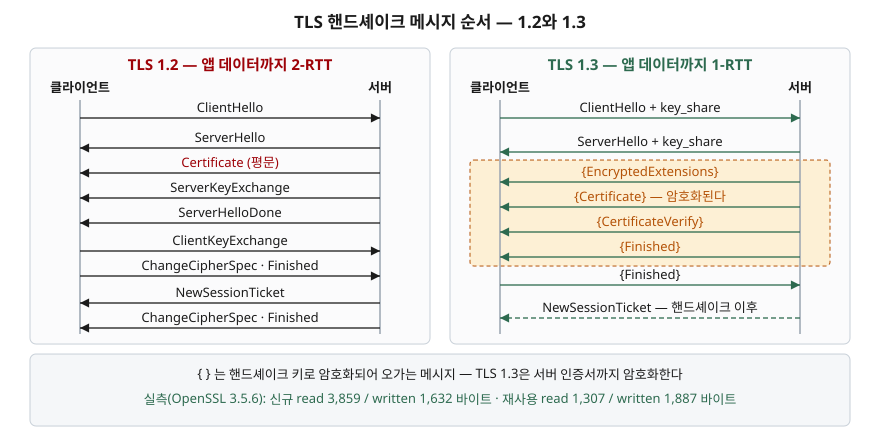

## 들어가며

HTTPS 붙이는 일은 보통 인증서 파일을 두고 설정 두 줄을 쓰면 끝난다. 그런데 어느 날
"이 서버가 TLS 1.2로도 붙나", "왜 이 클라이언트만 핸드셰이크에서 끊기나" 같은 질문이 온다.

이때 대부분은 브라우저 주소창의 자물쇠를 눌러 본다. 거기서는 "TLS 1.3, AES-256-GCM"
정도만 나오고, 정작 궁금한 "어떤 순서로 무엇이 오갔는지"는 안 나온다. 그다음 수순은
서버 설정 파일을 고쳐 가며 재시작하고 브라우저로 다시 붙어 보기다. 프로토콜 옵션이
대여섯 개면 재시작을 대여섯 번 하게 되고, 그래도 어느 단계에서 어긋났는지는 모른 채
"되네/안 되네"만 남는다.

`openssl s_client` 한 줄이면 오간 메시지를 그대로 볼 수 있다. 서버를 건드리지 않고
클라이언트 쪽 조건만 바꿔 가며 확인하는 방법이다.

## 개념

`openssl s_client`는 TLS 클라이언트다. 브라우저가 하는 일을 하지만
**협상 과정을 전부 출력한다.** 가장 짧은 형태는 이렇다.

```bash
echo | openssl s_client -connect www.iana.org:443 -servername www.iana.org -brief
```

- `echo |` — 표준 입력을 즉시 닫아 핸드셰이크만 하고 빠진다. 없으면 대화형으로 멈춰 있는다
- `-connect` — 붙을 호스트와 포트
- `-servername` — SNI(Server Name Indication). 한 IP에 여러 인증서가 있는 요즘
  환경에서는 이걸 빼면 엉뚱한 인증서가 온다
- `-brief` — 협상 결과만 요약. 인증서 본문(PEM)을 찍지 않는다

```
Protocol version: TLSv1.3
Ciphersuite: TLS_AES_256_GCM_SHA384
Peer certificate: CN=www.iana.org
Verification: OK
Negotiated TLS1.3 group: X25519MLKEM768
```

`Verification: OK`가 핵심이다. 로컬 신뢰 저장소로 체인 검증이 통과했다는 뜻이고,
여기가 깨지면 앞의 세 줄이 아무리 좋아도 브라우저는 경고를 띄운다.

## 구조



> **출처**: TLS 1.3 메시지 순서와 `{ }` 표기(핸드셰이크 키로 암호화됨)는
> [RFC 8446 §2 Protocol Overview, Figure 1: Message Flow for Full TLS Handshake](https://www.rfc-editor.org/rfc/rfc8446.html#section-2),
> TLS 1.2 순서는 [RFC 5246 §7.3 Handshake Protocol Overview, Figure 1](https://www.rfc-editor.org/rfc/rfc5246.html#section-7.3)이다.
> 그림에 그린 메시지 목록과 순서는 아래 실습의 `-msg` 출력과 대조해 일치를 확인했다.
> 바이트 수는 이 글에서 직접 측정한 값이다.

두 버전의 차이는 두 군데다. 첫째, **왕복 횟수**다. TLS 1.2는 서버가
`ServerHelloDone`까지 보낸 뒤 클라이언트의 `ClientKeyExchange`를 받아야 키가 정해진다.
TLS 1.3은 `ClientHello`에 키 교환 재료(`key_share`)를 미리 실어 보내므로 한 번의 왕복으로
끝난다. 둘째, **인증서가 암호화되는지**다. TLS 1.2는 서버 인증서를 평문으로 보내
중간에서 누가 어디에 붙는지 볼 수 있지만, TLS 1.3은 `ServerHello` 직후부터 암호화하므로
`Certificate`가 `{ }` 안에 들어간다.

## 동작 원리

`-msg`를 붙이면 오간 핸드셰이크 메시지가 그대로 나온다.

```bash
echo | openssl s_client -connect www.iana.org:443 -servername www.iana.org -msg 2>&1 |
  grep -E '^(>>>|<<<).*(Hello|Certificate|Finished|EncryptedExtensions)'
```

```
>>> TLS 1.3, Handshake [length 060b], ClientHello
<<< TLS 1.3, Handshake [length 04ba], ServerHello
<<< TLS 1.3, Handshake [length 000a], EncryptedExtensions
<<< TLS 1.3, Handshake [length 09ab], Certificate
<<< TLS 1.3, Handshake [length 004f], CertificateVerify
<<< TLS 1.3, Handshake [length 0034], Finished
>>> TLS 1.3, Handshake [length 0034], Finished
```

`>>>`가 보낸 것, `<<<`가 받은 것이다. `length`는 16진수다.
RFC 8446 Figure 1의 순서와 정확히 같다. `-tls1_2`를 붙이면
`ServerKeyExchange` · `ServerHelloDone` · `ClientKeyExchange`가 등장하는 옛 흐름으로 바뀐다.

여기서 눈에 걸리는 것이 `ClientHello`의 크기다. `0x060b`는 1,547바이트다.
`ServerHello`(1,210바이트)보다 크고, TLS 1.2로 내리면 같은 `ClientHello`가 207바이트다.
왜 이렇게 큰지 키 교환 그룹을 바꿔 가며 재 봤다.

```
X25519MLKEM768   ClientHello 0x05d1 = 1489 바이트
X25519           ClientHello 0x0139 = 313 바이트
P-256            ClientHello 0x015a = 346 바이트
```

기본 협상에서 잡힌 `X25519MLKEM768`은 X25519와 **ML-KEM-768을 합친 하이브리드 그룹**이다.
양자 컴퓨터에 대비한 키 교환이 이미 기본값으로 동작하고 있고, 그 대가가
ClientHello 한 개에 **약 1,176바이트**로 눈에 보인다. 핸드셰이크 전체로는
받는 바이트 2,772 → 3,857, 보내는 바이트 398 → 1,574로 늘었다.

## 실습 예제

전체 조사 스크립트: [`code/handshake_probe.sh`](code/handshake_probe.sh)

인증서 체인은 이렇게 본다.

```bash
echo | openssl s_client -connect www.iana.org:443 -servername www.iana.org 2>&1 |
  sed -n '/Certificate chain/,/^---/p' | grep -E '^ [0-9] s:|^   i:|^   v:'
```

```
 0 s:CN=www.iana.org
   i:C=US, O=Google Trust Services, CN=WE1
   v:NotBefore: Aug 21 20:51:32 2026 GMT; NotAfter: Nov 19 21:51:30 2026 GMT
 1 s:C=US, O=Google Trust Services, CN=WE1
   i:C=US, O=Google Trust Services LLC, CN=GTS Root R4
   v:NotBefore: Dec 13 09:00:00 2023 GMT; NotAfter: Feb 20 14:00:00 2029 GMT
 2 s:C=US, O=Google Trust Services LLC, CN=GTS Root R4
   i:C=BE, O=GlobalSign nv-sa, OU=Root CA, CN=GlobalSign Root CA
   v:NotBefore: Nov 15 03:43:21 2023 GMT; NotAfter: Jan 28 00:00:42 2028 GMT
```

`s:`가 주체, `i:`가 발급자다. 0번의 발급자가 1번의 주체이고, 1번의 발급자가 2번의 주체다.
맨 위 2번은 루트인데 발급자가 **다른 CA**(GlobalSign Root CA)로 되어 있다.
교차 서명(cross-signing)이다. 구형 클라이언트가 새 루트를 아직 모를 때 오래된 루트로
이어 붙여 검증되게 하는 장치다. 서버가 체인을 어디까지 보내는지에 따라
"우리 서버는 되는데 특정 기기만 안 된다"가 갈린다.

### 세션 재사용은 바이트를 줄여 주기만 하지 않는다

TLS 1.3의 세션 티켓은 **핸드셰이크가 끝난 뒤에** 온다. 그래서 `echo |`로 곧바로
끊으면 티켓을 받지 못한다. `-sess_out`을 붙여도 파일이 안 생긴다.
요청을 보내고 연결을 몇 초 유지해야 티켓이 도착한다.

```
티켓 저장됨: 1786 바이트
-- 티켓 없이 새로 접속
SSL handshake has read 3859 bytes and written 1632 bytes
New, TLSv1.3, Cipher is TLS_AES_256_GCM_SHA384
-- 저장한 티켓으로 재접속
SSL handshake has read 1307 bytes and written 1887 bytes
Reused, TLSv1.3, Cipher is TLS_AES_256_GCM_SHA384
```

받는 바이트는 3,859 → 1,307로 줄었다. 인증서 체인을 다시 안 받기 때문이다.
그런데 **보내는 바이트는 1,632 → 1,887로 늘었다.** 티켓이 `ClientHello`에 실려 나가서다.
"세션 재사용은 트래픽을 줄인다"고만 알고 있으면 이 방향은 예상 밖이다.
업링크가 좁은 회선이나 요금이 상행 트래픽에 붙는 환경에서는 이 증가가 의미를 가진다.

## 실무에서 주의할 점

- **`-servername`을 빼면 조사 자체가 틀어진다.** SNI 없이 붙으면 공유 IP에서
  기본 인증서가 오므로 "인증서가 잘못 깔렸다"는 오진을 하게 된다.
- **`-brief` 없이 돌리면 인증서 PEM이 화면을 덮는다.** 결과만 볼 때는 `-brief`,
  체인을 볼 때는 `sed`로 구간을 자른다.
- **바이트 수는 실행마다 몇 바이트씩 달라진다.** 티켓 길이와 확장 필드가 매번 같지 않다.
  절대값보다 조건을 바꿨을 때의 **차이**를 본다.
- **양자내성 하이브리드는 이미 기본값이다.** ClientHello가 1,400바이트를 넘으면
  MTU가 작은 경로나 ClientHello 크기를 제한하는 구형 미들박스에서 걸릴 수 있다.
  그런 의심이 들면 `-groups X25519`로 좁혀 붙여 보고 결과가 갈리는지 확인한다.
- **`Verification: OK`만 보고 끝내지 않는다.** `-servername`, 시스템 시각,
  신뢰 저장소가 조사하는 장비 기준이라 실제 클라이언트와 다를 수 있다.

## 정리

- `openssl s_client -connect ... -servername ... -brief`로 서버를 건드리지 않고 협상 결과를 본다.
- `-msg`는 오간 핸드셰이크 메시지를 순서대로 찍는다. RFC 8446 Figure 1과 대조해 읽으면 된다.
- TLS 1.3은 1-RTT이고 서버 인증서까지 암호화한다. TLS 1.2는 2-RTT이고 인증서가 평문이다.
- 기본 협상에서 X25519MLKEM768이 잡히면서 ClientHello가 313 → 1,489바이트로 커졌다.
- 세션 재사용은 받는 바이트를 3,859 → 1,307로 줄이는 대신 보내는 바이트를 1,632 → 1,887로 늘렸다.

## 참고 자료

- [RFC 8446 — The Transport Layer Security (TLS) Protocol Version 1.3, §2 Protocol Overview](https://www.rfc-editor.org/rfc/rfc8446.html#section-2)
- [RFC 5246 — The TLS Protocol Version 1.2, §7.3 Handshake Protocol Overview](https://www.rfc-editor.org/rfc/rfc5246.html#section-7.3)
- [RFC 8446 §4.6.1 New Session Ticket Message](https://www.rfc-editor.org/rfc/rfc8446.html#section-4.6.1)
- [RFC 6066 — TLS Extensions: Extension Definitions, §3 Server Name Indication](https://www.rfc-editor.org/rfc/rfc6066.html#section-3)
- [OpenSSL — openssl-s_client(1) 매뉴얼](https://docs.openssl.org/master/man1/openssl-s_client/)
