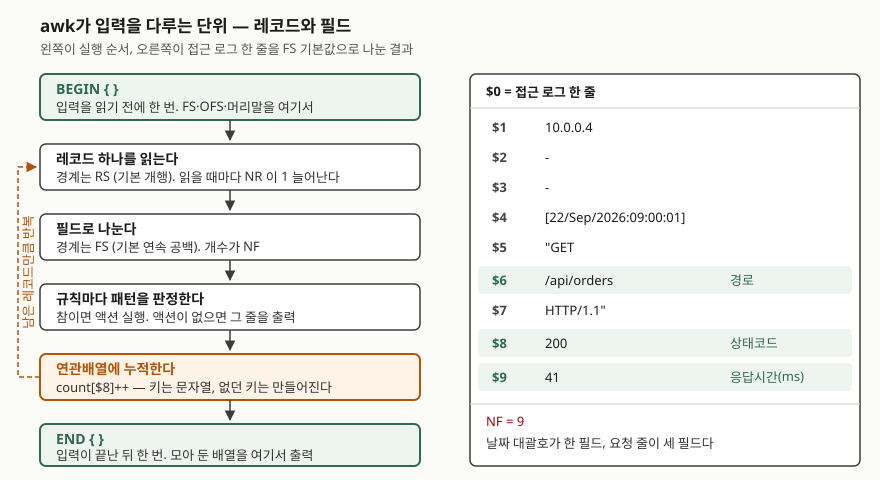

## 들어가며

장애 보고서에 "어제 5xx가 몇 건이었나"를 적어야 한다. `grep ' 500 ' access.log | wc -l`로
한 건씩 세어 보다가, 상태코드가 500만 있는 게 아니라는 걸 깨닫고 503도 세고 502도 센다.
경로별로도 나눠 달라는 말이 붙으면 `grep`을 경로 수만큼 더 돌린다.

여기서 대부분 결과를 엑셀에 옮겨 붙이기 시작한다. **상태코드 5종 × 경로 3종이면 명령을
15번 치고 15개의 숫자를 손으로 옮긴다.** 다음 날 같은 보고서를 또 쓰면 15번을 다시 친다.
그런데 로그 파일은 이미 줄과 칸으로 된 표다. 표를 표로 다루는 도구가 `awk`다.

## 개념

`awk`는 **입력을 레코드로 끊고, 레코드를 필드로 나눈 뒤, 규칙 목록을 레코드마다 적용하는**
언어다. 규칙은 `패턴 { 액션 }` 꼴이고 둘 중 하나는 생략할 수 있다.

- 패턴만 적으면 — 맞는 레코드를 **그대로 출력한다** (`awk '$8 >= 500'`)
- 액션만 적으면 — 모든 레코드에 **액션을 실행한다** (`awk '{print $1}'`)

`grep`과 갈리는 지점이 두 개다. 첫째, **칸 단위로 조건을 건다.** "여덟 번째 칸이 500 이상"은
`grep`으로 쓸 수 없다. 둘째, **줄을 넘어 값을 들고 간다.** 변수와 연관배열이 레코드 사이에
살아 있어서 세고 더하는 일이 한 번에 끝난다.

## 구조



> **출처**: 단계와 변수의 의미는 POSIX 표준
> [The Open Group Base Specifications Issue 8 — awk](https://pubs.opengroup.org/onlinepubs/9799919799/utilities/awk.html)
> 를 따랐다. 표준은 입력이 레코드의 나열로 해석되며 기본 레코드는 개행을 제외한 한 줄이라고
> 적고, 기본 필드는 공백·개행이 아닌 문자들의 문자열이라고 적는다. `NR`은 입력 시작부터의
> 레코드 순번, `NF`는 현재 레코드의 필드 수로 정의된다. 오른쪽 필드 분해 결과(`NF = 9`)는
> 아래 실습에서 나온 실제 출력이다.

## 동작 원리

도식의 흐름에서 실무 사고가 나는 자리는 **두 번째 칸**, 필드 분리다.

기본 `FS`는 연속된 공백이다. 접근 로그 한 줄을 이 기준으로 나누면 날짜 대괄호가 한 필드,
따옴표로 감싼 요청 줄이 세 필드(`"GET`, `/api/orders`, `HTTP/1.1"`)로 쪼개진다.
**따옴표는 awk에게 아무 의미가 없다.** 그래서 상태코드는 사람이 세는 대로 `$7`이 아니라
`$8`이다. 이걸 확인하지 않고 쓰면 응답시간을 상태코드로 세는 표가 나온다.

그다음이 비교다. POSIX는 **양쪽이 모두 숫자이거나, 한쪽이 숫자이고 다른 쪽이 숫자 꼴의
문자열일 때** 숫자로 비교한다고 정한다. 뒤집으면 **한쪽이 숫자 꼴이 아니면 문자열로
비교한다.** 로그 한 줄이 깨져 숫자 자리에 글자가 들어오면 `$3 > 100`이 조용히 참이 된다.
에러도 경고도 없다.

누적은 연관배열이 맡는다. 키는 문자열이고, 없던 키는 참조하는 순간 만들어진다.
그래서 `count[$8]++` 한 줄로 집계가 끝난다. 다만 `for (k in arr)`의 **순회 순서는 표준이
정하지 않는다.** 정렬이 필요하면 `sort`에 넘기거나 볼 키를 직접 훑는다.

## 실습 예제

10줄짜리 접근 로그와 빈 줄이 섞인 CSV를 스크립트가 만들어 돌렸다. 전체 소스:
[`code/awk_aggregate.sh`](code/awk_aggregate.sh), 실행 기록: [`code/output.txt`](code/output.txt)

### 옵션은 네 갈래로 묶인다

`awk --help`가 내놓는 목록을 하는 일로 묶었다. 이 글에서 실제로 돌려 본 것에 표시를 붙였다.

| 갈래 | 옵션 | 하는 일 |
|---|---|---|
| **프로그램을 어디서 읽는가** | `-f 파일` / `--file` | 프로그램을 파일에서 (돌려 봄) |
| | `-e '프로그램'` / `--source` | 명령줄 프로그램을 명시적으로 (`-f`와 섞을 때) |
| | `-E 파일` / `--exec` | `-f`와 같지만 뒤에 오는 인자를 옵션으로 읽지 않음 |
| | `-i 파일` / `--include` | 라이브러리 소스를 불러옴 |
| | `-l 라이브러리` / `--load` | 공유 라이브러리 확장을 불러옴 |
| **입력을 어떻게 나누는가** | `-F fs` / `--field-separator` | `FS`를 정함 (돌려 봄) |
| | `-k` / `--csv` | 따옴표를 존중하는 CSV 분리 (돌려 봄) |
| | `-b` / `--characters-as-bytes` | 멀티바이트를 바이트로 취급 |
| | `-n` / `--non-decimal-data` | `0x1f` 같은 표기를 숫자로 읽음 |
| | `-N` / `--use-lc-numeric` | 소수점을 로케일 기준으로 |
| **값을 어떻게 넘기는가** | `-v 변수=값` / `--assign` | 프로그램 시작 전에 변수를 설정 (돌려 봄) |
| **어느 문법으로 읽는가** | `-P` / `--posix` | POSIX만. gawk 확장을 막음 (돌려 봄) |
| | `-c` / `--traditional` | 원래 awk 문법만 |
| | `-r` / `--re-interval` | `{n,m}` 반복 표기를 켬 |
| | `-M` / `--bignum` | 임의 정밀도 정수·부동소수 |
| **무엇을 더 하는가** | `-S` / `--sandbox` | 파일 쓰기·`system()`·리다이렉션 금지 |
| | `-L` / `--lint` | 의심스러운 구문을 경고 |
| | `-o` / `--pretty-print` | 프로그램을 정렬해 출력 |
| | `-p` / `--profile` | 실행 횟수를 붙여 출력 |
| | `-d` / `--dump-variables` | 전역 변수 목록을 덤프 |
| | `-D` / `--debug` | 디버거로 실행 |
| | `-O` / `--optimize`, `-s` / `--no-optimize` | 최적화를 켬 / 끔 |

`-F`·`-v`·`-f` 셋은 POSIX 표준 옵션이고 나머지는 gawk 확장이다. 이식이 필요한 스크립트는
이 셋 안에서 쓴다.

### 필드 번호를 먼저 확인한다

```text
$ awk 'NR==1 {for (i = 1; i <= NF; i++) printf "%d:%s\n", i, $i}' access.log
1:10.0.0.4
2:-
3:-
4:[22/Sep/2026:09:00:01]
5:"GET
6:/api/orders
7:HTTP/1.1"
8:200
9:41
```

`awk`를 쓰기 전에 항상 이걸 먼저 친다. **눈으로 센 칸 번호와 `awk`가 세는 번호는 다르다.**
여기서는 상태코드가 `$8`, 응답시간이 `$9`, 경로가 `$6`이다.

### 집계는 연관배열 한 줄이다

```text
$ awk '{count[$8]++} END {for (code in count) print code, count[code]}' access.log
200 5
201 2
404 1
500 1
503 1
```

`grep`을 다섯 번 돌려 얻을 것을 한 번에 얻는다. 키를 둘로 늘리면 표가 된다.

```text
$ awk '{n[$6]++; sum[$6]+=$9} END {for (p in n) printf "%-14s %3d %7d %9.1f\n", p, n[p], sum[p], sum[p]/n[p]}' access.log | sort
/api/orders      6    5268     878.0
/api/stock       2    3019    1509.5
/healthz         2       4       2.0
```

`/api/stock`은 2건인데 평균이 1509.5ms다. 3001ms짜리 한 건이 평균을 끌어올렸다.
**평균만 보면 두 경로가 다 느려 보이지만 실제로 느린 것은 각각 한 건씩이다.**
건수와 합계를 같이 찍어야 이게 보인다.

### --csv는 따옴표 안의 쉼표를 존중한다

값에 쉼표가 들어간 CSV 한 줄(`"orders,legacy",busan,39`)을 두 방식으로 나눴다.

```text
$ awk -F, 'NR==3 {print NF; print $1}' latency.csv
4
"orders
$ awk --csv 'NR==3 {print NF; print $1}' latency.csv
3
orders,legacy
```

`-F,`는 따옴표를 모르므로 필드가 하나 더 생기고 `$1`이 잘린다. **뒤쪽 필드 번호가
한 칸씩 밀리므로 그 줄만 다른 값을 세게 된다.** CSV를 다룰 때는 `--csv`를 쓴다.
gawk 5.3.0에서 들어온 옵션이라 그 이전 버전에서는 쓸 수 없다.

### 숫자 비교가 조용히 문자열 비교로 바뀐다

같은 CSV에서 `latency_ms` 자리에 글자가 들어간 줄이 섞이면 이렇게 된다.

```text
$ awk -F, 'NR>1 && NF && $3 > 100 {print $3}' latency.csv
busan
5002
3001
```

`busan`이 100보다 크다고 나왔다. `-F,`가 필드를 밀어 `$3`에 지역명이 들어왔고,
한쪽이 숫자 꼴이 아니므로 **문자열 비교로 바뀌어** `"busan" > "100"`이 참이 된 것이다.
명시적으로 문자열 비교를 시키면 숫자들도 전부 통과한다.

```text
$ awk -F, 'NR>1 && NF && $3 "" > "100" {print $3}' latency.csv
41
busan
18
5002
3001
2
```

`"41" > "100"`이 참이다. 첫 글자 `4`가 `1`보다 크기 때문이다. **숫자를 다룰 때는
`$3+0`으로 강제하거나 입력이 숫자인지 먼저 거른다.**

### 빈 줄도 레코드다

```text
$ awk 'END {print NR}' latency.csv   →  8
$ awk 'NF {c++} END {print c}' latency.csv →  7
```

파일 중간의 빈 줄이 `NR`에 들어간다. `NF`를 패턴으로 쓰면 필드가 0개인 줄이 빠진다.
**`NF`만 적어 놓은 이 패턴이 빈 줄을 거르는 관용 표현이다.**

### 출력 모양과 종료 코드

```text
$ awk -v OFS=, '{print $1, $8}' access.log | head -3
10.0.0.4,200
10.0.0.7,200
10.0.0.4,500

$ awk -v OFS=, 'NR==1 {$1 = $1; print}' access.log
10.0.0.4,-,-,[22/Sep/2026:09:00:01],"GET,/api/orders,HTTP/1.1",200,41
```

`print a, b`의 쉼표 자리에 `OFS`가 들어간다. 그런데 `$0`을 그냥 출력하면 `OFS`가 안 먹는다.
`$1 = $1`처럼 필드에 대입해야 `$0`이 `OFS`로 다시 조립된다. 관용 표현이지만 처음 보면
아무 일도 안 하는 줄로 보인다.

```text
$ awk '$8 >= 500 {found=1} END {exit !found}' access.log  →  종료 코드 0
$ awk '$8 >= 900 {found=1} END {exit !found}' access.log  →  종료 코드 1
```

`exit`에 준 값이 종료 코드가 된다. 감시 스크립트에서 `if awk ...; then` 으로 분기할 때 쓴다.

### --posix는 gawk 확장을 막는다

```text
$ awk 'BEGIN {print gensub(/api/, "v2", "g", "/api/orders")}'
/v2/orders
$ awk --posix 'BEGIN {print gensub(/api/, "v2", "g", "/api/orders")}'
awk: cmd. line:1: fatal: function `gensub' not defined
```

`gensub`은 gawk 확장이다. 배포 서버의 awk가 mawk나 busybox awk면 같은 에러가 난다.
**이식할 스크립트는 `--posix`를 한 번 붙여 돌려 보면 확장을 썼는지 바로 드러난다.**

## 실무에서 주의할 점

- **필드 번호를 눈으로 세지 않는다.** 접근 로그에서 상태코드는 `$7`처럼 보이지만 `$8`이다.
  `for (i=1;i<=NF;i++)`로 한 줄을 찍어 확인하고 시작한다.
- **숫자 조건은 `+0`으로 강제한다.** 한쪽이 숫자 꼴이 아니면 비교가 문자열로 바뀌는데
  에러가 나지 않는다. 위에서 `busan > 100`이 참이 됐다.
- **CSV에 `-F,`를 쓰지 않는다.** 값에 쉼표가 들어가는 순간 그 줄만 필드가 밀린다.
  gawk 5.3.0 이상이면 `--csv`, 아니면 CSV를 다룰 줄 아는 도구로 먼저 정규화한다.
- **`for (k in arr)` 결과를 그대로 보고서에 싣지 않는다.** 순서가 표준으로 정해져 있지 않아
  환경이나 버전이 바뀌면 줄 순서가 달라진다. `sort`에 넘기거나 볼 키를 직접 훑는다.
- **셸 변수를 프로그램 안에 끼워 넣지 않는다.** `-v`로 넘긴다. 작은따옴표를 끊어 값을
  끼워 넣으면 값에 공백이나 따옴표가 들어올 때 프로그램이 깨진다.
- **이식할 스크립트는 `-F`·`-v`·`-f` 안에서 쓴다.** 나머지는 gawk 확장이다.
  `--posix`로 한 번 돌려 확인한다.

## 정리

- `awk`는 레코드(`RS`)로 끊고 필드(`FS`)로 나눈 뒤, 규칙을 레코드마다 적용한다.
- 기본 `FS`가 연속 공백이라 접근 로그의 상태코드는 `$8`이다. 쓰기 전에 필드 번호를 찍어 본다.
- 연관배열 한 줄(`count[$8]++`)로 집계가 끝나고, 키를 늘리면 표가 된다. 다만 `for-in`
  순서는 표준이 정하지 않는다.
- 비교는 한쪽이 숫자 꼴이 아니면 문자열로 바뀐다. `"busan" > "100"`과 `"41" > "100"`이
  둘 다 참이었다.
- 따옴표 안에 쉼표가 있는 CSV는 `-F,`가 필드를 밀어 놓는다. `--csv`가 gawk 5.3.0부터 있다.
- `exit` 값이 종료 코드가 되고, `--posix`가 gawk 확장을 썼는지 알려 준다.

## 참고 자료

- [The Open Group Base Specifications Issue 8 — awk](https://pubs.opengroup.org/onlinepubs/9799919799/utilities/awk.html) — 레코드·필드의 기본 정의, `NR`·`NF`·`FNR`·`FILENAME`·`OFS`·`ORS`, `for (var in array)` 순서가 미지정이라는 것, 숫자·문자열 비교 판정 규칙, `exit`의 동작
- [GNU Awk 5.3.0 릴리스 공지 (help-gawk, 2023-11)](https://lists.gnu.org/archive/html/help-gawk/2023-11/msg00000.html) — CSV 파싱이 5.3.0에 들어왔고 `--csv`를 켰을 때 One True AWK와 같은 동작을 의도한다는 것
- 옵션 표의 원본은 설치된 GNU Awk 5.4.0이 내놓는 `awk --help` 출력이다. 짧은 이름과 긴 이름의 대응, POSIX 옵션과 GNU 확장의 구분이 그 출력에 그대로 적혀 있다
