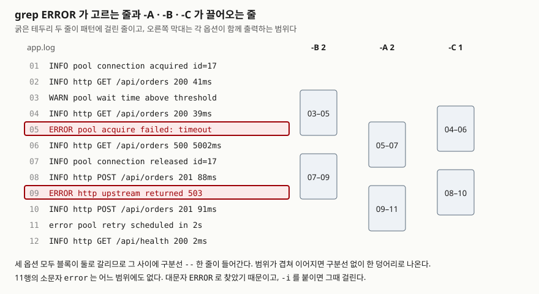

## 들어가며

서비스가 몇 분간 500을 뱉었다는 연락을 받고 서버에 붙는다. `grep ERROR app.log`를 치면
에러 줄이 나온다. 그런데 그 줄에 적힌 것은 "acquire failed: timeout"뿐이고, **그 직전에
무슨 일이 있었는지는 안 보인다.**

그래서 대부분 `vi`로 로그를 열어 `/ERROR`로 찾은 다음 화면을 위아래로 굴린다. 하루치
로그가 수백 MB면 파일이 뜨는 데만 시간이 걸리고, 매칭이 40군데면 `n`을 40번 누르며
매번 같은 동작을 반복한다. **에디터를 여는 순간 자동화가 끊긴다.** 파이프로 다음
명령에 넘길 수도, 스크립트에 넣을 수도 없다. 그런데 grep은 앞뒤 줄을 같이 뽑는 옵션을
처음부터 갖고 있다.

## 개념

`grep`은 **입력을 한 줄씩 읽어 패턴에 맞는 줄을 출력하는** 명령이다. 기본 단위가 줄이라
맞는 줄만 나오고 나머지는 버려진다. 여기서 두 가지를 더 지정할 수 있다.

- **얼마나 같이 보여줄 것인가** — `-A`(뒤), `-B`(앞), `-C`(앞뒤). 뒤에 줄 수를 붙인다
- **패턴을 어떤 문법으로 읽을 것인가** — `-G`(기본), `-E`, `-F`, `-P` 중 하나

두 번째가 자주 사고를 낸다. 같은 문자열을 넘겨도 **어느 엔진으로 읽느냐에 따라 결과가
달라지는데**, grep은 대부분의 경우 오류를 내지 않고 그냥 0건을 돌려준다.

## 구조



> **출처**: 세 옵션이 가져오는 방향과 블록 사이에 구분선이 들어가는 동작은
> [grep(1) man page — Context Line Control](https://man7.org/linux/man-pages/man1/grep.1.html)
> 이 `-A`를 "Print NUM lines of trailing context after matching lines", `-B`를
> "leading context before matching lines"로 적고, 세 옵션 모두 인접하지 않은 묶음
> 사이에 그룹 구분자 `--`를 넣는다고 적는 것을 따랐다. 그림의 줄 번호와 범위는
> 아래 실습에서 나온 실제 출력이다. (man page는 grep 3.12 기준, 실행은 3.0)

## 동작 원리

**문맥 옵션은 출력할 때만 작용한다.** grep은 매칭 여부를 여전히 한 줄씩 판정하고,
맞는 줄을 찾으면 그 주변 줄을 **버리지 않고 같이 내보낼 뿐이다.** 그래서
`grep -c -C 1 ERROR`는 화면에 6줄이 나오는 것과 무관하게 `2`를 돌려준다. 실습에서 확인했다.

범위가 겹치면 합쳐지고, 떨어져 있으면 사이에 `--` 한 줄이 들어간다. 이 구분선이 있어
**한 덩어리인지 서로 다른 사건인지**를 눈으로 셀 수 있다. 도식의 세 옵션은 모두
블록이 둘로 갈렸다.

엔진 쪽은 사정이 다르다. 기본은 **기본 정규식(BRE)**이고 `+`, `?`, `|`, `()` 앞에
역슬래시가 필요하다. `-E`는 **확장 정규식(ERE)**이라 그 역슬래시가 없어도 된다.
`-P`는 **PCRE**로, `\d` 같은 축약 문자 클래스와 전방·후방 탐색을 쓸 수 있다.
`\d`를 `-E`에 넘기면 **오류가 아니라 0건**이 나온다. 이게 가장 조용한 함정이다.

## 실습 예제

12줄짜리 샘플 로그를 스크립트가 직접 만들어 돌렸다. 전체 소스:
[`code/grep_context.sh`](code/grep_context.sh), 실행 기록: [`code/output.txt`](code/output.txt)

### 옵션은 네 갈래로 묶인다

옵션이 많아 보이지만 **무엇을 정하느냐**로 갈린다. 아래는 이 글에서 전부 실제로 돌려 본 것이다.

| 갈래 | 옵션 | 하는 일 |
|---|---|---|
| **무엇을 패턴으로 읽는가** | `-F` | 정규식이 아니라 고정 문자열로 |
| | `-G` | BRE (기본값) |
| | `-E` | ERE — `+`, `?`, `\|`를 역슬래시 없이 |
| | `-P` | PCRE — `\d`, 전방탐색 |
| | `-e 패턴` | 패턴을 여러 개 |
| | `-f 파일` | 패턴을 파일에서 읽어 |
| **어디까지 맞아야 하는가** | `-i` | 대소문자 무시 |
| | `-w` | 단어 경계가 맞을 때만 |
| | `-x` | 줄 전체가 맞을 때만 |
| | `-v` | 맞지 **않는** 줄만 |
| **무엇을 보여줄 것인가** | `-n` | 줄 번호 |
| | `-c` | 걸린 **줄 수** |
| | `-o` | 맞은 부분만 |
| | `-l` / `-L` | 걸린 / 안 걸린 **파일 이름만** |
| | `-h` / `-H` | 파일 이름 숨김 / 강제 표시 |
| | `-q` | 아무것도 출력하지 않고 종료 코드만 |
| | `-m N` | N건에서 멈춤 |
| | `-A` / `-B` / `-C N` | 뒤 / 앞 / 양쪽 N줄을 함께 |
| **어느 파일을 볼 것인가** | `-r` / `-R` | 디렉터리를 따라 내려가며 (`-R`은 심볼릭 링크도) |
| | `--include` / `--exclude` | 파일 이름 패턴으로 추리기 |
| | `-s` | 파일을 못 읽어도 에러 메시지를 내지 않음 |

`-r`처럼 **여러 파일을 대상으로 하면 출력 형식이 바뀐다.** 파일이 하나일 때는 줄만 나오지만
둘 이상이면 `파일명:줄`이 된다. 스크립트에서 이 차이를 놓치면 파싱이 어긋난다.

### 앞뒤를 같이 본다

```
$ grep -C 1 ERROR app.log
2026-09-22T09:00:04 INFO  http  GET /api/orders 200 39ms
2026-09-22T09:00:05 ERROR pool  acquire failed: timeout after 5000ms
2026-09-22T09:00:05 INFO  http  GET /api/orders 500 5002ms
--
2026-09-22T09:00:11 INFO  http  POST /api/orders 201 88ms
2026-09-22T09:00:12 ERROR http  upstream returned 503 for /api/stock
2026-09-22T09:00:13 INFO  http  POST /api/orders 201 91ms
```

에러 한 줄만 볼 때는 안 보이던 것이 바로 아래 줄에 있다. **timeout이 5000ms인데 그
요청이 5002ms에 500으로 끝났다.** 두 줄을 나란히 놓아야 보이는 관계다.
`-B 2`로 앞만 보면 `wait time above threshold`가 이미 두 줄 전에 떠 있던 것도 나온다.

### 점은 임의의 한 글자다

```
$ grep -c 5.0 app.log      →  2
$ grep -c -F 5.0 app.log   →  0
```

로그에 `5.0`이라는 글자는 한 번도 없다. 그런데 앞은 2건을 돌려줬다. `.`이 임의의 한
글자라서 `5002`와 `5000`에 걸린 것이다. **검색어가 문자열이면 `-F`를 붙인다.**
IP나 버전처럼 점이 들어가는 값을 찾을 때마다 겪는다.

### 같은 패턴을 엔진이 다르게 읽는다

```
$ grep -c 'wait=[0-9]\+ms' app.log   →  2
$ grep -c -E 'wait=[0-9]+ms' app.log →  2
$ grep -c -E 'wait=\d+ms' app.log    →  0
$ grep -c -P 'wait=\d+ms' app.log    →  2
```

세 번째 줄이 문제다. **오류도 경고도 없이 0을 돌려준다.** 다른 정규식 도구에서
쓰던 `\d`를 그대로 옮겨 오면 "해당 로그가 없다"로 잘못 읽게 된다. `[0-9]`로 쓰거나
`-P`를 붙이면 된다. grep 3.7 이상에서는 불필요한 역슬래시에 경고가 붙기도 하지만,
`\d` 자체는 여전히 조용히 0건이다.

### PCRE가 필요한 순간

"ERROR인데 timeout은 아닌 줄"을 찾는 일이 자주 있다. 두 번 파이프로 거는 대신 한 번에 건다.

```
$ grep -P '^(?=.*ERROR)(?!.*timeout)' app.log
2026-09-22T09:00:12 ERROR http  upstream returned 503 for /api/stock
```

전방탐색 `(?=...)`은 **글자를 소비하지 않고 조건만 확인한다.** 그래서 "있는지"와
"없는지"를 한 패턴에 같이 적을 수 있다. BRE·ERE에는 이 문법이 없다.

`-o`를 쓰면 매칭된 부분만 뽑아 다음 명령에 넘길 수 있다.

```
$ grep -o -P '(?<= )\d{3}(?= \d+ms)' app.log
200
200
500
201
201
200
```

### -c가 세는 것은 줄 수다

```
$ grep -c 00 app.log          →  12
$ grep -o '00' app.log | wc -l →  18
```

12줄짜리 파일에서 `-c`가 12를 돌려줬다. 모든 줄에 `00`이 하나 이상 있다는 뜻이지
`00`이 12개라는 뜻이 아니다. 실제 개수는 18이다. **건수를 보고할 때 어느 쪽을 센 것인지
확인한다.**

### 못 찾으면 종료 코드가 1이다

```
$ grep -q FATAL app.log   →  (종료 코드 1)
$ grep -q ERROR app.log   →  (종료 코드 0)
```

POSIX가 정한 값이다. 0은 찾음, 1은 못 찾음, 2 이상은 오류다. 스크립트에서
`if grep -q ...`로 분기할 때 쓰는 근거가 이것이고, `set -e`를 켠 스크립트에서
못 찾은 grep 때문에 스크립트가 통째로 죽는 원인도 이것이다.

### 여러 파일을 뒤질 때 달라지는 것

```text
$ grep -r ERROR grep_demo_tree
grep_demo_tree/patterns.txt:ERROR
grep_demo_tree/svc/http.log:2026-09-22T09:00:12 ERROR http  upstream returned 503
grep_demo_tree/svc/pool.log:2026-09-22T09:00:05 ERROR pool  acquire failed: timeout

$ grep -r -l ERROR grep_demo_tree
grep_demo_tree/patterns.txt
grep_demo_tree/svc/http.log
grep_demo_tree/svc/pool.log

$ grep -r -L ERROR grep_demo_tree
grep_demo_tree/etc/app.conf
grep_demo_tree/svc/quiet.log
```

`-l`은 **걸린 파일 이름만**, `-L`은 그 반대다. "에러가 난 서비스"보다 "로그를 남기지 않은
서비스"를 찾을 때 `-L`이 답이 된다. `-h`를 붙이면 파일 이름이 빠져 내용만 모이고,
`-H`를 붙이면 파일이 하나여도 이름이 붙는다. 스크립트에서는 파일 개수에 따라 형식이
흔들리지 않게 둘 중 하나를 **명시하는 편이 안전하다.**

### 줄 전체가 맞아야 할 때

```text
$ grep -x ERROR app.log
(종료 코드 1)

$ grep -c -x '.*ERROR.*' app.log
2
```

`-x`는 줄 **전체**가 패턴과 맞을 때만 잡는다. 로그에 `ERROR`만 있는 줄은 없으므로 0건이다.
설정 파일에서 `debug`라는 값 자체를 찾을 때처럼, 부분 일치를 원치 않는 자리에 쓴다.

### 에러 메시지를 감추는 것과 종료 코드는 별개다

```text
$ grep ERROR 'grep_demo_tree/없는파일.log'
grep: grep_demo_tree/없는파일.log: No such file or directory
(종료 코드 2)

$ grep -s ERROR 'grep_demo_tree/없는파일.log'
(종료 코드 2)
```

`-s`는 **메시지만** 감춘다. 종료 코드는 2 그대로다. 파일이 없어도 조용히 넘어가길 바라며
`-s`를 붙였다가, `set -e` 스크립트가 여전히 죽는 이유가 이것이다.

## 실무에서 주의할 점

- **`set -e` 스크립트에서 grep을 조건 없이 쓰지 않는다.** 못 찾으면 종료 코드 1이라
  스크립트가 그 줄에서 끝난다. `if grep -q ...; then` 안에 넣거나 `|| true`를 붙인다.
- **문자열을 찾을 때는 `-F`를 습관으로 붙인다.** 점·대괄호·별표가 들어간 값은 정규식으로
  읽히는 순간 엉뚱한 줄이 걸린다. IP, 버전, 파일 경로가 특히 그렇다.
- **`\d`·`\w`·`\s`를 `-E`에 쓰지 않는다.** 오류가 안 나고 0건이 나오므로 "로그에 없다"로
  오판하게 된다. `-P`를 붙이거나 POSIX 클래스(`[0-9]`, `[[:digit:]]`)로 바꾼다.
- **패턴은 항상 작은따옴표로 감싼다.** `*`, `?`, `$`가 셸에 먼저 잡아먹힌다.
  같은 명령이 디렉터리 내용에 따라 다르게 동작하는 사고가 여기서 난다.
- **`-c`와 매칭 수를 구분해 보고한다.** 위에서 12와 18로 갈렸다. 한 줄에 여러 번 나오는
  패턴을 셀 때는 `-o | wc -l`을 쓴다.
- **대용량 로그는 범위를 먼저 좁힌다.** 시간대로 자른 뒤(`sed -n` 등) grep을 걸면
  문맥 옵션의 출력량도 같이 줄어든다. `-C 5`를 전체 파일에 거는 것은 대개 실수다.

## 정리

- grep의 판정 단위는 줄이고, `-A`·`-B`·`-C`는 **판정이 아니라 출력에만** 관여한다.
- 떨어진 블록 사이에는 `--` 구분선이 들어간다. 사건이 몇 건인지 셀 때 쓴다.
- 패턴을 읽는 엔진은 네 가지(`-G`·`-E`·`-F`·`-P`)고, 같은 문자열이 엔진에 따라 다르게
  걸린다. `\d`는 `-E`에서 **경고 없이 0건**이었다.
- `.`은 임의의 한 글자다. 문자열을 찾을 때는 `-F`를 쓴다. `5.0`이 `5002`에 걸렸다.
- `-c`는 줄 수다. 같은 파일에서 `-c`는 12, `-o | wc -l`은 18이었다.
- 못 찾으면 종료 코드 1이다. `set -e` 스크립트에서 이것 때문에 죽는다.

## 참고 자료

- [grep(1) man page (GNU grep 3.12)](https://man7.org/linux/man-pages/man1/grep.1.html) — `-A`/`-B`/`-C`의 방향과 그룹 구분자, `-P`·`-o`·`-w`의 동작, 종료 코드
- [POSIX.1-2024 — grep](https://pubs.opengroup.org/onlinepubs/9799919799/utilities/grep.html) — `-c`·`-n`·`-i`·`-v`·`-E`·`-F`의 표준 정의와 종료 상태 0·1·2
- [POSIX.1-2024 — Regular Expressions](https://pubs.opengroup.org/onlinepubs/9799919799/basedefs/V1_chap09.html) — 기본 정규식과 확장 정규식의 차이
- [PCRE2 — pcre2pattern](https://www.pcre.org/current/doc/html/pcre2pattern.html) — `\d` 같은 축약 문자 클래스와 전방·후방 탐색 문법
