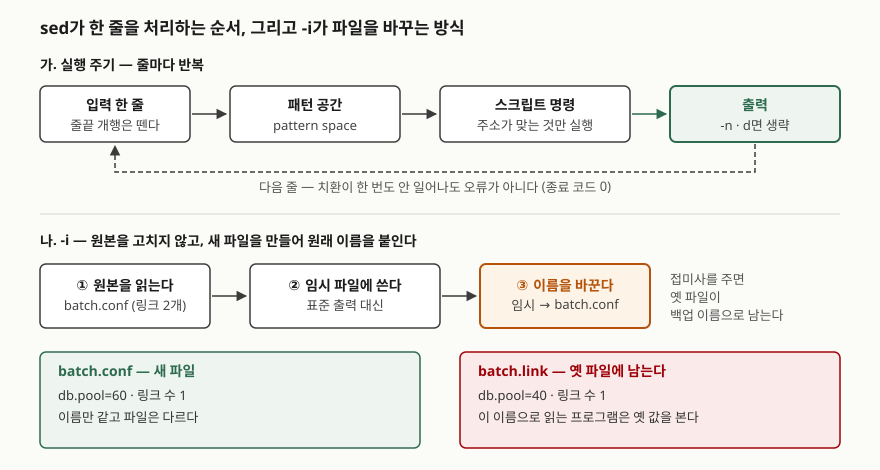

## 들어가며

DB 서버를 옮기면서 설정 파일 수십 개에 박힌 `10.0.0.1`을 `10.0.0.2`로 바꿔야 하는 날이 온다.
파일을 하나씩 편집기로 열면 30개면 30번 열고 저장하고, 그중 하나는 빠뜨린다. 그래서
`sed -i 's/10.0.0.1/10.0.0.2/g' *.conf` 한 줄로 끝내는데, 다음 날 복제 서버 `10.0.0.12`가
`10.0.0.22`로, 백업 서버 `10.0.0.100`이 `10.0.0.200`으로 바뀌어 있는 것을 발견한다.

`-i`는 되돌리기 기능이 없고, 틀린 치환도 성공한 것처럼 조용히 끝난다. 아래 실습에서 이 한 줄은
여섯 줄짜리 파일에서 **바꿔야 할 한 줄 외에 네 줄을 더 바꿨다.** 치기 전에 확인하는 절차가 필요하다.

## 개념

`sed`는 **입력을 한 줄씩 읽어 스크립트를 적용하고 결과를 내보내는 스트림 편집기**다.
POSIX 표준은 동작을 이렇게 정한다. 입력 한 줄을 끝 개행을 뗀 채로 **패턴 공간**에 넣고,
주소가 그 줄을 고르는 명령을 순서대로 적용한 뒤, `-n`이 없으면 패턴 공간을 표준 출력에
쓰고 비운다. 그리고 다음 줄로 넘어간다.

여기서 두 가지가 따라 나온다. 첫째, **원본 파일은 건드리지 않는다.** 결과는 표준 출력으로만
나간다. 둘째, **스크립트가 아무 줄도 바꾸지 않아도 실패가 아니다.** 명령이 적용될 줄이 없었을
뿐이다. 파일을 직접 고치는 `-i`는 POSIX에 없는 GNU 확장이고, 이 둘째 성질을 그대로 물려받는다.

## 구조



> **출처**: 실행 주기는 [POSIX.1-2024 — sed, EXTENDED DESCRIPTION](https://pubs.opengroup.org/onlinepubs/9799919799/utilities/sed.html#tag_20_109_13_03),
> `-i`의 임시 파일·이름 바꾸기는 [GNU sed 매뉴얼 — Command-Line Options](https://www.gnu.org/software/sed/manual/sed.html#Command_002dLine-Options)를 따랐다.
> 아래쪽 두 상자의 값과 링크 수는 실습 9장의 실제 출력이다.

## 동작 원리

도식 아래쪽이 이 글의 중심이다. GNU sed 매뉴얼은 `-i`가 **임시 파일을 만들어 출력을 거기로
보내고, 파일 끝에 이르면 임시 파일의 이름을 원래 이름으로 바꾼다**고 적는다. 그러니
`-i`가 끝난 뒤의 `batch.conf`는 이름만 같은 **다른 파일**이다.

평소에는 차이가 드러나지 않는다. 드러나는 것은 같은 파일에 이름이 둘 이상 붙어 있을 때다.
하드 링크로 이어진 두 이름 중 하나에 `-i`를 쓰면, 그 이름만 새 파일로 옮겨 가고 다른 이름은
옛 파일에 그대로 남는다. 설정을 고쳤는데 어떤 프로그램은 옛 값을 계속 읽는 상황이 이렇게
생긴다. 심볼릭 링크도 같은 방식으로 끊긴다. 매뉴얼은 `--follow-symlinks`를 주면 링크를 따라가
최종 대상을 고친다고 적는다.

도식 위쪽의 점선은 두 번째 함정이다. 주기는 줄이 끝날 때까지 돌고, 치환이 한 번도 안
일어났다는 사실은 어디에도 남지 않는다. 매뉴얼의 종료 코드 목록도 0(성공), 1(잘못된 명령),
2(입력 파일을 못 엶), 4(입출력 오류)뿐이다. **"못 찾음"에 해당하는 코드가 없다.**

## 실습 예제

설정 파일 세 개를 만들어 돌렸다. 전체 소스: [`code/sed_safe_replace.sh`](code/sed_safe_replace.sh),
실행 기록: [`code/output.txt`](code/output.txt)

```text
$ cat -n app.conf
     1	# primary: 10.0.0.1
     2	db.host=10.0.0.1
     3	db.replica=10.0.0.12
     4	backup.host=10.0.0.100
     5	cache.bytes=10000001
     6	log.dir=/var/log/app
```

바꿔야 하는 것은 2번 줄 하나다.

### 옵션은 다섯 갈래로 묶인다

`sed --help`가 내놓는 목록을 하는 일로 묶었다. 실습 장 번호를 붙였고, 이 환경에서 돌리지 못한
두 개는 이유를 적었다.

| 갈래 | 옵션 | 하는 일 | 실습 |
|---|---|---|---|
| **스크립트를 어디서 읽는가** | `-e 스크립트` / `--expression` | 스크립트를 추가. 여러 번 줄 수 있다 | 13장 |
| | `-f 파일` / `--file` | 스크립트를 파일에서 읽음 | 13장 |
| **출력과 편집 대상** | `-n` / `--quiet` / `--silent` | 자동 출력을 끔. `p`로 고른 줄만 나온다 | 2장 |
| | `-i[접미사]` / `--in-place` | 파일을 직접 고침. 접미사가 있으면 백업 | 7~9장 |
| | `--follow-symlinks` | `-i`가 심볼릭 링크를 따라가 대상을 고침 | 못 돌림 ① |
| | `-s` / `--separate` | 여러 파일을 한 흐름이 아니라 따로 처리 | 10장 |
| **입력을 어떻게 끊는가** | `-z` / `--null-data` | 줄 구분을 개행 대신 NUL로 | 17장 |
| | `-b` / `--binary` | 윈도우 계열에서 CR을 떼지 않고 읽음 | 18장 |
| | `-u` / `--unbuffered` | 입출력 버퍼를 최소로 | 못 돌림 ② |
| **정규식과 호환성** | `-E` / `-r` / `--regexp-extended` | 확장 정규식(ERE). POSIX 표기는 `-E` | 11장 |
| | `--posix` | GNU 확장을 전부 끔 | 21장 |
| **점검과 제한** | `--debug` | 해석한 스크립트와 줄마다의 처리 과정을 찍음 | 22장 |
| | `--sandbox` | `e`·`r`·`w` 명령을 거부 | 20장 |
| | `-l N` / `--line-length` | `l` 명령의 줄 바꿈 폭 | 19장 |

① Git Bash에서 `ln -s`는 링크 대신 복사본을 만들고, 네이티브 링크를 강제하면 권한 부족으로
거부됐다. 리눅스에서 확인해야 할 항목이다. ② 효과가 출력 시점에만 나타나 기록으로 남길 수 없다.
매뉴얼은 `tail -f`처럼 계속 들어오는 입력을 바로바로 내보낼 때 쓴다고 적는다.

POSIX가 정한 옵션은 `-E`·`-e`·`-f`·`-n` 넷이다. `-i`를 포함한 나머지는 GNU 확장이라
BSD·busybox의 sed에서는 문법이 다르거나 없다.

### 흔히 치는 한 줄이 다섯 줄을 바꾼다

`-n`과 `p` 플래그를 함께 쓰면 **바뀐 줄만** 찍힌다. 고치기 전의 미리보기로 쓴다.

```text
$ sed -n 's/10.0.0.1/10.0.0.2/gp' app.conf
# primary: 10.0.0.2
db.host=10.0.0.2
db.replica=10.0.0.22
backup.host=10.0.0.200
cache.bytes=10.0.0.2
```

다섯 줄이 바뀌었다. `cache.bytes=10000001`이 IP 주소가 됐다. 정규식에서 `.`은 **아무 글자
하나**이므로 `10.0.0.1`은 `10000001`에도 맞는다. `12`와 `100`은 뒤에 글자가 더 있는데도
앞부분이 맞아서 바뀌었다.

점만 이스케이프한 것, 단어 경계 `\b`까지 건 것, 값 전체를 `=`와 `$`로 묶은 것을 차례로 돌렸다.

```text
$ sed -n 's/10\.0\.0\.1/10.0.0.2/gp' app.conf
# primary: 10.0.0.2
db.host=10.0.0.2
db.replica=10.0.0.22
backup.host=10.0.0.200
$ sed -n 's/\b10\.0\.0\.1\b/10.0.0.2/gp' app.conf
# primary: 10.0.0.2
db.host=10.0.0.2
$ sed -n 's/=10\.0\.0\.1$/=10.0.0.2/p' app.conf
db.host=10.0.0.2
```

점을 이스케이프하면 `cache.bytes`가 빠지고, 단어 경계 `\b`를 걸면 `12`와 `100`이 빠진다.
`\b` 판에서도 주석 줄은 바뀐다. 주석까지 바꿀지는 정할 일이지만, **"값 전체가 이것인 줄"을
원하면 `=`와 `$`로 앞뒤를 묶는 것이 가장 좁다.** `\b`는 GNU 확장이다.

### 치기 전에 diff로 본다

```text
$ sed 's/=10\.0\.0\.1$/=10.0.0.2/' app.conf | diff -u app.conf - | tail -n +3
@@ -1,5 +1,5 @@
 # primary: 10.0.0.1
-db.host=10.0.0.1
+db.host=10.0.0.2
 db.replica=10.0.0.12
 backup.host=10.0.0.100
 cache.bytes=10000001
```

`-i` 없이 돌린 결과를 원본과 `diff`로 맞대면, 바뀌는 줄과 그 주변이 한 번에 보인다.
파일이 여러 개면 파일마다 이것을 돌려 합쳐 본다.

### 치환이 0건이어도 성공이다

```text
$ sed -n 's/=10\.9\.9\.9$/=10.0.0.2/p' app.conf; echo "종료 코드 $?"
종료 코드 0
$ grep -c '=10\.9\.9\.9$' app.conf
0
(종료 코드 1)
```

없는 값을 바꾸라고 해도 `sed`는 0을 돌려준다. 오타 난 패턴으로 스크립트를 돌리면 아무것도
안 바뀐 채 "성공"으로 끝난다. **바꿀 줄이 몇 개인지는 `grep -c`로 먼저 센다.** `grep`은 못
찾으면 1을 돌려주므로 스크립트에서 분기할 수 있다.

### 백업 접미사

```text
$ sed -i.bak 's/=10\.0\.0\.1$/=10.0.0.2/' app.conf
$ ls app.conf*
app.conf
app.conf.bak
$ sed -i'orig_*' 's/db.pool=20/db.pool=40/' batch.conf
$ ls orig_* batch.conf
batch.conf
orig_batch.conf
```

`-i` 뒤에 붙인 글자가 백업 파일 이름의 접미사가 된다. 접미사에 `*`가 있으면 그 자리에 원래
파일 이름이 들어가므로, 앞에 붙이거나(`orig_*`) 다른 폴더(`bak/*`)로 보낼 수 있다.
**`-i`와 접미사 사이에 공백을 넣으면 안 된다.** 실행 기록 23장에서 `sed -i .bak '...'`은
`.bak`을 스크립트로 읽어 `unknown command: '.'`로 실패했다(종료 코드 1). 이 경우는 실패가 드러나서
그나마 낫다.

### -i는 하드 링크를 끊는다

```text
$ ln batch.conf batch.link
$ stat -c '%h %n' batch.conf batch.link
2 batch.conf
2 batch.link
$ sed -i 's/db.pool=40/db.pool=60/' batch.conf
$ stat -c '%h %n' batch.conf batch.link
1 batch.conf
1 batch.link
$ grep pool batch.conf batch.link
batch.conf:db.pool=60
batch.link:db.pool=40
```

예상은 했지만 결과로 보니 분명했다. 링크 수가 2에서 1로 떨어졌고, 두 이름이 서로 다른 값을
가리킨다. 도식 아래쪽 그대로다. 같은 파일을 두 경로로 참조하는 배포 구조라면 `-i` 대신
**원본에 덮어쓰는** 방법을 쓴다. 실행 기록 24장에서 `sed ... > batch.tmp && cat batch.tmp > batch.conf`로
고치자 링크 수가 2로 유지되고 두 이름이 같은 새 값(`db.pool=80`)을 보였다. `cat`의 리다이렉션은
새 파일을 만들지 않고 기존 파일의 내용을 바꾸기 때문이다.

### 여러 파일에서 $와 1이 가리키는 곳

```text
$ sed -n '$p' app.conf batch.conf
db.pool=60
$ sed -s -n '$p' app.conf batch.conf
log.dir=/var/log/app
db.pool=60
```

기본은 모든 파일을 **이어 붙인 한 흐름**으로 보므로 `$`는 마지막 파일의 마지막 줄 하나다.
`-s`를 주면 파일마다 `$`가 생긴다. 매뉴얼은 `-i`가 `-s`를 함께 켠다고 적는다.
`-i` 없이 여러 파일에 `sed '1i # managed'`를 쓰면 첫 파일에만 한 줄이 들어가는 이유가
이것이다(실행 기록 25장).

### 주소와 플래그

실무에서 자주 쓰는 형식만 추렸다. 전부 실행 기록 14~16장에 결과가 있다.

| 쓰는 곳 | 형식 | 뜻 | 기록의 결과 |
|---|---|---|---|
| 주소 | `2,3` | 2~3번 줄 | 2·3번 줄 |
| | `/replica/,$` | 정규식에 맞는 줄부터 끝까지 | 3~6번 줄 |
| | `/^#/!` | 주석이 **아닌** 줄 | 주석만 남기고 치환 |
| | `1~2` | 1번부터 2줄 간격 (GNU) | 1·3·5번 줄 |
| | `0,/x=/` | 첫 줄을 포함해 처음 맞는 곳까지 (GNU) | 첫 `x=`만 바뀜 |
| `s` 플래그 | `g` / `3` / `2g` | 전부 / 세 번째만 / 두 번째부터 | `a-a-X-a`, `a-X-X-X` |
| | `I` | 대소문자 무시 (GNU) | `DB.HOST` → `db.host` |
| | `w 파일` | 바뀐 줄을 파일에도 씀 | 4줄 기록 |
| 명령 | `d` / `a` / `i` / `c` | 삭제 / 뒤에 추가 / 앞에 추가 / 교체 | |
| | `y/abc/ABC/` | 글자 단위 대응 치환 | `DB.HOST` |
| | `q` / `q5` | 그 줄까지 찍고 종료 / 종료 코드 5 | 종료 코드 5 |

`0,/re/`와 `1,/re/`의 차이는 직접 돌려야 보인다. `x=1`·`x=2`·`x=3` 세 줄에 `0,/x=/`를 쓰면
첫 줄만 바뀌고, `1,/x=/`를 쓰면 **두 줄이** 바뀐다. `1,/re/`는 끝 조건을 2번 줄부터 찾기
때문이다. "처음 한 번만 바꾸기"를 원하면 `0,`이다.

### CRLF 파일은 -b로 봐야 서버와 같다

```text
$ sed -n 'l' crlf.conf
db.host=10.0.0.1$
db.pool=20$
$ sed -b -n 'l' crlf.conf
db.host=10.0.0.1\r$
db.pool=20\r$
$ sed -b -n 's/=20$/=40/p' crlf.conf
$ sed -b -n 's/=20\r$/=40\r/p' crlf.conf | od -c | head -2
0000000   d   b   .   p   o   o   l   =   4   0  \r  \n
```

예상과 다른 결과였다. Git Bash의 sed는 기본으로 줄끝 CR을 떼고 읽어서, `l` 명령에 `\r`이
안 보인다. 매뉴얼은 텍스트와 바이너리를 구분하는 OS에서만 `-b`가 효과가 있다고 적는다.
**리눅스 서버에는 이 처리가 없으므로 `-b`를 붙인 쪽이 서버에서 보게 될 모습이다.** 거기서는
`=20$`가 맞지 않아 치환이 0건이고, 앞 절대로 종료 코드는 0이다. 윈도우에서 편집한 설정
파일이 서버에서 안 바뀔 때 `sed -n l`로 `\r`부터 확인한다.

### 나머지 옵션

```text
$ sed --sandbox -n 's/10/20/w out.txt' app.conf
sed: -e expression #1, char 9: e/r/w commands disabled in sandbox mode
(종료 코드 1)
$ echo 'aaab' | sed 's/a\+/X/'
Xb
$ echo 'aaab' | sed --posix 's/a\+/X/'
aaab
```

`--sandbox`는 파일을 쓰는 `w`를 거부했다. 외부에서 받은 스크립트를 돌릴 때 쓴다. `--posix`를
주자 GNU 확장인 `\+`가 "1회 이상"이 아니라 글자 `+`로 읽혀 아무것도 안 바뀌었다. 이식할
스크립트는 `--posix`로 한 번 돌려 보면 확장을 썼는지 드러난다. `--debug`는 해석한 스크립트와
줄마다 맞은 위치(`regex[0] = 7-16 '=10.0.0.1'`)를 찍어 준다. 치환이 왜 안 되는지 볼 때 쓴다.

## 실무에서 주의할 점

- **`-i` 전에 `-n ... p`로 바뀔 줄을 먼저 본다.** 한 줄만 바꿀 생각이었는데 다섯 줄이 나왔다면
  패턴이 넓은 것이다. 파일 전체는 `sed ... | diff -u 원본 -`로 본다.
- **패턴의 점을 이스케이프하고 앞뒤를 묶는다.** `10.0.0.1`은 `10000001`에도, `10.0.0.12`에도
  맞았다. 값 전체를 바꿀 때는 `=값$`처럼 고정한다.
- **종료 코드로 성공을 판단하지 않는다.** 치환 0건도 0이다. `grep -c`로 대상 줄 수를 먼저
  세고, 끝난 뒤 새 값의 줄 수를 다시 세어 맞춘다.
- **백업 접미사를 붙인다.** `-i.bak` 뒤에 `diff 파일.bak 파일`로 확인하고 지운다. `-i`와
  접미사 사이에 공백을 넣지 않는다.
- **링크로 묶인 파일에는 `-i`를 쓰지 않는다.** 하드 링크는 끊겼고, 심볼릭 링크는
  `--follow-symlinks` 없이는 링크 자체가 일반 파일로 바뀐다.
- **윈도우에서 온 파일은 `sed -n l`로 줄끝을 본다.** `\r`이 남아 있으면 `$` 앞에 걸리는
  패턴이 전부 빗나간다.

## 정리

- `sed`는 한 줄씩 패턴 공간에 넣어 명령을 적용하고 출력한다. 원본은 `-i`를 줘야만 바뀐다.
- `-i`는 임시 파일에 쓰고 이름을 바꾼다. 하드 링크가 2에서 1로 끊기고 두 이름이 다른 값을 가졌다.
- 이스케이프 안 한 점과 경계 없는 패턴이 바꿀 한 줄 외에 네 줄을 더 바꿨다. `=값$`으로 묶으면 한 줄이다.
- 치환이 0건이어도 종료 코드는 0이다. 대상은 `grep -c`로 센다.
- Git Bash의 sed는 CR을 떼고 읽는다. `-b`를 붙인 결과가 리눅스 서버의 결과다.

## 참고 자료

- [POSIX.1-2024 — sed, EXTENDED DESCRIPTION](https://pubs.opengroup.org/onlinepubs/9799919799/utilities/sed.html#tag_20_109_13_03) — 패턴 공간과 실행 주기, POSIX가 정한 옵션이 `-E`·`-e`·`-f`·`-n`뿐이라는 것
- [GNU sed 매뉴얼 — Command-Line Options](https://www.gnu.org/software/sed/manual/sed.html#Command_002dLine-Options) — `-i`의 임시 파일·이름 바꾸기, 접미사의 `*`, `-i`가 `-s`를 켠다는 것, `--follow-symlinks`, `-u`, `-b`, `-s`, `-z`
- [GNU sed 매뉴얼 — Range Addresses](https://www.gnu.org/software/sed/manual/sed.html#Range-Addresses) — `0,/regexp/`가 첫 줄에서도 끝 조건을 찾는다는 것
- [GNU sed 매뉴얼 — Exit status](https://www.gnu.org/software/sed/manual/sed.html#Exit-status) — 종료 코드 0·1·2·4와 `q`·`Q`의 종료 코드 인자
- [GNU sed 매뉴얼 원본 (texinfo, savannah)](https://cgit.git.savannah.gnu.org/cgit/sed.git/plain/doc/sed.texi) — 이 글을 쓸 때 gnu.org 접속이 거부되어 위 세 항목의 내용은 이 원본에서 확인했다
- 옵션 표의 원본은 설치된 GNU sed 4.9가 내놓는 `sed --help` 출력이다
