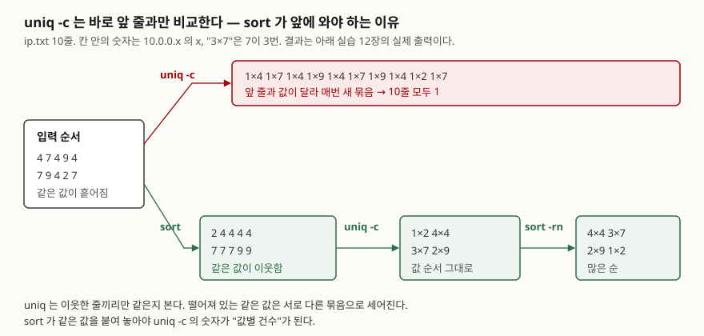

## 들어가며

서버가 느려졌다는 연락을 받고 접속 로그를 연다. 어느 IP가 요청을 가장 많이 보냈는지 알고 싶어
`grep -c 10.0.0.4 access.log`를 치고, 다음 IP로 또 친다. IP가 수백 개면 수백 번이다. 그래서
`awk '{print $1}' access.log | uniq -c`를 찾아 쓰는데, 결과가 전부 1이다. 로그를 다시 보면 같은
IP가 분명 여러 번 있다. 명령 하나가 틀렸다는 건 알겠는데 무엇이 틀렸는지 모르니, 다시 IP를 하나씩
세는 방법으로 돌아간다. 틀린 곳은 `uniq` 앞에 `sort`가 빠진 한 자리다.

## 개념

셋은 따로 쓰이지만 집계에서는 한 줄로 이어진다.

- **`sort`** — 줄을 정렬한다. 비교 기준(문자열·숫자·버전·월)과 비교 범위(줄 전체·특정 필드)를 고른다
- **`uniq`** — **이웃한** 같은 줄을 하나로 합친다. `-c`를 붙이면 몇 줄이 합쳐졌는지 앞에 적는다
- **`wc`** — 줄·단어·바이트·문자 수를 센다

`sort | uniq -c | sort -rn`이 "값별 건수를 많은 순으로" 뽑는 관용 표현이다. 가운데의 `uniq`가
이웃한 줄만 본다는 것이 앞뒤에 `sort`가 필요한 이유다. POSIX는 이웃하지 않은 반복 줄은 검출되지
않는다고 못 박아 둔다.

## 구조



> **출처**: `uniq`가 이웃한 줄만 비교한다는 규정은 [The Open Group Base Specifications Issue 8 — uniq: DESCRIPTION](https://pubs.opengroup.org/onlinepubs/9799919799/utilities/uniq.html)의 DESCRIPTION 절을,
> 옵션 이름은 설치된 GNU coreutils 8.32의 `uniq --help`·`sort --help` 출력을 따랐다.
> 칸 안의 값은 아래 실습 12장의 실제 출력이다.

## 동작 원리

**`uniq`는 이웃한 줄끼리 비교한다.** 한 묶음이 끝나는 것은 다음 줄이 앞 줄과 달라질 때다.
`4 7 4 9 4 …`처럼 흩어진 입력이면 매 줄이 새 묶음이 되어 전부 1로 세어진다. 정렬해 같은 값을
붙여 놓으면 비로소 묶음 하나가 "값 하나"가 된다.

**`sort`는 키를 먼저 비교하고, 같으면 줄 전체를 바이트로 비교한다.** POSIX는 키가 같게 정렬되는
줄을 POSIX 로케일 기준으로 바이트 단위 비교를 더 한다고 정한다. GNU `--help`가 말하는
"last-resort comparison"이 이것이고, `-s`가 이것을 끈다. 끄면 키가 같은 줄은 입력 순서를 지킨다.

**키는 `-k 시작[,끝]`으로 정하고, 끝을 빼면 줄 끝까지다.** POSIX 규정이 그렇다. `-t`를 주지 않으면
필드는 앞의 공백까지 포함한다. 그래서 `-k2.1`의 첫 글자는 공백이다. 여기에 **키에 붙인 옵션(`-k3,3n`의
`n`)은 그 키에서 전역 옵션을 모두 덮어쓴다.** 뒤에 `-r`을 따로 적어도 그 키에는 적용되지 않는다.

## 실습 예제

샘플 파일을 스크립트가 만들고 끝나면 지운다. 전체 소스: [`code/sort_uniq_wc.sh`](code/sort_uniq_wc.sh),
실행 기록: [`code/output.txt`](code/output.txt). 이 환경은 `LANG`이 비어 있어 기본 로케일이 `C`다.

### sort 옵션 — 다섯 갈래

`sort --help`의 목록을 하는 일로 묶었다. POSIX 표준 옵션은 `-b -c -C -d -f -i -k -m -n -o -r -t -u`이고
나머지는 GNU 확장이다. 전부 돌려 봤다.

| 갈래 | 옵션 | 하는 일 | 장 |
|---|---|---|---|
| **값을 어떻게 읽는가** | (없음) | 로케일 순서로 문자열 비교 | 1 |
| | `-n` / `--numeric-sort` | 앞부분 숫자로 비교. `1e3`은 1, `0x10`은 0 | 2 |
| | `-g` / `--general-numeric-sort` | 부동소수로 읽음. `1e3`, `0x10`도 숫자 | 2 |
| | `-h` / `--human-numeric-sort` | `512 < 1K < 2M < 1G` | 2 |
| | `-V` / `--version-sort` | 글자 안의 숫자를 수로 | 3 |
| | `-M` / `--month-sort` | `(모름) < JAN < … < DEC`, 대소문자 무시 | 3 |
| | `-R` / `--random-sort`, `--random-source` | 섞되 같은 키는 붙여 둠 | 10 |
| | `--sort=WORD` | 위 방식을 이름으로 | 3 |
| **비교 전에 무엇을 무시하는가** | `-f` / `--ignore-case` | 소문자를 대문자로 접어 비교 | 4 |
| | `-b` / `--ignore-leading-blanks` | 앞 공백 무시 | 4·5 |
| | `-d` / `--dictionary-order` | 공백과 영숫자만 봄 | 4 |
| | `-i` / `--ignore-nonprinting` | 인쇄 가능한 문자만 봄 | 4 |
| **어디를 비교하는가** | `-k` / `--key`, `-t` / `--field-separator` | 키 범위와 구분자 | 5 |
| **순서·중복·검사** | `-r` / `--reverse` | 비교 결과를 뒤집음 | 3·6 |
| | `-s` / `--stable` | 마지막 전체 줄 비교를 끔 | 6 |
| | `-u` / `--unique` | 같은 키의 첫 줄만 | 7 |
| | `-c` / `-C` / `--check` | 정렬됐는지만 검사 (종료 코드 1) | 8 |
| **입출력과 자원** | `-m` / `--merge` | 정렬된 파일을 병합만 | 9 |
| | `-o` / `--output` | 결과를 파일로. 입력과 같은 파일 가능 | 9 |
| | `--files0-from`, `-z` / `--zero-terminated` | NUL 구분 이름 목록 / NUL 구분 줄 | 9·10 |
| | `-S`, `-T`, `--parallel`, `--batch-size`, `--compress-program` | 메모리·임시 폴더·병렬도 | 11 |
| | `--debug` | 키로 쓰인 부분에 밑줄, 의심스러운 사용에 경고 | 5 |

### 로케일이 기본 순서를 바꾼다

```text
$ LC_ALL=C sort words.txt | paste -sd' '
Apple Banana _tmp apple banana cherry
$ LC_ALL=en_US.UTF-8 sort words.txt
_tmp
apple
Apple
banana
Banana
cherry
```

`C`는 바이트 순서라 대문자 전부가 소문자보다 앞이고 `_`(0x5F)는 그 사이에 낀다. UTF-8 로케일은
대소문자를 섞어 놓는다. **같은 명령이 서버마다 다른 순서를 낸다.** 스크립트에서는 `LC_ALL=C`를 붙인다.

### 숫자를 어떻게 읽는가

```text
$ sort numbers.txt | paste -sd' '
-3 1.5 10 100 2 9
$ sort -n numbers.txt | paste -sd' '
-3 1.5 2 9 10 100
$ sort -n general.txt | paste -sd' '
0x10 1e3 5 20
$ sort -g general.txt | paste -sd' '
5 0x10 20 1e3
$ sort -n sizes.txt | paste -sd' '
1G 1K 2M 3K 512
$ sort -h sizes.txt | paste -sd' '
512 1K 3K 2M 1G
```

`-n`은 앞의 숫자만 읽어 `1e3`을 1, `0x10`을 0으로 본다. `-g`는 둘 다 1000과 16으로 읽었다.
`-n`에 크기 표기를 주면 `1G`와 `1K`가 똑같이 1이 되고 마지막 전체 줄 비교가 `G < K`로 순서를 정한다.

### 키 끝을 빼면 줄 끝까지 비교한다

```text
$ sort -t, -k2 staff.csv | paste -sd' '
jung,dev,500 park,dev,500 kim,dev,700 han,hr,1200 lee,ops,450 choi,ops,800
$ sort -t, -k2,2 staff.csv | paste -sd' '
jung,dev,500 kim,dev,700 park,dev,500 han,hr,1200 choi,ops,800 lee,ops,450
$ sort -t, -k2 --debug staff.csv 2>&1 | head -6
sort: text ordering performed using simple byte comparison
jung,dev,500
     _______
____________
```

`-k2`는 부서가 같으면 급여 문자열까지 비교했고, `-k2,2`는 부서만 보고 나머지는 전체 줄 비교(이름순)로
정했다. `--debug`의 밑줄이 키가 어디까지인지 보여 준다. 첫 줄 밑줄은 키, 둘째 줄은 전체 줄 비교다.

```text
$ sort -s -k2.1,2.1 --debug status.log 2>&1 | head -4
sort: text ordering performed using simple byte comparison
sort: leading blanks are significant in key 1; consider also specifying 'b'
09:00:01 200 /api/orders
        _
```

`-t` 없이 두 번째 필드 첫 글자를 키로 잡으면 공백이 잡혀 순서가 그대로다. `--debug`가 경고까지 낸다.
`-b`를 붙인 뒤에야 2xx·4xx·5xx로 묶였다.

### 키 옵션이 -r을 덮어쓴다

```text
$ sort -s -t, -k3,3n -r staff.csv | paste -sd' '
lee,ops,450 park,dev,500 jung,dev,500 kim,dev,700 choi,ops,800 han,hr,1200
$ sort -s -t, -k3,3nr staff.csv | paste -sd' '
han,hr,1200 choi,ops,800 kim,dev,700 park,dev,500 jung,dev,500 lee,ops,450
```

예상과 달랐던 결과다. `-r`을 줬는데 오름차순이 나왔다. 키에 `n`을 붙이는 순간 그 키는 전역 옵션을
안 받는다. 뒤집으려면 `-k3,3nr`처럼 키 안에 넣는다. 같은 급여 500에서 `-s`가 입력 순서(park → jung)를 지켰다.

### 같은 파일로 리다이렉트하면 비워진다

```text
$ cp numbers.txt redirect.txt && sort -n redirect.txt > redirect.txt; wc -l redirect.txt
0 redirect.txt
$ cp numbers.txt inplace.txt && sort -n -o inplace.txt inplace.txt; paste -sd' ' inplace.txt
-3 1.5 2 9 10 100
```

셸은 명령을 실행하기 전에 `>`의 파일을 잘라 둔다. `sort`가 읽을 때는 이미 빈 파일이다. `-o`는 POSIX가
입력과 같은 파일이어도 된다고 정한 옵션이다.

### -u, -c, -R

```text
$ sort -t, -k2,2 -u staff.csv | paste -sd' '
kim,dev,700 han,hr,1200 lee,ops,450
$ sort -f -u levels.txt | paste -sd' '
ERROR warn
$ sort -c numbers.txt
[종료 코드 1]
$ sort -R --random-source=seed.bin ip.txt | paste -sd' '
10.0.0.2 10.0.0.7 10.0.0.7 10.0.0.7 10.0.0.4 10.0.0.4 10.0.0.4 10.0.0.4 10.0.0.9 10.0.0.9
```

`-c`가 stderr로 낸 줄은 기록 끝의 `--- stderr ---` 아래에 모여 있다.

```text
sort: numbers.txt:3: disorder: 100
```

`-u`는 키가 같은 줄 중 입력에서 먼저 온 줄을 남겼다(POSIX는 어느 줄을 남길지 정하지 않는다).
`-c`는 처음 어긋난 줄을 stderr로 알리고 1로 끝난다. `-R`은 같은 `--random-source`로 두 번 돌려도
같은 순서였고, 같은 IP끼리 붙어 있었다. 11장의 `-S 1K -T . --parallel=1 --batch-size=2`와
`--compress-program=gzip`은 기본 실행과 `md5sum`이 같았다. 자원만 바꾸고 결과는 바꾸지 않는다.

### uniq 옵션 — 두 갈래

| 갈래 | 옵션 | 하는 일 | 장 |
|---|---|---|---|
| **무엇을 남기는가** | (없음) | 이웃한 같은 줄을 첫 줄로 합침 | 12 |
| | `-c` / `--count` | 앞에 건수 | 12 |
| | `-d` / `--repeated` | 반복된 묶음만, 하나씩 | 13 |
| | `-D`, `--all-repeated[=METHOD]` | 반복된 줄 전부, 묶음 사이 빈 줄 선택 | 13 |
| | `-u` / `--unique` | 한 번만 나온 줄만 | 13 |
| | `--group[=METHOD]` | 전부 출력하되 묶음 사이에 빈 줄 | 13 |
| **무엇을 비교하는가** | `-i` / `--ignore-case` | 대소문자 무시 | 14 |
| | `-f N` / `--skip-fields` | 앞 N개 필드 건너뜀 | 14 |
| | `-s N` / `--skip-chars` | 앞 N글자 건너뜀 (필드 뒤에) | 14 |
| | `-w N` / `--check-chars` | 앞 N글자만 비교 | 14 |
| | `-z` / `--zero-terminated` | NUL 구분 줄 | 14 |

POSIX 옵션은 `-c -d -u -f -s`다. `-f`와 `-s`를 함께 주면 필드를 먼저 건너뛰고 글자를 건너뛴다.

```text
$ sort ip.txt | uniq -c | sort -rn
      4 10.0.0.4
      3 10.0.0.7
      2 10.0.0.9
      1 10.0.0.2
$ sort ip.txt | uniq -d | paste -sd' '
10.0.0.4 10.0.0.7 10.0.0.9
$ sort ip.txt | uniq -u | paste -sd' '
10.0.0.2
$ uniq -c -f1 fields.txt
      2 x1 GET /a
      2 x3 POST /b
$ uniq -c -w1 fields.txt
      3 x1 GET /a
      1 y4 POST /b
```

`fields.txt`는 `x1 GET /a`, `x2 GET /a`, `x3 POST /b`, `y4 POST /b` 네 줄이다. `-f1`은 요청 ID를
건너뛰어 요청 종류로 묶었고, `-w1`은 첫 글자만 봐서 `x`로 시작하는 세 줄을 한 묶음으로 쳤다.
`sort -u`와 `sort | uniq`의 결과는 `cmp`로 같았다.

### wc 옵션 — 세는 것 다섯 가지

| 옵션 | 세는 것 | 장 |
|---|---|---|
| `-l` / `--lines` | **개행 문자** 수 | 15 |
| `-w` / `--words` | 공백으로 구분된 단어 수 | 15 |
| `-c` / `--bytes` | 바이트 수 | 15 |
| `-m` / `--chars` | 문자 수 (로케일에 따라 다름) | 15 |
| `-L` / `--max-line-length` | 가장 긴 줄의 표시 폭 (GNU 확장) | 15 |
| `--files0-from=F` | NUL 구분 파일 목록에서 입력 | 16 |

```text
$ wc spaces.txt
 3  5 32 spaces.txt
$ wc -l no_newline.txt
2 no_newline.txt
$ LC_ALL=C wc -c -m hangul.txt
18 18 hangul.txt
$ LC_ALL=en_US.UTF-8 wc -c -m hangul.txt
10 18 hangul.txt
$ LC_ALL=en_US.UTF-8 wc -L hangul.txt
9 hangul.txt
$ wc -m -c -l hangul.txt
 2 18 18 hangul.txt
$ wc -l < ip.txt
10
```

`no_newline.txt`는 `one`, `two`, `three` 세 줄인데 2가 나왔다. 마지막 줄 끝에 개행이 없으면 세지
않는다. `-m`은 `C` 로케일에서 바이트와 같은 18이었고 UTF-8에서 10이었다. 한글 네 글자가 3바이트씩이다.
`-L`은 한글을 폭 2로 셌다. 옵션을 `-m -c -l` 순으로 줘도 출력은 **줄·단어·문자·바이트** 순서다.
표준 입력으로 주면 파일 이름이 빠져 숫자만 남는다. 스크립트에서 값만 쓸 때 이 형태를 쓴다.

## 실무에서 주의할 점

- **`uniq` 앞에는 `sort`를 둔다.** 이웃한 줄만 비교하므로 흩어진 입력은 전부 1로 센다. 에러가 없어
  틀린 줄 모르고 넘어간다.
- **스크립트의 `sort`에는 `LC_ALL=C`를 붙인다.** 기본 순서가 로케일을 따른다. 같은 파일이 서버마다
  다른 순서로 나오면 `comm`·`join`처럼 정렬을 전제로 하는 명령이 어긋난다.
- **`-k`에는 끝 위치를 함께 적는다.** `-k2`는 줄 끝까지다. 필드 하나만 볼 때는 `-k2,2`다.
  `-t`가 없으면 필드가 앞 공백을 포함하므로 글자 위치를 쓸 때는 `-b`를 붙인다. `--debug`로 확인한다.
- **키에 옵션을 붙였으면 `-r`도 키 안에 넣는다.** `-k3,3n -r`은 뒤집히지 않는다.
- **`sort file > file`을 쓰지 않는다.** 셸이 먼저 파일을 비운다. `sort -o file file`을 쓴다.
- **`wc -l`은 줄 수가 아니라 개행 수다.** 마지막 줄에 개행이 없는 파일은 하나 적게 나온다.
  바이트와 문자도 다르다. 한글이 섞이면 `-c`와 `-m`을 구분해 쓴다.

## 정리

- `uniq`는 이웃한 줄끼리 비교한다. `sort | uniq -c | sort -rn`이 값별 건수의 기본형이다.
- `sort`는 키를 비교한 뒤 같으면 줄 전체를 바이트로 비교하고, `-s`가 이것을 끈다.
- `-k2`는 줄 끝까지, `-k2,2`는 한 필드다. 키에 붙인 옵션은 전역 옵션을 덮어써 `-r`이 먹지 않았다.
- `> 같은파일`은 0줄이 됐고 `-o`는 안전했다.
- `wc -l`은 개행을 세서 개행 없는 마지막 줄을 뺐고, `-m`은 로케일에 따라 18과 10으로 갈렸다.

## 참고 자료

- [The Open Group Base Specifications Issue 8 — uniq](https://pubs.opengroup.org/onlinepubs/9799919799/utilities/uniq.html) — 이웃하지 않은 반복 줄은 검출되지 않는다는 규정, POSIX 옵션 `-c -d -u -f -s`, `-f` 다음에 `-s`가 적용되는 순서
- [The Open Group Base Specifications Issue 8 — sort](https://pubs.opengroup.org/onlinepubs/9799919799/utilities/sort.html) — 키 끝 생략 시 줄 끝까지, `-t` 없을 때 필드가 앞 구분자를 포함한다는 것, 키 옵션이 전역 옵션을 덮어쓴다는 것, 키가 같을 때의 바이트 비교, `-o`가 입력 파일과 같아도 된다는 것, `-u`가 어느 줄을 남길지 정하지 않는다는 것
- [The Open Group Base Specifications Issue 8 — wc](https://pubs.opengroup.org/onlinepubs/9799919799/utilities/wc.html) — `-l`이 개행 문자 수라는 정의, `-c`(바이트)와 `-m`(문자)의 구분, 단어의 정의
- [The Open Group Base Specifications Issue 8 — Shell Command Language: Redirecting Output](https://pubs.opengroup.org/onlinepubs/9799919799/utilities/V3_chap02.html#tag_19_07_02) — `>`가 파일을 만들거나 길이 0으로 자른다는 규정
- 옵션 표의 원본은 설치된 GNU coreutils 8.32의 `sort --help`·`uniq --help`·`wc --help` 출력이다. `info`·`man`이 없는 환경이라 온라인 매뉴얼 대신 이것을 기준으로 삼았다. 온라인 매뉴얼은 9.x판이라 옵션이 더 있을 수 있다
