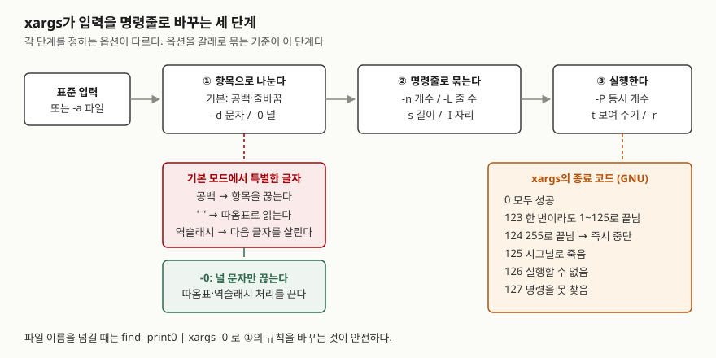

## 들어가며

로그 폴더가 차서 30일 넘은 `.log` 파일을 지우려고 `find /var/log/app -name '*.log' -mtime +30 | xargs rm`을 친다.
에러 한 줄이 뜨고 끝났는데 폴더를 다시 보면 파일이 절반쯤 남아 있다. 이름에 공백이나 작은따옴표가 든 파일이
섞여 있었기 때문이다. 이런 일을 겪으면 대개 `for f in $(find ...)`로 바꾸거나 파일마다 `rm`을 따로 돌린다.
전자는 같은 공백 문제를 그대로 갖고, 후자는 파일 1만 개면 `rm` 프로세스를 1만 번 띄운다.
`xargs`가 입력을 어떤 규칙으로 자르는지 알면 한 줄로 끝난다.

## 개념

`xargs`는 **표준 입력에서 읽은 항목을 명령의 인자로 붙여 실행**한다. 파이프는 데이터를 명령의 입력(stdin)으로
넘기지만, `rm`·`ls`·`grep 패턴 파일…`처럼 **인자**로 받아야 하는 명령이 있다. 그 사이를 잇는 것이 `xargs`다.

명령을 빼면 기본으로 `echo`를 돌린다(POSIX 규정). 그리고 인자를 한 번에 몰아 붙이므로 파일 1만 개도
명령줄 길이 한도 안에서 몇 번의 실행으로 끝난다.

## 구조



> **출처**: 기본 모드의 따옴표·역슬래시 처리와 `-I`·`-L` 규칙은 [The Open Group Base Specifications Issue 8 — xargs: DESCRIPTION·OPTIONS](https://pubs.opengroup.org/onlinepubs/9799919799/utilities/xargs.html),
> 종료 코드와 `-P`·`--process-slot-var`·`-d`는 [GNU findutils xargs(1) 매뉴얼 원본 (2024-06-03)](https://cgit.git.savannah.gnu.org/cgit/findutils.git/plain/xargs/xargs.1)의 EXIT STATUS·OPTIONS 절을,
> 옵션 목록은 설치된 4.10.0의 `xargs --help` 출력을 따랐다.

## 동작 원리

**① 나누기.** 기본 모드에서 `xargs`는 공백과 줄바꿈으로 항목을 끊고, 작은따옴표·큰따옴표로 묶인 문자열은
하나로 읽고, 역슬래시 뒤의 글자는 그대로 살린다. 셸과 비슷한 규칙이라 파일 이름을 넘길 때 문제가 된다.
`-d 문자`는 그 문자로만 끊고, `-0`은 널 문자로만 끊는다. 둘 다 따옴표·역슬래시 처리와 `-E`를 끈다.

**② 묶기.** 항목을 명령줄 하나에 몇 개 붙일지 정한다. 기준은 개수(`-n`), 입력 줄 수(`-L`), 바이트 길이(`-s`)이고,
`-I`는 개수 대신 자리를 정한다. GNU 매뉴얼은 `-s`의 기본값을 시스템 한도와 128KiB 중 작은 쪽으로 잡는다고 적는다.

**③ 실행.** 만든 명령줄을 차례로, 또는 `-P`만큼 동시에 돌리고, 자식의 종료 코드를 모아 자기 종료 코드를 정한다.

## 실습 예제

전체 소스: [`code/xargs_options.sh`](code/xargs_options.sh), 실행 기록: [`code/output.txt`](code/output.txt).
스크립트가 임시 폴더에 `app.log`, `report 2026.log`, `it's.log`, 이름에 줄바꿈이 든 `two⏎lines.log`를 만들고
끝나면 지운다. 환경은 Windows 11의 Git Bash다.

### 옵션 한눈에 — 4.10.0 `--help` 기준

| 갈래 | 옵션 | 하는 일 | 확인 |
|---|---|---|---|
| 나누기 | `-0` / `-d 문자` | 널 / 지정 문자로만 끊는다 | 2장 |
| | `-a 파일` | stdin 대신 파일에서 읽는다 | 3장 |
| | `-E 끝` / `-e[끝]` | 이 줄이 나오면 나머지 입력을 버린다 | 3장 |
| 묶기 | `-n 개수` | 명령줄 하나에 인자 최대 개수 | 4장 |
| | `-L 줄` / `-l[줄]` | 비어 있지 않은 입력 줄 최대 개수 | 4장 |
| | `-s 바이트` / `-x` | 명령줄 길이 한도 / 넘치면 중단 | 5장 |
| | `-I 자리` / `-i[자리]` | 줄마다 한 번, 자리에 항목을 넣는다 | 6장 |
| | `--show-limits` | 길이 한도를 보여 준다 | 0장 |
| 실행 | `-r` | 입력이 비면 실행하지 않는다 | 7장 |
| | `-t` | 실행할 명령을 stderr에 찍는다 | 8장 |
| | `-P 개수` / `--process-slot-var` | 동시 실행 개수 / 자식별 슬롯 번호 | 9장 |
| | `-p` / `-o` | 실행 전 묻기 / 자식의 stdin을 터미널로 | 돌리지 않음 |

`-p`와 `-o`는 터미널이 필요해 무인 실행에서 돌리지 않았다.

### 나누기 — 따옴표 하나에 멈춘다

```text
$ echo "'a b' c" | xargs -n 1 echo
a b
c
$ find logs -name '*.log' | sort | xargs ls -1
xargs: unmatched single quote; by default quotes are special to xargs unless you use the -0 option
ls: cannot access 'lines.log': No such file or directory
logs/app.log
[종료 코드 123]
```

두 번째가 들어가며의 장면이다. `xargs`는 `it's.log`의 작은따옴표를 여는 따옴표로 읽고, 닫는 따옴표를 못 찾자
**그때까지 모은 인자로 한 번 실행하고 멈췄다.** 그 뒤의 `report 2026.log`는 아예 넘어가지 않았다.
에러가 나도 앞쪽 일부는 처리되므로 `rm`이었다면 "절반쯤 지워진" 상태가 된다.

```text
$ find logs -name '*.log' | sort | xargs -d '\n' ls -1
ls: cannot access 'lines.log': No such file or directory
ls: cannot access 'logs/two': No such file or directory
logs/app.log
logs/it's.log
logs/report 2026.log
$ find logs -name '*.log' -print0 | sort -z | xargs -0 -n 1 printf '[%s]\n'
[logs/app.log]
[logs/it's.log]
[logs/report 2026.log]
[logs/two
lines.log]
```

`-d '\n'`은 공백과 따옴표를 견뎠지만 이름 안의 줄바꿈에서 깨졌다. 파일 이름에 들어갈 수 없는 문자는 널뿐이므로
`find -print0 | xargs -0`만 네 파일을 모두 온전히 넘겼다. 중간에 정렬이 필요하면 `sort -z`처럼 널 구분을 이어 간다.
`-0`을 쓰면 `-E STOP`은 경고와 함께 무시됐다.

### 묶기 — 개수, 줄, 길이

```text
$ printf '1 2 3\n4 5\n6\n' | xargs -n 2 echo
1 2
3 4
5 6
$ printf '1 2 \n3\n4\n' | xargs -L 1 echo
1 2 3
4
```

`-n`은 줄과 상관없이 항목 개수로 끊었다. `-L 1`은 줄 단위인데, 두 번째처럼 **줄 끝에 공백이 있으면 다음 줄까지
한 줄로 이었다.** POSIX가 정한 규칙이고, 공백이 끝에 남은 입력 파일에서 `-L`의 결과가 어긋나는 원인이 된다.

`-s 20`은 명령줄을 20바이트로 제한해 `seq 1 12`를 두 번에 나눠 돌렸다. 여기에 `-x`를 붙여도 결과가 같았다.
`-x`가 차이를 만든 것은 `-n 10 -s 20`처럼 **요청한 개수가 한도에 안 들어갈 때**뿐이었다. `-x` 없이는
7개와 5개로 조용히 쪼개 돌렸고, `-x`를 붙이자 `argument list too long`으로 멈췄다(종료 코드 1).

```text
Maximum length of command we could actually use: 20380
Size of command buffer we are actually using: 25166
```

`--show-limits`가 보고한 한도다. 이 값은 Git Bash(Cygwin) 환경의 것이고 시스템마다 다르므로,
리눅스 서버에서는 같은 명령으로 그 서버의 값을 확인한다.

### 자리 바꿔 넣기 — `-I`

```text
$ printf 'a b\nc\n' | xargs -I {} echo '<{}>'
<a b>
<c>
$ printf '  lead\n' | xargs -I {} echo '<{}>'
<lead>
```

`-I`는 줄 하나를 항목 하나로 읽어 공백이 든 줄도 쪼개지 않았다. 대신 **줄 앞의 공백은 지웠다.** POSIX 규정이고,
GNU 매뉴얼은 `-I`가 `-x`와 `-L 1`을 함께 켠다고 적는다. 줄마다 명령을 한 번씩 띄우므로 항목이 많으면 느리다.

### 실행 — 빈 입력, 병렬, 종료 코드

`printf '' | xargs echo 'ran with:'`는 입력이 없는데도 `ran with:`를 찍었다. `-r`을 붙이자 아무것도 돌지 않았다.
`find ... | xargs rm`에서 찾은 것이 없으면 인자 없는 `rm`이 돈다는 뜻이다.

```text
$ printf '0.6\n0.2\n0.4\n' | xargs -P 3 -n 1 sh -c 'sleep "$0"; echo done $0'
done 0.2
done 0.4
done 0.6
$ seq 1 4 | xargs -P N -n 1 sh -c 'sleep 0.5'   (N = 1, 2, 4)
-P 1 : 2254 ms
-P 2 : 1348 ms
-P 4 : 770 ms
```

`-P 3`은 입력 순서(0.6, 0.2, 0.4)가 아니라 **끝난 순서**로 찍었다. 0.5초짜리 4개는 `-P 1`에서 2초를 조금 넘고,
`-P 4`에서 한 번 분량 근처까지 줄었다. 0.5초를 넘는 부분은 프로세스를 띄우는 비용이다. `-P 0`은 가능한 만큼
동시에 돌리고, `--process-slot-var=SLOT`은 자식마다 0·1 같은 슬롯 번호를 넣어 주며 끝난 자식의 번호를 다시 썼다.

| 경우 | 출력 | 종료 코드 |
|---|---|---|
| 자식이 1로 끝남 | (없음) | 123 |
| 자식이 255로 끝남 | `xargs: sh: exited with status 255; aborting` — 두 번째 항목 `b`는 돌지 않음 | 124 |
| 명령이 없음 | `xargs: no-such-command: No such file or directory` | 127 |
| 인자 하나가 `-s` 한도를 넘음 | `xargs: cannot fit single argument within argument list size limit` | 1 |

자식이 1~125로 끝나면 `xargs`는 나머지를 계속 돌리고 마지막에 123을 돌려준다. 255만 즉시 중단 신호로 쓰인다.
실행 권한이 없는 파일을 줄 때의 126은 **재현하지 못했다.** 권한 비트 없이 만든 `not_exec.sh`가 Git Bash에서는
그대로 실행돼 0이 나왔다. Windows 파일 권한을 따르는 이 환경의 차이이고, 리눅스에서 확인할 부분으로 남긴다.

## 실무에서 주의할 점

- **파일 이름은 `-print0 | xargs -0`으로 넘긴다.** 기본 모드는 따옴표 하나에 앞쪽만 처리하고 멈추고, `-d '\n'`도
  줄바꿈 든 이름에서 깨졌다. 중간에 `grep`·`sort`를 끼우면 `grep -z`·`sort -z`로 널 구분을 이어 간다.
- **지우는 명령에는 `-r`을 붙인다.** 입력이 비어도 명령이 인자 없이 한 번은 돈다(7장). 인자가 없을 때
  무엇을 하는지는 명령마다 다르므로, 그 경우를 따져 보기보다 아예 돌지 않게 막는 편이 싸다.
- **`-P` 출력은 섞인다.** 끝난 순서로 나오고, 매뉴얼은 여러 자식이 함께 쓰면 뒤섞일 가능성이 크다고 경고한다.
  결과를 모아 쓰려면 자식마다 다른 파일에 쓰거나 끝난 뒤 `sort`한다.
- **종료 코드 123은 "일부 실패"다.** 앞쪽 몇 개만 실패해도 나머지는 계속 돌고 끝에서 123이 나온다. 첫 실패에서
  멈추려면 자식이 `exit 255`로 끝나게 감싼다.
- **`-I`는 줄마다 한 번 실행한다.** 인자를 모아 한 번에 넘기는 `xargs`의 장점을 버리는 셈이므로, 자리가
  맨 끝이면 `-I` 대신 기본 모드나 `-n`을 쓴다.

## 정리

- `xargs`는 입력을 ① 항목으로 나누고 ② 명령줄로 묶어 ③ 실행한다. 옵션도 이 세 갈래로 나뉜다.
- 기본 모드는 공백·따옴표·역슬래시를 특별하게 읽어, 따옴표 든 파일 이름 하나에서 앞쪽만 실행하고 멈췄다.
- 파일 이름에 안전한 구분은 널뿐이므로 `find -print0 | xargs -0`을 쓴다.
- `-x`는 `-n`과 함께일 때 차이를 만들고, 입력이 비어도 명령은 한 번 돌며(`-r`로 막는다), `-P`는 끝난 순서로 출력한다.
- 종료 코드 123은 일부 실패, 124는 255로 인한 중단, 127은 명령 없음이다.

## 참고 자료

- [The Open Group Base Specifications Issue 8 (IEEE Std 1003.1-2024) — xargs](https://pubs.opengroup.org/onlinepubs/9799919799/utilities/xargs.html) — DESCRIPTION(따옴표·역슬래시, 입력이 없을 때 1회 실행), OPTIONS(`-I` 앞 공백 무시·`-x` 강제, `-L` 끝 공백 이어 읽기, `-x`), OPERANDS(기본 `echo`), EXIT STATUS, CONSEQUENCES OF ERRORS(255로 끝난 자식)
- [GNU findutils — xargs(1) 매뉴얼 원본 (2024-06-03)](https://cgit.git.savannah.gnu.org/cgit/findutils.git/plain/xargs/xargs.1) — `-P`·`--process-slot-var`·`-d`·`-s` 기본값, EXIT STATUS(123·124·125·126·127). 저장소 최신본이며 설치판 4.10.0과 같은 해의 것이다
- 설치된 GNU findutils 4.10.0의 `xargs --help`·`--show-limits` 출력 — [`code/output.txt`](code/output.txt)
