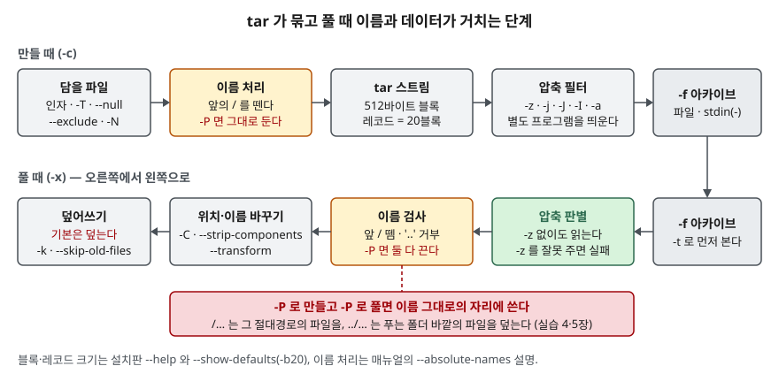

## 들어가며

서버를 옮기면서 설정 폴더를 묶어 새 서버에 풀어야 하는 일이 생긴다. 검색해서 나온 `tar -zcvf`를 외워 두었다가,
어느 날 순서를 바꿔 `tar -cfv conf.tar /etc/app`을 치면 `Cannot stat` 에러와 함께 `v`라는 파일이 생긴다.
받은 아카이브를 풀 때는 더 조용히 사고가 난다. 누군가 절대경로를 넣어 만든 아카이브를 습관처럼 `-P`까지 붙여 풀면,
지금 폴더가 아니라 `/etc/app/app.conf` 자리에 옛 설정이 덮인다. 대부분은 이런 일을 겪고 나서야 옵션 하나하나를
매뉴얼에서 찾는데, tar의 `--help`만 300줄이 넘는다.

## 개념

`tar`는 여러 파일을 **하나의 아카이브**로 묶거나 푼다. 묶기만 하고 줄이지는 않는다. 줄이는 일은 `gzip`·`bzip2`·`xz` 같은
압축 프로그램이 하고, tar의 `-z`·`-j`·`-J`는 그 프로그램을 **별도 프로세스로 띄워** 스트림을 통과시킨다.
그래서 `.tar.gz`는 "tar로 묶은 것을 gzip으로 줄인 것"이다. `gzip`은 파일 하나만 다루고, 기본으로 **원본을 지우고** `.gz`로 바꾼다.

옵션을 쓰는 방식은 셋이다. `tar cvf`(옛 방식, 대시 없음), `tar -cvf`(짧은 옵션 묶음), `tar --create --file=…`(긴 옵션).
짧은 옵션을 묶을 때 **인자를 받는 옵션(`-f`) 바로 뒤의 글자는 그 인자**로 읽힌다. 옵션 순서가 문제가 되는 곳은 이 한 군데다.

## 구조



> **출처**: 이름 처리와 `-P`의 동작은 [GNU tar 매뉴얼 원본 tar.texi — absolute-names](https://cgit.git.savannah.gnu.org/cgit/tar.git/plain/doc/tar.texi),
> 블록·레코드 크기와 옵션 갈래는 설치된 1.35의 `tar --help`·`--show-defaults` 출력([`code/output.txt`](code/output.txt)),
> 종료 코드는 [tar(1) — RETURN VALUE](https://man7.org/linux/man-pages/man1/tar.1.html#RETURN_VALUE)를 따랐다.

## 동작 원리

**만들 때.** tar는 아카이브를 512바이트 블록 단위로 쓰고(`-R`이 멤버마다 블록 번호를 찍는다), 블록 여러 개를 레코드로 모아 내보낸다. 이 판의 기본은
20블록(10,240바이트)을 한 레코드로 모아 쓰는 것이고(`-b20`), 12장에서 `--checkpoint=4`가 #4·#8·#12를 찍은 것은
120KiB 아카이브가 12레코드였기 때문이다. 이름은 이 단계에서 앞의 `/`가 떨어진다. 매뉴얼은 만들 때 앞의 `/`를 떼고,
풀 때는 앞의 `/`와 중간의 `..`을 특별하게 다루며, `--absolute-names`(`-P`)가 **이 둘을 모두 끈다**고 적는다.

**풀 때.** 순서가 거꾸로다. 읽을 때는 압축 형식을 스스로 알아내므로 `-z`가 없어도 `.tar.gz`를 읽었다. 반대로 압축되지 않은
아카이브에 `-z`를 주면 `gzip: stdin: not in gzip format`으로 실패했다. 그 다음 이름 검사, `-C`·`--strip-components`·`--transform`,
덮어쓰기 정책 순으로 지난다.

## 실습 예제

전체 소스: [`code/tar_gzip_options.sh`](code/tar_gzip_options.sh), 실행 기록: [`code/output.txt`](code/output.txt).
`app/` 아래에 `conf/app.conf`, `logs/a.log`, `.git/HEAD`, 2만 줄짜리 `data.txt`를 만들어 쓴다. 환경은 Windows 11의 Git Bash이고
bzip2·xz는 깔려 있고 zstd는 없다.

### 옵션 한눈에 — 1.35 `--help` 기준

| 갈래 | 옵션 | 하는 일 | 확인 |
|---|---|---|---|
| 동작 모드 | `-c` `-t` `-x` | 만들기 / 목록 / 풀기 | 1장 |
| | `-r` `-u` `-A` `--delete` | 끝에 붙이기 / 새것만 붙이기 / 아카이브 잇기 / 지우기 | 1장 |
| | `-d` | 아카이브와 디스크 비교 | 11장 |
| 압축 | `-z` `-j` `-J` `--zstd` | gzip / bzip2 / xz / zstd 통과 | 3장 |
| | `-a` / `-I 프로그램` | 확장자로 고르기 / 임의 프로그램 | 3장 |
| 이름 | `-P` | 앞의 `/`와 `..`을 그대로 둔다 | 4·5장 |
| | `--transform` `--strip-components` | 이름 바꾸기 / 앞 경로 떼기 | 7장 |
| 풀 위치 | `-C 폴더` `--one-top-level` | 그 폴더에 / 하위 폴더를 만들어 | 7장 |
| | `-O` `--to-command` | stdout으로 / 다른 명령의 입력으로 | 7장 |
| | 멤버 이름, `--wildcards` | 일부만 / 패턴으로 | 7장 |
| 덮어쓰기 | 기본, `-k`, `--skip-old-files` | 덮는다 / 에러 / 조용히 건너뛴다 | 8장 |
| | `--keep-newer-files` `--backup` | 디스크가 새것이면 둔다 / 번호 붙여 남긴다 | 8장 |
| 선택 | `--exclude` `--exclude-vcs` | 패턴 / `.git` 등 VCS 폴더 | 9장 |
| | `-T` `--null` `--no-recursion` | 목록 파일 / 널 구분 / 폴더 안으로 안 들어감 | 9장 |
| | `-N` `--newer-mtime` | 날짜보다 새것만 (기준이 다르다) | 9장 |
| | `--remove-files` | 담은 뒤 원본 삭제 | 9장 |
| 속성 | `--sort` `--mtime` `--owner` `--group` `--numeric-owner` | 순서·시각·소유자 고정 | 10장 |
| 검사 | `-W` `-g 스냅숏` | 쓴 뒤 검증 / 증분 백업 | 11장 |
| 출력 | `-v` `--totals` `--checkpoint` `-R` `--full-time` `--utc` `--index-file` | 목록·합계·진행·블록 번호·시각 | 12장 |

`-M`·`-L`·`-F`(테이프 여러 권), `--rmt-command`, `--acls`·`--xattrs`·`--selinux`, `-p`·`--same-owner`는 이 환경에서
의미 있게 확인할 수 없어 돌리지 않았다. `-h`는 Git Bash의 `ln -s`가 링크 대신 복사본을 만들어 제외했다.

### 옵션 순서 — `-cfv`

```text
$ tar -cfv style4.tar app/conf
tar: style4.tar: Cannot stat: No such file or directory
tar: Exiting with failure status due to previous errors
[종료 코드 2]
$ tar -tf v
app/conf/
app/conf/app.conf
```

`-f`가 바로 뒤의 `v`를 아카이브 이름으로 가져갔다. `style4.tar`는 담을 파일로 읽혀 `Cannot stat`이 났고, 그래도
`app/conf`는 `v`라는 아카이브에 들어갔다. `-cvf`·`cvf`·`--file=`은 모두 정상이었고, `-cf style5.tar -v`처럼
`-v`를 따로 떼어 뒤에 붙여도 됐다. `-c`와 `-x`를 함께 주면 `You may not specify more than one '-Acdtrux'`로 거절됐다.

### 절대경로와 `-P`

```text
$ tar -cPf abs-p.tar /tmp/tardemo/etc-sample/app.conf
$ tar -xf ../abs-p.tar
tar: Removing leading `/' from member names
$ find . -type f
./tmp/tardemo/etc-sample/app.conf
$ tar -xPf ../abs-p.tar
$ cat /tmp/tardemo/etc-sample/app.conf
secret=old
```

`-P`로 만든 아카이브도 `-P` 없이 풀면 `/`를 떼고 **지금 폴더 아래에** 풀었다. `-P`를 붙여 풀자 그 사이 `secret=CHANGED`로
바꿔 둔 원래 자리의 파일이 아카이브 안의 옛 내용으로 덮였다. 경고는 한 줄도 없었다.

`../outside.txt`처럼 위로 올라가는 이름은 풀 때 `Member name contains '..'`로 **그 항목을 거절하고** 종료 코드 2를 냈다.
`-P`를 붙이면 푸는 폴더 바깥에 `outside.txt`를 만들었다. 목록(`-t`)에서는 두 경우 모두 `Removing leading …` 경고를 내면서도
이름은 `/tmp/…`, `../outside.txt` 그대로 찍었다. 그래서 풀기 전에 목록을 걸러 보면 찾아진다.

```text
$ tar -tf abs-p.tar | grep -E '^/|(^|/)\.\.(/|$)'
/tmp/tardemo/etc-sample/app.conf
```

### 압축 — 크기와 자동 판별

```text
122880 app.tar
 45577 app.tar.gz
 45540 best.tar.gz
 25787 app.tar.bz2
  5928 app.tar.xz
```

2만 줄짜리 숫자 파일이 든 아카이브라 xz가 gzip의 약 8분의 1(45,577 → 5,928바이트)까지 줄였다. `-a`는 `.gz`·`.xz` 확장자를 보고 알맞은 프로그램을
골랐고, `-a` 없이 `fake.tar.gz`라고 이름만 붙이면 압축되지 않은 tar가 만들어져 `gzip -t`가 `not in gzip format`을 냈다.
zstd가 없는 환경의 `--zstd`는 `Child returned status 127`로 끝났다 — 압축이 별도 프로세스라는 것이 여기서 드러난다.

### 풀 위치와 이름 — `--transform`의 빈 폴더

```text
$ tar -xf app.tar -C xform --transform="s,^app/,myapp/," && ls xform
app
myapp
$ tar -tf app.tar --transform="s,^app/,myapp/," --show-transformed-names | head -n 3
app/
myapp/.git/
myapp/.git/HEAD
```

**예상과 다른 결과다.** 파일은 전부 `myapp/` 아래로 갔는데 빈 `app/` 폴더가 하나 남았다. 폴더 항목은 목록에 `app/`로 찍히지만
식은 끝 슬래시가 없는 `app`에 적용되어 `^app/`에 맞지 않았다. `s,^app\(/\|$\),myapp\1,`로 쓰자 `myapp` 하나만 생겼다.
`--strip-components=1`은 맨 앞의 `app/`를 떼어 `conf`·`data.txt`·`logs`를 바로 풀었고, `--wildcards` 없이 `"app/logs/*.log"`를 주면
패턴을 글자 그대로 찾아 `Not found in archive`가 났다.

### 덮어쓰기와 선택

디스크의 `app.conf`를 `port=9090`으로 바꾼 뒤 그냥 풀면 `port=8080`으로 **덮였다.** `-k`는 파일마다 `File exists`를 내고
종료 코드 2로 끝났고, `--skip-old-files`는 조용히 넘어갔다. `--keep-newer-files`는 파일을 지켰지만 이 환경에서는 폴더마다
`Unexpected inconsistency when making directory`를 함께 내고 종료 코드 2를 냈다. 원인은 확인하지 못했다.

```text
$ tar -cf newer.tar -N "2026-03-01" app; tar -tf newer.tar | grep -v "/$"
app/.git/HEAD
app/conf/app.conf
app/data.txt
app/logs/a.log
$ tar -cf newer2.tar --newer-mtime="2026-03-01" app; tar -tf newer2.tar | grep -v "/$"
app/logs/a.log
```

**이것도 예상과 달랐다.** 수정 시각을 2026-01-01로 맞춘 파일까지 `-N`에 걸렸다. `stat`을 보면 이 파일들의 ctime(상태 변경 시각)이
오늘이다. 실측으로는 `-N`이 수정 시각이 오래돼도 상태 변경 시각이 새로우면 담았고, 수정 시각만 보려면 `--newer-mtime`을 써야 했다.
방금 복사하거나 권한을 바꾼 파일은 ctime이 새로워서 전부 들어간다.

### 재현 가능한 아카이브와 검사

같은 폴더를 1초 간격으로 두 번 묶으면 바이트가 달랐다(`differ`). `--sort=name --mtime=@0 --owner=0 --group=0 --numeric-owner`를
붙이자 두 번이 같았고(`same`), 여기에 `-z`를 더해도 같았다. `-d`는 내용을 바꾼 파일에 `Mod time differs`·`Size differs`를
찍고 종료 코드 1을 냈다. `-g snap.db`로 증분을 걸자 두 번째 묶음에는 새로 만든 `app/logs/b.log` 하나만 들어갔다.

| 종료 코드 | 뜻 (tar(1)) | 실습에서 나온 곳 |
|---|---|---|
| 0 | 정상 종료 | 대부분 |
| 1 | 일부 파일이 다름 | `-d` 비교 |
| 2 | 치명적 오류 | `-cfv`, 없는 멤버, `..` 거절, `-k`, `-z` 잘못 줌 |

### gzip 단독

```text
$ gzip -dc g.txt.gz | gzip -1 > seq1.gz && … gzip -9 > seq9.gz && wc -c seq1.gz seq9.gz
105341 seq1.gz
109144 seq9.gz
$ … wc -c help.txt help1.gz help6.gz help9.gz
16672 help.txt
 5816 help1.gz
 5150 help6.gz
 5133 help9.gz
```

**예상과 반대로** `seq 1 50000` 출력에서는 `-1`이 `-9`보다 3.5% 작았다. 영어 텍스트인 `tar --help` 출력에서는 `-9`가 가장 작았다.
압축 수준은 "클수록 작다"가 보장되지 않으므로 실제 데이터로 재 보고 고른다.

그 밖에 `gzip 파일`은 원본을 지웠고, `-k`는 남겼고, `.gz`가 이미 있으면 `not overwritten`(종료 코드 2)으로 멈춰 `-f`가 필요했다.
`-c`는 stdout으로 내보내 원본을 건드리지 않았다. `-N`으로 풀면 `renamed.gz`가 안에 저장된 이름 `orig.txt`로 풀렸고,
`-n`으로 만든 파일은 이름·시각을 저장하지 않아 같은 내용이면 바이트까지 같았다. `-r`은 폴더 안 파일을 하나씩 따로 압축했다.

## 실무에서 주의할 점

- **받은 아카이브는 `-t`로 먼저 본다.** `^/`나 `..`이 든 이름이 있으면 풀지 않거나 `-C`로 빈 폴더에 푼다. 그리고 풀 때 `-P`를 붙이지 않는다.
  `-P` 없이 푸는 한 tar가 `/`를 떼고 `..`을 거절한다.
- **기본은 덮어쓴다.** 기존 파일을 지켜야 하면 `--skip-old-files`나 `--backup=numbered`를 붙인다. `-k`는 종료 코드 2를 내므로
  스크립트에서 실패로 잡힌다.
- **`-f`는 묶음의 맨 끝에 둔다.** `-czf 이름`처럼 쓰거나 긴 옵션 `--file=`을 쓴다.
- **증분·선별 백업에서 `-N`과 `--newer-mtime`을 구분한다.** `-N`은 ctime도 보므로 복사·권한 변경 뒤 전부 다시 담긴다.
- **`--transform`은 폴더 항목까지 맞는 식을 쓰고 `--show-transformed-names`로 먼저 본다.**
- **배포물처럼 같은 입력에서 같은 파일이 나와야 하면** `--sort=name --mtime --owner --group --numeric-owner`를 붙인다.
  gzip 단독이면 `-n`을 쓴다.

## 정리

- tar는 묶기만 하고 압축은 별도 프로세스(gzip·bzip2·xz)가 한다. 읽을 때는 압축 형식을 스스로 알아낸다.
- `-f`는 바로 뒤를 인자로 가져가므로 `-cfv`는 `v`라는 아카이브를 만든다.
- 만들 때 앞의 `/`를 떼고, 풀 때 `/`를 떼고 `..`을 거절한다. `-P`는 둘 다 끄므로 받은 아카이브를 `-P`로 풀면 원래 자리의 파일이 덮인다.
- `-N`은 ctime도 보고, `--transform`은 끝 슬래시 없는 폴더 이름에 적용되며, gzip `-1`이 `-9`보다 작은 데이터가 있다.
- 종료 코드는 0 정상, 1 파일 다름, 2 치명적 오류다. gzip은 경고에도 2를 낸다.

## 참고 자료

- [GNU tar 매뉴얼 원본 tar.texi (savannah)](https://cgit.git.savannah.gnu.org/cgit/tar.git/plain/doc/tar.texi) — `--absolute-names`(만들 때 `/` 제거, 풀 때 `/`·`..` 특별 처리를 끔), Synopsis의 종료 코드. 저장소 최신본이라 설치판 1.35보다 새 판일 수 있다
- [tar(1) — man7.org](https://man7.org/linux/man-pages/man1/tar.1.html) — 옵션 설명, RETURN VALUE. 페이지 날짜 2026-06-11로 설치판 1.35보다 새 판이다
- [gzip(1) 매뉴얼 원본 (savannah)](https://cgit.git.savannah.gnu.org/cgit/gzip.git/plain/gzip.1) — 기본 동작(원본 교체), `-n`·`-N`, 기본 수준 `-6`, 종료 코드(경고 2)
- 설치된 GNU tar 1.35·gzip 1.14의 `--help`·`--show-defaults` 출력 — [`code/output.txt`](code/output.txt) (옵션 목록은 `code/` 의 확인용 스크립트로 뽑았다)
