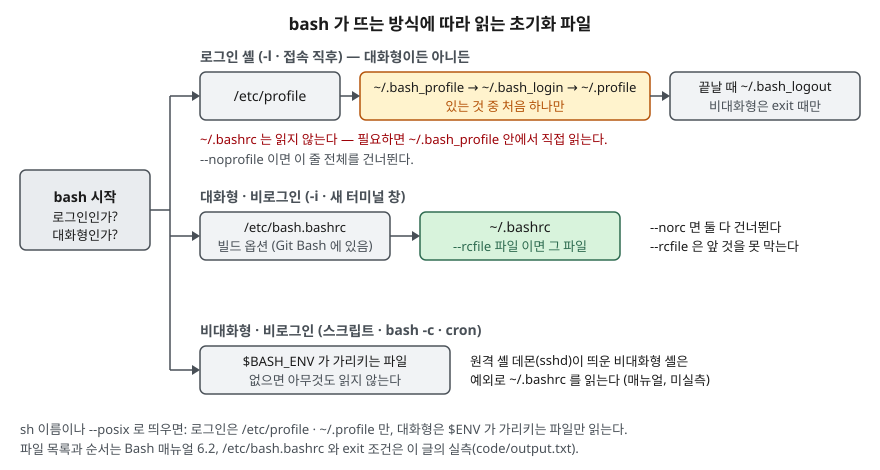

## 들어가며

서버에 새 도구를 깔고 `~/.bashrc`에 `export PATH=$PATH:/opt/tool/bin`을 넣는다. 터미널을 새로 열면 잘 되는데, SSH로 막 접속한 셸에서는
`command not found`가 나고, cron에 건 스크립트에서는 아예 변수가 비어 있다. 대부분은 이때 `.bash_profile`·`.profile`·`/etc/profile`에
같은 줄을 하나씩 더 넣어 본다. 그러다 보면 셸을 하나 더 띄울 때마다 PATH에 같은 경로가 또 붙는다. 이 예제에서는 셸 세 겹에서 `/opt/demo/bin`이
세 번 붙었다. 어느 파일이 언제 읽히는지 모르고 파일을 늘리면 문제가 옮겨 갈 뿐이다.

## 개념

셸이 쓰는 변수는 두 종류다. **셸 변수**는 그 셸 안에서만 보이고, **환경변수**는 셸이 새 프로세스를 띄울 때 넘겨준다. `export`는 셸 변수에
"넘겨줄 것" 표시(`declare -x`)를 붙이는 명령이다. 자식은 받은 값을 고칠 수 있지만 그 변경은 부모로 돌아오지 않는다.

그래서 값은 **셸이 뜰 때 읽는 초기화 파일**에서 정해진다. bash는 자신이 **로그인 셸**인지(접속 직후, `-l`), **대화형**인지(`-i`,
사람이 명령을 치는 터미널)를 보고 읽을 파일을 고른다. 둘 다 아닌 셸 — 스크립트, `bash -c`, cron이 띄우는 셸 — 은 기본으로 아무 파일도 읽지 않는다.

## 구조



> **출처**: 파일 목록·순서·옵션은 [Bash Reference Manual §6.2 Bash Startup Files](https://www.gnu.org/software/bash/manual/html_node/Bash-Startup-Files.html#Invoked-as-an-interactive-login-shell_002c-or-with-_002d_002dlogin),
> `/etc/bash.bashrc`와 `exit` 조건은 이 글의 실측([`code/output.txt`](code/output.txt)). 매뉴얼은 온라인 최신판이며 설치판은 5.3.9다.

## 동작 원리

로그인 셸은 `/etc/profile`을 읽고, `~/.bash_profile`·`~/.bash_login`·`~/.profile`을 **이 순서로 찾아 처음 있는 것 하나만** 읽는다.
대화형·비로그인 셸은 `~/.bashrc`를 읽는다. 둘은 겹치지 않는다. **로그인 셸은 대화형이어도 `~/.bashrc`를 읽지 않는다**(1-E).
그래서 `~/.bash_profile` 안에서 `~/.bashrc`를 직접 읽게 한다(2-D). Git for Windows도 `.bash_profile`이 없으면 이 줄을 넣은 파일을 만들어 준다
(`/etc/profile.d/bash_profile.sh`).

비대화형 셸은 `BASH_ENV` 환경변수가 있으면 그 파일만 읽는다. 매뉴얼은 이때 PATH로 파일을 찾지 않는다고 적으므로 절대경로를 준다.
`sh`라는 이름이나 `--posix`로 띄우면 POSIX 셸을 흉내 내어 로그인은 `/etc/profile`·`~/.profile`만, 대화형은 `ENV`가 가리키는 파일만 읽는다.

시스템 쪽 `/etc/bash.bashrc`는 bash 소스의 `config-top.h`에서 `SYS_BASHRC`를 켜야 생기는 기능이고 기본값은 꺼져 있어서 GNU 매뉴얼의 목록에는 없다. 이 환경(Git for Windows)의 bash에는 켜져 있어서
대화형·비로그인 셸이 `~/.bashrc`보다 먼저 읽었다.

## 실습 예제

전체 소스: [`code/bash_startup_env.sh`](code/bash_startup_env.sh), 실행 기록: [`code/output.txt`](code/output.txt).
`/tmp/shinit/home`을 HOME으로 삼아 초기화 파일마다 `[읽음] ~/파일`을 찍게 하고, 새 셸은 `env -i`로 빈 환경에서 띄웠다.
시스템 파일은 흔적으로 판별했다. `/etc/profile`은 `CONFIG_SITE`를 export 하고, `/etc/bash.bashrc`는 대화형 셸에서 PS1을 export 한다.
터미널 없이 `-i`로 띄우면 나오는 `no job control` 경고 두 줄은 셸마다 같아서 걸러 냈다.

### 옵션 한눈에

| 갈래 | 옵션·명령 | 하는 일 | 확인 |
|---|---|---|---|
| 셸 모드 | `-c 명령` / `-l`(`--login`) / `-i` | 명령 실행 / 로그인 셸 / 대화형 | 1장 |
| 초기화 제어 | `--noprofile` / `--norc` | 로그인 파일 / bashrc 파일을 건너뜀 | 3장 |
| | `--rcfile 파일` = `--init-file 파일` | `~/.bashrc` 대신 그 파일 | 3장 |
| | `BASH_ENV` / `ENV` | 비대화형 / POSIX 대화형이 읽을 파일 | 1·4장 |
| | `--posix`, `sh` 이름 | POSIX 규칙으로 초기화 | 4장 |
| 변수 속성 | `export` `-n` `-p` `-f` | 내보내기 / 끄기 / 목록 / 함수 | 5장 |
| | `declare -p` `-x`, `set -a` | 속성 보기 / 내보내기 / 이후 대입 자동 내보내기 | 5장 |
| env | `-i`(`-`) `-u` `-C` `-0` | 빈 환경 / 하나 빼기 / 폴더 바꾸기 / NUL 구분 | 6장 |
| | `-S` `-v` | 문자열 쪼개기(`#!` 줄) / 처리 과정 출력 | 6장 |
| | `--ignore-signal` `--list-signal-handling` | 자식이 시그널을 무시하게 / 기본과 다른 처리를 찍기 | 6장 |
| | `--default-signal` `--block-signal` | 기본 처리로 되돌리기 / 막기 | 돌리지 않음 |
| printenv | `이름…` `-0` | 값만 찍기, 없으면 종료 코드 1 | 6장 |

### 방식마다 읽는 파일

```text
[1-B 로그인·비대화형]  $ bash -l -c CMD
  [읽음] ~/.bash_profile
[1-C 로그인·비대화형, 끝에 exit]  $ bash -l -c 'CMD; exit'
  [읽음] ~/.bash_profile
  [읽음] ~/.bash_logout
[1-D 비로그인·대화형]  $ bash -i -c CMD
  [읽음] ~/.bashrc
  [상태] login=아니오 interactive=예 /etc/profile= /etc/bash.bashrc=읽음
[1-E 로그인·대화형]  $ bash -l -i -c CMD
  [읽음] ~/.bash_profile
```

(`[상태]` 줄은 1-D만 남기고 줄였다. 전체는 `output.txt`에 있다.)

**예상과 달랐던 것 하나.** `~/.bash_logout`은 로그인 셸이 끝나면 늘 읽힐 것 같았지만, `-c`로 준 명령이 그냥 끝날 때는 읽지 않고
`exit`로 끝낼 때만 읽었다. 매뉴얼도 비대화형 로그인 셸은 `exit` 내장 명령을 실행할 때라고 조건을 둔다. 스크립트에서 뒷정리를
`.bash_logout`에 맡기면 안 되는 이유다.

2장에서 `.bash_profile`을 지우자 `.bash_login`을, 그것도 지우자 `.profile`을 읽었다. 셋이 다 있어도 읽힌 것은 하나였다.

### 초기화 옵션 — `--rcfile`은 시스템 파일을 막지 못한다

```text
[3-B --norc]  $ bash --norc -i -c CMD
  [상태] login=아니오 interactive=예 /etc/profile= /etc/bash.bashrc=
[3-C --rcfile 파일]  $ bash --rcfile ~/.alt_rc -i -c CMD
  [읽음] ~/.alt_rc
  [상태] login=아니오 interactive=예 /etc/profile= /etc/bash.bashrc=읽음
[3-E --rcfile 을 로그인 셸에 주면]  $ bash --rcfile ~/.alt_rc -l -i -c CMD
  [읽음] ~/.bash_profile
```

**이것도 예상과 달랐다.** `--rcfile`로 파일을 바꾸면 초기화가 그 파일 하나로 끝날 줄 알았는데 `/etc/bash.bashrc`는 그대로 읽혔다.
`--rcfile`이 바꾸는 것은 `~/.bashrc` 자리뿐이고, 시스템 파일까지 끄려면 `--norc`를 써야 한다. 로그인 셸에서는 `--rcfile`이 아무 일도 하지 않았다.
`sh -i`와 `bash --posix -i`는 `~/.bashrc` 대신 `ENV=~/.posix_env`가 가리킨 파일을 읽었다(4장).

### 셸 변수와 환경변수

```text
[5-B declare -p 로 속성 보기, export -n 으로 내보내기 끄기]
  declare -x APP_MODE="dev"
  declare -- APP_MODE="dev"
  export -n 뒤 자식: 없음
[5-C 한 명령에만 주기]  $ APP_MODE=prod bash -c ...; echo $APP_MODE
  자식: prod
  부모: dev
[5-E set -a — 이후 대입을 전부 export]
  자식: AUTO_A=1 AUTO_B=없음
```

`declare -p`의 `-x`가 내보내기 표시이고, `export -n`은 값은 두고 표시만 뗀다. `이름=값 명령`은 그 명령에만 값을 준다.
자식이 `export`한 값은 부모에 남지 않았고, 같은 줄을 `.`(source)로 읽자 남았다. 초기화 파일이 `source`되는 이유다.
함수는 `export -f` 전에는 자식에서 `command not found`였다.

### env

```text
[6-B -i — 빈 환경에서 시작. PATH 도 비므로 명령 이름만 주면]  $ env -i DEMO_C=3 env
  env: 'env': No such file or directory
  종료 코드 127
[6-C 절대경로로 주면]  $ env -i DEMO_C=3 /usr/bin/env
  DEMO_C=3
  MSYSTEM=MINGW64
  SYSTEMROOT=C:\WINDOWS
  WINDIR=C:\WINDOWS
[6-H -S]
  -S 로 옵션을 붙인 #! 줄: ehB
  /usr/bin/env: 'bash -e': No such file or directory
  /usr/bin/env: use -[v]S to pass options in shebang lines
```

`env -i`는 PATH까지 비우므로 이 환경에서는 명령을 이름만으로 찾지 못했다. 절대경로를 주자 돌았는데, 비운 환경에 `MSYSTEM`·`SYSTEMROOT`·`WINDIR`
세 개가 따라 들어왔다. Git Bash에서만 보이는 줄로, 리눅스에서는 확인하지 않았다. `#!/usr/bin/env bash -e`는 `bash -e`를 한 이름으로 찾다가 실패했고
`#!/usr/bin/env -S bash -e`로 쓰자 `$-`에 `e`가 들어왔다. 그 밖에 `-u`는 한 변수만 뺐고, `-C /tmp`는 폴더를 바꿔 실행했고, `-0`은 값 안의
줄바꿈과 항목 경계를 구분했고, `-v`는 비우기·설정·실행 단계를 찍었고, `--ignore-signal=INT`는 `--list-signal-handling`에 `INT … IGNORE`로 나타났다.
`printenv`는 셸 변수 `LOCAL_ONLY`를 찾지 못해 종료 코드 1을 냈다.

### PATH가 겹으로 쌓인다

```text
[7-A .bashrc 에 PATH 추가, 대화형 셸을 세 겹 띄우면]
  PATH=/usr/bin:/bin:/opt/demo/bin:/opt/demo/bin:/opt/demo/bin
[7-B 이미 있으면 건너뛰게 고친 뒤]
  PATH=/usr/bin:/bin:/opt/demo/bin
[7-C PATH 가 아예 없는 빈 환경에서 bash 가 쓰는 PATH]
  PATH=/usr/local/bin:/usr/local/sbin:/usr/bin:/usr/sbin:/bin:/sbin:.
  export 됐나: declare -- PATH="/usr/local/bin:/usr/local/sbin:/usr/bin:/usr/sbin:/bin:/sbin:."
```

자식 셸은 부모의 PATH를 물려받은 뒤 `.bashrc`를 또 읽으므로 한 겹마다 한 번씩 붙었다. `case ":$PATH:"`로 이미 있으면 건너뛰게 하자 한 번만 남았다.
PATH가 없는 환경에서 bash는 기본값을 **셸 변수로만** 세웠고(export 안 됨), 이 빌드의 기본값은 끝에 현재 폴더 `.`이 붙어 있었다.

## 실무에서 주의할 점

- **환경변수는 로그인 파일에, 별칭·프롬프트는 `~/.bashrc`에 둔다.** 그리고 `~/.bash_profile`에서 `~/.bashrc`를 읽는다. 로그인 셸은 `~/.bashrc`를 읽지 않기 때문이다.
- **`~/.bash_profile`을 만들면 `~/.profile`은 더 읽히지 않는다(2장).** 그 전까지 `~/.profile`에 있던 설정이 조용히 빠지므로 `.bash_profile` 안에서 `.profile`도 읽는다.
- **PATH를 늘리는 줄은 중복을 검사한다.** 셸을 겹칠 때마다 붙고, 같은 경로가 길어지면 찾는 순서를 읽기 어려워진다.
- **스크립트·cron은 초기화 파일을 믿지 않는다.** 비대화형 셸은 아무것도 읽지 않으므로 필요한 변수와 PATH를 스크립트 첫머리에 적거나 `BASH_ENV`를 절대경로로 준다.
- **`env -i`로 깨끗한 환경을 만들 때는 명령을 절대경로로 쓰고 PATH·HOME을 직접 넣는다.** 비운 환경에서 bash가 세우는 기본 PATH는 빌드마다 다르고, 이 빌드처럼 `.`이 들어 있을 수 있다.
- **`#!` 줄에서 인자를 넘기려면 `env -S`를 쓴다.** coreutils 8.30부터 있는 옵션이다. `-C`는 8.28, 시그널 옵션은 8.31부터라 그보다 낮은 coreutils에서는 안 된다.

## 정리

- 로그인 셸은 `/etc/profile` 다음 `~/.bash_profile`·`~/.bash_login`·`~/.profile` 중 처음 하나만, 대화형·비로그인은 `~/.bashrc`, 비대화형은 `BASH_ENV`만 읽는다.
- 로그인 셸은 `~/.bashrc`를 읽지 않는다. `~/.bash_logout`은 비대화형 로그인 셸이면 `exit` 때만 읽혔다.
- `--rcfile`은 `~/.bashrc` 자리만 바꾸고 `/etc/bash.bashrc`는 막지 못했다. 둘 다 끄는 것은 `--norc`다.
- `export`는 자식에게 넘길 표시를 붙일 뿐이고 자식의 변경은 부모로 오지 않는다. 값을 남기려면 `source`한다.
- `.bashrc`에서 PATH를 늘리면 셸 겹마다 붙는다. 중복 검사를 넣는다.

## 참고 자료

- [Bash Reference Manual §6.2 Bash Startup Files](https://www.gnu.org/software/bash/manual/html_node/Bash-Startup-Files.html) — 로그인·대화형·비대화형·`sh`·`--posix`·원격 셸 데몬별 초기화 파일. 온라인 최신판이라 설치판 5.3.9와 판이 다를 수 있다
- [Bash Reference Manual §4.2 Bash Builtin Commands](https://www.gnu.org/software/bash/manual/html_node/Bash-Builtins.html) — `declare`·`export`, [§4.3.1 The Set Builtin](https://www.gnu.org/software/bash/manual/html_node/The-Set-Builtin.html) — `set -a`
- [GNU Coreutils Manual — env invocation](https://www.gnu.org/software/coreutils/manual/html_node/env-invocation.html) — `-i`·`-u`·`-C`·`-S`·시그널 옵션. 온라인 최신판이며 설치판은 8.32다
- [GNU coreutils NEWS](https://cgit.git.savannah.gnu.org/cgit/coreutils.git/plain/NEWS) — `env -C`(8.28), `-S`(8.30), 시그널 옵션(8.31) 추가
- [bash 소스 config-top.h](https://cgit.git.savannah.gnu.org/cgit/bash.git/plain/config-top.h) — `SYS_BASHRC "/etc/bash.bashrc"`가 기본으로 주석 처리돼 있다
- 설치된 bash 5.3.9·env 8.32의 `--help`, `help export`·`help declare` 출력 — `code/`의 확인용 스크립트로 뽑았다
- Git for Windows의 `/etc/profile`·`/etc/bash.bashrc`·`/etc/profile.d/bash_profile.sh` — 설치본을 직접 읽었다
