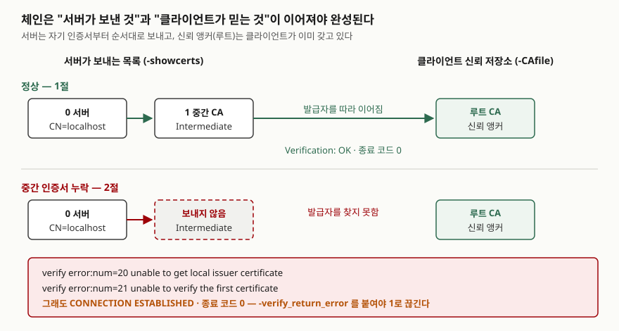

## 들어가며

새 서버에 인증서를 붙이고 브라우저로 열어 보니 자물쇠가 잘 뜬다. 그런데 며칠 뒤 배치 작업의 HTTP 클라이언트와
일부 안드로이드 단말에서만 "인증서를 확인할 수 없다"는 오류가 올라온다. 이때 흔히 하는 일은 브라우저를 바꿔 가며
다시 열어 보거나, 인증서 파일을 다시 받아 서버를 재시작하는 것이다. 브라우저는 예전에 받아 둔 중간 인증서를 재사용해
문제를 가리기도 해서, 재시작을 몇 번 해도 원인이 보이지 않는다. 서버가 실제로 **무엇을 보냈는지**를 보면 한 번에 끝난다.

## 개념

`openssl s_client`는 TLS 클라이언트다. 서버가 보낸 인증서 목록, 검증 결과와 오류 번호, 협상된 프로토콜을 그대로 찍는다.
받은 인증서는 `openssl x509`로 넘겨 만료일·이름을 읽고, 파일로 가진 인증서는 `openssl verify`로 같은 검증을 한다.

이 글은 외부 사이트 대신 스크립트가 만든 **사설 CA(루트 → 중간 → 서버)** 와 `127.0.0.1`의 `openssl s_server`를 쓴다.
중간 인증서를 빠뜨린 서버, 만료된 서버를 마음대로 만들 수 있어야 정상 출력과 고장 출력을 나란히 볼 수 있기 때문이다.
TLS 핸드셰이크 메시지 자체는 [TLS 핸드셰이크에서 실제로 오가는 것](../../../Infra/tls/2026-09-21-tls-handshake-openssl/index.md)에서 다뤘다.

## 구조



> **출처**: 인증서 목록 순서는 [RFC 8446 §4.4.2 Certificate](https://www.rfc-editor.org/rfc/rfc8446.html#section-4.4.2),
> `-showcerts`가 검증된 체인이 아니라 서버가 보낸 목록이라는 점은 [openssl-s_client(1) OPTIONS](https://docs.openssl.org/3.5/man1/openssl-s_client/#options),
> 체인 구성과 신뢰 앵커는 [openssl-verification-options(1) Certification Path Building](https://docs.openssl.org/3.5/man1/openssl-verification-options/#certification-path-building)을 따랐다.
> 오류 번호와 문구는 이 글의 예제 출력이다.

## 동작 원리

TLS 1.3 명세의 인증서 메시지 규정(RFC 8446 §4.4.2)은 보내는 쪽 인증서가 맨 앞에 오고, 그 뒤의 인증서가 앞의 것을 인증하며,
신뢰 앵커는 빼도 된다고 정한다. 그래서 서버는 보통 **자기 인증서 + 중간 CA**를 보내고, 루트는 클라이언트 신뢰 저장소에 있다.
클라이언트는 서버 인증서의 발급자를 받은 목록에서 찾고, 없으면 신뢰 저장소에서 찾는다. 두 곳 모두 없으면 체인이 끊긴다.

여기서 `s_client`의 기본값이 중요하다. 매뉴얼의 NOTES 절은 이 도구가 **검증 오류가 나도 핸드셰이크를 계속하도록** 설계됐다고 적는다.
체인의 문제를 전부 보여 주려는 것이다. 그 대가로, 종료 코드만 보는 스크립트는 고장 난 서버를 정상으로 판정한다.

## 실습 예제

전체 소스: [`code/cert_check.sh`](code/cert_check.sh), 실행 기록: [`code/output.txt`](code/output.txt).
서버는 연결 하나를 받고 끝나도록 `-naccept 1 -www`로 띄웠다. `127.0.0.1`로 붙으므로 매 출력에 `Can't use SSL_get_servername`이
찍힌다. SNI 규정(RFC 6066 §3)이 IP 주소를 이름으로 보내지 못하게 해서 `s_client`가 SNI를 보내지 않았기 때문이다.

### 정상과 중간 인증서 누락

```text
== 1. 체인을 다 보내는 서버 ==

$ openssl s_client -connect 127.0.0.1:44301 -CAfile root.pem -verify_hostname localhost -brief
Connecting to 127.0.0.1
Can't use SSL_get_servername
CONNECTION ESTABLISHED
Protocol version: TLSv1.3
Ciphersuite: TLS_AES_256_GCM_SHA384
Peer certificate: CN=localhost
Hash used: SHA256
Signature type: ecdsa_secp256r1_sha256
Verification: OK
Verified peername: localhost
Negotiated TLS1.3 group: X25519MLKEM768
DONE
[종료 코드 0]
```

```text
== 2. 중간 인증서를 빠뜨린 서버 ==

$ openssl s_client -connect 127.0.0.1:44302 -CAfile root.pem -brief
Connecting to 127.0.0.1
Can't use SSL_get_servername
depth=0 CN=localhost
verify error:num=20:unable to get local issuer certificate
depth=0 CN=localhost
verify error:num=21:unable to verify the first certificate
CONNECTION ESTABLISHED
Protocol version: TLSv1.3
Ciphersuite: TLS_AES_256_GCM_SHA384
Peer certificate: CN=localhost
Hash used: SHA256
Signature type: ecdsa_secp256r1_sha256
Verification error: unable to verify the first certificate
Negotiated TLS1.3 group: X25519MLKEM768
DONE
[종료 코드 0]

$ openssl s_client -connect 127.0.0.1:44303 -CAfile root.pem -brief -verify_return_error
Connecting to 127.0.0.1
Can't use SSL_get_servername
depth=0 CN=localhost
verify error:num=20:unable to get local issuer certificate
68720000:error:0A000086:SSL routines:tls_post_process_server_certificate:certificate verify failed:../openssl-3.5.6/ssl/statem/statem_clnt.c:2124:
[종료 코드 1]
```

**예상과 달랐던 부분이 여기다.** 중간 인증서를 빠뜨린 서버에도 `CONNECTION ESTABLISHED`가 떴고 종료 코드는 0이었다.
`-verify_return_error`를 붙이자 그제야 핸드셰이크가 끊기고 1이 나왔다. 점검 스크립트에서 `s_client`의 종료 코드로
판정한다면 이 옵션은 빠지면 안 된다.

### 서버가 실제로 보낸 것 — `-showcerts`

```text
 0 s:CN=localhost
   i:CN=Blog Test Intermediate CA
-----BEGIN CERTIFICATE-----
 1 s:CN=Blog Test Intermediate CA
   i:CN=Blog Test Root CA
-----BEGIN CERTIFICATE-----
Verify return code: 0 (ok)
Post-Handshake New Session Ticket arrived:
    Verify return code: 0 (ok)
Post-Handshake New Session Ticket arrived:
    Verify return code: 0 (ok)
 0 s:CN=localhost
   i:CN=Blog Test Intermediate CA
-----BEGIN CERTIFICATE-----
Verify return code: 21 (unable to verify the first certificate)
```

`s:`는 주체, `i:`는 발급자다. 위는 정상 서버로 두 장, 아래는 누락 서버로 한 장이다. `0`번의 `i:`가 가리키는 이름이
목록에도 신뢰 저장소에도 없으면 21번 오류가 된다. `Verify return code`가 세 번 찍힌 것은 TLS 1.3에서 서버가
세션 티켓을 두 번 보내 세션 정보가 그때마다 다시 출력됐기 때문이다.

### 호스트명·만료·SNI

```text
$ openssl s_client -connect 127.0.0.1:44306 -CAfile root.pem -verify_hostname db.internal.test -brief
Connecting to 127.0.0.1
Can't use SSL_get_servername
depth=0 CN=localhost
verify error:num=62:hostname mismatch
CONNECTION ESTABLISHED
Protocol version: TLSv1.3
Ciphersuite: TLS_AES_256_GCM_SHA384
Peer certificate: CN=localhost
Hash used: SHA256
Signature type: ecdsa_secp256r1_sha256
Verification error: hostname mismatch
Negotiated TLS1.3 group: X25519MLKEM768
DONE
[종료 코드 0]
```

```text
$ openssl s_client -connect 127.0.0.1:44307 -CAfile root.pem -brief
Connecting to 127.0.0.1
Can't use SSL_get_servername
depth=0 CN=localhost
verify error:num=10:certificate has expired
notAfter=Apr  1 00:00:00 2025 GMT
notAfter=Apr  1 00:00:00 2025 GMT
CONNECTION ESTABLISHED
Protocol version: TLSv1.3
Ciphersuite: TLS_AES_256_GCM_SHA384
Peer certificate: CN=localhost
Hash used: SHA256
Signature type: ecdsa_secp256r1_sha256
Verification error: certificate has expired
Negotiated TLS1.3 group: X25519MLKEM768
DONE
[종료 코드 0]
```

`-verify_hostname`이 없으면 이름은 검사하지 않는다. 두 경우 모두 종료 코드는 0이다.

```text
== 6. SNI — 같은 포트에서 이름에 따라 다른 인증서 ==
Peer certificate: CN=www.test
Verification error: unable to verify the first certificate
 0 s:CN=www.test
Peer certificate: CN=localhost
Verification: OK
```

서버에 `-servername www.test -cert2 sni.pem`을 주어, SNI가 `www.test`면 두 번째 인증서를 내게 했다.
`-servername www.test`로 붙자 `CN=www.test`가, `-noservername`으로 붙자 기본 인증서가 왔다.
**두 번째 인증서는 검증에 실패했고 `-showcerts`에 한 장만 보였다.** 매뉴얼상 `-cert_chain`은 `-cert`에만 걸리는 옵션이라
`-cert2`는 중간 인증서 없이 나갔다. 가상 호스트마다 인증서를 따로 붙이는 서버에서, 한 이름만 체인이 빠지는 일이 이렇게 생긴다.

### 클라이언트 인증서를 요구하는 서버

```text
$ openssl s_client -connect 127.0.0.1:44314 -CAfile root.pem -brief
Connecting to 127.0.0.1
Can't use SSL_get_servername
CONNECTION ESTABLISHED
Protocol version: TLSv1.3
Ciphersuite: TLS_AES_256_GCM_SHA384
Requested Signature Algorithms: id-ml-dsa-65:id-ml-dsa-87:id-ml-dsa-44:ECDSA+SHA256:ECDSA+SHA384:ECDSA+SHA512:ed25519:ed448:ecdsa_brainpoolP256r1_sha256:ecdsa_brainpoolP384r1_sha384:ecdsa_brainpoolP512r1_sha512:rsa_pss_pss_sha256:rsa_pss_pss_sha384:rsa_pss_pss_sha512:RSA-PSS+SHA256:RSA-PSS+SHA384:RSA-PSS+SHA512:RSA+SHA256:RSA+SHA384:RSA+SHA512
Peer certificate: CN=localhost
Hash used: SHA256
Signature type: ecdsa_secp256r1_sha256
Verification: OK
Negotiated TLS1.3 group: X25519MLKEM768
4C240000:error:0A00045C:SSL routines:ssl3_read_bytes:tlsv13 alert certificate required:../openssl-3.5.6/ssl/record/rec_layer_s3.c:918:SSL alert number 116
[종료 코드 1]
```

TLS 1.3에서는 클라이언트가 `CONNECTION ESTABLISHED`를 찍은 **다음에** 서버의 거절 경보(116)를 받았다.
`-cert client.pem -key client.key -cert_chain inter.pem`을 주자 `DONE`, 종료 코드 0으로 끝났다.

### 받은 인증서 읽기와 만료 점검

9절은 `s_client`가 받은 인증서를 그대로 파이프로 넘긴다. 일련번호는 매번 난수라 스크립트에서 가렸다.

```bash
openssl s_client -connect "127.0.0.1:${PORT}" -CAfile root.pem </dev/null 2>/dev/null \
  | openssl x509 -noout -subject -issuer -dates -serial -ext subjectAltName -nameopt RFC2253
```

```text
== 9. 받은 인증서를 x509 로 넘겨 읽기 ==
subject=CN=localhost
issuer=CN=Blog Test Intermediate CA
notBefore=Oct  2 03:16:44 2026 GMT
notAfter=Dec 31 03:16:44 2026 GMT
serial=(난수, 생략)
X509v3 Subject Alternative Name: 
    DNS:localhost, IP Address:127.0.0.1
```

10절은 세 인증서(90일짜리 `server`, 1일짜리 `soon`, 2025년에 끝난 `old`)에 `-enddate`와 `-checkend 604800`(7일)을 차례로 돌렸다.

```text
== 10. 만료 임박 판정 -checkend ==
notAfter=Dec 31 03:16:44 2026 GMT
Certificate will not expire
[server: 종료 코드 0]
notAfter=Oct  3 03:16:44 2026 GMT
Certificate will expire
[soon: 종료 코드 1]
notAfter=Apr  1 00:00:00 2025 GMT
Certificate will expire
[old: 종료 코드 1]
```

`-checkend`는 지금부터 주어진 초 안에 만료되면 1을 낸다. 이미 만료된 `old`도 같은 문구와 1이 나왔으므로
"이미 만료"와 "곧 만료"를 가르려면 `-enddate`를 함께 본다.

```text
== 11. 파일로 체인 검증 — openssl verify ==
$ openssl verify -CAfile root.pem server.pem
CN=localhost
error 20 at 0 depth lookup: unable to get local issuer certificate
error server.pem: verification failed
[종료 코드 2]
$ openssl verify -CAfile root.pem -untrusted inter.pem -show_chain server.pem
server.pem: OK
Chain:
depth=0: CN=localhost (untrusted)
depth=1: CN=Blog Test Intermediate CA (untrusted)
depth=2: CN=Blog Test Root CA
[종료 코드 0]
$ openssl verify -CAfile root.pem -untrusted inter.pem old.pem
CN=localhost
error 10 at 0 depth lookup: certificate has expired
error old.pem: verification failed
[종료 코드 2]
$ openssl verify -CAfile root.pem -untrusted inter.pem -attime 1791515837 soon.pem
CN=localhost
error 10 at 0 depth lookup: certificate has expired
error soon.pem: verification failed
[종료 코드 2]
```

`verify`는 `s_client`와 달리 실패하면 바로 0이 아닌 값을 낸다. `-attime`에 일주일 뒤의 시각을 주자 아직 유효한 `soon`이
만료로 판정됐다. 배포 전에 "다음 주에도 이 체인이 통과하는가"를 미리 물을 수 있다.

### 옵션 정리

모두 이 환경의 `--help`에 있는 것을 확인하고 위 예제에서 실제로 돌렸다.

| 갈래 | 옵션 | 하는 일 | 예제 |
|---|---|---|---|
| 연결 | `-connect 호스트:포트` | 붙을 곳 | 전부 |
| | `-servername 이름` / `-noservername` | SNI를 지정 / 보내지 않음 | 6절 |
| 검증 | `-CAfile 파일` | 신뢰할 루트 | 전부 |
| | `-verify_hostname 이름` | 인증서 이름과 대조 | 1·4절 |
| | `-verify_return_error` | 검증 실패 시 끊고 1을 냄 | 2절 |
| 출력 | `-brief` | 요약만 | 1·2절 |
| | `-showcerts` | 서버가 보낸 목록 전부(검증된 체인 아님) | 3절 |
| 협상 | `-tls1_2` / `-tls1_3` | 프로토콜 고정 | 7절 |
| | `-alpn h2` | ALPN 제안. `ALPN protocol: h2` | 7절 |
| | `-status` | OCSP 스테이플링 요청. `OCSP response: no response sent` | 7절 |
| 클라이언트 인증 | `-cert` / `-key` / `-cert_chain` | 내 인증서·키·중간 CA | 8절 |
| x509 | `-noout -subject -issuer -dates -serial -ext -nameopt` | 필드 읽기 | 9절 |
| | `-enddate -checkend 초` | 만료 시각과 임박 판정 | 10절 |
| verify | `-untrusted` / `-show_chain` / `-attime` | 중간 CA 지정 / 체인 표시 / 시각 바꿔 검증 | 11절 |

`-starttls`(메일·DB 프로토콜에서 평문으로 붙은 뒤 TLS로 올리는 것)와 `-CApath`도 `--help`에 있지만 이 글에서는 돌리지 않았다.

## 실무에서 주의할 점

- **종료 코드로 판정하려면 `-verify_return_error`를 붙인다.** 기본값은 체인 누락·이름 불일치·만료 모두 0이다.
  `Verification: OK` 문구를 grep 하는 방법도 있지만 옵션 하나가 더 단단하다.
- **IP로 붙으면 SNI가 안 나간다.** 가상 호스트 서버라면 기본 인증서가 와서 엉뚱한 진단을 하게 된다.
  IP로 붙어야 하면 `-servername`에 실제 도메인을 준다.
- **`-CAfile`을 주지 않으면 시스템 신뢰 저장소를 쓴다.** 그 저장소에 중간 CA가 들어 있으면 누락이 가려질 수 있다.
  서버 설정을 점검할 때는 루트만 든 파일을 `-CAfile`로 준다.
- **`-checkend`는 이미 만료된 인증서도 같은 문구로 알린다.** 경보 메시지에는 `-enddate` 값을 함께 싣는다.
- **SNI별 인증서는 체인을 따로 확인한다.** 기본 이름이 통과해도 다른 이름은 체인이 빠졌을 수 있다. 이름마다 `-showcerts`로 장수를 센다.

## 정리

- `s_client`는 검증에 실패해도 연결을 계속하고 종료 코드 0을 낸다. 판정용으로는 `-verify_return_error`가 필요하다.
- 서버가 보낸 장수는 `-showcerts`로 센다. 서버 인증서의 발급자가 목록에도 신뢰 저장소에도 없으면 20·21번 오류다.
- 이름은 `-verify_hostname`(62번), 만료는 10번 오류로 나온다. IP로 붙으면 SNI가 빠진다.
- 파일 점검은 `x509 -checkend`와 `verify -untrusted -attime`으로 한다. `verify`는 실패하면 2를 낸다.

## 참고 자료

- [openssl-s_client(1) — OpenSSL 3.5](https://docs.openssl.org/3.5/man1/openssl-s_client/#options) — `-showcerts`, `-verify_return_error`, `-servername`, NOTES의 검증 실패 후 계속 진행 설명
- [openssl-s_server(1) — OpenSSL 3.5](https://docs.openssl.org/3.5/man1/openssl-s_server/#options) — `-cert_chain`이 `-cert`에만 적용, `-cert2`, `-naccept`, `-Verify`
- [openssl-x509(1) — Certificate checking options](https://docs.openssl.org/3.5/man1/openssl-x509/#certificate-checking-options) — `-checkend`
- [openssl-verify(1) — OpenSSL 3.5](https://docs.openssl.org/3.5/man1/openssl-verify/#diagnostics) — 오류 출력 형식, `-show_chain`
- [openssl-verification-options(1) — Certification Path Building](https://docs.openssl.org/3.5/man1/openssl-verification-options/#certification-path-building) — 신뢰 앵커, `-untrusted`, `-attime`
- [RFC 8446 §4.4.2 Certificate](https://www.rfc-editor.org/rfc/rfc8446.html#section-4.4.2) — 인증서 목록 순서
- [RFC 6066 §3 Server Name Indication](https://www.rfc-editor.org/rfc/rfc6066.html#section-3) — SNI에 IP 주소를 쓰지 않는다는 규정
