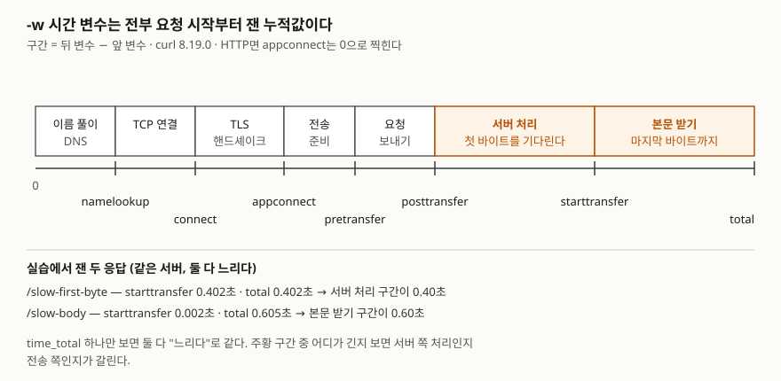

## 들어가며

배포 직후 "주문 API가 느리다"는 말이 올라온다. 대부분은 브라우저 개발자 도구를 열어 보거나, 애플리케이션 로그에
시간을 찍는 코드를 넣고 다시 배포한다. 배포 한 번에 10분이 걸리면 가설 하나를 확인하는 데 10분이 든다. 그런데 느린
곳이 DNS인지, TLS인지, 서버 처리인지, 본문 전송인지는 서버에 붙은 셸에서 curl 한 줄로 구간별로 갈라 볼 수 있다.
오류 응답의 본문을 보거나, 헤더 하나를 바꿔 다시 보내 보는 것도 같은 자리에서 끝난다.

## 개념

curl은 URL로 데이터를 보내고 받는 명령줄 도구다. HTTP 요청의 메서드·헤더·본문을 옵션으로 정하고, 응답의 헤더·본문·
상태 코드·구간별 시간을 원하는 모양으로 찍는다. 이 판의 `curl --help all`에는 옵션 줄이 273개 있으므로, 이 글은 API를 디버깅할 때
실제로 치는 것을 다섯 갈래로 묶는다.

모든 예제는 스크립트가 띄운 **로컬 API 서버**(`127.0.0.1:18080`)에 보낸다. 느린 응답, 500, 간헐적 503을 일부러 만들
수 있어야 옵션이 무엇을 바꾸는지 출력으로 비교할 수 있기 때문이다. 서버는 받은 요청을 JSON으로 되돌려주는
`/echo`를 가지고 있어서, curl이 실제로 무엇을 보냈는지가 출력에 그대로 보인다.

옵션 설명은 curl 공식 매뉴얼을 따랐다. 매뉴얼 사이트는 8.23.0판이고 실행한 curl은 8.19.0이므로,
옵션 목록은 이 판의 `curl --help all`에서 다시 확인했다.

## 구조



> **출처**: [curl man page — -w, --write-out](https://curl.se/docs/manpage.html#-w)과 그 원본
> [docs/cmdline-opts/write-out.md](https://github.com/curl/curl/blob/master/docs/cmdline-opts/write-out.md) — 각 시간 변수가 "시작부터"
> 어느 시점까지인지의 정의. 아래 두 줄의 값은 이 글의 실습 4번 출력이다.

## 동작 원리

`-w`의 시간 변수는 각각 **요청을 시작한 순간부터** 그 시점까지 걸린 시간이다. 그래서 구간의 길이는 뒤 변수에서 앞
변수를 빼야 나온다. `time_starttransfer`는 첫 응답 바이트가 도착한 시점이라 서버 처리 시간을 포함하고,
`time_total`은 마지막 바이트까지다. `time_posttransfer`(요청의 마지막 바이트를 보낸 시점)는 8.10.0에서 추가됐다.

curl은 응답 본문을 표준 출력으로, 진행 표시줄·오류 메시지·`-v` 정보를 표준 오류로 보낸다. 상태 코드가 500이어도
전송 자체가 성공하면 종료 코드는 0이다. 이 세 가지가 아래 함정 대부분의 원인이다.

## 실습 예제

전체 소스: [`code/curl_options.sh`](code/curl_options.sh)·[`code/api_server.py`](code/api_server.py),
실행 기록: [`code/output.txt`](code/output.txt). 출력에서 `Date` 헤더 줄은 실행마다 바뀌므로 걸렀다.

### 1. 응답 보기

| 옵션 | 하는 일 |
|---|---|
| `-i` (`--show-headers`) | 응답 헤더를 본문 앞에 붙여 찍는다. 8.10.0 전 이름은 `--include` |
| `-I` (`--head`) | HEAD 요청을 보내 헤더만 받는다 |
| `-D 파일` | 응답 헤더를 따로 파일에 쓴다 |
| `-o 파일` | 본문을 파일에 쓴다. 버릴 때는 `-o /dev/null` |
| `-v` | 요청·응답 헤더와 연결 과정을 표준 오류에 찍는다 |
| `-s` / `-S` | 진행 표시줄과 오류 메시지를 끈다 / `-s`에서도 오류 메시지는 찍는다 |
| `--no-progress-meter` | 진행 표시줄만 끈다. 경고는 남는다 |

```text
$ curl -w '\n' http://127.0.0.1:18080/users/42 2>&1
  % Total    % Received % Xferd  Average Speed  Time    Time    Time   Current
                                 Dload  Upload  Total   Spent   Left   Speed
...
{"id": 42, "name": "kim"}

$ curl --no-progress-meter -v http://127.0.0.1:18080/users/42 2>&1 | no_date
> GET /users/42 HTTP/1.1
> Host: 127.0.0.1:18080
> User-Agent: curl/8.19.0
> Accept: */*
...
< HTTP/1.1 200 OK
< X-Request-Id: req-0001
...
$ curl -v -w '\n' http://127.0.0.1:18080/users/42 2>/dev/null
{"id": 42, "name": "kim"}

$ curl -s http://127.0.0.1:1/users/42 2>&1
[종료 코드 7]
$ curl -sS http://127.0.0.1:1/users/42 2>&1
curl: (7) Failed to connect to 127.0.0.1 port 1 after 2030 ms: Could not connect to server
```

`-v`를 켜도 표준 오류를 버리면 본문만 남았다. 표준 출력이 터미널이 아니면(스크립트·파이프) 옵션 없이도 진행 표시줄이 찍혔다. 로그에 이것이 섞이지 않게
하려고 `-s`를 붙이면, 이번에는 접속 실패 메시지까지 사라져 종료 코드 7만 남는다. 스크립트에는 `-sS`를 쓴다.
닫힌 포트에 붙는 데 이 환경(Windows)에서는 2초가 넘게 걸렸다.

### 2. 요청 만들기

| 옵션 | 하는 일 |
|---|---|
| `-X 메서드` | 요청 메서드를 바꾼다 |
| `-H '이름: 값'` / `-A 값` | 헤더를 더한다 / User-Agent를 바꾼다 |
| `-d 데이터` | POST 본문. `Content-Type: application/x-www-form-urlencoded`가 붙는다. `@파일`이면 파일 내용 |
| `--data-raw` | `-d`와 같되 `@`를 글자 그대로 보낸다 |
| `--data-urlencode` | 값을 URL 인코딩해서 보낸다 |
| `--json 데이터` | POST 본문 + `Content-Type`·`Accept: application/json` (7.82.0부터) |
| `-G` / `--url-query` | `-d` 값을 쿼리 문자열로 옮겨 GET으로 / 쿼리를 바로 더한다 |
| `-F 이름=값` | multipart/form-data. `@파일`이면 파일 첨부 |
| `-u 사용자:암호` | Basic 인증 헤더를 만든다 |
| `-c 파일` / `-b 파일` | 받은 쿠키를 파일에 저장 / 파일의 쿠키를 보낸다 |

```text
$ curl -s -d @body.json http://127.0.0.1:18080/echo
{"method": "POST", ..., "Content-Type": "application/x-www-form-urlencoded", "Content-Length": "25"}, "body": "{\"id\": 42, \"name\": \"kim\"}"}
$ curl -s --data-raw @body.json http://127.0.0.1:18080/echo
{"method": "POST", ..., "Content-Length": "10"}, "body": "@body.json"}
$ curl -s --json '{"name":"kim"}' http://127.0.0.1:18080/echo
{"method": "POST", ..., "Accept": "application/json", "Content-Type": "application/json", ...}
$ curl -s --data-urlencode 'q=a&b c' http://127.0.0.1:18080/echo
{..., "body": "q=a%26b+c"}
$ curl -s -u alice:secret http://127.0.0.1:18080/echo
{..., "Authorization": "Basic YWxpY2U6c2VjcmV0"}, "body": ""}
$ curl -s -v -u alice:secret -o /dev/null http://127.0.0.1:18080/echo 2>&1 | grep -i '^> authorization'
> Authorization: Basic YWxpY2U6c2VjcmV0
```

`-d @body.json`은 JSON 파일을 보냈지만 `Content-Type`은 폼이었다. JSON만 받는 API는 이 요청을 거절한다.
`-u`가 만든 값은 `alice:secret`을 Base64로 바꾼 것일 뿐이므로 암호화가 아니다.

### 3. 리다이렉트와 실패 판정

| 옵션 | 하는 일 |
|---|---|
| `-L` / `--max-redirs N` | `Location`을 따라간다 / 최대 N번까지 |
| `--post301`·`--post302`·`--post303` | 그 코드에서도 POST를 유지한다 |
| `-f` | 400 이상이면 본문을 버리고 종료 코드 22 |
| `--fail-with-body` | 22로 끝나되 본문은 찍는다 (7.76.0부터) |

```text
$ curl -s -L -d 'id=kim' http://127.0.0.1:18080/login
{"method": "GET", "path": "/echo", ..., "body": ""}
$ curl -s -L --post302 -d 'id=kim' http://127.0.0.1:18080/login
{"method": "POST", "path": "/echo", ..., "body": "id=kim"}
$ curl -sS -L --max-redirs 3 http://127.0.0.1:18080/loop 2>&1
curl: (47) Maximum (3) redirects followed
$ curl -s -w '\n' http://127.0.0.1:18080/error
{"error": "database unavailable"}
[종료 코드 0]
$ curl -sS -f http://127.0.0.1:18080/error 2>&1
curl: (22) The requested URL returned error: 500
$ curl -sS --fail-with-body -w '\n' http://127.0.0.1:18080/error 2>&1
curl: (22) The requested URL returned error: 500
{"error": "database unavailable"}
[종료 코드 22]
```

302를 따라가자 POST가 GET으로 바뀌고 본문이 사라졌다. 매뉴얼은 301·302·303에서 GET으로 바뀔 수 있다고 적는다.
500 응답도 옵션이 없으면 종료 코드 0이다. `-f`는 실패를 알려 주지만 원인이 적힌 본문을 버리므로,
디버깅에는 `--fail-with-body`가 맞다.

### 4. 시간과 재시도

| 옵션 | 하는 일 |
|---|---|
| `-w 형식` / `-w @파일` | 끝난 뒤 변수를 찍는다. `%{http_code}`·`%{time_total}`·`%header{이름}`·`%{json}` |
| `--connect-timeout 초` | 연결까지의 한도 |
| `-m 초` | 전송 전체의 한도. 넘으면 종료 코드 28 |
| `--retry N` | 일시적 오류(시간 초과, HTTP 408·429·500·502·503·504·522·524)에 N번 다시 시도 |
| `--retry-delay 초` / `--retry-connrefused` | 재시도 간격 / 접속 거부도 재시도 |

```text
$ curl -s -o /dev/null -w @timing-format.txt http://127.0.0.1:18080/slow-first-byte
   namelookup:    0.000047
   connect:       0.000705
   appconnect:    0.000000
   pretransfer:   0.000770
   posttransfer:  0.000769
   starttransfer: 0.402293
   total:         0.402385
$ curl -s -o /dev/null -w @timing-format.txt http://127.0.0.1:18080/slow-body
   namelookup:    0.000036
   connect:       0.000684
   appconnect:    0.000000
   pretransfer:   0.000754
   posttransfer:  0.000754
   starttransfer: 0.001575
   total:         0.604548
```

`timing-format.txt`는 `   total:         %{time_total}\n`처럼 변수 7개를 한 줄씩 적은 파일이다.

```text
$ curl -s -w '\nx-request-id=%header{x-request-id}\n' http://127.0.0.1:18080/users/42
{"id": 42, "name": "kim"}
x-request-id=req-0001
$ curl -sS -m 0.5 http://127.0.0.1:18080/slow-body 2>&1
curl: (28) Operation timed out after 501 milliseconds with 21 out of 28 bytes received
part-0
part-1
part-2
$ curl --no-progress-meter --retry 3 --retry-delay 1 -w ' http=%{http_code}\n' http://127.0.0.1:18080/flaky 2>&1
{"error": "try again", "call": 1}Warning: Problem : HTTP error. Will retry in 1 second. 3 retries left.
{"error": "try again", "call": 2}Warning: Problem : HTTP error. Will retry in 1 second. 2 retries left.
{"ok": true, "call": 3} http=200
```

두 응답 모두 느렸지만 느린 곳이 달랐다. 첫 번째는 첫 바이트까지 0.40초(서버 처리), 두 번째는 첫 바이트가 0.002초에
왔고 본문을 받는 데 0.60초가 걸렸다. `%header{이름}`은 응답 헤더 하나만 뽑는다. 요청 ID를 로그와 맞춰 볼 때 쓴다. `time_total`만 보면 이 차이가 안 보인다.

예상과 달랐던 것은 `--retry`다. **실패한 시도의 503 본문도 표준 출력에 그대로 찍혀** 마지막 성공 본문 앞에 붙었다.
이 출력을 JSON 파서로 넘기면 깨진다. `-m`으로 끊긴 전송도 그때까지 받은 본문 21바이트를 찍고 끝났다.

### 5. 연결 바꾸기

| 옵션 | 하는 일 |
|---|---|
| `--resolve 이름:포트:주소` | DNS 대신 그 주소로 붙는다. `Host` 헤더는 이름 그대로 |
| `-x 프록시` | 프록시를 거친다 |
| `-k` | 인증서 검증을 건너뛴다 |

```text
$ curl -s --resolve api.example.test:18080:127.0.0.1 http://api.example.test:18080/echo
{"method": "GET", "path": "/echo", "headers": {"Host": "api.example.test:18080", ...}
$ curl -s -x http://127.0.0.1:18080 http://api.example.test/echo
{"method": "GET", "path": "http://api.example.test/echo", "headers": {"Host": "api.example.test", ...}
$ curl -sS -o /dev/null https://127.0.0.1:18443/ 2>&1 | head -n 1 | sed 's/ - .*//'
curl: (60) schannel: SEC_E_UNTRUSTED_ROOT (0x80090325)
$ curl -s -k -o /dev/null -w @timing-format.txt https://127.0.0.1:18443/
   namelookup:    0.000037
   connect:       0.000651
   appconnect:    0.008870
   pretransfer:   0.008978
   posttransfer:  0.008977
   starttransfer: 0.009508
   total:         0.009552
```

`--resolve`는 DNS를 바꾸기 전에 새 서버를 진짜 도메인 이름으로 시험할 때 쓴다. `-x`로 보낸 요청은 요청 줄에 **URL 전체**가
들어갔다. 프록시가 받는 모양이 이것이다. HTTPS에서는 `appconnect`가 0이 아니게 되고, 이 로컬 서버의 TLS 핸드셰이크는
약 8ms(0.008870 − 0.000651)였다. 오류 메시지 뒷부분은 Windows 로캘 문자열이라 잘랐다.

## 실무에서 주의할 점

- **스크립트의 curl에는 `-sS`와 `-f`(또는 `--fail-with-body`)를 함께 붙인다.** 없으면 500도 종료 코드 0으로 지나가고,
  `-s`만 있으면 접속 실패의 이유가 사라진다.
- **JSON은 `-d`가 아니라 `--json`으로 보낸다.** `-d @파일`은 내용만 읽고 `Content-Type`은 폼으로 붙인다.
- **POST에 `-L`을 붙일 때는 리다이렉트 코드를 본다.** 301·302·303에서 본문이 사라진 GET이 된다. 필요하면 `--post302` 등을 쓴다.
- **`--retry`의 출력은 시도마다 쌓인다.** 결과를 파싱하려면 `-o 파일`로 받는다.
- **`-k`는 원인을 확인하는 데만 쓴다.** 인증서 오류를 없애는 옵션이 아니라 검증을 끄는 옵션이다.
- **`-u`와 `-v`를 같이 쓴 출력을 공유하지 않는다.** `-v`는 보낸 헤더를 그대로 찍고, `Authorization` 값은 Base64일 뿐이다.

## 정리

- 옵션은 응답 보기·요청 만들기·리다이렉트와 실패 판정·시간과 재시도·연결 바꾸기 다섯 갈래로 묶인다.
- `-w`의 시간 변수는 시작부터의 누적값이다. 빼서 구간을 보면 서버 처리와 본문 전송이 갈린다.
- 상태 코드 500도 기본 종료 코드는 0이다. `-f`·`--fail-with-body`가 22로 바꾼다.
- `-d @파일`은 폼 형식으로, `-L`은 302에서 GET으로, `--retry`는 실패 본문까지 찍는다.

## 참고 자료

- [curl man page](https://curl.se/docs/manpage.html) — 8.23.0판. 이 글은 8.19.0에서 실행했다
  - [-w, --write-out](https://curl.se/docs/manpage.html#-w), [--json](https://curl.se/docs/manpage.html#--json), [-f, --fail](https://curl.se/docs/manpage.html#-f), [-L, --location](https://curl.se/docs/manpage.html#-L), [-i, --show-headers](https://curl.se/docs/manpage.html#-i), [--resolve](https://curl.se/docs/manpage.html#--resolve)
- [curl 원본 문서 docs/cmdline-opts](https://github.com/curl/curl/tree/master/docs/cmdline-opts) — [write-out.md](https://github.com/curl/curl/blob/master/docs/cmdline-opts/write-out.md), [retry.md](https://github.com/curl/curl/blob/master/docs/cmdline-opts/retry.md), [show-headers.md](https://github.com/curl/curl/blob/master/docs/cmdline-opts/show-headers.md)
- [RFC 9110 §15.4 Redirection 3xx](https://www.rfc-editor.org/rfc/rfc9110.html#section-15.4) — 3xx 상태 코드의 정의
