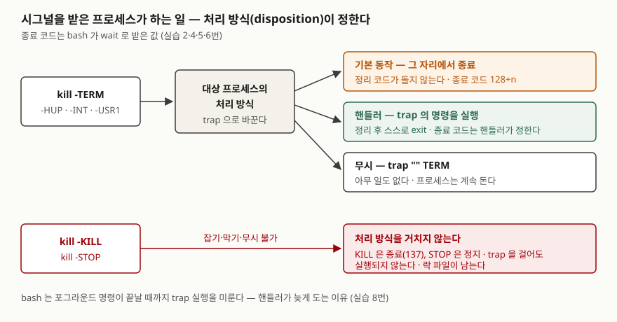

## 들어가며

배치 작업이 멈춘 것 같아 프로세스를 내려야 하는 상황은 운영을 하다 보면 자주 온다. 많은 사람이 `kill -9 <PID>`부터
친다. 한 번에 내려가니 편하지만, 다음 실행에서 "이미 실행 중"이라며 작업이 시작되지 않는다. 앞 프로세스가 지우고
나갔어야 할 락 파일이 남았기 때문이다. 그 파일을 찾아 지우고, 반쯤 쓰다 만 임시 파일을 정리하는 데 다시 10분을 쓴다.
`kill` 한 줄에서 아낀 몇 초가 정리 작업 10분이 된다. 어떤 시그널을 언제 보낼지 알면 이 정리를 프로세스가 스스로 하게
만들 수 있다.

## 개념

**시그널**은 커널이 프로세스에게 보내는 짧은 알림이다. 번호 하나와 이름 하나로 이루어지고, 받은 프로세스는 미리 정한
**처리 방식**(disposition)대로 움직인다. 처리 방식은 세 가지다. 기본 동작(대부분 종료), 등록한 핸들러 실행, 무시.
`kill`은 이름과 달리 "죽이는" 명령이 아니라 **시그널을 보내는** 명령이다. 시그널을 안 적으면 `TERM`을 보낸다.

| 시그널 | 뜻 | 기본 동작 | 잡을 수 있나 |
|---|---|---|---|
| `TERM` | 종료해 달라는 요청 | 종료 | 예 |
| `INT` | 터미널의 Ctrl+C | 종료 | 예 |
| `HUP` | 터미널이 끊겼다. 데몬은 관례로 "설정을 다시 읽어라" | 종료 | 예 |
| `KILL` | 무조건 종료 | 종료 | **아니오** |
| `STOP` / `CONT` | 멈춤 / 이어 가기 | 정지 / 재개 | **STOP은 아니오** |

리눅스 매뉴얼 signal(7)은 `KILL`과 `STOP`은 잡을 수도, 막을 수도, 무시할 수도 없다고 적는다. 셸에서 핸들러는
`trap`으로 등록한다.

이 글은 **Git Bash**(Windows 11)에서 돌렸다. `kill`·`trap`은 리눅스와 같은 bash 5.3.9 내장 명령이고, 시그널 전달은
Cygwin 런타임 3.6.7이 POSIX 동작을 흉내 낸다. 리눅스 커널에서 직접 확인한 결과가 아니라는 점과, 아래에서 보듯
**시그널 번호 일부가 리눅스 x86과 다르다**는 점을 감안해 읽는다.

## 구조



> **출처**: [signal(7) — DESCRIPTION, Signal dispositions·Standard signals](https://man7.org/linux/man-pages/man7/signal.7.html#DESCRIPTION)(세 가지 처리 방식, KILL·STOP은 잡기·막기·무시 불가),
> [Bash Reference Manual §3.7.6 Signals](https://tiswww.case.edu/php/chet/bash/bashref.html#Signals)(포그라운드 명령 중 trap 지연),
> [§3.7.5 Exit Status](https://tiswww.case.edu/php/chet/bash/bashref.html#Exit-Status)(시그널 n으로 끝나면 128+n). 종료 코드는 실습의 실행 결과다.

## 동작 원리

시그널을 받은 프로세스가 무엇을 할지는 **보내는 쪽이 아니라 받는 쪽**이 정한다. `kill -TERM`은 "끝내 달라"는 요청일
뿐이고, 받는 쪽이 `trap`을 걸어 두었으면 그 명령을 실행한다. 핸들러가 락 파일을 지우고 `exit 0`을 부르면 종료 코드는 0이다.
핸들러가 없으면 기본 동작으로 그 자리에서 끝나고, bash는 종료 코드를 **128+시그널 번호**로 돌려준다. TERM이면 143,
KILL이면 137, HUP이면 129다. 그래서 종료 코드만 보고도 `kill -l 143`으로 어떤 시그널에 죽었는지 알 수 있다.

`KILL`은 처리 방식을 거치지 않는다. 핸들러가 돌 틈이 없으므로 정리 코드도 돌지 않는다. `kill -9`를 먼저 쓰면 안 되는
이유가 이것이다.

bash 매뉴얼은 또 하나를 적는다. bash가 **포그라운드 명령이 끝나기를 기다리는 중**에 trap을 건 시그널이 오면, 그
명령이 끝난 뒤에야 trap을 실행한다. 반면 `wait`로 백그라운드 작업을 기다리는 중이면 `wait`가 바로 돌아오고 trap이
실행된다. 스크립트에 trap을 걸었는데 TERM에 늦게 반응한다면 이 때문이다.

## 실습 예제

전체 소스: [`code/kill_signals.sh`](code/kill_signals.sh), 실행 기록: [`code/output.txt`](code/output.txt).
시그널을 받는 쪽은 스크립트가 `bash -c`로 띄운 작은 작업이다. 옵션 목록은 이 판의 `help kill`·`help trap`·`timeout --help`로 확인했다.

### 1. kill — 무엇을 보낼지 고르는 옵션

| 형식 | 하는 일 |
|---|---|
| `kill PID` | `TERM`을 보낸다 |
| `kill -s TERM PID` / `kill -n 15 PID` / `kill -TERM PID` | 같은 시그널을 이름·번호·짧은 형식으로 지정 |
| `kill -l [번호·이름·종료코드]` | 시그널 목록, 또는 번호↔이름 변환 (`-L`은 같은 뜻) |
| `kill -0 PID` | 아무것도 보내지 않고 살아 있는지·보낼 권한이 있는지만 본다 |
| `kill %1` | 셸의 작업 번호로 보낸다 |
| `kill -- -PGID` | 음수면 프로세스 그룹 전체에 보낸다 |

```text
== 1. 이름과 번호 — kill -l
$ kill -l 143
TERM
   HUP   1
   ...
   TERM  15
   USR1  30
   STOP  17
   CONT  19
   CHLD  20
```

예상과 달랐던 것이 여기서 나왔다. 이 환경에서 `USR1`은 30, `STOP`은 17이다. signal(7)의 번호표에서 x86·ARM
리눅스는 `USR1` 10, `STOP` 19, `CONT` 18, `CHLD` 17이고, 이 환경의 값은 같은 표의 Alpha/SPARC 칸과 일치한다.
1·2·3·9·15는 양쪽이 같다. POSIX도 `kill -번호` 형식에서 0·1·2·3·6·9·14·15만 이름과 짝지어 두었다.
**그 밖의 시그널은 번호가 아니라 이름으로 쓴다.** `kill -10`을 외워 두면 아키텍처가 바뀌는 순간 다른 시그널이 간다.

`kill -s TERM`, `kill -n 15`, `kill -SIGTERM`은 세 번 모두 143으로 같았다(실습 3번). 없는 PID에 `kill -0`을 보내면
`No such process`와 함께 종료 코드 1이다(실습 11번). 스크립트에서 "그 프로세스가 아직 있나"를 물을 때 쓴다.

### 2. TERM과 KILL — 정리할 기회

락 파일을 만든 뒤 TERM에 trap을 걸어 두는 작업을 띄우고, 한 번은 TERM을, 한 번은 KILL을 보냈다.

```text
== 4. TERM 은 정리할 기회를 주고, KILL 은 주지 않는다
   [작업] TERM 받음 — 락 파일 지우고 종료
   TERM: 종료 코드 0, 락 파일 없음
   KILL: 종료 코드 137, 락 파일 app.lock
```

TERM을 무시하도록(`trap "" TERM`) 만든 작업은 TERM을 받고도 `kill -0`에 살아 있었고, KILL에야 137로 끝났다(실습 5번).
TERM으로 안 죽는 프로세스가 실제로 있고, 그때 KILL이 필요하다. 순서는 **TERM을 먼저 보내고 기다린 뒤에 KILL**이다.

### 3. trap — 받는 쪽 옵션

| 형식 | 하는 일 |
|---|---|
| `trap '명령' TERM HUP` | 시그널을 받으면 명령을 실행 |
| `trap '' TERM` | 무시한다. 자식 명령에도 무시가 이어진다 |
| `trap - TERM` | 원래 처리 방식으로 되돌린다 |
| `trap -p [시그널]` | 다시 입력할 수 있는 형식으로 등록 내용을 찍는다 |
| `trap -P 시그널` | 등록한 명령만 찍는다 |

```text
== 6. KILL 에 trap 을 걸면
   trap KILL 종료 코드 0
   trap -p: trap -- 'echo "   [작업] KILL 잡았다"' SIGKILL
   KILL 보낸 뒤: 종료 코드 137 (trap 은 실행되지 않았다)
```

두 번째로 예상과 달랐던 것이다. bash 5.3.9는 `trap ... KILL`을 오류 없이 받아 주고 `trap -p`에도 등록된 것처럼
보여 준다. 하지만 KILL을 보내자 핸들러는 실행되지 않고 137로 끝났다. 스크립트에 `trap cleanup KILL`이 있다고
정리가 보장되는 것이 아니다.

`trap -p TERM`은 `trap -- 'echo cleanup' SIGTERM`, `trap -P TERM`은 `echo cleanup`만 찍었고, `trap - TERM` 뒤에는
아무것도 찍지 않았다(실습 14번).

### 4. HUP — 설정 다시 읽기

HUP에 "설정 파일을 다시 읽는" 함수를 걸어 두고, 파일을 바꾼 뒤 HUP을 보냈다.

```text
== 7. HUP — 설정 다시 읽기에 쓰는 관례
   [작업] 설정 읽음: level=info
   [작업] 설정 읽음: level=debug
   HUP 보낸 뒤: 살아 있음 (kill -0 → 0)
   trap 없는 sleep 에 HUP: 종료 코드 129 (128+1)
```

핸들러가 있는 작업은 재시작 없이 새 값을 읽고 계속 돌았다. 핸들러가 없는 `sleep`은 같은 HUP에 129로 죽었다.
"HUP은 재로드"는 프로그램이 그렇게 만들어 둔 **관례**이고, 기본 동작은 종료다. 그 프로그램이 HUP을 처리하는지
문서로 확인하지 않고 보내면 서비스가 내려간다.

### 5. trap이 늦게 도는 경우

```text
== 8. 포그라운드 명령이 도는 동안 trap 은 미뤄진다
   [작업] TERM 처리
   sleep 3 (포그라운드)  : kill 부터 끝날 때까지 2511ms
   [작업] TERM 처리
   sleep 3 & wait $!    : kill 부터 끝날 때까지 30ms
```

같은 trap인데 `sleep 3`을 포그라운드로 돌린 쪽은 남은 2.5초를 다 채운 뒤 핸들러가 돌았다. `sleep 3 & wait $!`로
바꾸자 30ms 만에 끝났다. 긴 명령을 도는 스크립트가 TERM에 빨리 반응해야 하면 이 형태로 쓴다.

### 6. 부모만 죽이면 자식이 남는다

```text
== 9. 부모만 죽이면 자식은 남는다 — 프로세스 그룹으로 보내기
   부모 PID 에만 TERM → 부모 없음 (kill -0 → 1) / 자식 살아 있음 (kill -0 → 0)
   -PGID 로 그룹에 TERM → 부모 없음 (kill -0 → 1) / 자식 없음 (kill -0 → 1)
```

자식 `sleep`을 띄운 스크립트에 TERM을 보내면 스크립트만 끝나고 자식은 남는다. "kill 했는데 프로세스가 안 죽는다"의
흔한 원인이다. `set -m`으로 작업마다 프로세스 그룹을 따로 받게 한 뒤 `kill -TERM -- -PGID`로 보내자 둘 다 끝났다.
`--`를 빼면 `-PGID`가 옵션으로 읽힐 수 있어 POSIX도 `--`를 붙이라고 권한다.

`STOP`을 보내자 1초 동안 카운터가 4에서 4로 멈췄고 `CONT` 뒤 1초 동안 13까지 올랐다(실습 10번). STOP은 죽이는 것이
아니라 멈추는 것이므로 `kill -0`에는 살아 있다고 나온다.

### 7. timeout — 시간이 지나면 보내기

| 옵션 | 하는 일 |
|---|---|
| `timeout 기간 명령` | 기간이 지나면 TERM. 종료 코드 124 |
| `-s 시그널` | TERM 대신 보낼 시그널 |
| `-k 기간` | 첫 시그널 뒤에도 살아 있으면 그만큼 기다렸다 KILL |
| `--preserve-status` | 124 대신 명령의 종료 코드를 그대로 |
| `-v` | 시그널을 보낼 때 표준 오류에 알린다 |
| `--foreground` | 터미널에서 직접 돌리지 않을 때 명령이 TTY를 쓰게 한다. TTY가 없는 이 실행 환경에서는 확인하지 않았다 |

```text
== 12. timeout — 시간이 지나면 보내기
   timeout 0.5 sleep 5                   → 124
   timeout -s KILL 0.5 sleep 5           → 137
   timeout --preserve-status 0.5 sleep 5 → 143
   timeout: sending signal TERM to command 'sleep'
   TERM 무시 작업, -k 없음 → 124 (3115ms)
   TERM 무시 작업, -k 1    → 137 (1591ms)
```

TERM을 무시하는 작업에 `-k` 없이 0.5초를 걸면, timeout은 124를 돌려주지만 **명령이 스스로 끝날 때까지(3.1초)
기다렸다.** 제한 시간을 걸었다고 그 시간에 끝나는 것이 아니다. `-k 1`을 붙여야 1.6초에 KILL로 끝났다.

## 실무에서 주의할 점

- **`kill -9`를 첫 수로 쓰지 않는다.** TERM을 보내고 몇 초 기다린 뒤 `kill -0`으로 확인하고, 그래도 살아 있을 때 KILL을
  보낸다. KILL은 락 파일·임시 파일·버퍼를 정리할 기회를 주지 않는다(실습 4번).
- **1·2·3·9·15 밖의 시그널은 이름으로 쓴다.** `USR1`이 이 환경에서 30, x86 리눅스에서 10이다. 스크립트를 다른 장비로
  옮기는 순간 다른 시그널이 간다.
- **HUP을 보내기 전에 그 프로그램이 HUP을 처리하는지 확인한다.** 처리하지 않으면 재로드가 아니라 종료다(실습 7번).
- **자식을 띄우는 스크립트는 프로세스 그룹으로 보낸다.** 부모 PID에만 보내면 자식이 남는다(실습 9번).
  반대로 스크립트를 짤 때는 TERM trap에서 자식을 정리하고, 긴 명령은 `& wait $!`로 돌려 신호에 바로 반응하게 한다.
- **`trap ... KILL`로 정리를 보장하려 하지 않는다.** 등록은 되지만 실행되지 않는다(실습 6번).
  정리는 TERM·INT·HUP과 `EXIT`에 건다.
- **`timeout`에는 `-k`를 같이 쓴다.** TERM을 무시하거나 정리가 오래 걸리는 명령은 제한 시간을 넘겨 계속 돈다(실습 12번).

## 정리

- `kill`은 시그널을 보내는 명령이고, 받은 쪽의 처리 방식(기본 동작·trap·무시)이 결과를 정한다.
- TERM은 정리할 기회를 주고, KILL·STOP은 처리 방식을 거치지 않는다. 그래서 TERM을 먼저, KILL은 마지막에 쓴다.
- 시그널로 끝나면 종료 코드는 128+n이고 `kill -l 종료코드`로 이름을 되찾는다. 번호는 플랫폼마다 다를 수 있다.
- HUP 재로드는 관례이고, 부모만 죽이면 자식이 남으며, 포그라운드 명령 중에는 trap이 미뤄진다.

## 참고 자료

- [signal(7) — Linux manual page](https://man7.org/linux/man-pages/man7/signal.7.html#DESCRIPTION) — 처리 방식, 표준 시그널, 아키텍처별 번호표 (man-pages 6.19)
- [Bash Reference Manual §3.7.6 Signals](https://tiswww.case.edu/php/chet/bash/bashref.html#Signals) — 포그라운드 명령 중 trap 지연, `wait` 중 즉시 반환 (Bash 5.3판)
- [Bash Reference Manual §3.7.5 Exit Status](https://tiswww.case.edu/php/chet/bash/bashref.html#Exit-Status) — 128+n
- [POSIX.1-2024 — kill utility](https://pubs.opengroup.org/onlinepubs/9799919799/utilities/kill.html) — `-번호` 형식의 0·1·2·3·6·9·14·15, 음수 PID와 `--`
- [timeout(1) — Linux manual page](https://man7.org/linux/man-pages/man1/timeout.1.html) — 온라인판은 최신 coreutils다. 이 글의 옵션은 8.32판 `timeout --help`로 확인했다
