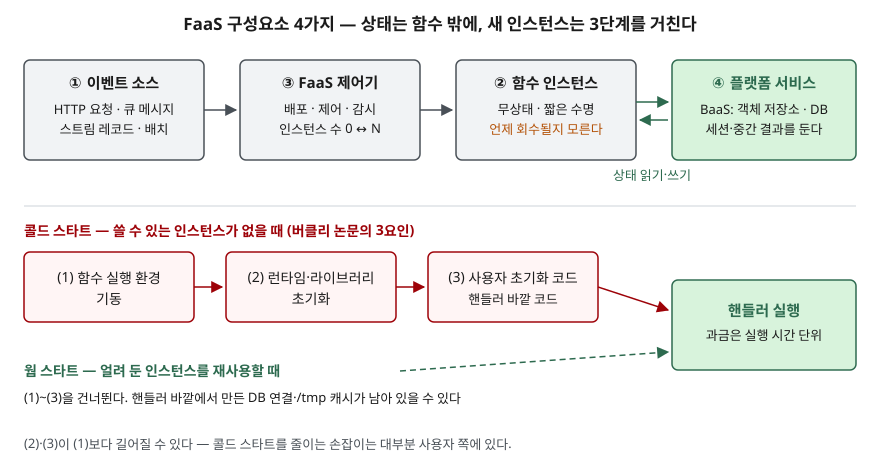

> **실행 검증 없음.** CNCF 백서, 버클리 논문, AWS 공식 문서의 정의와 구조를 정리한 개념 글이다. 실행 예제와 측정값은 없다.

## 들어가며

서버리스는 클라우드 서비스 모델 문제에서 IaaS·PaaS와 나란히 자주 묻는다. "서버 관리가 필요 없다"는 한 줄은 누구나 쓰므로
점수는 **무엇이 결정적으로 다른가**와 **그 대가가 무엇인가**에서 갈린다. 실무에서는 이벤트가 올 때만 짧게 도는 처리,
예를 들어 파일 업로드 뒤 변환이나 드문드문 오는 API 호출에 상시 서버를 띄워 두는 비용을 없앤다. 대신 상태를 어디에
둘지와 첫 호출이 늦어지는 문제를 설계 단계에서 풀어야 한다.

## 정의

- **CNCF 백서**: 서버 관리가 필요 없는 애플리케이션을 만들고 실행하는 개념이다. 하나 이상의 함수로 묶어 올린 애플리케이션이
  **그 순간의 수요에 맞춰** 실행·확장·과금된다.
- **버클리 논문**: 서버리스 컴퓨팅은 **FaaS(Function as a Service) + BaaS(Backend as a Service)** 다. FaaS가 범용 계산을 맡고,
  객체 저장소·데이터베이스·메시징 같은 전문화된 BaaS가 그것을 보완한다.

CNCF는 **운영 모델**로, 버클리는 **구성**으로 정의한다. 답안 첫 줄에는 "서버 프로비저닝·관리 없이 이벤트에 따라 실행·확장되고
사용량으로 과금되는 FaaS + BaaS 기반 컴퓨팅 모델"처럼 둘을 합쳐 쓸 수 있다.

## 등장 배경

버클리 논문은 가상 머신 기반 클라우드를 **서버 기반(serverful)** 이라 부르고, 이때 인스턴스 선택·확장·배포·장애 대응·
모니터링·로깅·보안 패치를 전부 사용자가 맡았다고 정리한다(논문 Table 2). 클라우드가 하드웨어를 빌려줬을 뿐
운영은 그대로 사용자 몫이었다는 것이다.

논문은 이것을 저수준 어셈블리 프로그래밍에, 서버리스를 고수준 언어에 견준다. 레지스터를 고르고 값을 싣고 결과를
되돌려 놓는 일이 자원을 확보하고 코드를 올리고 자원을 반납하는 일과 같은 모양이라는 것이다. 서버리스는 이 단계들을
제공자에게 넘기고, 사용자는 **함수와 그 함수를 깨울 이벤트**만 정한다. 과금 단위도 "할당한 VM"에서 "실행한 시간"으로 바뀐다.

## 구성요소 / 절차

### 서버 기반 방식과의 결정적 차이 — 3가지 (버클리 논문 §2)

1. **계산과 저장의 분리** — 계산과 저장이 따로 확장되고 따로 과금된다. 저장은 별도 클라우드 서비스가 맡고 **계산은 무상태**다
2. **자원 할당 없는 코드 실행** — 자원을 요청하지 않고 코드만 올리면 클라우드가 실행 자원을 자동으로 마련한다
3. **할당량이 아니라 사용량에 비례한 과금** — VM의 크기·개수가 아니라 실행 시간처럼 실행에 붙은 차원으로 과금된다

### FaaS 구성요소 — 4가지 (CNCF 백서 서버리스 처리 모델)

| 구성요소 | 역할 |
|---|---|
| ① 이벤트 소스 | 함수 인스턴스로 이벤트를 발생시키거나 흘려 보낸다 |
| ② 함수 인스턴스 | 하나의 함수 또는 마이크로서비스. 수요에 따라 늘고 준다 |
| ③ FaaS 제어기 | 함수 인스턴스와 이벤트 소스를 배포·제어·감시한다 |
| ④ 플랫폼 서비스 | FaaS가 쓰는 클러스터·클라우드 서비스. BaaS가 여기 든다 |

### 무상태 설계가 상태를 밖으로 밀어내는 이유

①의 "계산은 무상태"는 선택이 아니라 나머지 두 차이에서 따라 나오는 결과다. 자원 할당을 제공자가 정하므로
인스턴스가 **언제 생기고 언제 사라질지 사용자가 정하지 못한다.** 호출이 없으면 인스턴스는 0개까지 줄고, AWS 문서는 계속
호출되는 함수라도 실행 환경을 몇 시간마다 교체한다고 적으며 **실행 환경이 계속 남는다고 가정하지 말라**고 한다.
이런 곳에 세션이나 중간 결과를 두면 다음 호출에서 사라질 수 있으므로, 상태는 수명이 인스턴스와 무관한 ④ BaaS로 나간다.

대가도 논문이 짚는다. 상태 공유가 잦은 작업은 저장소 왕복 비용을 매번 치르고(§3.1), 함수끼리 "앞 작업의 출력이 준비됐다"를
알릴 수단이 저장소에 없어 별도 알림 서비스를 거쳐야 한다(§3.2). 그래서 세밀한 조정이 필요한 상태 중심 처리는 FaaS에 잘 맞지 않는다.

### 콜드 스타트 — 3요인 (버클리 논문 §3.4)

CNCF 백서는 배포되지 않은 상태에서 함수 인스턴스를 시작하는 것을 **콜드 스타트**, 멈춰 있지만 배포된 상태에서 시작하는 것을
**웜 스타트**로 나눈다. 버클리 논문은 콜드 스타트 지연의 요인을 **3가지**로 든다.

1. 함수 실행 환경을 기동하는 시간
2. 함수의 소프트웨어 환경을 초기화하는 시간 (예: Python 라이브러리 적재)
3. 사용자 코드의 애플리케이션별 초기화

논문은 **(2)와 (3)이 (1)보다 훨씬 길어질 수 있다**고 적는다. AWS 문서도 실행 전 지연에 가장 크게 기여하는 것이 초기화 코드라고 하고,
그 요인으로 패키지 크기, 초기화 작업량, 연결을 맺는 라이브러리의 성능을 든다. 콜드 스타트를 줄이는 손잡이 대부분이 사용자 쪽에 있다는 뜻이다.

## 도식

> **출처**: 구성요소는 [CNCF Serverless Whitepaper v1.0 — Detail View: Serverless Processing Model](https://github.com/cncf/wg-serverless/blob/master/whitepapers/serverless-overview/README.md), 콜드 스타트 3요인은 [Berkeley EECS-2019-3 §3.4 Predictable Performance](https://www2.eecs.berkeley.edu/Pubs/TechRpts/2019/EECS-2019-3.html), 웜 스타트의 연결·/tmp 재사용은 [AWS Lambda Developer Guide — Understanding the Lambda execution environment lifecycle](https://docs.aws.amazon.com/lambda/latest/dg/lambda-runtime-environment.html)

답안지에는 윗줄 박스 4개를 화살표로 잇고 ②와 ④ 사이에 "상태"를 적은 뒤, 아랫줄에 콜드 스타트 3칸만 옮기면 된다.

## 비교

### 배포 모델 4가지

| 구분 | IaaS(VM) | 컨테이너 오케스트레이션 | PaaS | 서버리스(FaaS) |
|---|---|---|---|---|
| 사용자가 관리 | OS·런타임·확장 전부 | 컨테이너 이미지·클러스터 설정 | 애플리케이션 | **함수 코드와 이벤트 연결** |
| 확장 | 사용자가 설계 | 오케스트레이터 규칙 | 플랫폼 | 요청에 따라 자동, **0까지 축소** |
| 과금 기준 | 할당한 인스턴스·시간 | 할당한 노드 | 할당한 인스턴스 | **실행 시간·호출 수** |
| 상태 | 어디든 둘 수 있다 | 볼륨으로 유지 | 대체로 외부 | **외부 저장소에만** |
| 맞는 워크로드 | 제어가 필요한 전부 | 이식성·성능이 필요한 마이크로서비스 | 전형적 HTTP 서비스 | **이벤트 구동, 수요 예측이 어려운 처리** |

> 컨테이너·PaaS·FaaS 열은 CNCF 백서의 배포 모델 비교를, IaaS 열과 상태·과금 행은 버클리 논문 Table 2를 따라 정리했다.
> 버클리 논문은 서버 기반과 서버리스를 한 연속선의 양 끝으로 보고, 쿠버네티스 같은 컨테이너 오케스트레이션을 그 중간에 둔다.

### FaaS와 BaaS

| 구분 | FaaS | BaaS |
|---|---|---|
| 제공하는 것 | 범용 계산 — 사용자가 쓴 함수 | 특정 기능 — 저장·DB·메시징·인증 |
| 사용자가 쓰는 코드 | 있다 | 없다 (API로 호출) |
| 상태 | 무상태 | 상태를 가진다 |
| 예 | AWS Lambda, Azure Functions | 객체 저장소, 키-값 DB, 큐 |

## 적용 시 고려사항

- **워크로드부터 가른다.** 이벤트로 시작해 짧게 끝나는 처리는 FaaS로 올리고, 장시간 실행이나 노드 간 잦은 통신이 필요한 처리는
  남긴다. 버클리 논문 Table 2 기준 AWS Lambda의 최대 실행 시간은 900초이고, 버클리는 OLTP 데이터베이스 같은 상태 중심 애플리케이션이
  BaaS로 남을 것으로 본다.
- **상태의 자리를 먼저 정한다.** 세션·중간 결과를 둘 저장소를 고르고, 인스턴스마다 DB 연결을 맺는다는 점을 고려해
  관계형 DB의 최대 연결 수를 함수의 동시 실행 수와 함께 설계한다. 웜 스타트에서 연결을 재사용할 수는 있지만 **남아 있다고 가정하지 않는다.**
- **콜드 스타트는 사용자 쪽 요인부터 줄인다.** 3요인 중 (2)·(3)이 크므로 필요한 라이브러리만 적재하고 초기화 코드를 줄인다.
  그래도 응답 시간 요구를 못 맞추면 미리 초기화해 두는 기능(AWS Provisioned Concurrency)을 쓰되, 그만큼 **유휴 시 비용 없음**이 깨진다는 점을 비용에 넣는다.
- **종속성을 관리한다.** 버클리 논문은 호출 방식과 패키징이 제공자마다 다르고 BaaS가 표준화되어 있지 않아, 서버리스의
  제공자 종속이 서버 기반보다 강할 수 있다고 본다. 업무 로직을 제공자 SDK에서 떼어 두고 이벤트 형식은 공통 규격(CloudEvents)에 맞춘다.
- **관측 체계를 같이 들인다.** 요청 하나가 여러 함수와 BaaS를 거치므로 분산 추적·중앙 로그 없이 들이면 장애 원인을 찾지 못한다.

> 기출 답안: [기출문제 — 서버리스 컴퓨팅](../../exam/2026-09-29-serverless-computing/index.md)

## 정리

- 정의 **2가지**: CNCF(서버 관리 없음, 수요에 맞춘 실행·확장·과금) / 버클리(**FaaS + BaaS**).
- 결정적 차이 **3가지**: **계**산·저장 분리, **자**원 할당 없는 실행, **사**용량 과금 → "계·자·사".
- FaaS 구성요소 **4가지**: 이벤트 소스, 함수 인스턴스, FaaS 제어기, 플랫폼 서비스.
- 무상태 → 인스턴스 수명을 사용자가 못 정하므로 **상태는 BaaS로** 나간다.
- 콜드 스타트 **3요인**: 환경 기동, 런타임 초기화, 사용자 초기화. 뒤의 둘이 크다.

## 참고 자료

- [CNCF Serverless Whitepaper v1.0 (2018-02)](https://github.com/cncf/wg-serverless/blob/master/whitepapers/serverless-overview/README.md) — 정의, 배포 모델 비교, 서버리스 처리 모델 4구성요소, 콜드·웜 스타트
- [Jonas et al., Cloud Programming Simplified: A Berkeley View on Serverless Computing, UC Berkeley EECS-2019-3 (2019-02)](https://www2.eecs.berkeley.edu/Pubs/TechRpts/2019/EECS-2019-3.html) · [arXiv:1902.03383](https://arxiv.org/abs/1902.03383) — §2 결정적 차이 3가지와 Table 2, §3.1~3.4 한계, §5 제공자 종속
- [AWS Lambda Developer Guide — Understanding the Lambda execution environment lifecycle](https://docs.aws.amazon.com/lambda/latest/dg/lambda-runtime-environment.html) — Init 단계, 실행 환경 재사용과 교체, 초기화 지연 요인, Provisioned Concurrency
- [CloudEvents Specification](https://github.com/cloudevents/spec)
