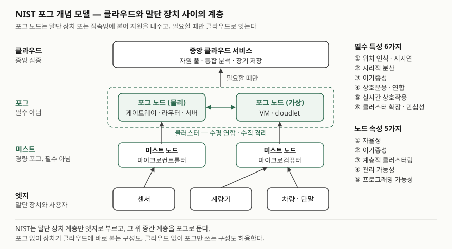
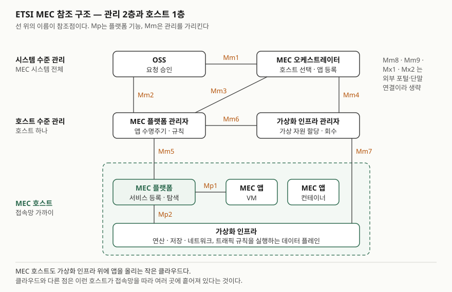

> 실행 검증 없음. 개념 정리이므로 NIST SP 500-325 본문, ETSI GS MEC 003 V3.1.1 본문, ISO/IEC TR 23188:2020
> 공개 미리보기(서론·목차)만 근거로 썼다. 지연 시간 같은 수치는 망 구성마다 달라 쓰지 않았다.

## 들어가며

엣지 컴퓨팅을 묻는 기출에서 답안이 흔히 무너지는 곳은 용어다. 엣지·포그·MEC를 같은 말로 쓰면 채점자는
정의를 모른다고 본다. 세 용어는 서로 다른 기관이 다른 관점에서 정의했고, 같은 장비가 문서에 따라 엣지로도
포그로도 불린다. 실무에서는 이 구분이 "어떤 처리를 클라우드에서 빼서 어느 계층에 둘 것인가"라는 배치
판단으로 이어진다.

## 정의

**엣지 컴퓨팅**은 처리와 저장을 시스템이 물리 세계와 맞닿는 곳, 즉 데이터가 생기는 곳 또는 그 가까이에
두는 컴퓨팅 방식이다(ISO/IEC TR 23188 서론).

같은 말을 문서마다 다른 범위로 쓴다. 답안에는 아래 세 정의를 구분해 적는다.

| 용어 | 정의 | 출처 |
|---|---|---|
| 포그 컴퓨팅 | 확장 가능한 컴퓨팅 자원의 공유 연속체에 어디서나 접근하게 하는 **계층형 모델**. 말단 장치와 중앙 클라우드 사이에 놓인 포그 노드로 이루어진다 | NIST SP 500-325 포그 컴퓨팅 절(§2.1) |
| 엣지(좁은 뜻) | 말단 장치와 그 사용자를 포함하는 **네트워크 계층**. 센서·계량기 자체의 로컬 연산을 가리킨다 | NIST SP 500-325 부록 A |
| MEC | 애플리케이션을 **네트워크 경계 안 또는 가까이 놓인 가상화 인프라** 위에서 소프트웨어로만 실행하게 하는 것. 이름은 Multi-access Edge Computing | ETSI GS MEC 003 프레임워크 절(§5) |

NIST는 포그보다 더 가볍고 장치에 더 붙은 계층을 **미스트(mist)** 로 따로 정의한다. 마이크로컨트롤러와
마이크로컴퓨터로 이루어진 원시적인 포그이고, 필수 계층이 아니다(§2.9).

## 등장 배경

클라우드는 자원을 한곳에 모아 탄력적으로 나눠 주는 데서 이점을 얻는다. 그 대가로 모든 요청이 데이터센터까지
왕복한다. ISO/IEC TR 23188은 클라우드 서비스가 엣지 가까이로 옮겨 가는 이유를 두 가지로 든다. **지연을
줄여야 하는 용도**와 **대역폭이 제한된 망으로 대량의 데이터를 보내지 않아도 되게 하는 것**이다.

NIST는 포그의 기원을 네트워크 가장자리에서 말단 장치에 풍부한 서비스를 주려던 초기 제안, 특히 저지연이
필요한 애플리케이션에서 찾는다(§2.3). 고속도로를 달리는 차량에 도로변 접속점이 스트리밍을 제공하는 경우처럼,
처리 위치가 **지리적으로 흩어져 있어야** 성립하는 서비스가 생긴 것이다.

통신사 쪽에서는 기지국과 접속망에 서버를 두려는 흐름이 ETSI MEC로 이어졌다. 이 그룹의 이름은 처음에 Mobile
Edge Computing이었고, MEC 003 참고문헌에도 예전 이름의 문서(GR MEC 017)가 그대로 남아 있다. 지금 이름의
"Multi-access"는 이동통신망만이 아니라 **여러 종류의 접속망**에서 MEC 애플리케이션을 돌린다는 범위를
가리킨다(MEC 003 적용 범위 절).

## 구성요소

### 포그 필수 특성 — 6가지

NIST가 포그를 다른 컴퓨팅 방식과 구분하는 기준으로 든 것이다(§2.3). 서비스가 6가지를 전부 쓸 필요는 없다.

| 번호 | 특성 | 내용 |
|---|---|---|
| ① | 위치 인식과 저지연 | 노드가 전체 시스템 안 자기 논리 위치와 다른 노드와의 통신 비용을 안다 |
| ② | 지리적 분산 | 넓게, 그러나 위치를 특정할 수 있게 흩어진 배치를 요구한다 |
| ③ | 이기종성 | 형태가 다른 데이터를 여러 종류의 통신으로 모아 처리한다 |
| ④ | 상호운용과 연합 | 여러 사업자의 구성요소가 함께 동작하고 서비스가 도메인을 넘어 연합된다 |
| ⑤ | 실시간 상호작용 | 배치 처리가 아니라 실시간 상호작용을 다룬다 |
| ⑥ | 연합 클러스터의 확장성과 민첩성 | 클러스터 단위로 탄력적 연산, 자원 풀링, 부하·망 상태 변화에 적응한다 |

같은 문서는 필수는 아니지만 자주 붙는 특성 2가지로 **무선 접속 우세**와 **이동성 지원**(LISP처럼 식별자와
위치를 분리하는 기법)을 따로 둔다(§2.4).

### 포그 노드 속성 — 5가지

6가지 특성을 실현하려면 노드가 아래 중 하나 이상을 갖춰야 한다(§2.5).

1. **자율성** — 노드 또는 노드 클러스터 단위로 독립해 국지 판단을 내린다
2. **이기종성** — 형태가 제각각이고 다양한 환경에 놓인다
3. **계층적 클러스터링** — 계층마다 다른 서비스 기능을 맡으면서 하나의 연속체로 함께 동작한다
4. **관리 가능성** — 복잡한 관리 시스템이 일상 운영 대부분을 자동으로 수행한다
5. **프로그래밍 가능성** — 망 사업자·도메인 전문가·장비 공급자·최종 사용자가 여러 수준에서 프로그래밍한다

포그 노드는 게이트웨이·스위치·라우터·서버 같은 물리 장비일 수도, VM·cloudlet 같은 가상 구성요소일 수도
있다(§2.2). 서비스 모델은 클라우드와 같은 SaaS·PaaS·IaaS **3가지**, 배치 모델은 사설·커뮤니티·공용·하이브리드
**4가지**다(§2.6, §2.7).

### MEC 프레임워크 — 4묶음

ETSI는 MEC 환경을 시스템 수준·호스트 수준·네트워크 수준 엔티티로 나누고, 프레임워크를 아래 4묶음으로 그린다(§5).

| 묶음 | 구성 | 하는 일 |
|---|---|---|
| ① MEC 호스트 | MEC 플랫폼, MEC 애플리케이션, 가상화 인프라 | 앱을 VM이나 컨테이너로 실행한다. 가상화 인프라의 데이터 플레인이 트래픽 규칙을 실행한다 |
| ② 시스템 수준 관리 | MEC 오케스트레이터(MEO), OSS 등 | MEO가 시스템 전체를 보고 앱 패키지를 등록하고 실행할 호스트를 고른다 |
| ③ 호스트 수준 관리 | MEC 플랫폼 관리자, 가상화 인프라 관리자 | 호스트 하나의 앱 수명주기와 가상 자원을 관리한다 |
| ④ 외부 엔티티 | 네트워크 수준 엔티티 | 이동통신망·로컬망·외부망과의 연결 |

구성요소 사이의 접점은 **참조점 3군**으로 묶는다(§6.1). 플랫폼 기능의 **Mp**, 관리의 **Mm**, 외부 연결의 **Mx**다.
가장 자주 묻는 것은 Mp1이다. MEC 플랫폼과 앱 사이에서 서비스 등록·탐색과 트래픽·DNS 규칙 활성화를 맡는다(§7.2.1).

플랫폼이 앱에 내주는 MEC 서비스는 **3갈래**다(§8). 무선망 정보 서비스, 위치 서비스, 트래픽 관리 서비스(대역폭
관리, 다중 접속 트래픽 조정)다. 통신망이 아는 정보를 앱에 노출한다는 점이 일반 포그 노드와 MEC를 가르는 지점이다.

## 도식

> **출처**: [NIST SP 500-325 Fog Computing Conceptual Model — §2.1 Figure 1, §2.2~2.5, §2.9, Annex A (2018)](https://doi.org/10.6028/NIST.SP.500-325)

> **출처**: [ETSI GS MEC 003 V3.1.1 — §6.1 Figure 6-1, §7.1 Functional elements, §7.2 Reference points (2022)](https://www.etsi.org/deliver/etsi_gs/MEC/001_099/003/03.01.01_60/gs_MEC003v030101p.pdf)

답안지에는 첫 그림을 네 줄(클라우드·포그·미스트·엣지)과 위쪽 화살표로, 둘째 그림을 관리 두 줄과 호스트 상자
하나로 줄여 그린다. 참조점은 Mp1과 Mm3(오케스트레이터 ↔ 플랫폼 관리자)만 적어도 구조가 드러난다.

## 비교

| 구분 | 클라우드 | 포그 (NIST) | 엣지 (NIST 좁은 뜻) | MEC (ETSI) |
|---|---|---|---|---|
| 정의 문서 | NIST SP 800-145 | NIST SP 500-325 | NIST SP 500-325 부록 A | ETSI GS MEC 003 |
| 처리 위치 | 원격 데이터센터 | 장치·접속망과 클라우드 사이 | 말단 장치 자체 | 접속망 경계 안 또는 가까이 |
| 구조 | 중앙 자원 풀 | 다계층, 클러스터 연합 | 소수 주변 장치에 한정 | 호스트 + 시스템·호스트 수준 관리 |
| 다루는 기능 | 연산·저장·서비스 전반 | 연산·네트워킹에 저장·제어·가속까지 | 고정된 위치에서 특정 앱 실행과 직접 전송 | 앱 실행 + 무선망·위치 정보 노출 |
| 재구성 | 탄력적 할당·반납 | 앱마다 동적 재구성 | 고정 논리 위치 | 오케스트레이터가 호스트 선택·재배치 |

포그와 엣지 칸의 "다루는 기능"과 "재구성"은 NIST 부록 A가 두 개념의 차이로 든 내용이다.

**MEC 호스트를 NIST 용어로 읽으면 포그 노드 자리에 온다.** NIST는 포그 노드를 말단 장치 **또는 접속망**에
밀착된 물리·가상 구성요소로 정의한다(§2.2). 기지국 옆 MEC 호스트가 바로 그런 구성요소다. ETSI는 같은 자리를
엣지라 부르므로, 답안에 "엣지"를 쓸 때는 어느 문서의 엣지인지 밝힌다. 이 문단은 두 정의를 맞대어 읽은
결과이고, 어느 문서도 둘을 같다고 명시하지는 않는다.

## 적용 시 고려사항

- **처리를 어느 계층에 둘지 기준을 먼저 정한다.** MEO는 호스트를 고를 때 지연 요구, 필요 자원, 위치 요구,
  필요한 MEC 서비스, 이동성 요구 등을 따진다(MEC 003 부록 A.1). 같은 기준을 시스템 설계에도 쓴다. 엣지에서
  원시 데이터를 줄여 올리면 회선 부담은 줄지만 클라우드에서 다시 분석할 원본이 사라진다.
- **사용자가 움직이면 앱 상태가 따라가야 한다.** 단말이 다른 기지국으로 넘어가면 원래 호스트와의 지연이
  커진다. ETSI는 앱 상태 재배치, 호스트 간 인스턴스 재배치, MEC와 외부 클라우드 사이 재배치를 구분한다
  (부록 A.4). 어느 방식을 쓸지는 앱이 상태를 얼마나 빨리 다시 만들 수 있느냐로 정한다.
- **연결이 끊겨도 동작하게 하고, 복구 뒤 맞추는 규칙을 둔다.** 자율성은 포그 노드 속성의 첫째다(§2.5).
  끊긴 동안의 판정 기록을 클라우드와 어떻게 합칠지, 충돌하면 어느 쪽 값을 기준으로 할지 미리 정한다.
- **흩어진 다수 노드는 자동화된 관리로만 운영된다.** 관리 가능성 속성(§2.5)과 MEO·플랫폼 관리자 구조가 이것을
  다룬다. 이미 NFV를 쓰는 통신망이면 MEC 플랫폼을 VNF로 올리고 NFV MANO를 재사용하는 변형 구조가 있다
  (MEC 003 §6.2).
- **앱 패키지의 무결성을 등록 단계에서 확인한다.** MEO는 앱 패키지를 등록할 때 무결성과 진위를 검사하고
  사업자 정책에 맞게 규칙을 조정한다(§7.1.4.1). 데이터센터 밖 수많은 지점에서 코드가 돌기 때문에 이 관문이
  사실상 배포 통제점이 된다.

> 기출 답안: [기출문제 — 엣지 컴퓨팅과 클라우드 컴퓨팅의 차이](../../exam/2026-10-09-edge-vs-cloud-computing/index.md)

## 정리

- 엣지 = **데이터가 생기는 곳 가까이에서 처리·저장**(ISO/IEC TR 23188). 포그는 NIST, MEC는 ETSI의 용어다.
- NIST 4계층: **클라우드 → 포그 → 미스트 → 엣지**. 포그·미스트는 필수 계층이 아니다.
- 포그 필수 특성 **6가지** — "위·지·이·상·실·확"(위치 인식·저지연, 지리적 분산, 이기종성, 상호운용·연합, 실시간, 확장성·민첩성).
- 포그 노드 속성 **5가지** — "자·이·계·관·프"(자율성, 이기종성, 계층적 클러스터링, 관리 가능성, 프로그래밍 가능성).
- MEC: 프레임워크 **4묶음**(호스트·시스템 관리·호스트 관리·외부), 참조점 **3군**(Mp·Mm·Mx), MEC 서비스 **3갈래**(무선망 정보·위치·트래픽 관리).

## 참고 자료

- [NIST SP 500-325, Fog Computing Conceptual Model (2018-03)](https://doi.org/10.6028/NIST.SP.500-325) — §2.1 포그 정의, §2.2 포그 노드, §2.3 필수 특성 6가지, §2.4 부가 특성, §2.5 노드 속성 5가지, §2.6~2.7 서비스·배치 모델, §2.9 미스트, 부록 A 포그와 엣지
- [ETSI GS MEC 003 V3.1.1, Multi-access Edge Computing (MEC); Framework and Reference Architecture (2022-03)](https://www.etsi.org/deliver/etsi_gs/MEC/001_099/003/03.01.01_60/gs_MEC003v030101p.pdf) — §1 적용 범위, §5 프레임워크, §6 참조 구조, §7 기능 요소와 참조점, §8 MEC 서비스, 부록 A.1 호스트 선택, A.4 이동성
- [ISO/IEC TR 23188:2020, Cloud computing — Edge computing landscape](https://webstore.iec.ch/publication/66566) — 서론의 엣지 컴퓨팅 설명. 본문 정의 절(3.1)은 공개 미리보기에 없어 확인하지 못했다
- [NIST SP 800-145, The NIST Definition of Cloud Computing (2011-09)](https://csrc.nist.gov/pubs/sp/800/145/final) — 비교표의 클라우드 칸
