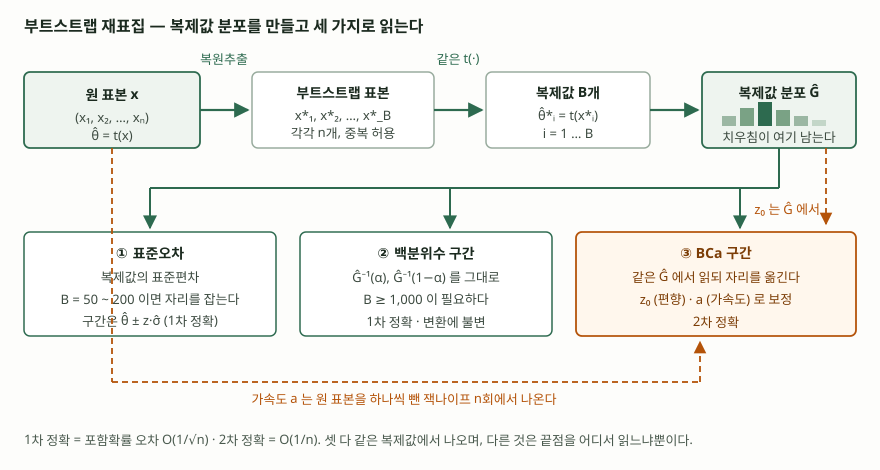

## 들어가며

모델 하나를 평가해 nDCG가 0.412가 나왔다고 하자. 다음 질문은 항상 같다. **이 숫자에
오차 범위를 붙이면 얼마인가.** 표본평균이라면 표준오차 공식이 있지만 nDCG에는 없고,
중앙값·조정 결정계수·군집 수처럼 흔히 쓰는 지표 대부분이 같은 처지다. 공식을 유도하거나
분포를 가정하는 대신, 가진 표본 하나에서 같은 계산을 수천 번 다시 돌려 답을 만드는
방법이 부트스트랩이다. 시험에서는 잭나이프와 대비시켜 묻는 형태가 가장 잦다.

> 계산으로 확인할 수 있는 주제이므로 식을 직접 돌려 검산했다. 수행 기록은
> [code/output.txt](code/output.txt)에 있다.

## 정의

**부트스트랩(bootstrap)** 은 관측된 표본을 모집단 대신 두고, 거기서 **크기 n의 복원추출을
B회 반복해 추정량의 표집분포를 경험적으로 만든 뒤**, 그 분포로 표준오차·편향·신뢰구간을
재는 재표집 기법이다. Efron이 1979년 논문에서 잭나이프를 다시 보는 자리에서 제안했고,
제목 자체가 *Bootstrap Methods: Another Look at the Jackknife*였다.

핵심 전제는 하나다. **경험분포가 모집단 분포를 대신할 만하다면, 경험분포에서 표본을
뽑는 일은 모집단에서 표본을 뽑는 일을 흉내 낸다.** 모집단에서 반복 표집할 수 없으니
가진 표본에서 반복 표집한다.

## 등장 배경

이전에 쓰던 방법 둘에 각각 한계가 있었다.

첫째, **공식 유도**는 추정량마다 따로 해야 한다. 표본평균은 `σ/√n`이 있지만, 조정
결정계수나 nDCG처럼 여러 단계를 거친 지표는 유도가 되지 않거나 점근 근사에 기댄다.
추정량을 하나 바꿀 때마다 통계학 문제가 새로 생긴다.

둘째, **정규 근사 구간** `θ̂ ± z·σ̂`는 표집분포가 정규라는 1차 근사를 문자 그대로
받아들인다. 치우친 분포에서는 이 가정이 깨지고, 게다가 이 구간은 **척도에 따라 답이
달라진다.** 로그를 씌운 척도에서 구간을 만들고 되돌린 것과 원 척도에서 만든 것이 다르다.

셋째, **잭나이프**는 관측치를 하나씩 빼는 n회 고정 계산이라 싸고 재현되지만, 하나를
빼도 값이 거의 안 움직이는 추정량에서 무너진다. 중앙값이 대표적이다.

부트스트랩은 이 셋을 같은 방식으로 푼다. **유도를 계산으로 바꾼다.**

## 구성요소 — 4단계

**① 재표집** — 원 표본 `x = (x₁,…,xₙ)`에서 **크기 n의 복원추출**로 `x*`를 만든다.
같은 관측치가 여러 번 뽑히고 어떤 관측치는 빠진다. 이 중복이 재표집의 전부다.

**② 복제값** — 원 추정에 쓴 **같은 함수** `t(·)`를 `x*`에 적용해 `θ̂* = t(x*)`를 얻는다.
이것을 B회 독립적으로 반복해 복제값 B개를 모은다.

**③ 복제값 분포** — 복제값 B개의 경험분포 `Ĝ`가 추정량의 표집분포를 대신한다.
표준오차 추정값은 복제값의 표본표준편차다.

**④ 읽기** — 같은 `Ĝ`에서 끝점을 어디서 읽느냐로 구간이 갈린다. 표준 구간은 `Ĝ`의
표준편차만 쓰고, 백분위수 구간은 `Ĝ⁻¹(α)`를 그대로 쓰며, BCa 구간은 두 상수로 읽는
자리를 옮긴다.

> **출처**: [B. Efron, B. Narasimhan, *The Automatic Construction of Bootstrap Confidence Intervals* (2018), 2절 식 (2.2)·(2.9), 3절 식 (3.11)–(3.12)](https://efron.ckirby.su.domains/papers/2018Automatic-Construction-BCIs.pdf)

### B는 얼마여야 하는가 — 용도에 따라 다르다

`Exp(1)`에서 뽑은 n = 25 표본의 불편분산을 추정량으로 두고, 같은 B로 20번씩 돌려
결과가 얼마나 흔들리는지 쟀다.

| `B` | 표준오차 추정의 흔들림 | 2.5% 끝점의 흔들림 | 97.5% 끝점의 흔들림 |
|---|---|---|---|
| 50 | 0.01775 | 0.07698 | 0.06871 |
| 200 | 0.00942 | 0.03695 | 0.03353 |
| 1,000 | 0.00354 | 0.01292 | 0.01371 |
| 4,000 | 0.00217 | 0.00795 | 0.00822 |
| 20,000 | 0.00085 | 0.00324 | 0.00354 |

> 값은 [code/output.txt](code/output.txt) `[2]`에서 가져왔다.

**표준오차는 B = 200에서 이미 자리를 잡지만 구간 끝점은 그렇지 않다.** 끝점은 분포의
꼬리를 읽는 값이라 같은 B에서 흔들림이 서너 배 크다. "표준오차는 수십~수백 회,
신뢰구간은 1,000회 이상"이라는 통상의 권고가 여기서 나온다.

## 비교 — 구간 세 가지

같은 복제값 4,000개에서 세 구간을 만들면 이렇게 갈린다.

| 방법 | 하한 | 상한 | 정확도 | 척도 변환에 |
|---|---|---|---|---|
| 표준 `θ̂ ± z·σ̂` | 0.4283 | 1.2208 | 1차 | 민감하다 |
| 백분위수 `Ĝ⁻¹(α)` | 0.4058 | 1.1925 | 1차 | 불변이다 |
| BCa | 0.4205 | 1.2021 | 2차 | 불변이다 |

> 관측값 `θ̂ = 0.8246`, `z₀ = +0.1586`, `a = −0.0606`. 값은 [code/output.txt](code/output.txt) `[3]`에서 가져왔다.

**1차 정확은 포함확률 오차가 `O(1/√n)`, 2차 정확은 `O(1/n)`이라는 뜻이다.** BCa가 쓰는
두 상수는 각각 다른 데서 나온다.

- **편향 보정 `z₀`** — 복제값 중 관측값보다 작은 것의 비율을 표준정규 분위수로 되돌린
  값이다. 여기서는 복제값의 56.3%가 관측값보다 작아 `z₀`가 양수가 되었고, BCa가 그만큼
  끝점을 위로 되돌려 하한이 0.4058에서 0.4205로 올라갔다.
- **가속도 `a`** — 표준오차가 모수에 따라 변하는 정도를 잡는 값이고, **원 표본을 하나씩
  뺀 잭나이프 값에서** `a = Σd³ / 6(Σd²)^{3/2}`로 구한다. 부트스트랩이 잭나이프를
  대체한 것이 아니라 **BCa 안에서 잭나이프를 쓴다**는 점이 답안에서 짚을 자리다.

### 잭나이프와의 대비

| | 잭나이프 | 부트스트랩 |
|---|---|---|
| 재표집 방식 | 비복원, 하나씩 제거 | 복원추출 |
| 반복 횟수 | n회 고정 | B회 (사용자가 정함) |
| 재현성 | 같은 표본이면 항상 같은 값 | 난수 의존 — 씨앗 고정 필요 |
| 중앙값 | 무너진다 | 돈다 |
| 2차 정확 구간 | 만들 수 없다 | BCa로 만든다 |

`Exp(1)` 표본 25개에서 중앙값을 재 보면 차이가 그대로 드러난다. **잭나이프 복제값은
서로 다른 값이 3개뿐이지만 부트스트랩 복제값은 16개**이고, 표준오차 추정값은 잭나이프가
0.3582, 부트스트랩이 0.2229다. 점근 이론값 `1/(2·f(m)·√n) = 0.2000`에 가까운 쪽은
부트스트랩이다. 하나를 빼도 가운데 값은 이웃한 두 자리 사이에서만 움직이지만, 복원추출은
같은 관측치를 여러 번 뽑아 순위 자체를 흔들기 때문이다.

## 적용 시 고려사항 — 4가지

- **B를 용도에 맞춰 정하고, 씨앗을 고정한다.** 표준오차만 필요하면 수백 회로 충분하고,
  신뢰구간이면 1,000회 이상이 필요하다. 난수가 들어가므로 같은 코드를 두 번 돌려도
  값이 다르다. **회귀 검증 절차에 넣으려면 씨앗을 고정해야** 어제와 오늘의 차이가
  모델 변화인지 난수인지 구분된다. 잭나이프에는 없던 운영상의 부담이다.
- **관측치가 독립이라는 전제 위에서만 성립한다.** 같은 세션에서 나온 요청이나 시계열
  로그를 그대로 복원추출하면 값은 나오지만 근거가 없다. 표본 안의 상관을 깨뜨리기
  때문이다. 블록 단위로 뽑는 방식으로 바꿔야 한다.
- **부트스트랩도 항상 되는 것은 아니다.** Bickel과 Freedman은 부트스트랩 근사가 넓은
  범위에서 타당함을 보이면서 **성립하지 않는 반례도 함께 제시했다.** 중앙값 역시
  미묘하다. Ghosh 외(1984)는 부트스트랩 분산 추정이 참값으로 수렴한다는 자연스러운
  추측이 **꼬리 조건 없이는 거짓**임을 반례로 보였고, `E|X|^α`가 어떤 `α > 0`에
  대해 존재하면 성립한다고 증명했다. "부트스트랩은 중앙값에서도 된다"는 조건부 문장이다.
- **계산 비용이 B배다.** 추정 함수를 B회 돌리므로, 학습에 시간이 걸리는 모델의 지표에
  건건이 붙일 수 없다. 대신 복제값끼리 독립이라 **병렬화가 그대로 된다.** 잭나이프의
  n회와 달리 B는 예산에 맞춰 줄일 수 있고, 줄이면 무엇이 먼저 나빠지는지도 위 표에 있다.

## 정리

암기 단서는 **"단계 4 · 구간 3 · 상수 2"**다.

- 단계 **4개** — 복원추출 → 복제값 `t(x*)` → 복제값 분포 `Ĝ` → 끝점 읽기
- 구간 **3개** — 표준(1차, 척도에 민감) · 백분위수(1차, 불변) · BCa(2차, 불변)
- BCa의 상수 **2개** — `z₀`는 복제값 분포에서, `a`는 **잭나이프 n회**에서 나온다
- B는 **표준오차면 수백, 신뢰구간이면 1,000회 이상**. 끝점이 표준오차보다 늦게 안정된다
- 잭나이프와 갈리는 지점은 **복원·B회·난수 의존**, 그리고 중앙값처럼 매끄럽지 않은
  추정량에서 잭나이프는 멈추고 부트스트랩은 (꼬리 조건 아래) 돈다

> 기출 답안: [기출문제 — 잭나이프 기법의 편향 감소와 분산 추정](../../exam/2026-09-22-jackknife-resampling/index.md)

## 참고 자료

- [B. Efron, *Bootstrap Methods: Another Look at the Jackknife*, The Annals of Statistics 7(1):1–26 (1979)](https://doi.org/10.1214/aos/1176344552) — 부트스트랩의 원 논문
- [B. Efron, R. Tibshirani, *Bootstrap Methods for Standard Errors, Confidence Intervals, and Other Measures of Statistical Accuracy*, Statistical Science 1(1):54–75 (1986)](https://doi.org/10.1214/ss/1177013815) — 절차와 구간 방법의 개관
- [T. DiCiccio, B. Efron, *Bootstrap Confidence Intervals*, Statistical Science 11(3):189–228 (1996)](https://doi.org/10.1214/ss/1032280214) — BCa·부트스트랩-t·ABC·보정의 2차 정확성
- [B. Efron, B. Narasimhan, *The Automatic Construction of Bootstrap Confidence Intervals* (2018)](https://efron.ckirby.su.domains/papers/2018Automatic-Construction-BCIs.pdf) — BCa 끝점 식 (2.2), `z₀` 식 (2.9), 잭나이프로 구하는 가속도 식 (3.11)–(3.12)
- [P. J. Bickel, D. A. Freedman, *Some Asymptotic Theory for the Bootstrap*, The Annals of Statistics 9(6):1196–1217 (1981)](https://doi.org/10.1214/aos/1176345637) — 타당성과 함께 반례
- [M. Ghosh, W. C. Parr, K. Singh, G. J. Babu, *A Note on Bootstrapping the Sample Median*, The Annals of Statistics 12(3):1130–1135 (1984)](https://doi.org/10.1214/aos/1176346731) — 중앙값의 부트스트랩 분산 추정과 꼬리 조건
