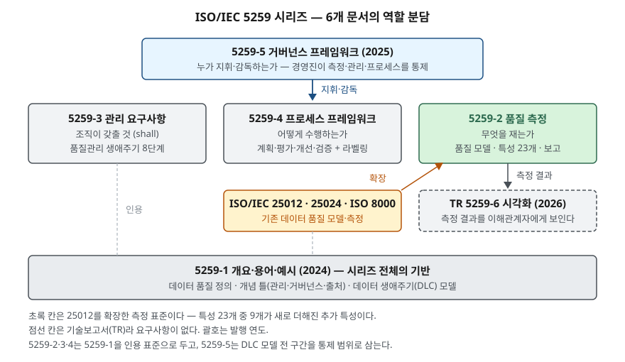

> **실행 검증 없음.** ISO/IEC 5259 각 파트의 적용 범위·목차·용어 정의를 정리한 개념 글이다. 실행 예제와 측정값은 없다.
> 표준 본문은 ISO 웹스토어가 막혀 있어, 공개 미리보기(머리말·서론·적용 범위·용어·목차)에서 확인한 내용만 썼다.

## 들어가며

AI 학습용 데이터의 품질관리를 묻는 문제에서 국제표준으로 드는 이름이 ISO/IEC 5259다. 이름만 적고 넘어가면 점수가 붙지 않는다.
**여섯 문서가 각각 무엇을 맡는지**와, 기존 데이터 품질 표준인 ISO/IEC 25012에서 **무엇이 더해졌는지**를 개수로 써야 한다.
실무에서는 데이터 품질 요구사항을 계약서나 검수 기준에 적을 때 어느 파트를 근거로 삼을지를 정하는 데 쓰인다.

## 정의

- **시리즈의 목적 (5259-1 서론)**: 분석과 ML에 쓰이는 데이터의 품질을 **평가하고 개선할 도구와 방법**을 제공한다.
- **데이터 품질 (5259-1 용어 정의 3.5)**: 지정된 맥락에서 **조직의 데이터 요구사항을 충족하는** 데이터의 특성.

답안 첫 줄에는 "ISO/IEC 5259는 JTC 1/SC 42가 제정한 분석·머신러닝용 데이터 품질 표준 시리즈로, 개요·측정·관리·프로세스·거버넌스·시각화의
6개 문서로 데이터 생애주기 전 구간의 품질 평가와 개선 방법을 정한다"로 쓸 수 있다.

## 등장 배경

일반 데이터 품질 모델은 이미 있었다. ISO/IEC 25012:2008은 컴퓨터 시스템 안의 데이터 품질을 **고유·시스템 의존** 두 관점의 특성 15개로 정의하고,
ISO/IEC 25024가 그 측정 방법을 정한다. 이 틀은 **레코드와 값 하나하나**가 맞는지를 보는 데 맞춰져 있다.

ML에서는 두 가지가 달라진다. 첫째, 5259-2 서론이 적듯 데이터가 **생애주기 단계마다 변환된다.** 원시 데이터를 받아 전처리하고 라벨을 붙이고
학습·평가용으로 나누는 동안 품질을 볼 대상이 바뀐다. 둘째, 레코드가 전부 정확해도 **데이터셋 전체의 분포**가 치우치면 모델이 틀린다.
클래스가 고르게 있는지, 모집단을 대표하는지, 비슷한 표본이 겹치는지는 건 단위 특성으로 잴 수 없다.
5259 시리즈는 25012·25024·ISO 8000을 **버리지 않고 확장하는** 방식으로 이 빈자리를 메웠다.

## 구성요소 / 절차

### 시리즈 구성 — 6개 문서 (5259-1 서론의 파트 목록)

| 문서 | 이름 | 무엇을 정하는가 | 발행 |
|---|---|---|---|
| ① 5259-1 | 개요·용어·예시 | 시리즈 문서를 서로 잇는 **개념 기반.** 품질 개념 틀(관리·거버넌스·데이터 출처)과 데이터 생애주기(DLC) 모델 | 2024-07 |
| ② 5259-2 | 데이터 품질 측정 | **품질 모델, 품질 측정값, 품질 보고** 지침 | 2024-11 |
| ③ 5259-3 | 관리 요구사항·지침 | 품질을 수립·실행·유지·**지속 개선**하기 위한 조직 요구사항. 상세 절차는 정하지 않고 참조 프로세스만 둔다 | 2024 |
| ④ 5259-4 | 프로세스 프레임워크 | 학습·평가 데이터의 품질 프로세스. 지도·비지도·준지도·강화학습·분석 **5가지**와 라벨링 절차 | 2024 |
| ⑤ 5259-5 | 거버넌스 프레임워크 | 조직의 **이사회·경영진이** 측정·관리·프로세스를 지휘·감독하는 통제 틀 | 2025-02 |
| ⑥ TR 5259-6 | 시각화 프레임워크 | 측정 결과를 이해관계자가 **시각화로 확인**하는 틀. 기술보고서(TR)라 요구사항이 없다 | 2026-05 |

5259-1 발행 당시 ②는 FDIS, ⑤는 DIS, ⑥은 CD 단계였다. 국제표준(IS)은 ①~⑤의 5개이고 ⑥은 기술보고서다.

### 5259-2 품질 특성 — 4개 묶음 23개 (5259-2 품질 특성 절, §6)

| 묶음 | 개수 | 특성 |
|---|---|---|
| 고유 특성 | 5 | 정확성·완전성·일관성·신뢰성(credibility)·현재성 |
| 고유·시스템 의존 특성 | 6 | 접근성·준수성·효율성·정밀성·추적성·이해성 |
| 시스템 의존 특성 | 3 | 가용성·이식성·복구성 |
| **추가 특성** | **9** | 감사성·**균형성**·**다양성**·효과성·식별성·관련성·**대표성**·**유사성**·적시성 |

앞의 세 묶음 14개는 25012에서 이어받았고, 네 번째 묶음 9개가 ML을 위해 더해졌다.
굵게 쓴 네 가지가 앞에서 말한 **데이터셋 단위** 특성이다. 5259-2는 용어 절에서 **목표 모집단**(추론을 적용할 관심 모집단)과
**클러스터**(공통 속성을 가진 요소로 자동 도출된 범주)를 정의해 두는데, 각각 대표성과 유사성을 재는 데 쓰인다.

### 5259-3 품질관리 생애주기 — 8단계 (5259-3 생애주기별 관리 절, §7)

동기·개념화 → 명세 → 계획 → 획득 → 전처리 → 증강 → 제공(provisioning) → 폐기.
단계마다 요구사항과 **산출물**(work product)을 따로 정하고, 검증·확인(V&V) 같은 활동은 모든 단계에 걸친 **수평 프로세스**로 둔다.

### 5259-4 프로세스 프레임워크 — 4가지 구성요소 (5259-4 프레임워크 절, §6)

품질 계획 → 품질 평가 → 품질 개선 → 품질 프로세스 검증. 검증에서 요구사항을 못 채우면 개선으로 되돌린다.

## 도식

> **출처**: [ISO/IEC 5259-1:2024 Introduction — 시리즈 파트 목록과 각 파트의 역할](https://cdn.standards.iteh.ai/samples/81088/f4aab019dc5843dbb7fecf362e6bf83e/ISO-IEC-5259-1-2024.pdf) · [ISO/IEC 5259-2:2024 Introduction·Clause 2 Normative references](https://cdn.standards.iteh.ai/samples/81860/6ac019c359644309afa716572bb73edc/ISO-IEC-5259-2-2024.pdf) · [ISO/IEC 5259-3:2024 Clause 2](https://cdn.standards.iteh.ai/samples/81092/ab16f7bfbd4d4f6aa74e64d345a0374c/ISO-IEC-5259-3-2024.pdf) · [ISO/IEC 5259-4:2024 Clause 2](https://cdn.standards.iteh.ai/samples/81093/5c3594d8176843b087a82f481aafd0f1/ISO-IEC-5259-4-2024.pdf) — 층 배치는 서론의 역할 서술을 묶은 것이다

답안지에는 맨 아래에 5259-1 기반을 가로로 긋고, 그 위에 관리(3)·프로세스(4)·측정(2)을 나란히 세운 뒤, 맨 위에 거버넌스(5)를 얹는다.
측정 옆에 "25012 확장, 특성 23개"를 적는 것이 핵심이다.

## 비교

### ISO/IEC 25012와 5259-2

| 구분 | ISO/IEC 25012:2008 | ISO/IEC 5259-2:2024 |
|---|---|---|
| 대상 | 컴퓨터 시스템에 구조화된 형태로 저장된 데이터 | 분석·ML에 쓰이는 데이터. 정형과 비정형(문서·이미지·음성) |
| 특성 수 | 15개 (고유 5 · 고유·시스템 7 · 시스템 3) | 23개 (고유 5 · 고유·시스템 6 · 시스템 3 · 추가 9) |
| 측정 | 별도 문서(ISO/IEC 25024) | 같은 문서 안에 측정값과 보고 지침 |
| 판단 단위 | 주로 값·레코드 | 레코드에 더해 **데이터셋 분포** |
| 생애주기 | 정하지 않음 | 5259-1의 DLC 모델을 전제 |

25012의 고유·시스템 의존 묶음 7개 가운데 **기밀성**(confidentiality)은 5259-2의 특성 목차에 없다.
추가 특성에는 **식별성**(identifiability)이 새로 들어갔다. 두 변화의 관계와 기밀성을 뺀 이유는 공개 미리보기 범위에서 확인하지 못했으므로,
답안에는 "기밀성이 빠지고 식별성이 들어갔다"는 사실까지만 쓴다.

### 5259-3 품질관리 생애주기와 ISO/IEC 8183 데이터 생애주기

| 5259-3 (8단계) | ISO/IEC 8183 (10단계) | 차이 |
|---|---|---|
| 동기·개념화 | 1 아이디어 구상 · 2 비즈니스 요구사항 | 8183은 이 단계를 AI 시스템 쪽에서 본다 |
| 명세 · 계획 | 3 데이터 계획 | 5259-3은 요구사항 명세를 계획과 나눠 **별도 단계**로 둔다 |
| 획득 | 4 데이터 획득 | 같다 |
| 전처리 · 증강 | 5 데이터 준비 | 5259-3은 **증강을 독립 단계**로 뗀다 |
| 제공 | 6 모델 구축 · 7 배포 · 8 운영 | 5259-3은 데이터를 모델 쪽에 **내주는 행위**만 본다 |
| 폐기 | 9 데이터 폐기 | 같다 |
| — | 10 시스템 폐기 | 데이터 품질관리의 범위 밖 |

> 대응은 두 표준의 단계 이름과 정의를 맞대어 정리한 것이다. 한쪽이 다른 쪽을 인용한다는 뜻은 아니다.

8183은 **AI 시스템 전체**에서 데이터가 거치는 길을, 5259-3은 그중 **데이터 품질을 관리할 구간**을 쪼갠다.
그래서 8183의 모델 구축·배포·운영 세 단계가 5259-3에서는 제공 하나로 모인다.

## 적용 시 고려사항

- **파트를 목적에 맞게 골라 인용한다.** 검수 기준(무엇을 몇 %로 재는가)은 5259-2, 수행기관이 지킬 체계는 5259-3, 작업 절차는 5259-4,
  발주기관 경영진의 통제는 5259-5다. "5259를 준수한다"로 뭉뚱그리면 검수에서 무엇을 확인할지가 정해지지 않는다.
- **추가 특성은 데이터셋 단위 계산이 필요하다.** 균형성·대표성·유사성은 레코드를 하나씩 검사해서는 나오지 않는다.
  분포와 클러스터를 계산할 파이프라인과, 목표 모집단을 무엇으로 볼지에 대한 정의가 먼저 있어야 한다.
- **데이터 출처를 메타데이터로 남긴다.** 5259-1은 데이터 출처(provenance)를 품질 개념 틀의 한 축으로 두고, 기원·파생·소유 기록으로 정의한다.
  원천에서 학습용 데이터까지 파생 관계가 끊기면 품질 문제가 어느 단계에서 생겼는지 거슬러 올라갈 수 없다.
- **국내 가이드라인과 용어를 맞춘다.** NIA 학습용 데이터 품질관리 가이드라인은 품질지표 12가지 체계를 쓴다.
  공공 구축사업은 두 체계를 함께 요구받을 수 있으므로 지표 대응표를 먼저 만들어 둔다.
- **TR은 요구사항이 아니다.** 5259-6은 기술보고서라 적합성 판정의 근거가 되지 않는다. 계약 요건에 넣을 때는 IS 파트만 쓴다.

## 정리

- 시리즈 **6개 문서**: 개요(1)·측정(2)·관리(3)·프로세스(4)·거버넌스(5)·시각화(TR 6) → "**개·측·관·프·거·시**". IS 5개 + TR 1개.
- 5259-2 특성 **4묶음 23개** = 25012에서 이어받은 **14개** + ML용 **추가 9개**. 25012의 기밀성은 목차에 없다.
- 데이터셋 단위 추가 특성 **4가지**: 균형성·다양성·대표성·유사성.
- 5259-3 생애주기 **8단계**(동기·명세·계획·획득·전처리·증강·제공·폐기), 5259-4 프레임워크 **4요소**(계획·평가·개선·검증).
- 한 줄: **25012가 값 하나를 본다면, 5259는 데이터셋과 생애주기를 본다.**

> 기출 답안: [기출문제 — 인공지능 학습용 데이터 품질관리](../../exam/2026-09-30-ai-training-data-quality-management/index.md)
>
> 관련 개념: [SQuaRE 표준 체계](../../software-engineering/2026-09-22-square-standard-family-structure/index.md) — ISO/IEC 25012가 속한 품질 모델 부문

## 참고 자료

- [ISO/IEC 5259-1:2024, Part 1: Overview, terminology, and examples](https://www.iso.org/standard/81088.html) · [공개 미리보기 — 서론의 파트 목록, 1절 적용 범위, 3절 용어(3.5 data quality, 3.17 data provenance)](https://cdn.standards.iteh.ai/samples/81088/f4aab019dc5843dbb7fecf362e6bf83e/ISO-IEC-5259-1-2024.pdf)
- [ISO/IEC 5259-2:2024, Part 2: Data quality measures](https://www.iso.org/standard/81860.html) · [공개 미리보기 — 서론, 1절 적용 범위, 3절 용어(3.9 target population, 3.19 cluster), 목차의 6절 품질 특성 23개](https://cdn.standards.iteh.ai/samples/81860/6ac019c359644309afa716572bb73edc/ISO-IEC-5259-2-2024.pdf)
- [ISO/IEC 5259-3:2024, Part 3: Data quality management requirements and guidelines](https://www.iso.org/standard/81092.html) · [공개 미리보기 — 1절 적용 범위, 목차의 7절 생애주기 8단계와 8절 수평 프로세스](https://cdn.standards.iteh.ai/samples/81092/ab16f7bfbd4d4f6aa74e64d345a0374c/ISO-IEC-5259-3-2024.pdf)
- [ISO/IEC 5259-4:2024, Part 4: Data quality process framework](https://www.iso.org/standard/81093.html) · [공개 미리보기 — 1절 적용 범위, 목차의 6절 프레임워크 4요소](https://cdn.standards.iteh.ai/samples/81093/5c3594d8176843b087a82f481aafd0f1/ISO-IEC-5259-4-2024.pdf)
- [ISO/IEC 5259-5:2025, Part 5: Data quality governance framework](https://www.iso.org/standard/84150.html)
- [ISO/IEC TR 5259-6:2026, Part 6: Visualization framework for data quality](https://www.iso.org/standard/86532.html)
- [ISO/IEC 25012:2008, SQuaRE — Data quality model](https://www.iso.org/standard/35736.html)
- [ISO/IEC 8183:2023, Artificial intelligence — Data life cycle framework](https://www.iso.org/standard/83002.html)
