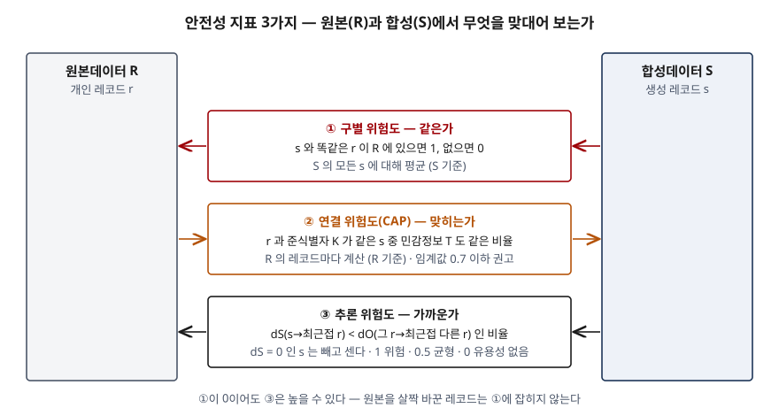

## 들어가며

합성데이터 문제는 생성 모델 이름(GAN·VAE·확산 모델)을 나열하면 평이해진다. 점수가 갈리는 곳은 품질을
**유용성과 안전성 두 축**으로 나누고, 안전성을 **세 가지 위험도**로 구분해 쓰는 데다.
실무에서는 합성데이터를 외부에 내줄지 판정할 때 이 지표와 임계값이 근거 문서가 된다.

> 계산으로 확인할 수 있는 주제이므로 안내서의 산출 절차를 코드로 옮겨 검산했다. 수행 기록은
> [code/output.txt](code/output.txt)에 있다. 원본은 가상 모집단에서 뽑은 300건이고, 생성 모델은 돌리지 않고
> 성질이 다른 합성 방식 네 가지를 흉내 냈다.

## 정의

- **합성데이터 (개인정보보호위원회 안내서, 2024-12)**: 특정 목적을 위해 원본데이터의 형식·구조·통계적 분포 특성과
  패턴을 학습해 생성한 모의 또는 가상 데이터.
- **유용성**: 합성데이터와 원본의 통계적 분포가 얼마나 유사한지, 같은 목표를 달성할 수 있는지.
- **안전성**: 합성데이터를 통해 원본 속 개인이 식별될 가능성이 있는지.

답안 첫 줄에는 "합성데이터는 원본의 구조와 통계적 분포를 학습한 모델로 만든 가상 데이터로, 원본처럼 쓸 수 있는가(유용성)와
원본 속 개인이 드러나지 않는가(안전성)를 함께 검증해야 활용할 수 있다"로 쓸 수 있다.

## 등장 배경

기존 비식별 처리는 원본 레코드를 남긴 채 식별자를 지우고 준식별자를 가린다. 레코드가 1:1로 남으므로 많이 가리면
분석 가치가 떨어지고, 덜 가리면 다른 데이터와 맞대어 재식별된다. NIST SP 800-226은 성별·우편번호·생년월일 세 항목만으로
비식별 의료 기록에서 개인을 다시 찾아낸 연결 공격 사례를 들어 이 한계를 설명한다(1.1절).

합성데이터는 레코드를 고치는 대신 **분포를 학습해 새 레코드를 만든다.** 원본 레코드가 남지 않으므로 1:1 연결은 끊긴다.
그러나 "원본 레코드가 없다"는 것이 "안전하다"는 뜻은 아니다. 생성 모델이 학습 레코드를 기억해 다시 내거나, 거의 같은
레코드를 내면 개인이 드러난다. 그래서 안전성을 **측정**해야 하고, 측정 방식이 하나로는 부족해 세 가지가 됐다.

## 구성요소 — 안전성 지표 3가지

안내서는 EU 제29조 작업반의 익명화 평가 기준(Opinion 05/2014)이 든 세 위험인 구별·연결·추론을 가져와
정형 합성데이터의 안전성 지표로 쓴다(부록2). 안내서는 이 지표를 **예시**로 두고 다른 지표도 쓸 수 있다고 밝힌다.

| 지표 | 묻는 것 | 계산 단위 | 산출 | 해석 |
|---|---|---|---|---|
| ① **구별 위험도** | 합성 안에 원본 레코드가 **그대로** 있는가 | 합성 레코드마다 | 같은 원본 레코드가 있으면 1, 없으면 0의 평균 | 0에 가까울수록 안전 |
| ② **연결 위험도** (CAP) | 원본의 준식별자를 아는 공격자가 합성에서 민감정보를 **맞히는가** | 원본 레코드마다 | 준식별자가 같은 합성 레코드 중 민감정보까지 같은 비율 | 0에 가까울수록 안전. 임계값 0.7 이하 권고 |
| ③ **추론 위험도** | 같지는 않지만 **매우 가까운** 합성 레코드가 있는가 | 합성 레코드마다 | 합성→최근접 원본 거리 `dS`가 그 원본→최근접 다른 원본 거리 `dO`보다 작은 비율. `dS = 0`은 뺀다 | 1 위험, 0.5 균형, 0은 유용성이 매우 낮음 |

③의 기준이 `dO`인 이유가 이 지표의 핵심이다. 원본 레코드끼리도 원래 이만큼은 떨어져 있다. 합성 레코드가 그 간격보다
원본에 더 바짝 붙어 있으면 모집단을 배운 것이 아니라 **그 사람을 베낀** 것이다.

```python
def inference_risk(synth, orig):
    """합성→가장 가까운 원본 거리(dS)가 그 원본→다른 원본 거리(dO)보다 작은 비율."""
    ...
    for s in synth:
        dists = [gower(s, o, age_range, income_range) for o in orig]
        d_s = min(dists)
        if d_s == 0:  # 원본과 같은 레코드는 구별 위험도가 따로 센다
            continue
        counted += 1
        closer += d_s < nearest_other[dists.index(d_s)]
    return closer / counted if counted else float("nan")
```

전체 소스는 [code/synth_risk.py](code/synth_risk.py)에 있다. 거리는 안내서가 예로 든 가워 거리를 썼다.

### 임계값 — 2가지 방식

안내서는 임계값을 두 갈래로 정한다(3단계-2, 부록4).

- **절대 임계값**: 지표 자체에 기준을 둘 수 있으면 그 값을 쓴다. 연결 위험도가 그렇다(0.7 이하 권고)
- **상대 임계값**: 원본을 50:50으로 무작위로 나눠 한쪽을 원본, 다른 쪽을 합성으로 보고 지표를 잰다. 이를 반복해 쌓인
  값의 분위수(높은 안전성이 필요하면 90%, 보통이면 99% 등)를 임계값으로 둔다. 구별·추론 위험도가 그렇다

상대 임계값의 뜻은 이렇다. **같은 모집단에서 새로 뽑은 실제 표본**이 내는 값을 기준선으로 삼는다. 모집단을 완벽히 배운
생성 모델의 출력은 새 표본과 구별되지 않으므로, 그보다 위험도가 높으면 학습 데이터 쪽으로 치우친 것이다.

## 도식



> **출처**: [개인정보보호위원회, 합성데이터 생성·활용 안내서 (2024-12) 부록2 합성데이터 안전성 검증 기준 — 구별·연결·추론 위험도 산출식](https://www.data.go.kr/data/15142321/fileData.do)

답안지에는 좌우에 R·S 기둥을 세우고 그 사이에 세 상자를 쌓는다. 화살표 방향이 계산 단위다 — ①③은 S에서, ②는 R에서 출발한다.

### 계산으로 본 상충

같은 원본 300건에 성질이 다른 합성 방식 네 가지를 대고 세 위험도와 유용성 차이를 쟀다.
유용성은 나이–소득 상관계수 차이(2차원 관계 유사성)와 직업별 평균 소득의 최대 차이로 봤다.

```text
방식   |   구별 | CAP평균 | CAP>0.7 |   추론 | 상관차이 | 직업평균차
과적합    |  0.393 |  0.761 |    0.697 |  0.934 |   0.008 |    0.007
새 표본   |  0.050 |  0.733 |    0.687 |  0.509 |   0.048 |    0.215
주변분포만  |  0.040 |  0.552 |    0.360 |  0.361 |   0.681 |    0.809
균등 잡음  |  0.020 |  0.309 |    0.000 |  0.167 |   0.707 |    1.133

[3] 추론 위험도 임계값 — 원본을 50:50으로 나눠 30회 측정한 분포 (부록4 절차)
    최소 0.480  중앙 0.569  최대 0.664  95% 분위수(임계값) 0.642
```

위에서 아래로 갈수록 원본과 덜 닮았다. 추론 위험도는 0.934 → 0.167로 내려가고, 상관 차이는 0.008 → 0.707로 올라간다.
**한쪽이 좋아지면 다른 쪽이 나빠진다.** 표만 보면 네 줄이 한 축 위에 놓인다.

- `과적합`은 유용성 차이가 사실상 0이지만 추론 위험도 0.934로 임계값 0.642를 크게 넘는다. 원본의 40%를 그대로 낸 탓에
  구별 위험도도 0.393이다
- `새 표본`은 추론 위험도 0.509로 임계값 아래이고 유용성 차이도 작다. 이 줄이 목표다. 구별 위험도가 0이 아닌 0.050인 것은
  나이(정수)와 소득(소수 한 자리)이 이산값이라 우연히 같은 레코드가 생기기 때문이다. 구별 위험도의 바닥도 데이터에 따라
  다르므로 상대 임계값이 필요하다
- `주변분포만`은 열을 따로 섞어 열 하나의 분포는 같지만 상관 차이가 0.681이다. 일차원 분포만 보고 통과시키면 놓친다
- `균등 잡음`은 가장 안전하지만 쓸 데가 없다

## 비교

### 세 위험도가 놓치는 것

`[4]`는 과적합 세트에서 원본과 **같은** 레코드만 지운 결과다.

```text
[4] 과적합 세트에서 원본과 같은 레코드를 지운 뒤
    남은 레코드 182건
방식   |   구별 | CAP평균 | CAP>0.7 |   추론 | 상관차이 | 직업평균차
삭제후    |  0.000 |  0.761 |    0.730 |  0.934 |   0.042 |    0.119
```

구별 위험도는 0이 됐지만 추론 위험도는 0.934 그대로다. 남은 182건은 소득만 0.1 흔든 레코드라 ①에는 안 잡히고 ③에 잡힌다.
**"원본과 같은 레코드가 없으니 안전하다"는 틀린 결론**이 여기서 나온다.

| 지표 | 잡는 것 | 놓치는 것 |
|---|---|---|
| ① 구별 | 원본 레코드의 그대로 복제 | 값을 조금만 바꾼 레코드 |
| ② 연결 | 준식별자 조합으로 민감정보를 맞히는 공격 | 준식별자·민감정보로 지정하지 않은 열. 범주형이어야 계산된다 |
| ③ 추론 | 원본에 바짝 붙은 근사 복제 | 거리 함수가 무시하는 차이. 거리 정의에 따라 값이 달라진다 |

CAP은 이 예제에서 해석에 주의가 필요했다. `새 표본`의 CAP 평균 0.733이 `과적합`의 0.761과 거의 같다. 이 데이터는 소득이
직업과 나이로 상당 부분 정해지도록 만들었으므로, 모집단의 관계만 재현해도 준식별자로 소득 구간을 맞힐 수 있다.
NIST SP 800-226이 2.1절에서 설명하듯 모집단 수준의 관계에서 나오는 추론은 그 사람의 데이터가 없어도 가능하다.
안내서는 CAP에 절대 임계값을 두지만, 이런 데이터에서는 원본 분할로 얻은 기준값을 함께 보아야 **개인 유출과
모집단 관계 재현을 구분할 수 있다** — 이 부분은 계산 결과에서 나온 판단이다.

### 사후 측정과 수학적 보장

| 구분 | 위험도 지표 (구별·연결·추론) | 차분 프라이버시 합성 |
|---|---|---|
| 안전성을 언제 확인하나 | 생성한 뒤 측정 | 생성 알고리즘 자체가 보장 |
| 보장 범위 | 측정한 공격 유형까지 | NIST SP 800-226은 아직 나오지 않은 공격까지 포함한다고 설명 |
| 조절 수단 | 레코드 삭제·매개변수 조정·재생성 | 프라이버시 손실 매개변수 ε |
| 유용성 손실 | 지운 레코드만큼 | 잡음만큼. 딥러닝 기반 DP 합성은 주변분포 기반보다 품질이 크게 낮다고 NIST가 적는다 |
| 근거 | 개인정보보호위원회 안내서 부록2·4 | NIST SP 800-226 3.6절 |

NIST SP 800-226은 차분 프라이버시를 쓰지 않은 합성데이터는 **비형식적 보장**만 준다고 본다(3.6절).
위험도 지표는 알려진 공격 세 가지를 재는 것이고, 재지 않은 공격에 대해서는 말해 주지 않는다.

## 적용 시 고려사항 — 4가지

- **세 지표를 함께 잰다.** `[4]`에서 보았듯 ①만 보면 근사 복제를 놓친다. 같은 실행에서 세 값과 유용성 지표를 함께
  남겨야 상충이 드러난다.
- **임계값은 생성 전에, 원본으로 정한다.** 상대 임계값은 원본 분할만으로 산출되므로 생성 모델과 무관하다. 생성 결과를
  보고 기준을 정하면 유용성이 높게 나온 결과에 기준을 맞추게 된다.
- **거리와 범주화 정의를 문서로 남긴다.** 추론 위험도는 거리 함수, CAP은 준식별자·민감정보 지정과 수치형의 범주화
  구간에 따라 값이 바뀐다. 심의와 재검증에서 같은 값을 다시 얻으려면 이 정의가 계보(lineage)와 함께 보관돼야 한다.
- **임계값을 못 넘으면 지우고, 그래도 안 되면 다시 만든다.** 안내서는 CAP이 높은 레코드를 일부 지워 기준을 맞출 수
  있다고 하지만, 임계값이 낮을수록 지워지는 레코드가 많아져 유용성이 떨어진다고도 적는다. 삭제로 맞추기 어려우면
  생성 매개변수를 조정해 재생성한다.

## 정리

- 품질 **2축**: 유용성(원본처럼 쓸 수 있나) · 안전성(개인이 드러나나). 같은 데이터에서 반대로 움직인다.
- 안전성 **3지표** — "**같·맞·가**": 구별(**같**은가) · 연결 CAP(**맞**히는가, 0.7 이하) · 추론(**가**까운가, 0.5가 균형).
- 계산 단위: 구별·추론은 **합성 레코드마다**, CAP은 **원본 레코드마다**.
- 임계값 **2방식**: 절대(CAP) · 상대(원본 50:50 분할 반복의 분위수, 구별·추론).
- 한 줄: **구별 위험도 0은 안전의 증거가 아니다. 근사 복제는 추론 위험도로만 잡힌다.**

> 기출 답안: [기출문제 — 합성데이터의 개념과 생성 기법, 품질 평가 지표](../../exam/2026-10-03-synthetic-data-generation-quality-metrics/index.md)
>
> 관련 개념: [차분 프라이버시 — 프라이버시 손실 매개변수 ε과 누적 손실](../../security/2026-10-03-differential-privacy-epsilon-composition/index.md) — 사후 측정 대신 수학적 보장을 주는 방식

## 참고 자료

- [개인정보보호위원회, 데이터의 안전한 활용을 위한 합성데이터 생성·활용 안내서 (2024-12, 발간등록번호 11-1790377-100001-01)](https://www.data.go.kr/data/15142321/fileData.do) — 제2장 정의·한계, 제3장 3단계 안전성 및 유용성 검증, 부록2 안전성 검증 기준(구별·연결·추론 위험도 산출식), 부록4 정형 데이터 검증 지표 임계값 산정 방법
- [NIST SP 800-188, De-Identifying Government Datasets: Techniques and Governance (2023-09)](https://doi.org/10.6028/NIST.SP.800-188) — §4.4 Synthetic Data
- [NIST SP 800-226, Guidelines for Evaluating Differential Privacy Guarantees (2025-03)](https://doi.org/10.6028/NIST.SP.800-226) — §1.1 De-Identification and Re-Identification, §2.1 The Promise of Differential Privacy, §3.6 Synthetic Data
- [Article 29 Data Protection Working Party, Opinion 05/2014 on Anonymisation Techniques (2014-04)](https://ec.europa.eu/justice/article-29/documentation/opinion-recommendation/files/2014/wp216_en.pdf) — 구별·연결·추론 세 기준
- J. Taub, M. Elliot, M. Pampaka, D. Smith, Differential Correct Attribution Probability for Synthetic Data: An Exploration, PSD 2018, LNCS 11126, pp. 122–137 — CAP
- [A. Alaa, B. van Breugel, E. Saveliev, M. van der Schaar, How Faithful is your Synthetic Data? Sample-level Metrics for Evaluating and Auditing Generative Models, ICML 2022](https://arxiv.org/abs/2102.08921) — 안내서가 추론 위험도의 근거로 인용
