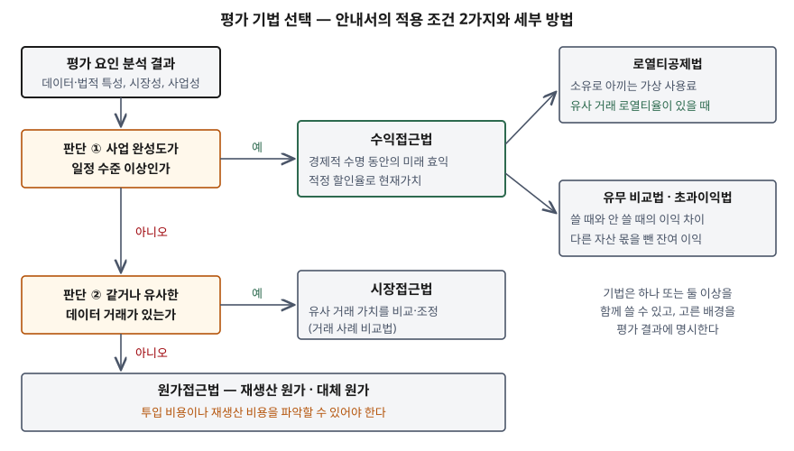

> **실행 검증 없음.** 법령과 공공기관·국제평가기준 문서의 정의와 절차를 정리한 개념 글이다. 평가 금액이나
> 측정값은 싣지 않는다. 과기정통부 안내서 원문은 직접 열지 못했고, 지정 평가기관(기술보증기금)·한국데이터산업진흥원의
> 공개 안내와 안내서를 해설한 법무법인 자료에서 같은 내용을 확인해 썼다.

## 들어가며

데이터를 담보로 보증을 받거나 데이터 유출 소송에서 손해액을 정하려면 "이 데이터가 얼마인가"에 숫자로 답해야 한다.
데이터산업법이 가치평가 제도를 법에 두고 정부가 안내서를 낸 뒤로, 시험은 세 기법의 이름보다 **어느 조건에서 어느 기법을
쓰고 그 기법이 어떤 변수에 기대는가**를 묻는다. 정보시스템 쪽에서는 그 변수 — 원가, 기여도, 경제적 수명 — 를 기록으로
뒷받침하는 일이 남는다.

## 정의

**데이터 가치평가**: 데이터 가치를 시장에서 일반적으로 인정된 평가 기법·모델에 따라 **가액·등급·점수**로 측정하는
일련의 활동이다(과기정통부 데이터 가치평가 안내서). 여기서 **데이터 가치**는 데이터의 생산·유통·거래·활용에서 생기는
**경제적 효익의 측정치**다.

안내서는 이 가치를 사용자의 활용에 중점을 둔 **사용가치**(value in use)로 보고, 판매자와 사용자가 물가·투입 비용 등을
고려해 합의한 **교환가치**(value in exchange), 곧 **데이터의 가격**과 구분한다. 평가액과 거래 가격이 달라도 모순이 아닌 이유다.

## 등장 배경

데이터에 값을 매기기 어려운 이유는 데이터의 경제적 특성에서 나온다. OECD 보고서(2022)가 드는 특성은 **3가지**다.

- **비경합성** — 여러 주체가 동시에 써도 닳지 않는다. 남의 접근을 막을 수 있는지는 법 제도에 달렸다
- **규모의 경제** — 처음 만드는 비용은 크고 복제 비용은 거의 없다. 그래서 원가와 가치가 따로 움직인다
- **거래의 희소성** — 대부분 자체 생산·자체 사용이라 비교할 거래 가격이 드물다

값을 매길 공인된 방법이 없으면 담보·투자·거래 가격 협상에서 데이터를 근거로 삼기 어렵다.
데이터산업법은 **제14조**에 가치평가를 명문화해, 과기정통부 장관이 평가 기법과 평가체계를 정해 고시하고
전문 인력·평가 모델·평가 정보 관리망을 갖춘 기관을 **가치평가기관으로 지정**하게 했다. 2023-03-02에 **4개 기관**
(기술보증기금, 나이스디앤비, 신용보증기금, 한국과학기술정보연구원)이 지정됐다(한국데이터산업진흥원). 공공데이터는 대상에서 빠진다.

## 구성요소 / 절차

### 평가 목적 — 6가지 (안내서)

| 목적 | 내용 |
|---|---|
| ① 이전·거래 | 데이터 매매, 라이선스 가격 결정 |
| ② 금융 | 담보권 설정, 투자 유치, 보증서 발급 |
| ③ 전략 | 기업 가치 증진, 데이터 상품화, 분사, 장기 경영계획 |
| ④ 소송 | 자산 침해, 채무불이행 등 분쟁 |
| ⑤ 청산 | 파산·구조조정에 따른 자산 평가 |
| ⑥ 기타 | 기증·처분·상각을 위한 세무 계획, 인수합병 |

### 평가 요인 — 4가지 (안내서)

**데이터 특성**(우수성·모방 난이도·지속가능성·경쟁 강도), **법적 특성**(법적 안정성·권리 범위·보안 강도 → 독점적 지위,
경제적 수명, 사업 보호 정도), **시장성**(진입 가능성·경쟁 강도·성장성·수요 민감도), **사업성**(제품 경쟁력·예상 점유율·
사업화 환경·영업이익성). 평가 요인은 기법의 **입력 변수**를 정한다. 법적 특성 분석이 경제적 수명을, 사업성 분석이 매출 추정을 낸다.

### 평가 기법 — 3가지와 세부 방법

| 기법 | 정의 (안내서) | 적용 조건 (안내서) | 세부 방법 (IVS 210 공개초안) |
|---|---|---|---|
| **수익접근법** | 경제적 수명 동안의 미래 경제적 효익에 적정 할인율을 적용해 현재가치로 환산 | 사업적 완성도가 일정 수준 이상 | 초과이익법, 로열티공제법, 유무 비교법(프리미엄 이익법), 그린필드법, 유통업자법 — **5가지** |
| **원가접근법** | 생산에 지출된 금액, 또는 같은 효익의 데이터를 생산·구입하는 데 드는 금액을 추정 | 유사 거래 사례가 없고 완성도가 낮을 때. 투입 비용·재생산 비용을 파악할 수 있어야 한다 | 대체 원가, 재생산 원가 — **2가지** |
| **시장접근법** | 같거나 유사한 데이터가 유통시장에서 거래된 가치를 비교·분석해 상대 가치를 산정 | 유사한 데이터 거래가 있을 때 | 거래 사례 비교법이 사실상 유일 |

데이터의 유형·특성·용도에 따라 **하나 또는 둘 이상**의 기법을 쓸 수 있고, 기법을 고른 배경을 명시해야 한다.

### 수익접근법의 세부 방법 둘

- **로열티공제법**(relief-from-royalty) — 데이터를 소유해 **내지 않아도 되는 가상의 사용료**를 수명 동안 세후로
  환산해 현재가치로 할인한다. IVS 공개초안은 로열티율을 정하는 **2가지** 길을 든다. 비교 가능한 거래의 시장 로열티율,
  그리고 사용권자와 권리자가 이익을 나눌 몫(이익 분할)이다. 안내서는 유사 데이터 거래의 **경상로열티율**을 참고할 수
  있을 때 이 방법을 예로 든다
- **유무 비교법**(with-and-without) — 데이터를 **쓰는 시나리오와 안 쓰는 시나리오**를, 다른 조건을 같게 둔 채 비교한다.
  두 사업가치의 차이를 보거나, 기간별 이익 차이를 현재가치로 합한다. 공개초안은 로열티공제법을 이 방법의 한 갈래로 보기도 한다

### 평가 절차 — 9단계 (안내서, 약 8주)

평가 의뢰·사전 검토 → 서류 제출·접수 → 평가계획 수립 → 평가 준비 → 킥오프·현장실사 → **평가 요인 분석** →
**데이터 가치 산정** → 평가 결과 통보 → 사후관리. 진흥원 안내는 같은 흐름을 **6단계**(사전 협의 → 서류 제출·계약 →
평가계획·준비 → 가치평가 실시 → 결과보고서 작성 → 결과 통보)로 묶는다. 묶음 방식이 다를 뿐 내용은 같다.

## 도식

> **출처**: [법무법인 화우, 과기정통부 데이터 가치평가 안내서 발간 해설 §3 평가 요인 및 주요 방법론 (2024-07-10)](https://www.hwawoo.com/newsletter/2024_07_10/240710_k_t.pdf) · [IVSC, IVS 210 Intangible Assets Exposure Draft §50 Income Approach Methods, §70 Relief-from-Royalty, §80 With-and-Without, §140 Cost Approach Methods](https://www.ivsc.org/wp-content/uploads/2021/10/IVS210IntangibleAssets.pdf)

답안지에는 판단 상자 두 개를 세로로 놓는다. 첫 판단이 "예"면 수익접근법, 아니면 둘째 판단으로 내려가 "예"면 시장접근법,
"아니오"면 원가접근법이다. 수익접근법 옆에 로열티공제법과 유무 비교법을 가지로 붙인다.

## 비교

### 사용가치와 교환가치

| 구분 | 사용가치 | 교환가치 |
|---|---|---|
| 기준 | 사용자의 활용에서 생기는 효익 | 판매자·사용자의 합의 |
| 다른 이름 | 데이터 가치 (평가 대상) | 데이터 가격 |
| 사용자마다 | 다르다 — 같은 데이터도 사업화 주체에 따라 갈린다 | 거래마다 하나로 정해진다 |

### 세 기법의 강점과 약점

| 항목 | 수익접근법 | 원가접근법 | 시장접근법 |
|---|---|---|---|
| 가치의 근거 | 미래 효익 | 과거·현재 투입 | 시장 거래 |
| 핵심 입력 | 매출 추정, 데이터 몫(로열티율·기여도), 할인율, 경제적 수명 | 인건비·인프라 원가, 이윤 가산, 진부화 | 비교 거래 가격, 차이 조정 |
| 강점 | 데이터가 만드는 가치를 직접 잰다 | 증빙이 있어 재현성이 높다 | 시장이 인정한 값이다 |
| 약점 | 가정이 많아 평가자에 따라 흔들린다 | 가치 전체를 담지 못한다 | 비교 대상이 드물다 |

OECD는 데이터의 재사용성 때문에 미래 수익 흐름을 정확히 추정하기 어렵다고 보고, 자체 사용 데이터에는 **원가합산법**이
가장 현실적이라고 적는다. 반면 원가는 외부효과를 반영하지 못해 가치 전체를 재지 못한다. 그래서 기법을 둘 이상 써서
차이를 설명하는 쪽이 권고된다.

## 적용 시 고려사항

- **경제적 수명은 4가지 요인을 함께 본다.** IVS 공개초안은 법적·기술적·기능적·경제적 요인을 따로 그리고 함께 보라고 하고,
  경제적 수명이 회계·세무상 내용연수와 **다른 개념**이라고 적는다. 데이터는 물리적으로 닳지 않지만 새 정보가 더해지지 않으면
  진부화된다. 데이터셋별 조회·활용 빈도의 시계열을 남겨 두면 활용이 줄어드는 속도를 수명의 근거로 쓸 수 있다.
- **할인율은 판단이 크게 개입하는 변수다.** 공개초안은 무형자산 할인율의 관찰 가능한 시장 증거가 드물어 상당한 전문가
  판단이 필요하다고 적는다. 사업성 분석에서 위험을 높게 보면서 할인율은 낮게 잡는 식의 엇갈림이 생기지 않게 한다.
- **원가접근법을 주된 기법으로 쓸 조건을 확인한다.** 공개초안은 **3가지** 조건 — 시장 참여자가 비슷한 효용의 자산을 다시 만들 수
  있고, 법적 보호나 진입 장벽이 없고, 프리미엄을 낼 필요가 없을 만큼 빨리 다시 만들 수 있을 것 — 을 든다. 오랜 기간 쌓인 이력
  데이터처럼 다시 만들 수 없는 데이터는 원가가 가치를 크게 밑돈다. 원가를 쓰면 데이터셋 단위 원가 태그와 데이터 계보로 배분 근거를 남긴다.
- **평가 전제를 명시한다.** 안내서는 대상 데이터, 목적과 용도, 적용된 가정, 제한 조건, 기법 선택 배경을 명시하는 것을 원칙으로 둔다.
  같은 데이터도 담보용과 매각용은 결과가 갈리므로, 대상 데이터의 판(버전)과 범위를 카탈로그에 고정해 둔다.
- **법적 특성이 수명과 매출의 상한을 정한다.** 개인정보·영업비밀이 섞이면 수집·제3자 제공의 동의 요건과 보호조치 수준을
  분석한다. 동의 범위 밖의 용도를 전제로 매출을 추정하면 평가가 성립하지 않으므로, 항목 단위로 수집 근거와 동의 범위가 연결돼 있어야 한다.

> 기출 답안: [기출문제 — 데이터 가치평가의 평가 요인, 방법론, 객관성을 정하는 핵심변수](../../exam/2026-10-05-data-valuation-factors-methods/index.md)
>
> 관련 개념: [현금흐름할인(DCF) — 미래의 돈을 오늘 값으로](../../../Finance/valuation/2026-10-03-dcf-discount-rate-sensitivity/index.md)

## 정리

- 데이터 가치 = **사용가치**. 교환가치(가격)와 다르다.
- 근거 **데이터산업법 제14조**, 지정 평가기관 **4곳**(2023-03-02), 공공데이터 제외.
- 평가 요인 **4가지** — 데이터 특성 · 법적 특성 · 시장성 · 사업성. "데·법·시·사".
- 기법 **3가지**와 조건 — 완성도 높으면 **수익**, 거래 있으면 **시장**, 둘 다 없으면 **원가**.
- 수익접근법 세부 — 로열티공제법(가상 사용료) · 유무 비교법(쓸 때와 안 쓸 때). 경제적 수명 **4요인**(법·기술·기능·경제).
- 목적 **6가지**(이전·금융·전략·소송·청산·기타), 절차 **9단계**(약 8주).

## 참고 자료

- [데이터 산업진흥 및 이용촉진에 관한 기본법 제14조(데이터 가치평가) — 국가법령정보센터](https://www.law.go.kr/법령/데이터산업진흥및이용촉진에관한기본법) (2022-04-20 시행)
- 과학기술정보통신부, 데이터 가치평가 안내서 (2024-07-04 발간) — 아래 공개 자료로 내용 확인
  - [법무법인 화우, 과기정통부 데이터 가치평가 안내서 발간 해설 (2024-07-10)](https://www.hwawoo.com/newsletter/2024_07_10/240710_k_t.pdf) — 정의, 평가 목적 6가지, 업무 절차 9단계, 평가 요인, 기법과 적용 조건
  - [기술보증기금, 데이터가치평가 안내](https://www.starvalue.or.kr/itechvalue/wsp/dataEval/dv_about.jsp) — 평가 요인, 주요 방법론, 절차
  - [한국데이터산업진흥원, 데이터 가치평가 제도 안내](https://www.kdata.or.kr/kr/contents/value01/view.do) — 지정 평가기관, 평가 대상, 6단계 절차
- [IVSC, IVS 210 Intangible Assets Exposure Draft](https://www.ivsc.org/wp-content/uploads/2021/10/IVS210IntangibleAssets.pdf) — §50 Income Approach Methods, §70 Relief-from-Royalty, §80 Premium Profit / With-and-Without, §120 Market Approach Methods, §130·140 Cost Approach, §160 Discount Rates, §170 Economic Lives. IVS 2017 개정 때의 공개초안이라 확정본과 문단 번호가 다를 수 있다
- [OECD, Measuring the value of data and data flows, OECD Digital Economy Papers No. 345 (2022-12)](https://www.oecd.org/en/publications/measuring-the-value-of-data-and-data-flows_923230a6-en.html) — §2.3 Economic characteristics of data, §4.2 Valuation of data
