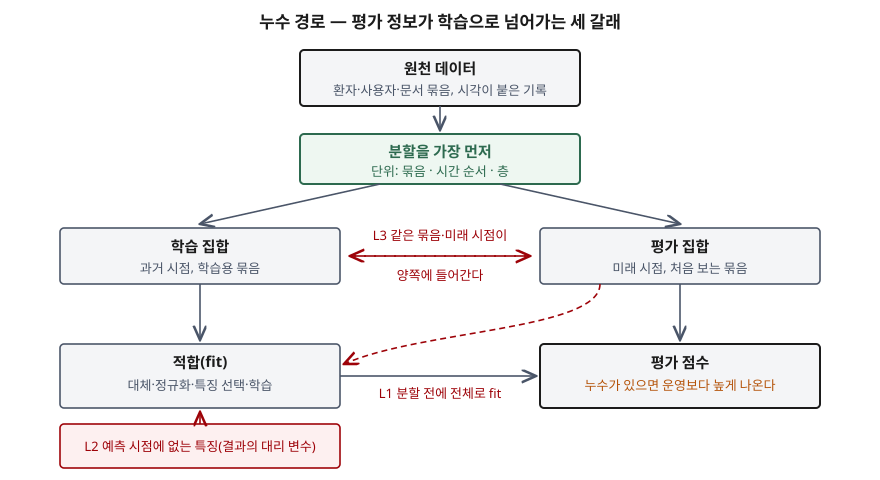

> 실험으로 확인할 수 있는 부분은 직접 돌렸다. 세 실험의 정확도·오차는
> [`code/leakage_demo.py`](code/leakage_demo.py)를 돌린 기록 [`code/output.txt`](code/output.txt)에서 가져왔다.
> 정의와 유형 분류는 원 논문과 scikit-learn 사용자 안내서를 근거로 했다.

## 들어가며

평가에서는 정확도가 높았는데 운영에 올리자 성능이 떨어지는 모델이 있다. 원인 중 가장 흔한 것이 평가 데이터의
정보가 학습 과정에 섞여 들어간 **데이터 누수**다. AI 학습데이터 구축을 묻는 기출에서 "학습·검증·평가로 나눈다"만
쓰면 점수가 붙지 않는다. **무엇을 단위로 나누는가**, 그리고 **분할보다 앞서 무엇을 하면 안 되는가**까지 써야 한다.

## 정의

**데이터 누수**: 데이터 마이닝 대상(정답)에 관한 정보 중 **정당하게는 쓸 수 없는 정보**가 모델 구축에 들어오는
것이다(Kaufman 외, 2012). scikit-learn 안내서는 같은 현상을 **예측 시점에 얻을 수 없는 정보**가 모델을 만들 때 쓰여,
교차검증 같은 평가가 지나치게 낙관적으로 나오고 새 데이터에서 성능이 떨어지는 것으로 설명한다.

두 정의의 공통점은 기준이 **예측 시점**이라는 것이다. 운영에서 모델이 받을 입력에 없는 정보가 학습이나 평가에
들어오면 누수다.

## 등장 배경

과적합은 오래된 문제이고, 평가 집합을 따로 떼는 것으로 막는다고 여겨졌다. 그런데 평가 집합을 떼어도 점수가
부풀려지는 일이 반복됐다. Kaufman 외(2012)는 데이터 마이닝 경진대회와 실무 사례에서 그 원인을 누수로 정식화했다.
Kapoor와 Narayanan(2022)은 기계학습을 쓰는 과학 연구에서 오류를 지적한 논문 20편을 조사해, **17개 분야의
329편**이 누수에 영향을 받았다고 정리했다. 의료·신경영상·보안처럼 데이터가 사람·장비·시간으로 묶이는 분야일수록
행을 독립 표본으로 다루는 습관이 문제가 됐다.

## 유형 — 3갈래 8가지 (Kapoor·Narayanan 분류)

| 갈래 | 유형 | 내용 |
|---|---|---|
| **L1** 학습·평가가 깔끔히 분리되지 않음 | L1.1 평가 집합 없음 | 학습한 데이터로 평가한다 |
| | L1.2 전체로 전처리 | 대체·과표집 등을 분할 전에 전체에 적용한다 |
| | L1.3 전체로 특징 선택 | 평가 집합에서 잘 맞는 특징을 고르는 데 평가 정보를 쓴다 |
| | L1.4 중복 | 같은 데이터가 학습과 평가 양쪽에 있다 |
| **L2** 정당하지 않은 특징 | L2 | 결과의 대리 변수처럼 예측 시점에 없는 특징을 쓴다 |
| **L3** 평가 집합이 관심 분포에서 오지 않음 | L3.1 시간 누수 | 평가 집합에 학습 집합보다 이른 시점이 있다 |
| | L3.2 학습·평가의 비독립 | 같은 사람·단위의 표본이 양쪽에 있다 |
| | L3.3 표본 편향 | 평가 분포가 주장하려는 분포와 다르다 |

L2는 특징이 정당한지가 도메인에 따라 갈려 하위 유형을 두지 않는다. 논문은 특징마다 정당성을 도메인 지식으로
설명하라고 권한다.

## 도식



> **출처**: [Kapoor & Narayanan, Leakage and the Reproducibility Crisis in ML-based Science §2.4 A taxonomy of data leakage](https://arxiv.org/abs/2207.07048) · [scikit-learn 1.9.1, Common pitfalls and recommended practices — Data leakage](https://scikit-learn.org/stable/common_pitfalls.html)

답안지에는 분할 상자를 맨 위에 두고 학습·평가 두 칸을 아래로 벌린 뒤, 빨간 점선 세 개만 긋는다.
평가 → 적합(L1), 학습 ↔ 평가(L3), 바깥 → 적합(L2)이다.

## 재현 — 정답과 무관한 데이터로 점수가 오르는가

세 실험 모두 특징으로 정답을 맞출 방법이 없거나(실험 1·2) 내일을 오늘 값 이상으로 알 수 없게(실험 3) 만들었다.
정직한 평가라면 정확도 0.5 근처가 나와야 한다. 시드 10개 평균이다.

```text
[실험1] 1-최근접 이웃 정확도 — 기대값은 0.5
  행 단위 무작위 분할                평균 1.000  (최소 1.000 · 최대 1.000)
  환자(묶음) 단위 분할               평균 0.475  (최소 0.125 · 최대 0.850)

[실험2] 1-최근접 이웃 교차검증 정확도 — 기대값은 0.5
  특징 선택을 분할 전에               평균 0.880  (최소 0.760 · 최대 0.960)
  특징 선택을 폴드 안에서              평균 0.486  (최소 0.320 · 최대 0.660)

[실험3] 가까운 시점 값으로 예측한 평균절대오차 — 클수록 어렵다
  시점을 섞어 분할                  평균 0.817  (최소 0.735 · 최대 0.888)
  앞 80% 학습 · 뒤 20% 평가        평균 5.467  (최소 1.770 · 최대 9.673)
```

- **실험 1 (L3.2)**: 환자 40명이 5건씩 기록을 남기고, 정답은 환자마다 동전을 던져 정했다. 행 단위로 나누면 평가 기록의
  최근접 이웃이 **같은 환자의 다른 기록**이라 정확도가 1.000이 된다. 모델은 병을 배운 것이 아니라 환자를 외웠다.
  환자 단위로 나누면 0.475로 떨어진다. 평가 환자가 8명뿐이라 시드마다 0.125~0.850으로 흔들린다.
- **실험 2 (L1.3)**: 표본 50개에 잡음 특징 2,000개를 두고 정답과 상관이 큰 20개를 고른다. 고르는 일을 분할 전에
  전체로 하면 교차검증 정확도가 0.880, 폴드 안에서 학습 부분만으로 하면 0.486이다. Hastie 외(ESL)가 교차검증을
  잘못 쓰는 예로 든 설정과 같은 구조다.
- **실험 3 (L3.1)**: 무작위 보행은 내일 값을 오늘 값 이상으로 알 수 없다. 시점을 섞으면 평가 시점의 앞뒤 시점이
  학습에 있어 미래를 보고 보간하므로 오차가 0.817이다. 시간 순서로 나누면 5.467로, 운영에서 마주칠 실제 난이도가 드러난다.

## 비교 — 분할 방식 4가지

| 분할 | 지키는 것 | 쓰는 때 | 막지 못하는 누수 |
|---|---|---|---|
| 행 단위 무작위 | 없음(독립 가정) | 행이 서로 독립이고 시간 순서가 무의미할 때 | L3.1, L3.2 |
| 층화(StratifiedKFold) | 각 폴드의 클래스 비율 | 클래스 불균형 | L3.1, L3.2 |
| 그룹(GroupKFold) | 같은 묶음은 한쪽에만 | 환자·사용자·화자·문서처럼 한 원천이 여러 행을 낼 때 | L3.1 |
| 시계열(TimeSeriesSplit) | 평가는 항상 학습보다 뒤 | 미래를 예측하는 모델 | L3.2 (묶음이 겹치면) |

scikit-learn 안내서는 그룹 분할을 같은 그룹이 평가와 학습에 동시에 나오지 않게 하는 방법으로, 시계열 분할을
평가 시점이 학습 시점보다 늘 뒤인 방법으로 설명한다. 묶음과 클래스 불균형이 함께 있으면 둘을 함께 지키는
`StratifiedGroupKFold`를 쓴다. 어느 분할도 **분할 전에 전체로 fit 하는 L1**은 막지 못한다. 그건 순서의 문제다.

## 적용 시 고려사항

- **분할을 가장 먼저 하고, fit은 학습 부분에만 한다.** 안내서의 원칙은 평가 데이터에 `fit`을 부르지 않는 것이다.
  전처리·특징 선택·과표집을 파이프라인에 넣으면 교차검증이 폴드마다 학습 부분으로만 다시 맞춘다.
- **분할 단위를 데이터 명세에 적는다.** 묶음 키(환자 ID, 사용자 ID, 원본 문서), 시간 기준 열, 층 변수를 데이터셋과
  함께 관리한다. 분할 결과를 재현하려면 시드와 함께 이 키가 있어야 한다.
- **중복과 근사 중복을 분할 전에 걸러낸다.** 같은 이미지의 크기만 바꾼 사본이나 같은 문장의 공백만 다른 사본은
  그룹 키가 없어도 L1.4를 만든다.
- **특징의 생성 시각을 확인한다.** 정답이 정해진 뒤에야 채워지는 열(처방 약물, 해지 사유)은 L2다. 열마다 "예측
  시점에 값이 있는가"를 확인하는 단계를 데이터 검수 절차에 둔다.
- **누수 점검을 문서로 남긴다.** Kapoor·Narayanan은 유형마다 대응 질문을 둔 모델 정보 시트(model info sheet)를 제안했다.
  모델 카드나 데이터시트에 같은 항목을 넣으면 검수자가 분할 근거를 확인할 수 있다.

> 기출 답안: [기출문제 — 표본추출의 절차, 확률·비확률 기법 비교, AI 학습데이터 구축에의 적용](../../exam/2026-10-06-sampling-ai-training-data/index.md)
>
> 관련 개념: [표본추출 — 확률·비확률 표본설계와 포함확률·가중치](../2026-10-06-sampling-design-inclusion-probability-weights/index.md)

## 정리

- 누수 = **예측 시점에 정당하게 쓸 수 없는 정답 정보**가 모델 구축에 들어오는 것.
- **3갈래 8가지**: L1 분리 실패(평가 없음·전처리·특징 선택·중복) / L2 부정당 특징 / L3 분포 불일치(시간·비독립·표본 편향).
- 분할 **4가지**: 무작위 · 층화 · 그룹 · 시계열. 층화는 비율, 그룹은 묶음, 시계열은 순서를 지킨다.
- 순서 원칙: **분할 → fit(학습 부분만) → 평가.** 파이프라인으로 강제한다.
- 재현: 정답과 무관한 데이터에서 행 분할 1.000 vs 묶음 분할 0.475, 전체 특징 선택 0.880 vs 폴드 안 0.486.

## 참고 자료

- Kaufman, S., Rosset, S., Perlich, C. & Stitelman, O., "Leakage in Data Mining: Formulation, Detection, and Avoidance", *ACM Transactions on Knowledge Discovery from Data* 6(4), 2012. [doi:10.1145/2382577.2382579](https://dl.acm.org/doi/10.1145/2382577.2382579)
- [Kapoor, S. & Narayanan, A., "Leakage and the Reproducibility Crisis in ML-based Science", arXiv:2207.07048 (2022)](https://arxiv.org/abs/2207.07048) — §2.4 A taxonomy of data leakage, Table 1, Appendix C Model info sheets. 이후 *Patterns*(Cell Press, 2023)에 게재
- [scikit-learn 1.9.1, Common pitfalls and recommended practices — Data leakage](https://scikit-learn.org/stable/common_pitfalls.html)
- [scikit-learn 1.9.1 User Guide §3.1 Cross-validation](https://scikit-learn.org/stable/modules/cross_validation.html) — §3.1.2.2.1 Stratified k-fold, §3.1.2.4.1 Group k-fold, §3.1.2.4.2 StratifiedGroupKFold, §3.1.2.6.1 Time Series Split
- Hastie, T., Tibshirani, R. & Friedman, J., *The Elements of Statistical Learning*, 2nd ed., Springer, 2009 — §7.10.2 The Wrong and Right Way to Do Cross-validation
