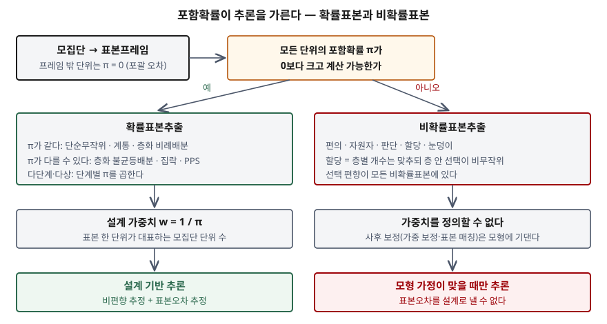

> 계산으로 확인할 수 있는 부분은 직접 검산했다. 다섯 가지 설계의 포함확률·기댓값·편향·표준편차는
> [`code/sampling_designs.py`](code/sampling_designs.py)를 돌린 기록 [`code/output.txt`](code/output.txt)에서 가져왔다.
> 정의와 기법 분류는 캐나다 통계청 조사방법 지침서를 근거로 했다.

## 들어가며

학습데이터를 모을 때도, 라벨 품질을 검수할 때도, 전체를 다 볼 수 없으면 일부를 고른다. 시험에서 표본추출은
기법 이름 나열로 끝나기 쉬운데, 점수는 **왜 확률표본이어야 모집단을 추론할 수 있는가**에 답할 때 붙는다.
그 답의 중심에 포함확률이 있다. 포함확률을 기록하지 않으면 확률적으로 뽑아 놓고도 가중치를 계산할 수 없어
표본을 확률표본으로 쓰지 못한다.

## 정의

**확률표본추출**: 모집단의 각 단위가 표본에 들어갈 확률(**포함확률** π)이 **0보다 크고 계산 가능하도록**
무작위로 단위를 고르는 방법이다. **비확률표본추출**은 주관적(비무작위) 방법으로 고르며, 단위가 뽑힐 확률을
정할 수 없다(Statistics Canada, 표본설계 장의 비확률표본 절(§6.1)과 확률표본 절(§6.2)).

**설계 가중치**: 표본 한 단위가 대표하는 모집단 단위 수의 평균으로, **포함확률의 역수** w = 1/π다. 다단계·다상
설계에서는 단계별 포함확률을 곱한 값의 역수를 쓴다(같은 지침서 가중치 절(§7.1)).

## 등장 배경

전수조사는 비싸고 느리다. 일부만 보고 전체를 말하려면 "그 일부가 전체를 대표한다"는 근거가 필요한데,
비확률표본에서는 그 근거가 **가정**뿐이다. 지침서는 비확률표본이 추론을 하려면 대표성에 대한 강한 가정이
필요하고, 모든 비확률표본에 선택 편향이 있어 그 가정이 위험하다고 적는다. 또 뽑힐 확률을 정할 수 없으므로
신뢰할 수 있는 추정치와 표본오차를 계산할 수 없다.

확률표본은 그 근거를 **설계**로 바꾼다. Horvitz와 Thompson(1952)은 포함확률이 단위마다 달라도 각 값을
π로 나눠 더하면 모집단 총계의 비편향 추정량이 된다는 것을 보였다. 이후 층화·집락·PPS처럼 포함확률을
일부러 다르게 주는 설계가 가능해졌다. 다르게 주더라도 **알기만 하면** 보정할 수 있기 때문이다.

## 구성요소

### 확률표본추출 기법 — 6가지 (지침서 §6.2)

| 기법 | 포함확률 | 효율이 오르는 조건 |
|---|---|---|
| ① 단순무작위 | 모두 n/N | 기준선 |
| ② 계통 | 모두 n/N | 목록 순서에 주기가 없을 때 |
| ③ 크기비례확률(PPS) | 규모 x에 비례: π = n·x / X | 규모가 조사 변수와 상관이 클 때 |
| ④ 층화 | 층마다 n_h / N_h | 층 안은 비슷하고 층 사이는 다를 때 |
| ⑤ 집락 | 집락 단위로 정해진다 | 집락 안이 **이질적**일 때. 보통은 효율이 떨어지고 비용이 준다 |
| ⑥ 다단계·다상 | 단계별 곱 | 대규모 조사에서 프레임을 단계별로 만든다 |

### 비확률표본추출 기법 — 6가지 (지침서 §6.1, §6.3.3)

편의(haphazard), 자원자, 판단, **할당**, 수정 확률(앞 단계 확률 + 마지막 단계 할당), 눈덩이.

### 할당추출과 층화추출 — 가장 자주 묻는 쌍

둘 다 비슷한 단위를 묶고 묶음별 개수를 정한다. 지침서가 짚는 차이는 **선택 방식**이다. 층화는 층 안에서
무작위로 뽑고, 할당은 누구를 뽑을지를 조사원에게 맡긴다. 응하지 않는 사람은 응하는 사람으로 바꾸므로
무응답 편향이 드러나지 않는다. 그래서 지침서는 할당추출이 상당한 선택 편향을 **감춘다**고 적는다.

## 도식



> **출처**: [Statistics Canada, Survey Methods and Practices §6.1 Non-Probability Sampling, §6.2 Probability Sampling, §7.1 Weighting](https://www150.statcan.gc.ca/n1/pub/12-587-x/12-587-x2003001-eng.pdf) · [AAPOR, Report of the Task Force on Non-Probability Sampling §4 Sample Matching](https://aapor.org/wp-content/uploads/2022/11/NPS_TF_Report_Final_7_revised_FNL_6_22_13-2.pdf)

답안지에는 판단 상자 하나를 가운데 두고 양쪽으로 세 칸씩 내린다. 왼쪽이 "기법 → w = 1/π → 설계 기반 추론",
오른쪽이 "기법 → 가중치 불가 → 모형 가정"이다.

## 검산 — 같은 모집단, 다섯 가지 설계

모집단 12개를 층 A(작은 값 9개)와 층 B(큰 값 3개)로 두고 표본 4개를 뽑는다. 가능한 표본을 **전부 나열해**
기댓값과 분산을 정확히 계산했다. 층 B는 학습데이터의 희소 클래스와 같은 모양이다.

```text
[포함확률 π] 설계가 정한다. 합은 언제나 표본 크기 n 이다
  층화 비례배분 A3+B1            π(a1)=1/3   π(b1)=1/3   가중치 1/π: 3    / 3    Σπ=4
  층화 불균등배분 A2+B2           π(a1)=2/9   π(b1)=2/3   가중치 1/π: 9/2  / 3/2  Σπ=4

설계 · 추정량                             표본수      기댓값       편향    표준편차
단순무작위 n=4                            495    9.167   +0.000   3.749
층화 비례배분 A3+B1                        252    9.167   +0.000   0.954
층화 불균등배분 A2+B2 · 가중치 무시              108   14.111   +4.944   0.925
층화 불균등배분 A2+B2 · 가중(1/π)             108    9.167   +0.000   0.769
집락 2개(4단위)                            15    9.167   +0.000   5.227
할당 A3+B1 (닿기 쉬운 단위)                    1    7.000   -2.167   0.000
```

참 평균은 110/12 = 9.167이다. 결과에서 읽을 것은 네 가지다.

- **층화는 같은 크기로 표준편차를 크게 줄인다.** 3.749 → 0.954. 분산비로는 약 0.06이다. 층 사이 차이가
  분산에서 빠지기 때문이다. 층화 비례배분의 분산은 공식으로도 손 계산해 0.910(표준편차 0.954)이 나와 맞았다.
- **불균등배분은 가중치가 있어야 성립한다.** B를 과다표집하면 가중치를 버린 평균은 14.111로 4.944만큼 기운다.
  1/π를 곱하면 편향이 0으로 돌아오고 표준편차는 비례배분보다 더 작은 0.769가 된다.
- **비슷한 것끼리 묶은 집락은 효율을 잃는다.** 표준편차 5.227, 분산비 약 1.9. 한 집락이 같은 정보를 두 번 준다.
- **할당은 층별 개수가 비례배분과 같아도 편향이 남는다.** 닿기 쉬운 단위만 고르니 결과가 7.000 하나로 고정된다.
  표준편차 0은 정밀하다는 뜻이 아니다. 뽑히지 않은 8개의 π가 0이라 오차를 잴 근거가 없다는 뜻이다.

## 비교

| 항목 | 층화추출 | 할당추출 | 집락추출 |
|---|---|---|---|
| 묶음 | 층(겹치지 않게) | 하위 집단 | 집락 |
| 묶음 안 선택 | 무작위 | 조사원 판단 | 집락 전체 또는 무작위 |
| 포함확률 | 계산 가능 | 정할 수 없다 | 계산 가능 |
| 효율 | 층 안이 비슷할수록 높다 | 측정 불가 | 집락 안이 비슷할수록 낮다 |
| 쓰는 이유 | 정밀도, 하위 집단 추정 | 비용, 속도 | 수집 비용, 프레임 부재 |

층화와 집락은 "묶는다"는 점이 같지만 바라는 묶음이 정반대다. 층화는 **층 안이 같을수록**, 집락은 **집락 안이
다를수록** 좋다.

## 적용 시 고려사항

- **포함확률을 레코드와 함께 저장한다.** 지침서는 표본 파일에 가중치 변수를 붙이는 방식을 쓴다. 과다표집한
  희소 클래스의 π가 사라지면 평가 지표를 모집단 비율로 되돌릴 수 없다.
- **프레임의 포괄 범위를 먼저 본다.** 프레임에 없는 단위는 π가 0이다. 확률표본이라도 그 단위들은 대표하지 못한다.
- **층 변수는 조사 변수와 관련이 있어야 한다.** 관련 없는 변수로 층을 나누면 층화의 이득이 없다. 검산에서도
  이득은 층 사이 평균 차이에서 나왔다.
- **같은 원천에서 나온 레코드는 집락으로 본다.** 같은 환자·사용자의 기록을 독립 단위로 세면 표본 크기를 과대평가한다.
  학습·평가 분할에서는 같은 문제가 데이터 누수로 나타난다.
- **비확률 수집을 보정할 때는 가정을 함께 적는다.** AAPOR 보고서는 비확률표본 추론의 타당성이 모형 가정이 맞는지에
  달렸다고 본다. 맞춘 변수 밖의 편향은 남는다.

> 기출 답안: [기출문제 — 표본추출의 절차, 확률·비확률 기법 비교, AI 학습데이터 구축에의 적용](../../exam/2026-10-06-sampling-ai-training-data/index.md)
>
> 관련 개념: [데이터 누수 — 학습·평가 분할에서 묶음·시간 단위를 지키는 이유](../2026-10-06-data-leakage-group-time-split/index.md)

## 정리

- 확률표본 = **π > 0 이고 계산 가능**. 비확률표본 = π를 정할 수 없다.
- 설계 가중치 **w = 1/π**. 다단계는 π를 곱한다. Horvitz–Thompson: 값/π의 합이 총계의 비편향 추정량.
- 확률 기법 **6가지**(단순무작위·계통·PPS·층화·집락·다단계), 비확률 **6가지**(편의·자원자·판단·할당·수정 확률·눈덩이).
- 층화는 **층 안 동질**, 집락은 **집락 안 이질**이 유리하다. 할당 ≠ 층화 — **층 안 선택이 무작위인가**.
- 검산: 같은 n=4에서 층화가 표준편차를 3.749 → 0.954로 줄이고, 가중치를 버리면 4.944만큼 기운다.

## 참고 자료

- [Statistics Canada, Survey Methods and Practices, Catalogue no. 12-587-X (2003)](https://www150.statcan.gc.ca/n1/pub/12-587-x/12-587-x2003001-eng.pdf) — §6.1 Non-Probability Sampling(§6.1.4 Quota Sampling), §6.2 Probability Sampling, §6.3.3 Snowball Sampling, §7.1 Weighting
- Horvitz, D. G. & Thompson, D. J., "A Generalization of Sampling Without Replacement From a Finite Universe", *Journal of the American Statistical Association* 47(260), pp. 663–685, 1952. [doi:10.1080/01621459.1952.10483446](https://doi.org/10.1080/01621459.1952.10483446)
- [AAPOR, Report of the AAPOR Task Force on Non-Probability Sampling (2013-06)](https://aapor.org/wp-content/uploads/2022/11/NPS_TF_Report_Final_7_revised_FNL_6_22_13-2.pdf) — §4 Sample Matching, Conclusions
