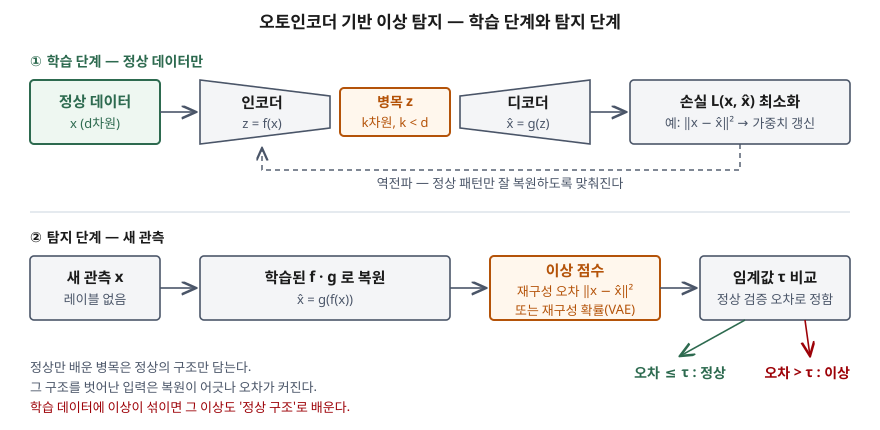

> 실험으로 확인할 수 있는 부분은 직접 돌렸다. 4-8-2-8-4 오토인코더와 역전파를 표준 라이브러리로 구현한
> [`code/autoencoder_demo.py`](code/autoencoder_demo.py)의 실행 기록 [`code/output.txt`](code/output.txt)에서 수치를 가져왔다.
> 신경망 학습은 초기값·에폭에 따라 수치가 달라지므로, 비교의 방향만 결론으로 삼는다. 정의와 기법 설명은 원 논문을 근거로 했다.

## 들어가며

딥러닝 시계열 이상 탐지를 묻는 기출에서 재구성 기반 계열은 빠지지 않는다. 운영 현장에서도 레이블 없이 수십 개 지표를
한꺼번에 감시해야 할 때 가장 먼저 검토되는 방식이다. 그런데 "정상을 학습해 복원 오차가 크면 이상"이라는 한 줄만으로는
답안이 되지 않는다. **왜 이상은 복원되지 않는지**, **그 전제가 언제 깨지는지**를 써야 다른 수험생과 갈린다.

## 정의

**오토인코더**: 입력을 출력으로 복사하도록 학습하는 신경망이다. 입력을 내부 표현으로 바꾸는 **인코더** $h=f(x)$와
그 표현에서 입력을 되살리는 **디코더** $r=g(h)$로 이뤄진다(Goodfellow 외, *Deep Learning* 14장).

**오토인코더 기반 이상 탐지**: 정상 데이터로 학습한 오토인코더에 새 입력을 넣어, **재구성 오차** $\lVert x-g(f(x))\rVert^2$
또는 **재구성 확률**이 임계값을 넘거나 밑도는 입력을 이상으로 판정하는 준지도 기법이다(An·Cho 2015, Darban 외 서베이 3.3절).

## 등장 배경

재구성으로 이상을 찾는 생각은 주성분 분석(PCA)에서 왔다. 정상 데이터의 주성분 부분공간에 투영했다가 되돌린 오차를
점수로 쓴다. 그러나 PCA는 **선형** 부분공간만 담는다. 지표 사이 관계가 곱이나 제곱처럼 비선형이면 정상도 복원이 어긋나
오경보가 난다. 디코더가 선형이고 손실이 평균제곱오차인 오토인코더는 PCA와 같은 부분공간을 배운다(*Deep Learning* 14.1절).
여기에 비선형 활성화를 넣어 **비선형 정상 구조**를 담게 한 것이 오토인코더 기반 탐지다.

시계열에서는 예측 기반 탐지가 먼저 쓰였다. Malhotra 외(EncDec-AD, 2016)는 수동 조작이나 관측되지 않는 변수 때문에
**원래 예측이 어려운** 시계열에서는 예측 오차가 정상일 때도 크다는 점을 들어, 다음 값을 맞히는 대신 창 전체를 복원하는
LSTM 인코더-디코더를 제안했다.

## 구성요소와 절차

### 구성요소 — 4가지

| 구성요소 | 역할 | 이상 탐지에서의 의미 |
|---|---|---|
| ① 인코더 $f$ | 입력 $x$(d차원)를 잠재 표현 $z$로 압축 | 정상 데이터의 공통 구조를 뽑는다 |
| ② 병목 $z$ | $k$차원, $k<d$ | 모든 입력을 복사할 수 없게 막는다. 정상 구조만 담을 자리 |
| ③ 디코더 $g$ | $z$에서 $\hat{x}$를 복원 | 정상 구조 위의 가장 가까운 점으로 되돌린다 |
| ④ 재구성 손실 / 점수 | 학습 때는 손실, 탐지 때는 점수 | 오차(결정적) 또는 재구성 확률(VAE) |

### 탐지 절차 — 4단계

1. **학습** — 정상 데이터만으로 재구성 손실을 최소화한다.
2. **임계값 결정** — 학습에 쓰지 않은 정상 검증 데이터의 오차 분포에서 임계값 $\tau$를 정한다(예: 99백분위).
   EncDec-AD는 검증 오차에 정규분포를 맞춰 우도로 점수를 낸다.
3. **점수 산출** — 새 입력을 복원해 오차 또는 재구성 확률을 구한다.
4. **판정** — 오차가 $\tau$를 넘으면(확률이면 밑돌면) 이상으로 본다.

### 왜 이상은 잘 복원되지 않는가

병목이 입력보다 작으므로 오토인코더는 모든 입력을 그대로 베낄 수 없다. 학습 손실을 줄이려면 학습 데이터에 **자주
나오는 구조**를 병목에 담는 수밖에 없다. 정상만 배웠다면 병목에 담긴 것은 정상의 구조뿐이다. 이 구조에서 벗어난
입력이 들어오면 디코더는 그 입력을 **정상 구조 위의 가까운 점으로** 되돌리고, 그 차이가 오차로 남는다.

### 재구성 오차와 재구성 확률

An·Cho(2015)는 변분 오토인코더(VAE)의 **재구성 확률**을 점수로 제안했다. VAE 인코더는 잠재 변수의 평균·분산을 내고,
그 분포에서 표본을 여러 번 뽑아 디코더가 낸 분포에서 원래 입력이 나올 확률을 평균한다. 디코더가 평균뿐 아니라
**분산**도 내므로, 원래 흔들림이 큰 지표의 오차는 덜 이상하게, 흔들림이 작은 지표의 오차는 더 이상하게 본다.
저자들은 이를 오차보다 원칙적이고 객관적인 점수로 본다. Xu 외(Donut, WWW 2018)는 계절성이 있는 웹 서비스 KPI에 VAE를
적용하면서, 이상과 결측이 섞인 학습 데이터에서도 학습되도록 손실(M-ELBO)과 결측 주입을 손봤다.

## 도식



> **출처**: [Goodfellow, Bengio & Courville, Deep Learning §14.1 Undercomplete Autoencoders](https://www.deeplearningbook.org/contents/autoencoders.html) · [An & Cho, Variational Autoencoder based Anomaly Detection using Reconstruction Probability (SNU DM TR 2015-03)](http://dm.snu.ac.kr/static/docs/TR/SNUDM-TR-2015-03.pdf) · [Malhotra et al., LSTM-based Encoder-Decoder for Multi-sensor Anomaly Detection (arXiv:1607.00148)](https://arxiv.org/abs/1607.00148)

답안지에는 위쪽에 사다리꼴 두 개(인코더·디코더)를 병목으로 잇고 "정상만"이라고 적는다. 아래쪽에 새 관측 → 복원 →
오차 → $\tau$ 비교 네 칸을 그리면 된다.

## 재현 — 값은 정상인데 관계가 깨진 이상

정상은 두 잠재 변수 $u, v$로 네 지표 $(u, v, uv, u^2)$가 정해진다. 이상은 셋째 지표의 부호만 뒤집은 $(u, v, -uv, u^2)$다.
요청 수가 늘었는데 CPU 사용률이 거꾸로 움직이는 상황처럼, 지표 하나하나는 정상 범위 안이고 **지표 사이의 관계만**
어긋났다.

```text
[실험1] 지표별 범위 검사 — 학습 정상의 지표별 최소~최대 안에 드는 이상 점
  47 / 50  (지표마다 따로 임계값을 걸면 이만큼을 놓친다)

[실험2] 재구성 오차 — 임계값은 검증 정상 오차의 99백분위
  학습 데이터                         정상 오차     이상 오차       임계값     탐지율     오경보
  정상 400                        0.0101    0.8985    0.0643    1.00    0.00
  정상 400 + 이상 40 (9.1%)         0.2595    0.3852    1.5416    0.00    0.01

[실험3] 평가 정상 점의 재구성 오차를 자리별로 — 이상이 생기는 자리 u, v >= 0.4 안과 밖
  학습 데이터                                  자리 안              자리 밖
  정상 400                          0.0138 ( 22점)      0.0096 (178점)
  정상 400 + 이상 40 (9.1%)           0.5089 ( 22점)      0.2287 (178점)
```

- **실험 1**: 지표마다 정상 범위를 걸면 이상 50개 중 47개가 통과한다. 단변량 임계값으로는 관계 이상을 구조적으로 놓친다.
- **실험 2 첫 줄**: 정상만 학습하면 이상의 오차(0.8985)가 정상(0.0101)의 약 89배이고, 정상 검증 오차로만 정한 임계값
  0.0643으로 50개를 모두 잡는다. 병목 2차원이 $(u, v)$만 담고 셋째 지표를 $uv$로 되돌리기 때문이다.
- **실험 2 둘째 줄**: 같은 이상을 학습 데이터에 9.1% 섞자 탐지율이 0이 됐다. 이상 오차는 0.3852로 줄고, 정상 오차는
  0.2595로 늘어 임계값이 1.5416까지 올라갔다.
- **실험 3**: 같은 $(u, v)$ 자리에서 셋째 지표가 $uv$와 $-uv$ 두 값으로 갈리니, 그 자리의 정상 오차가 0.5089로 가장 크게
  올랐다. 이 실행에서는 자리 밖 정상의 오차도 0.0096에서 0.2287로 올라, 오염이 모델 전체의 복원을 흐렸다. 이 정도는
  망 크기와 학습 설정에 따라 달라지지만, **이상이 정상으로 학습되고 정상과 이상의 오차 간격이 사라지는 방향**은 같다.

## 비교 — 재구성 기반과 다른 방식

| 구분 | 오토인코더 재구성 | PCA 재구성 | 예측 기반(LSTM 등) | Isolation Forest |
|---|---|---|---|---|
| 점수 | 재구성 오차·재구성 확률 | 부분공간 투영 오차 | 예측 오차 | 고립 경로 길이 |
| 정상 구조 | 비선형 | 선형 | 시간 의존성 | 만들지 않음 |
| 학습 데이터 | 정상 위주(준지도) | 정상 위주 | 정상 위주 | 이상이 섞여도 됨 |
| 시계열 판정 시점 | 창 단위 | 창 단위 | 값 도착 즉시 | 창 구성 시 창 단위 |
| 강한 곳 | 다변량 지표 간 관계, 패턴 단위 | 선형 상관이 깨진 경우 | 예측 가능한 지표의 급변 | 대용량 전역 이상 |
| 약한 곳 | 오염된 학습 데이터, 과한 일반화 | 비선형 관계 | 원래 예측하기 어려운 지표 | 지표 간 관계 이상(창·특징 설계 없으면) |

> 계열 구분은 Darban 외 서베이 3.2~3.3절, 예측 기반의 약점은 Malhotra 외(2016) 기준이다. "강한 곳·약한 곳" 행은 각 방식의
> 점수 정의에서 따라 나오는 경향이며 측정값이 아니다.

## 적용 시 고려사항

- **학습 데이터에서 이상을 걷어내는 절차를 둔다.** 위 실험처럼 같은 종류의 이상이 반복해 섞이면 그것이 정상으로 학습된다.
  장애 이력·변경 기록과 대조해 학습 구간을 고르고, 걷어낸 구간을 기록한다. 깨끗한 데이터를 확보할 수 없으면
  입력을 복원 가능한 부분 $L_D$와 이상·잡음 $S$로 나누고 $S$에 희소성 벌점을 주는 Robust Deep Autoencoder(Zhou·Paffenroth,
  KDD 2017)나, 레이블된 이상·결측을 손실에서 빼는 Donut의 M-ELBO처럼 오염을 견디는 학습을 쓴다.
- **병목 크기는 정상 구조의 차원에 맞춘다.** 병목이 너무 크면 항등 함수에 가까워져 이상까지 복원한다. Gong 외(MemAE,
  ICCV 2019)는 오토인코더가 너무 잘 일반화해 이상을 잘 복원하는 바람에 놓치는 문제를 지적하고, 정상 원형을 저장한
  메모리로만 복원하게 했다. 반대로 너무 작으면 정상도 복원하지 못해 오경보가 늘어난다.
- **지표 스케일을 맞추거나 재구성 확률을 쓴다.** 제곱 오차의 합은 값 범위가 큰 지표가 지배한다. 정규화 규칙을 학습·운영에
  똑같이 적용하고, 지표마다 흔들림이 크게 다르면 분산을 반영하는 재구성 확률을 검토한다.
- **임계값은 정상 검증 오차로 정하고 다시 정하는 주기를 둔다.** 배포·계절 변화로 정상 오차 분포가 움직이면 같은 임계값이
  오경보를 쏟아낸다. 임계값·모델 버전·학습 구간을 함께 남겨 어느 경보가 어떤 기준에서 났는지 재현할 수 있게 한다.
- **지표별 오차를 경보에 함께 싣는다.** 재구성 기반은 어느 지표의 복원이 어긋났는지 바로 보여 준다. 합계 점수만 보내지 말고
  지표별 오차 상위 몇 개를 붙이면 운영자가 원인을 좁히는 데 쓸 수 있다.

> 기출 답안: [기출문제 — 시계열 데이터의 이상치 유형, 탐지 방식, 딥러닝 기반 탐지 기법](../../exam/2026-10-07-time-series-anomaly-detection/index.md)
>
> 관련 개념: [Isolation Forest — 고립에 필요한 분할 횟수로 이상치를 찾는 원리](../2026-10-07-isolation-forest-path-length/index.md)

## 정리

- 정의: **정상만 학습한 오토인코더의 재구성 오차(또는 재구성 확률)를 점수**로 쓰는 준지도 이상 탐지.
- 구성요소 **4가지**(인코더 · 병목 · 디코더 · 손실/점수), 절차 **4단계**(학습 → 임계값 → 점수 → 판정).
- 원리: 병목은 **정상 구조만** 담는다 → 벗어난 입력은 가까운 정상으로 복원돼 오차가 남는다.
- 점수 **2종**: 재구성 오차(결정적) / 재구성 확률(VAE, 지표별 분산 반영).
- 전제가 깨지는 **2곳**: 학습 데이터 오염(실험에서 탐지율 1.00 → 0.00), 병목이 커서 생기는 과한 일반화.

## 참고 자료

- [I. Goodfellow, Y. Bengio, A. Courville, Deep Learning, MIT Press, 2016 — Chapter 14 Autoencoders](https://www.deeplearningbook.org/contents/autoencoders.html) — 인코더·디코더 정의, §14.1 Undercomplete Autoencoders(선형 디코더와 PCA)
- [J. An, S. Cho, Variational Autoencoder based Anomaly Detection using Reconstruction Probability, SNU Data Mining Center Special Lecture on IE, 2015 (TR 2015-03)](http://dm.snu.ac.kr/static/docs/TR/SNUDM-TR-2015-03.pdf)
- [P. Malhotra et al., LSTM-based Encoder-Decoder for Multi-sensor Anomaly Detection, ICML 2016 Anomaly Detection Workshop (arXiv:1607.00148)](https://arxiv.org/abs/1607.00148)
- [H. Xu et al., Unsupervised Anomaly Detection via Variational Auto-Encoder for Seasonal KPIs in Web Applications, WWW 2018 (arXiv:1802.03903)](https://arxiv.org/abs/1802.03903)
- C. Zhou, R. C. Paffenroth, "Anomaly Detection with Robust Deep Autoencoders", *KDD 2017*. [doi:10.1145/3097983.3098052](https://doi.org/10.1145/3097983.3098052)
- [D. Gong et al., Memorizing Normality to Detect Anomaly: Memory-augmented Deep Autoencoder for Unsupervised Anomaly Detection, ICCV 2019 (arXiv:1904.02639)](https://arxiv.org/abs/1904.02639)
- [Z. Z. Darban, G. I. Webb, S. Pan, C. C. Aggarwal, M. Salehi, Deep Learning for Time Series Anomaly Detection: A Survey, arXiv:2211.05244v3 (2024)](https://arxiv.org/abs/2211.05244) — §3.2 예측 기반, §3.3 재구성 기반
