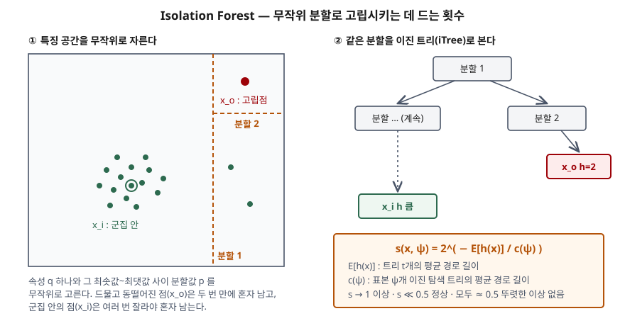

> 실험으로 확인할 수 있는 부분은 직접 돌렸다. 논문의 알고리즘 1~3과 식 1·2를 표준 라이브러리로 구현한
> [`code/iforest_demo.py`](code/iforest_demo.py)의 실행 기록 [`code/output.txt`](code/output.txt)에서 수치를 가져왔다.
> 정의와 절차는 원 논문(Liu·Ting·Zhou, ICDM 2008)을 근거로 했다.

## 들어가며

시계열 이상 탐지 기출에서 "고전 기법을 기준선으로 둔다"고 쓰면 채점자는 어떤 기법인지를 본다. Isolation Forest는
그 자리에 가장 자주 오르는 이름이고, 전역 이상치 벤치마크에서 최근 딥러닝 기법보다 나았다는 보고도 있다
(Lai 외, NeurIPS 2021). 레이블 없이 돌고 계산량이 데이터 수에 선형이라 운영 메트릭·로그 특징에 바로 붙이기 쉽다.
다만 "트리로 이상을 찾는다"에서 멈추면 점수가 붙지 않는다. **왜 경로가 짧으면 이상인지**, **그 길이를 무엇으로
나누는지**까지 써야 한다.

## 정의

**Isolation Forest(iForest)**: 데이터를 무작위 속성과 무작위 분할값으로 반복해 나눌 때 **한 점을 혼자 남기는 데
필요한 분할 횟수(경로 길이)가 짧은 점을 이상으로 판정**하는 비지도 트리 앙상블 기법이다(Liu·Ting·Zhou, ICDM 2008).

출발점은 이상치가 **수가 적고(few) 값이 다르다(different)**는 두 성질이다. 적고 동떨어진 점은 무작위로 잘라도 일찍
혼자 남고, 빽빽한 군집 안의 점은 여러 번 잘라야 혼자 남는다.

## 등장 배경

그전의 모델 기반 이상 탐지는 대부분 **정상의 모습(프로파일)을 먼저 만들고** 거기서 벗어난 것을 이상으로 봤다.
통계 기법, 분류 기반, 군집 기반이 모두 그렇다. 논문은 여기서 두 가지 문제를 짚는다.

1. 탐지기가 정상을 설명하도록 최적화돼 있어 이상을 찾는 데는 최적이 아니다. 오경보가 많거나 이상을 덜 잡는다.
2. 계산 복잡도가 높아 저차원·소규모 데이터에 묶이는 기법이 많다.

iForest는 정상을 설명하지 않고 **이상을 직접 고립**시킨다. 거리도 밀도도 계산하지 않으므로 학습 비용은
$O(t\,\psi\log\psi)$, 평가 비용은 $O(n\,t\log\psi)$다($t$는 트리 수, $\psi$는 부분표본 크기, $n$은 평가 데이터 수).

## 구성요소와 절차

### 2단계 절차

| 단계 | 하는 일 | 논문 알고리즘 |
|---|---|---|
| ① 학습 | 비복원 부분표본 $\psi$개마다 iTree를 하나씩, 모두 $t$개 만든다. 높이 제한은 $\lceil\log_2\psi\rceil$ | 알고리즘 1 iForest, 알고리즘 2 iTree |
| ② 평가 | 각 점을 모든 트리에 통과시켜 경로 길이 $h(x)$를 재고, 평균 $E[h(x)]$를 점수로 바꾼다 | 알고리즘 3 PathLength, 식 2 |

### iTree 분할 종료 조건 — 3가지

속성 $q$ 하나와 그 속성의 최솟값~최댓값 사이 분할값 $p$를 무작위로 골라 $q<p$로 나누기를 반복하다가 다음 중
하나에 걸리면 멈춘다. ① 높이 제한에 닿았다 ② 남은 점이 1개 이하다 ③ 남은 점의 값이 모두 같다.

높이를 $\lceil\log_2\psi\rceil$에서 끊는 이유는 그것이 대략 평균 트리 높이이기 때문이다. 관심 있는 것은 평균보다
**짧게** 고립되는 점이므로 그보다 깊이 자랄 필요가 없다. 끊긴 잎에 점이 여러 개 남으면 PathLength가 그 수로
$c(\text{size})$를 더해 덜 자란 부분을 보정한다.

### 핵심 식 — 2개

**정규화 상수** $c(n)$: iTree는 이진 탐색 트리와 구조가 같아서, 잎에서 끝나는 경로의 평균 길이를 이진 탐색 트리의
실패 탐색 평균 길이로 추정한다.

$$c(n) = 2H(n-1) - \frac{2(n-1)}{n},\qquad H(i) \approx \ln i + 0.5772156649$$

**이상 점수**: 평균 경로 길이를 $c(\psi)$로 나눠 표본 크기와 무관하게 비교할 수 있게 만든다.

$$s(x,\psi) = 2^{-E[h(x)]/c(\psi)}$$

### 점수 해석 — 3가지

| 점수 | 뜻 |
|---|---|
| $s$가 1에 매우 가깝다 | 이상으로 본다 |
| $s$가 0.5보다 한참 작다 | 정상으로 봐도 안전하다 |
| 모든 점이 $s\approx0.5$ | 표본 전체에 뚜렷한 이상이 없다 |

$E[h(x)]=c(\psi)$이면 $\psi$와 상관없이 $s=0.5$다. 그래서 0.5가 기준선 노릇을 한다.

## 도식



> **출처**: [Liu, Ting & Zhou, Isolation Forest (ICDM 2008) §2 Isolation and Isolation Trees (Fig.1, Eq.1·2), §4 Anomaly Detection using iForest](https://cs.nju.edu.cn/zhouzh/zhouzh.files/publication/icdm08b.pdf)

답안지에는 왼쪽에 점 무더기와 동떨어진 점 하나, 세로·가로 점선 두 개를 긋고, 오른쪽에 트리 세 층과 점수식 한 줄을
적는다. "$h$ 짧음 → $s$가 1에 가까움"을 화살표 하나로 이으면 된다.

## 재현 — 논문 알고리즘을 그대로 돌려 보면

### 경로 길이와 점수

정상 군집 500점(평균 0, 표준편차 1)으로 $\psi=256$, 트리 100개를 만들고 세 점을 넣었다.

```text
[실험2] 정상 군집 500점(평균 0, 표준편차 1)으로 학습, ψ=256, 트리 100개
  c(ψ) = 10.245
  점                   평균 경로 E[h]      점수 s
  중심점 (0, 0)               13.49     0.402
  가장자리 (2.5, 0)             7.19     0.615
  고립점 (6, 6)                4.10     0.758
```

고립점은 평균 4.10번 만에 혼자 남아 $c(256)=10.245$보다 한참 짧고, 점수가 0.758이다. 중심점은 $E[h]$가 높이 제한
8을 넘는 13.49인데, 높이 제한에 걸린 잎에 남은 점 수로 $c(\text{size})$를 더한 결과다. 중심점 점수가 0.402로
0.5 아래에 머무는 것이 "한참 작으면 정상"의 모양이다.

### 부분표본이 작을수록 군집 이상을 더 잘 잡는다

논문은 이상이 잘 안 잡히는 두 현상을 든다. **swamping**은 정상이 이상 가까이 붙어 있어 정상을 이상으로 잘못
판정하는 것, **masking**은 이상이 많이 뭉쳐 있어 스스로를 가리는 것이다. 둘 다 이상 탐지에 필요한 것보다 데이터가
많아서 생긴다. 정상 4,000점 옆에 이상 100점을 빽빽하게 뭉쳐 두고 $\psi$만 바꿨다.

```text
       ψ   높이 제한     이상 평균 s     정상 평균 s     상위 100 적중
    4100      13       0.558       0.443          0.21
    1024      10       0.594       0.451          0.19
     256       8       0.670       0.462          0.81
      64       6       0.718       0.469          1.00
```

전체 데이터로 트리를 만들면 이상 군집 100점이 서로를 가려 상위 100개 중 21개만 이상이다. $\psi=64$로 줄이면
부분표본마다 이상 군집에서 뽑히는 점이 한두 개로 줄어 곧바로 고립되고, 상위 100개가 전부 이상이 된다.
논문이 든 이유 두 가지가 그대로 보인다. 부분표본이 **데이터 크기를 줄여** 고립을 쉽게 하고, 트리마다 **다른 이상을
맡게** 된다. 이것이 iForest가 "표본은 클수록 좋다"는 통념과 반대로 가는 지점이다.

### 시계열은 값이 아니라 창을 넣는다

사인파의 한 구간만 주기를 절반으로 바꿨다. 값 범위는 정상과 같은 $[-1, 1]$ 근처다.

```text
  입력 구성                    이상 구간 최고 순위     상위 25 중 이상 구간
  값 하나 (w=1)                        59              0 / 25
  창 w=10                             1             14 / 25
  창 w=25                             1             10 / 25
```

값 하나씩 넣으면 iForest는 범위 안의 값을 고립시킬 이유가 없어 이상 구간이 59위에 그친다. 직전 $w$개 값을 묶은
벡터를 넣으면 "이 모양이 드물다"를 고립시킬 수 있어 1위로 올라온다. 기출 답안의 유형 분류로 말하면 iForest는
점 단위 전역 이상치에 맞는 기법이고, 형상·계절 같은 패턴 단위 이상은 **창 구성**이 있어야 잡힌다. 상위 25개가
다 차지 않는 것은 창 끝 시점으로 레이블을 매겨, 이상 구간 직후에 끝나는 창(이상을 일부 담은 창)을 정상으로 셌기
때문이다.

## 비교 — 비지도 이상 탐지 기법

| 구분 | Isolation Forest | LOF (지역 이상 계수) | 거리 기반 (k-최근접) | 오토인코더 |
|---|---|---|---|---|
| 이상의 기준 | 고립에 드는 분할 수가 짧다 | 이웃 대비 지역 밀도가 낮다 | k번째 이웃까지 거리가 멀다 | 정상 구조로 복원이 안 된다 |
| 정상 모델을 만드는가 | 만들지 않는다 | 이웃 밀도로 간접 | 만들지 않는다 | 만든다(병목 표현) |
| 주된 계산 | 무작위 분할 트리 | 이웃 탐색 | 이웃 탐색 | 신경망 학습 |
| 계산량 | 학습 $O(t\psi\log\psi)$, 평가 $O(nt\log\psi)$ | 단순 구현은 $O(n^2)$ 이웃 계산 | 단순 구현은 $O(n^2)$ | 학습 비용이 크다 |
| 강한 곳 | 대용량, 점 단위 전역 이상 | 밀도가 다른 군집이 섞인 지역 이상 | 저차원·소규모 | 다변량 지표 간 관계 이상 |
| 점수 해석 | $s\in(0,1]$, 0.5 기준 | 1 근처 정상, 1보다 크면 이상 | 거리 그대로 | 오차 크기, 임계값 별도 |

LOF는 한 점의 지역 밀도를 이웃의 지역 밀도와 견줘 **주변에 비해 얼마나 고립됐는가**를 수치로 만든다(Breunig 외,
SIGMOD 2000). scikit-learn 안내서는 정상은 LOF가 1 근처, 이상은 1보다 크게 나온다고 설명한다. 같은 거리라도
빽빽한 군집 옆이면 이상, 성긴 군집 안이면 정상으로 볼 수 있어 밀도가 다른 군집이 섞인 데이터에 맞다.

## 적용 시 고려사항

- **부분표본 크기와 트리 수를 크게 잡는다고 좋아지지 않는다.** 논문은 $\psi=256$, $t=100$을 기본으로 두고, $\psi$를
  더 키워도 처리 시간과 메모리만 늘고 탐지 성능은 오르지 않는다고 했다. 위 실험처럼 이상이 뭉쳐 있으면 오히려
  작게 잡아야 잡힌다. scikit-learn도 `max_samples='auto'`를 `min(256, n_samples)`로 둔다.
- **점수 부호와 임계값 규칙을 구현마다 확인한다.** scikit-learn의 `score_samples`는 논문 점수의 **부호를 뒤집은 값**이라
  낮을수록 이상이고, `contamination='auto'`이면 `offset_`을 $-0.5$로 둬 논문의 0.5 기준을 따른다. `contamination`에
  비율을 주면 그 비율만큼을 무조건 이상으로 자른다. 이상 비율을 모르는 운영 환경에서 값을 아무렇게나 넣으면
  경보 수가 그 값으로 고정된다.
- **축에 평행한 분할의 한계를 안다.** iTree는 속성 하나씩 자르므로 점수 분포에 축 방향 줄무늬가 생긴다.
  Extended Isolation Forest(Hariri 외)는 기울기가 무작위인 초평면으로 잘라 이 편향을 없앴다. 지표끼리 강하게
  상관된 데이터에서는 이 차이가 커진다.
- **시계열은 특징 설계가 탐지 성능을 정한다.** 값 하나로는 점 단위 전역 이상만 잡힌다. 창 길이, 차분, 이동 통계량처럼
  어떤 벡터를 넣을지를 데이터 명세에 적고, 창 길이는 주기와 이상 지속 시간을 보고 정한다.
- **지역 이상이 핵심이면 LOF를 함께 본다.** 밀도가 다른 군집이 섞여 있고 "옆 군집에 비해 이상한가"가 중요하면
  iForest만으로는 부족할 수 있다. 두 점수를 함께 보거나 군집별로 따로 돌린다.

> 기출 답안: [기출문제 — 시계열 데이터의 이상치 유형, 탐지 방식, 딥러닝 기반 탐지 기법](../../exam/2026-10-07-time-series-anomaly-detection/index.md)
>
> 관련 개념: [오토인코더 기반 이상 탐지 — 재구성 오차로 정상에서 벗어난 것을 찾는 원리](../2026-10-07-autoencoder-reconstruction-anomaly-detection/index.md)

## 정리

- iForest = **고립에 드는 분할 수(경로 길이)가 짧은 점이 이상.** 전제는 이상이 **적고 다르다.**
- **2단계**(학습 → 평가), iTree 종료 조건 **3가지**(높이 제한 · 1개 이하 · 값 동일), 핵심 식 **2개**($c(n)$, $s$).
- 점수 $s=2^{-E[h]/c(\psi)}$ 해석 **3가지**: 1 근처 이상 · 0.5보다 한참 작으면 정상 · 모두 0.5면 뚜렷한 이상 없음.
- 기본값 $\psi=256$, $t=100$. 부분표본이 **swamping·masking**을 줄인다 — 이상 군집 상위 100 적중이 $\psi$ 4100에서 0.21, 64에서 1.00.
- 시계열에는 **창 구성**이 필요하다 — 값 하나 59위, 창 $w=10$이면 1위.

## 참고 자료

- [F. T. Liu, K. M. Ting, Z.-H. Zhou, Isolation Forest, IEEE ICDM 2008](https://cs.nju.edu.cn/zhouzh/zhouzh.files/publication/icdm08b.pdf) — §2 Isolation and Isolation Trees(식 1·2, iTree·경로 길이 정의), §3 swamping·masking, §4 알고리즘 1~3·매개변수·복잡도. [doi:10.1109/ICDM.2008.17](https://doi.org/10.1109/ICDM.2008.17)
- [scikit-learn 1.9.1, IsolationForest](https://scikit-learn.org/stable/modules/generated/sklearn.ensemble.IsolationForest.html) — `max_samples`, `contamination`, `score_samples`, `offset_`
- [scikit-learn 1.9.1 User Guide §2.7 Novelty and Outlier Detection](https://scikit-learn.org/stable/modules/outlier_detection.html) — §2.7.3.2 Isolation Forest, §2.7.3.3 Local Outlier Factor
- M. M. Breunig, H.-P. Kriegel, R. T. Ng, J. Sander, "LOF: Identifying Density-Based Local Outliers", *ACM SIGMOD 2000*. [doi:10.1145/342009.335388](https://doi.org/10.1145/342009.335388)
- [S. Hariri, M. Carrasco Kind, R. J. Brunner, Extended Isolation Forest, arXiv:1811.02141](https://arxiv.org/abs/1811.02141) — 축 평행 분할의 점수 편향과 무작위 기울기 초평면. 이후 IEEE TKDE 게재
- [K.-H. Lai et al., Revisiting Time Series Outlier Detection: Definitions and Benchmarks, NeurIPS 2021 Datasets and Benchmarks Track](https://datasets-benchmarks-proceedings.neurips.cc/paper_files/paper/2021/file/ec5decca5ed3d6b8079e2e7e7bacc9f2-Paper-round1.pdf) — 전역 이상치에서 고전 기법(OCSVM·Isolation Forest)이 앞선 결과
