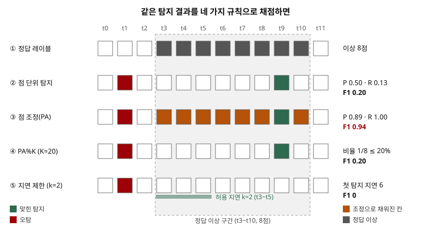

> 실험으로 확인할 수 있는 부분은 직접 돌렸다. 네 가지 채점 규칙을 표준 라이브러리로 구현한
> [`code/pa_eval_demo.py`](code/pa_eval_demo.py)의 실행 기록 [`code/output.txt`](code/output.txt)에서 수치를 가져왔다.
> 정의는 처음 쓴 논문(Xu 외, WWW 2018)과 이를 비판한 논문(Kim 외, AAAI 2022)을 근거로 했다.

## 들어가며

시계열 이상 탐지 기출의 고려사항 칸에 "평가 방식부터 검증한다"고 쓰면, 채점자는 그 평가 방식이 무엇이고
왜 틀렸는지를 본다. 공개 벤치마크에서 F1이 0.9를 넘는 논문이 흔한데, 그 대부분이 **점 조정**이라는 채점
규칙을 거친 값이다. 실무에서는 이 숫자를 보고 모델을 고르고 운영 환경에 올렸다가 오경보에 묻히는 일이
생긴다. 도입 검토서에 적힌 F1이 어떤 규칙으로 잰 것인지 묻는 일이 곧 이 개념의 쓸모다.

## 정의

**점 조정(point adjustment, PA)**: 정답 이상 구간 안에서 **한 시점이라도 임계값을 넘으면 그 구간의 모든
시점을 탐지한 것으로 바꾼 뒤** 정밀도·재현율·F1을 계산하는 평가 프로토콜이다(Xu 외, WWW 2018 §4.2).
이렇게 계산한 F1을 **F1-PA**, 바꾸지 않고 계산한 값을 **점 단위 F1**이라 부른다(Kim 외, AAAI 2022 §1).

Kim 외는 이 프로토콜이 **탐지 성능을 크게 과대평가할 수 있다**고 보였다. 무작위 점수조차 최신 기법 수준의
F1-PA를 얻는다.

## 등장 배경

PA는 실수가 아니라 운영 현장의 요구에서 나왔다. Donut 논문은 운영자가 점 단위 지표에는 관심이 없고,
연속된 이상 구간 안 **어느 점에서든 경보가 울리면 되며 지연만 너무 길지 않으면 된다**고 설명한다.
기존에 제안된 구간 지표들은 너무 복잡해 널리 쓰이지 않았으므로 단순한 규칙을 택했다는 것이다.
같은 논문은 정확도와 별도로 **경보 지연**(구간 첫 점에서 첫 탐지 점까지의 시간)도 함께 쟀다.

문제는 이후 연구들이 규칙만 가져가고 **지연 측정은 버렸다**는 데 있다. 또 하나의 배경은 레이블의
불완전성이다. Kim 외는 SWaT 시험 데이터에서 이상으로 표시된 창 일부가 정상과 더 비슷한 패턴을 가진다는
것을 t-SNE로 보였다. 구간 전체를 이상으로 칠했지만 실제로 이상 신호가 간헐적이면 점 단위 F1은
탐지 능력을 **과소평가**한다. PA는 이 과소평가를 피하려다 반대쪽으로 넘어간 규칙이다.

## 구성요소와 절차

### 평가에 들어가는 요소 — 4가지

| 요소 | 뜻 |
|---|---|
| ① 이상 점수 $A(w_t)$ | 시점 $t$의 창 $w_t$에 대해 모델이 내는 값 (예측 오차, 재구성 오차 등) |
| ② 임계값 $\delta$ | $A(w_t)>\delta$이면 $\hat{y}_t=1$ |
| ③ 정답 구간 집합 $S=\{S_1,\dots,S_M\}$ | $S_m=\{t^m_s,\dots,t^m_e\}$, 연속된 이상 시점의 묶음 |
| ④ 조정 규칙 | $\hat{y}_t$를 구간 단위로 고쳐 쓰는 규칙. PA·PA%K·지연 제한이 여기서 갈린다 |

### PA의 조정 식

$$\hat{y}_t = \begin{cases} 1, & A(w_t)>\delta \ \text{ 또는 } \ t\in S_m \text{ 이고 } \exists\, t'\in S_m,\ A(w_{t'})>\delta \\ 0, & \text{그 밖} \end{cases}$$

Kim 외 식 (4)다. 조정은 구간 **안**의 점만 바꾸므로 TP는 늘고 FN은 줄며 **FP는 그대로**다. 따라서 PA를
적용하면 정밀도·재현율·F1은 **올라가기만 한다.**

### 무작위 점수가 높은 F1-PA를 얻는 원리 — 3단계

1. 점마다 확률 $p$로 임계값을 넘는 무작위 점수를 생각한다. 길이 $l$인 구간을 한 번도 맞히지 못할 확률은 $(1-p)^l$이다.
2. 따라서 구간을 맞힐 확률은 $1-(1-p)^l$이고, PA 뒤에는 그 구간의 $l$개 점이 모두 TP가 된다. 구간이 길수록 이 값은 1로 간다.
3. 오탐은 정상 구간에서 $p$ 비율로만 생긴다. 이상 비율이 낮지 않고 구간이 길면 작은 $p$로도 재현율 1 근처와 쓸 만한 정밀도를 함께 얻는다.

Kim 외는 균등 분포 무작위 점수에 대해 이 관계를 식 (6)·(7)로 쓰고, 벤치마크의 구간 길이가 대체로
100~5,000이라 **구간이 아주 짧은 경우를 빼면 임계값만 조정해 F1-PA를 1 가까이 만들 수 있다**고 했다.

### 대안 조정 규칙 — 3가지

| 규칙 | 구간을 인정하는 조건 | 근거 |
|---|---|---|
| ① PA%K | 구간 안 탐지 점의 비율이 $K\%$를 **넘을 때만** 구간 전체 인정. $K=0$이면 PA, $K=100$이면 점 단위 F1 | Kim 외 §4.2 |
| ② 지연 제한 조정 | 구간 시작점에서 $k$ 시점 안에 탐지가 있을 때만 구간 전체 인정. 아니면 구간 전체를 놓친 것으로 | Ren 외, KDD 2019 §5.2 |
| ③ 범위 기반 정밀도·재현율 | 조정하지 않고 구간마다 **존재·겹친 크기·위치·조각 수**를 따로 점수화 | Tatbul 외, NeurIPS 2018 §4 |

Kim 외는 $K$를 정하기 어려우면 $K$를 0에서 100까지 올리며 얻은 F1-PA%K 곡선의 **넓이(AUC)**를 쓰라고
권한다. Ren 외는 분 단위 시계열에 $k=7$, 시간 단위에 $k=3$, 일 단위에 $k=1$을 썼다.
Tatbul 외의 재현율은 존재 보상(가중치 $\alpha$)과 겹침 보상($1-\alpha$)의 합이고, 정밀도는 존재 보상 없이
겹침 보상만 쓴다. $\alpha=0$, 조각 수 계수 $\gamma=1$, 평탄한 위치 편향이면 구간마다 **겹친 비율의 평균**이 된다.

## 도식



> **출처**: [Xu et al., Unsupervised Anomaly Detection via VAE for Seasonal KPIs in Web Applications (WWW 2018) §4.2 Performance Metrics, Fig.7](https://arxiv.org/abs/1802.03903) · [Kim et al., Towards a Rigorous Evaluation of Time-series Anomaly Detection (AAAI 2022) §3.1 Eq.4, §4.2 PA%K](https://arxiv.org/abs/2109.05257) · [Ren et al., Time-Series Anomaly Detection Service at Microsoft (KDD 2019) §5.2 Metrics, Fig.6](https://arxiv.org/abs/1906.03821)

답안지에는 칸 12개짜리 줄 세 개면 충분하다. 정답 줄, 한 칸만 칠한 탐지 줄, 구간 전체를 칠한 PA 줄을
그리고 옆에 F1 0.20 → 0.94를 적는다. 같은 탐지가 규칙 하나로 4.7배가 되는 것이 이 개념의 전부다.

## 재현 — 같은 점수를 다섯 규칙으로 채점하면

길이 10,000, 이상 구간 5개 × 100점(이상 비율 5%)의 레이블을 만들고 탐지기 셋을 붙였다.
**무작위**는 $U(0,1)$, **정보 있음**은 이상 구간에서 평균이 $1.5\sigma$ 오르는 점수, **늦게 앎**은 구간의
뒤쪽 20%에서만 점수가 오르는 점수다. 논문들이 보고하는 방식대로 지표마다 최고 F1이 나오는 임계값을 따로 골랐다.

```text
[실험1] 지표별 최고 F1 — 지표마다 최적 임계값을 따로 고름
  탐지기                 F1(점 단위)       F1-PA    F1-PA%20    F1-PA%50     F1-지연≤7       범위 F1
  무작위 U(0,1)             0.090       0.773       0.292       0.119       0.255       0.095
  정보 있음(+1.5σ)           0.398       0.999       0.870       0.543       0.832       0.343
  늦게 앎(뒤 20%)            0.234       1.000       0.595       0.234       0.283       0.207
```

세 가지가 보인다. 무작위 점수의 F1-PA가 0.773으로 정보 있는 탐지기의 **점 단위** F1 0.398의 두 배 가까이다.
F1-PA로는 정보 있음(0.999)과 늦게 앎(1.000)이 구별되지 않고 순위는 오히려 뒤집힌다. 지연 제한을 걸면
늦게 앎이 0.283으로 떨어져 무작위(0.255)와 비슷해진다. 구간 뒤쪽에서만 반응하는 탐지기의 실체가 드러난다.

구간 길이만 바꾸면 무작위 점수의 F1-PA가 어떻게 움직이는지 본다. 이상 비율은 5%로 고정했다.

```text
     구간 길이    구간 수    F1(점 단위)     F1-PA
        10      50       0.092     0.455
        50      10       0.090     0.812
       100       5       0.088     0.869
       500       1       0.089     0.992
```

점 단위 F1은 0.09 근처에서 움직이지 않는데 F1-PA는 구간이 길어질수록 0.455에서 0.992까지 오른다.
$1-(1-p)^l$에서 $p=0.02$, $l=500$이면 1.000이 되는 것과 같은 모양이다. 앞 실험과 데이터 시드가 달라
구간 길이 100의 값(0.869)이 실험1(0.773)과 다르다.

PA%K 곡선과 넓이는 다음과 같다.

```text
  탐지기                 K=0   K=10   K=20   K=30   K=40   K=50   K=60   K=70   K=80   K=90  K=100     AUC
  무작위 U(0,1)        0.773  0.407  0.292  0.239  0.165  0.119  0.090  0.090  0.090  0.090  0.090   0.201
  정보 있음(+1.5σ)      0.999  0.960  0.870  0.770  0.663  0.543  0.488  0.411  0.398  0.398  0.398   0.620
  늦게 앎(뒤 20%)       1.000  0.977  0.595  0.370  0.242  0.234  0.234  0.234  0.234  0.234  0.234   0.397
```

$K=0$에서 세 탐지기가 0.77~1.00으로 몰려 있다가 $K$를 올리면 무작위가 가장 빨리 무너진다. 늦게 앎은
구간의 20%만 맞히므로 $K=20$을 넘는 순간 0.595에서 0.370으로 꺾인다. AUC로 줄 세우면 0.620 > 0.397 > 0.201로
점 단위 F1의 순서와 같다.

마지막으로 F1-PA가 가장 높은 임계값에서 경보가 얼마나 늦었는지 쟀다.

```text
  무작위 U(0,1)       탐지 구간 5/5  지연 [42, 93, 8, 1, 28]  평균 34.4
  정보 있음(+1.5σ)     탐지 구간 5/5  지연 [48, 8, 60, 53, 71]  평균 48.0
  늦게 앎(뒤 20%)      탐지 구간 5/5  지연 [80, 97, 84, 80, 80]  평균 84.2
```

정보 있는 탐지기의 평균 지연이 무작위보다 길다. PA 아래에서는 구간당 한 점만 맞히면 되므로 오탐을 줄이는
**높은 임계값**이 최고 점수를 낸다. 그 임계값에서는 첫 탐지가 구간 안쪽으로 밀린다. F1-PA를 최대화한
임계값을 그대로 운영에 쓰면 경보가 늦어지는 이유다.

## 비교 — 시계열 이상 탐지 평가 방식

| 구분 | 점 단위 F1 | F1-PA | F1-PA%K | 지연 제한 조정 | 범위 기반 P/R |
|---|---|---|---|---|---|
| 채점 단위 | 시점 | 구간(한 점이면 전체) | 구간(비율 $K\%$ 초과) | 구간(시작 후 $k$ 안) | 구간별 겹침 |
| 과대평가 | 없음 | **크다** — 무작위 점수도 높음 | $K$가 클수록 줄어든다 | 늦은 탐지는 0점 | $\alpha$를 크게 두면 생긴다 |
| 과소평가 | 레이블이 불완전하면 생긴다 | 없음 | $K$가 클수록 생긴다 | $k$가 짧으면 생긴다 | 설정에 따라 |
| 탐지 지연 반영 | 안 함 | 안 함 | 안 함 | **함** | 위치 편향 $\delta$로 앞쪽 가중 가능 |
| 매개변수 | 없음 | 없음 | $K$ (또는 AUC) | $k$ | $\alpha,\gamma,\omega,\delta$ |
| 쓰임 | 가장 보수적인 기준 | 기존 논문과 비교할 때만 | PA 대신 보고 | 운영 경보 요구가 있을 때 | 구간 품질을 세밀히 볼 때 |

## 적용 시 고려사항

- **보고서의 F1이 어느 규칙으로 잰 것인지부터 확인한다.** 같은 모델이 PA 여부만으로 0.398과 0.999로 갈린다.
  비교표에 PA를 쓴 값과 쓰지 않은 값이 섞여 있으면 순위가 의미가 없다. Kim 외는 SWaT에서 논문들이 보고한
  F1-PA와 F1 사이의 켄달 순위 상관이 0.07에 그쳤다고 보고했다.
- **무작위·미학습 기준선을 함께 잰다.** Kim 외는 무작위로 초기화한 단층 LSTM 오토인코더, 또는 입력 자체를
  점수로 쓴 값을 기준선으로 두라고 권한다. 이 기준선을 넘지 못하면 모델의 효과를 다시 봐야 한다.
  위 실험에서 무작위 점수의 F1-PA 0.773이 바로 그 기준선 노릇을 한다.
- **임계값은 시험 데이터를 보지 않고 정한다.** 지표마다 최고 F1이 나오는 임계값을 고르는 관행은 시험
  레이블을 보고 임계값을 정하는 것과 같다. 운영에서는 그런 임계값을 알 수 없으므로 AUROC·AUPR처럼
  임계값 의존이 적은 지표를 함께 보거나, 검증 구간에서 정한 임계값을 시험 구간에 그대로 적용한다.
- **운영 요구를 지표에 넣는다.** "분 단위 지표에서 7분 안에 알아야 한다"는 요구가 있으면 지연 제한
  조정의 $k$로 바꿔 넣는다. 늦게 앎 탐지기처럼 PA로는 완벽하지만 운영에서는 쓸모없는 모델을 거른다.
- **레이블 정책을 기록한다.** PA가 생긴 이유는 레이블이 구간 단위로 거칠게 붙기 때문이다. 이상 구간을
  어떤 기준으로 칠했는지, 간헐적 신호를 어떻게 처리했는지를 데이터 명세에 남겨야 $K$나 $k$를 근거 있게 정할 수 있다.

> 기출 답안: [기출문제 — 시계열 데이터의 이상치 유형, 탐지 방식, 딥러닝 기반 탐지 기법](../../exam/2026-10-07-time-series-anomaly-detection/index.md)
>
> 관련 개념: [Isolation Forest — 고립에 필요한 분할 횟수로 이상치를 찾는 원리](../2026-10-07-isolation-forest-path-length/index.md)

## 정리

- PA = **구간에서 한 점만 맞혀도 구간 전체를 맞힌 것으로 바꾸는 채점 규칙.** TP만 늘고 FP는 그대로라 점수는 오르기만 한다.
- 과대평가 원리 **3단계**: 구간을 맞힐 확률 $1-(1-p)^l$ → 맞히면 $l$점 전부 TP → 오탐은 $p$만큼. 구간이 길수록 무작위도 1에 가까워진다.
- 대안 **3가지**: **PA%K**(비율 $K\%$ 초과, AUC 보고), **지연 제한**($k$ 안 탐지), **범위 기반 P/R**(존재·크기·위치·조각 수).
- 실험: 무작위 F1-PA 0.773 > 정보 있는 탐지기의 점 단위 F1 0.398. 늦게 앎은 F1-PA 1.000이지만 지연 제한 0.283.
- 기준선(무작위·미학습)과 함께, 시험 레이블을 보지 않은 임계값으로 보고한다.

## 참고 자료

- [S. Kim, K. Choi, H.-S. Choi, B. Lee, S. Yoon, Towards a Rigorous Evaluation of Time-series Anomaly Detection, AAAI 2022 (arXiv:2109.05257)](https://arxiv.org/abs/2109.05257) — §3.1 식 (4) PA 정의, §3.2 무작위 점수의 F1-PA(식 6·7), §4.1 새 기준선, §4.2 PA%K, §5.3 F1-PA와 F1의 상관, §5.5 AUC. [AAAI 게재본](https://ojs.aaai.org/index.php/AAAI/article/view/20680)
- [H. Xu et al., Unsupervised Anomaly Detection via Variational Auto-Encoder for Seasonal KPIs in Web Applications, WWW 2018 (arXiv:1802.03903)](https://arxiv.org/abs/1802.03903) — §4.2 Performance Metrics: 구간 조정 규칙과 경보 지연
- [H. Ren et al., Time-Series Anomaly Detection Service at Microsoft, KDD 2019 (arXiv:1906.03821)](https://arxiv.org/abs/1906.03821) — §5.2 Metrics: 지연 $k$ 안에서만 구간을 인정하는 규칙, Fig.6
- [N. Tatbul, T. J. Lee, S. Zdonik, M. Alam, J. Gottschlich, Precision and Recall for Time Series, NeurIPS 2018 (arXiv:1803.03639)](https://arxiv.org/abs/1803.03639) — §4.1 범위 기반 재현율(식 4~7), §4.2 범위 기반 정밀도(식 8·9)
