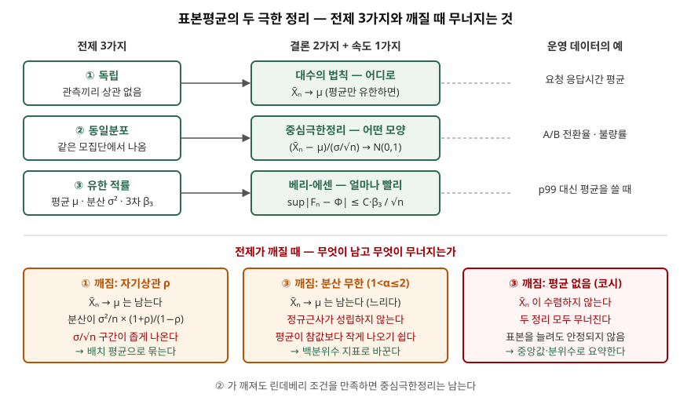

> 두 정리의 전제가 깨질 때의 동작을 표준 라이브러리 난수와 정확 계산으로 검산했다.
> 계산 기록은 [code/output.txt](code/output.txt)에 있다. 정의와 정리는 확률론 교과서와
> 원 논문을 근거로 했다.

## 들어가며

두 정리는 데이터 분석 과목에서 거의 매 회 어느 한쪽이 나온다. 답안에서 흔한 실수는
둘을 "표본이 크면 정규분포가 된다"는 한 문장으로 뭉치는 것이다. 실무에서는 그보다 한
단계 아래가 문제다. 응답시간 평균에 `±1.96·s/√n` 오차 막대를 붙인 대시보드, A/B 테스트의
z 검정, 몬테카를로 추정의 오차 표시가 전부 두 정리의 **전제**에 기대는데, 운영 데이터는
그 전제를 자주 어긴다. 이 글은 전제가 하나씩 깨질 때 무엇이 남고 무엇이 무너지는지를
숫자로 보인다.

## 정의

**대수의 법칙(Law of Large Numbers)** 은 독립·동일분포이고 평균 μ가 유한한 확률변수의
표본평균 X̄ₙ이 n이 커질수록 μ로 수렴한다는 정리다. 교과서가 증명하는 형태는 임의의
ε > 0에 대해 `P(|X̄ₙ − μ| ≥ ε) → 0`인 **약한 법칙**이고, 확률 1로 `X̄ₙ → μ`인
**강한 법칙**은 고급 과정에서 증명한다고 적는다(Grinstead & Snell 8장).

**중심극한정리(Central Limit Theorem)** 는 같은 조건에 분산 σ²까지 유한하면 표준화한
표본평균 `(X̄ₙ − μ)/(σ/√n)`의 분포가 모집단 분포와 무관하게 표준정규분포로 수렴한다는
정리다(같은 책 9장).

답안 첫 줄은 이렇게 끊는다. **대수의 법칙은 표본평균이 어디로 가는지를, 중심극한정리는
그 주변에서 1/√n 폭으로 어떤 모양으로 흩어지는지를 말한다.**

## 등장 배경

대수의 법칙은 베르누이가 사후 출간된 『추측술(Ars Conjectandi, 1713)』에서 처음
증명했다. 동전을 많이 던지면 앞면 비율이 1/2에 가까워진다는 경험을 **확률의 빈도 해석을
정당화하는 정리**로 만든 것이다. 다만 "가까워진다"만으로는 표본을 몇 개 모아야 하는지
답할 수 없었다.

그 공백을 채운 것이 중심극한정리다. 드무아브르는 『우연의 이론(The Doctrine of Chances,
1718)』에서 이항분포의 합을 정규곡선으로 근사하는 방법을 보였고, 그 뒤 동일분포 조건은
린데베리 조건으로 약해졌다. 펠러는 이 조건이 사실상 필요조건이기도 함을 보였다(Grinstead
& Snell 9장 역사 노트). 오차를 **σ/√n 축척과 정규 분위수로 계산할 수 있게 된 것**이
표본조사·품질관리·실험 설계의 출발점이다.

## 구성요소 — 전제 3가지, 결론 2가지, 속도 1가지

| 구분 | 항목 | 내용 |
|---|---|---|
| 전제 ① | 독립 | 관측끼리 영향을 주지 않는다 |
| 전제 ② | 동일분포 | 모든 관측이 같은 분포에서 나온다 |
| 전제 ③ | 유한 적률 | 대수의 법칙은 평균, 중심극한정리는 분산, 수렴 속도 상한은 3차 절대적률까지 유한 |
| 결론 ① | 대수의 법칙 | X̄ₙ → μ |
| 결론 ② | 중심극한정리 | (X̄ₙ − μ)/(σ/√n) → N(0, 1) |
| 속도 | 베리-에센 부등식 | `sup|Fₙ(x) − Φ(x)| ≤ C₀·β₃/√n`, β₃ = E|X − μ|³/σ³ |

베리-에센 부등식의 상수 C₀는 쳅초바(Shevtsova)가 2011년에 **0.4748 미만**으로 좁혔다.
정규근사의 오차가 1/√n으로 줄어들고, 모집단이 비대칭일수록(β₃가 클수록) 느리다는 것을
이 부등식이 수치로 보장한다.

## 도식



> **출처**: [C. M. Grinstead, J. L. Snell, Introduction to Probability 2nd ed., Ch. 8 Law of Large Numbers · Ch. 9 Central Limit Theorem (AMS, 2003)](https://math.dartmouth.edu/~prob/prob/prob.pdf) · [I. Shevtsova, On the absolute constants in the Berry–Esseen type inequalities for identically distributed summands, arXiv:1111.6554 (2011)](https://arxiv.org/abs/1111.6554) — 아래 세 칸의 동작은 [code/output.txt](code/output.txt)의 계산 결과다

답안지에는 위 두 줄(전제 3 → 결론 2 + 속도 1)만 그려도 된다. 아래 세 칸을 붙이면
"전제를 아는 답안"이 된다.

## 동작 — 전제가 깨질 때

### 기준선

독립·동일분포 지수분포에서 n = 100으로 `평균 ± 1.96·s/√n` 구간을 4,000번 만들면
참 평균을 덮은 비율이 0.9400이다. 왜도 2인 모집단이라 0.95보다 조금 모자라지만 대체로
맞는다.

### 독립이 깨질 때 — 자기상관

시계열 지표처럼 앞 값이 뒤 값에 남는 데이터를 정상 AR(1) `Xₜ = ρXₜ₋₁ + εₜ`로 두면
표본평균의 분산은 `σ²/n × [1 + 2Σ(1 − k/n)ρᵏ]`이고, n이 크면 `(1+ρ)/(1−ρ)`배로
불어난다. 분산은 여전히 0으로 가므로 체비쇼프 부등식에 넣으면 **대수의 법칙은 남는다.**
무너지는 것은 오차 폭이다.

```text
  rho  (1+r)/(1-r)      정확식    모의 n·Var     유효 n      단순 구간      배치 평균
  0.0       1.0000   1.0000      0.9877   1000.0     0.9470     0.9510
  0.5       3.0000   2.9960      2.9447    333.8     0.7490     0.9545
  0.9      19.0000  18.8200     18.0641     53.1     0.3550     0.9390
```

ρ = 0.9에서 관측 1,000개는 독립 관측 53개만큼의 정보밖에 없다. 그런데 `s/√1000`으로
폭을 잡으니 95% 구간이라고 그린 막대가 실제로는 **35.5%만** 참값을 덮는다. 인접 관측
100개씩 묶어 배치 평균 10개로 폭을 다시 잡으면 0.9390으로 돌아온다.

### 유한 분산이 깨질 때 — 두꺼운 꼬리

하한 1, 꼬리 지수 α인 파레토 분포는 밀도가 αx^(−α−1)이다. 적분하면 평균은 α > 1일 때
α/(α−1)이고, E[X²] = ∫αx^(1−α)dx는 α ≤ 2에서 발산한다. α = 1.5는 **평균은 3으로 있는데
분산은 무한**인 경우다. 누적 평균은 n = 100에서 2.1520, 10⁶에서 2.9698로 느리게나마
3에 붙는다. 대수의 법칙은 남는다.

```text
 alpha    참 평균     분산      n      단순 구간      평균<참값
   3.0    1.50   0.75   1000     0.9480     0.5150
   1.5    3.00     무한    100     0.7070     0.7000
   1.5    3.00     무한   1000     0.7490     0.6840
   1.5    3.00     무한  10000     0.7850     0.6770
```

분산이 유한한 α = 3은 n = 1,000에서 0.9480으로 맞는다. α = 1.5는 표본을 100배 늘려도
0.79에 머물고, 표본평균의 약 68%가 참값보다 **작게** 나온다. 드물게 오는 아주 큰 값이
평균을 끌어올리는데 대부분의 표본에는 그 값이 없기 때문이다. 중심극한정리의 전제가 없으니
정규근사가 맞아 들어간다는 보장도 없다.

### 수렴 속도 — 상한은 보수적이다

지수분포 n개의 합은 얼랑 분포이므로 표준화 평균과 정규분포의 최대 거리를 정확히 계산할
수 있다.

```text
     n    실제 sup|F_n - Φ|        베리-에센 상한 0.4748·β3/√n
     5             0.0596                       0.5127
    30             0.0243                       0.2093
  1000             0.0042                       0.0363
```

실제 거리와 상한이 함께 1/√n으로 줄고, 상한은 세 n 모두에서 실제의 약 8.6배다. 베리-에센 부등식은
"이보다 나쁘지는 않다"는 보증이지 표본 크기를 정하는 계산식으로 쓰기에는 느슨하다.

## 비교

| 구분 | 대수의 법칙 | 중심극한정리 |
|---|---|---|
| 답하는 질문 | 어디로 가는가 | 어떤 모양으로 흩어지는가 |
| 수렴의 종류 | 확률수렴(약한), 거의 확실한 수렴(강한) | 분포수렴 |
| 필요한 적률 | 평균 | 분산 (속도까지는 3차 적률) |
| 자기상관이 있으면 | 남는다 | 오차 폭 σ/√n이 틀린다 |
| 분산이 무한하면 (1<α≤2) | 남는다, 느리다 | 성립하지 않는다 |
| 평균이 없으면 (코시) | 성립하지 않는다 | 성립하지 않는다 |
| 운영에서 쓰는 곳 | 몬테카를로 추정, 장기 평균 지표 | 신뢰구간, A/B z 검정, X̄ 관리도 |

## 적용 시 고려사항

- **오차 막대를 그리기 전에 자기상관부터 본다.** 1분 단위 지표, 같은 세션의 요청은
  독립이 아니다. 유효 표본 수 `n/[(1+ρ)/(1−ρ)]`를 계산하거나 배치 평균으로 폭을
  잡는다. 배치 크기는 상관이 사라질 만큼 길어야 한다.
- **꼬리가 두꺼운 지표는 평균 대신 백분위수로 관리한다.** 응답시간, 파일 크기, 거래
  금액은 꼬리 지수가 2 아래일 수 있다. 평균에 정규근사 구간을 붙이면 폭이 좁게 나오고
  평균 자체도 대부분 작게 나온다. p95·p99나 중앙값을 지표로 삼는다.
- **"n ≥ 30이면 정규"를 규칙으로 쓰지 않는다.** 정리에 그런 숫자는 없다. 비대칭이 크면
  더 큰 n이 필요하고, 그 정도는 β₃가 정한다.
- **동일분포 위반은 린데베리 조건으로 구제되지만 드리프트는 아니다.** 배포 전후처럼
  평균 자체가 바뀌면 표본평균은 두 구간의 가중 평균으로 간다. 정리가 틀린 것이 아니라
  추정 대상이 바뀐 것이므로 구간을 나눠 본다.

> 기출 답안: [기출문제 — 대수의 법칙과 중심극한정리](../../exam/2026-10-08-law-of-large-numbers-central-limit-theorem/index.md)

## 정리

- **어디로(대수의 법칙) / 어떤 모양(중심극한정리) / 얼마나 빨리(베리-에센, C₀ < 0.4748)** — 결론 2 + 속도 1.
- 전제 **3가지: 독립·동일분포·유한 적률.** 암기 단서는 "**독·동·유**".
- 깨질 때 **3갈래**: 자기상관 → 법칙은 남고 폭이 틀린다(배치 평균) / 분산 무한 → 법칙은 남고 정규근사가 무너진다(백분위수) / 평균 없음 → 둘 다 무너진다(중앙값).

## 참고 자료

- [C. M. Grinstead, J. L. Snell, Introduction to Probability 2nd ed. (AMS, 2003)](https://math.dartmouth.edu/~prob/prob/prob.pdf) — 약한·강한 대수의 법칙(8장, 연습문제 15), 체비쇼프 부등식, 베르누이 『추측술』(8장 역사 노트), 드무아브르와 린데베리·펠러 조건(9장) (1차)
- [I. Shevtsova, On the absolute constants in the Berry–Esseen type inequalities for identically distributed summands, arXiv:1111.6554 (2011-11)](https://arxiv.org/abs/1111.6554) — C₀ < 0.4748 (1차)
- [NIST/SEMATECH e-Handbook of Statistical Methods §6.3.2.1 Shewhart X-bar and R and S Control Charts (2012)](https://www.itl.nist.gov/div898/handbook/pmc/section3/pmc321.htm) — X̄ 관리도의 √n 관리 한계 (1차)
- [Python 3.13 random — paretovariate, gauss, expovariate](https://docs.python.org/3.13/library/random.html) — 모의실험에 쓴 난수 생성기 (1차)
