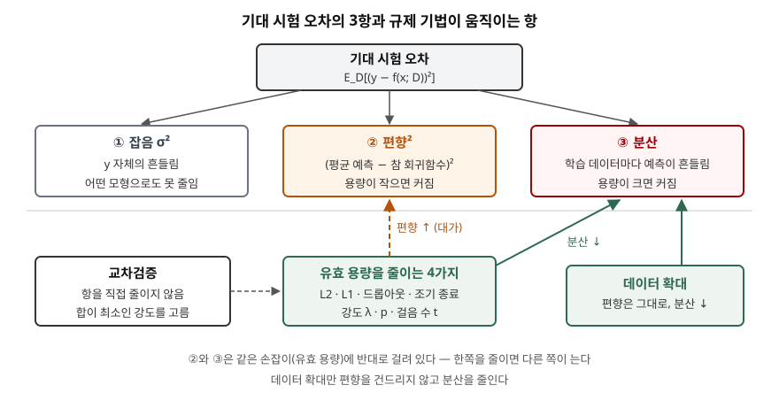

> 분해식과 규제 기법의 효과를 표준 라이브러리만으로 검산했다. 학습 표본을 200번
> 새로 뽑아 같은 모형을 200번 맞춘 기록이 [code/output.txt](code/output.txt)에 있다.
> 정의와 등식은 원 논문을 근거로 했다.

## 들어가며

과적합·과소적합은 데이터 분석 과목에서 자주 나오는데, 답안이 "규제, 드롭아웃, 데이터
증강"을 나열하는 데서 그치면 점수가 갈리지 않는다. 채점자가 보려는 것은 그 기법들이
**오차의 어느 성분을 줄이고 어느 성분을 대가로 내는가**다. 실무에서도 같은 질문이다.
λ를 얼마로 둘지, 몇 에폭에서 멈출지는 전부 편향과 분산 사이의 한 점을 고르는 일이다.
이 글은 그 관계를 분해식 하나로 세우고 숫자로 확인한다.

## 정의

**편향-분산 분해(bias/variance decomposition)** 는 학습 데이터 D로 만든 추정기 f(x; D)의
기대 제곱 오차를, 평균 예측이 참 회귀함수에서 떨어진 정도인 **편향²** 과 데이터가 바뀔
때 예측이 흔들리는 정도인 **분산** 으로 나누는 등식이다. Geman 등은 이를 다음과 같이
유도한다(1992, 3.1절).

```text
E_D[(f(x;D) − E[y|x])²] = (E_D[f(x;D)] − E[y|x])²  +  E_D[(f(x;D) − E_D[f(x;D)])²]
                              편향²                          분산
```

여기에 새 관측 y의 조건부 분산 σ²(잡음)를 더하면 기대 시험 오차가 된다.

답안 첫 줄은 이렇게 끊는다. **편향-분산 트레이드오프는 모형의 유연성을 높이면 편향은
줄고 분산은 늘어, 둘의 합이 최소가 되는 중간 용량이 존재한다는 관계다.**

## 등장 배경

1980년대 말 역전파 신경망이 퍼지면서 "파라미터가 많을수록 더 많이 배운다"는 기대가
있었다. Geman 등은 신경망을 **비모수 회귀 추정기**로 보고, 모형을 가정하지 않는 추정은
분산이 커서 수렴에 매우 큰 표본이 필요하고, 분산을 누르려고 모형을 가정하면 그 모형이
틀린 만큼 편향이 생긴다는 점을 정리했다. 이 양쪽 한계를 **딜레마**라 부른 것이 이 용어의
출발이다. 같은 논문 4.1절은 그 균형점을 데이터로 고르는 방법으로 교차검증을, 매끄러운
해를 선호하게 만드는 방법으로 벌점 함수(규제)를 든다.

## 구성요소 — 오차 3항, 조절 수단 6가지

| 구분 | 항목 | 정의 | 줄이는 방법 |
|---|---|---|---|
| 오차 ① | 잡음 σ² | y가 x로 다 설명되지 않는 부분 | 없음 (측정 개선만 가능) |
| 오차 ② | 편향² | 평균 예측과 참값의 차이 제곱 | 용량 확대, 특징 추가 |
| 오차 ③ | 분산 | 학습 데이터에 따른 예측의 흩어짐 | 용량 축소, 데이터 확대 |

| 조절 수단 | 무엇을 바꾸는가 | 강도 손잡이 |
|---|---|---|
| ① L2 규제 | 손실에 λΣw² 를 더해 계수를 고르게 줄인다 | λ |
| ② L1 규제 | 손실에 λΣ\|w\| 를 더해 일부 계수를 정확히 0으로 만든다 | λ |
| ③ 드롭아웃 | 입력·은닉 단위를 확률 1−p로 지운 채 학습한다 | 유지 확률 p |
| ④ 조기 종료 | 경사 하강을 수렴 전에 멈춘다 | 걸음 수 t |
| ⑤ 교차검증 | ①~④의 강도와 차수를 검증 오차로 고른다 | — |
| ⑥ 데이터 확대 | 같은 용량에서 표본 수를 늘린다 | N |

드롭아웃은 선형 회귀에서 기대값을 취하면 **특성별 L2 규제**가 된다. Srivastava 등의
주변화 절(9.1절)은 목적식이 `||y − Xw̃||² + (1−p)/p · ||Γw̃||²`, `Γ = diag(XᵀX)^(1/2)` 로
바뀐다고 보인다. p가 작을수록 벌점 계수가 커진다.

## 도식



> **출처**: [S. Geman, E. Bienenstock, R. Doursat, Neural Networks and the Bias/Variance Dilemma §3.1 The Bias/Variance Decomposition of Mean-Squared Error, §4.1 Automatic Smoothing (Neural Computation 4(1), 1992)](https://doi.org/10.1162/neco.1992.4.1.1) · [N. Srivastava et al., Dropout §9.1 Linear Regression (JMLR 15, 2014)](https://jmlr.org/papers/v15/srivastava14a.html) — 화살표 방향은 [code/output.txt](code/output.txt)의 계산 결과로 확인했다

답안지에는 위 네 칸(오차 → 3항)과 아래 "용량을 줄이면 분산↓ 편향↑" 화살표 두 개만
그려도 된다.

## 동작 — 같은 모형을 200번 맞춰 보기

참 함수 `sin(πx)` 에 잡음 σ = 0.2를 얹은 학습 표본 20개를 200번 새로 뽑고, 르장드르
다항식으로 맞춘 예측을 평가 격자 101점에서 모았다. 각 점에서 예측 200개의 평균이
참값과 떨어진 정도가 편향, 200개끼리 흩어진 정도가 분산이다.

**분해식이 맞는지부터 본다.** 차수 3에서 편향² 0.0036 + 분산 0.0072 + 잡음 0.0400 =
0.0509이고, 새 잡음을 얹은 시험 관측과 직접 잰 MSE는 0.0507이다.

**용량을 올리면 두 항이 반대로 움직인다.**

| 차수 | 편향² | 분산 | 기대 오차 |
|---|---|---|---|
| 1 | 0.1712 | 0.0041 | 0.2153 |
| 3 | 0.0036 | 0.0072 | 0.0509 |
| 5 | 0.0000 | 0.0105 | 0.0506 |
| 9 | 0.0001 | 0.0228 | 0.0629 |
| 15 | 0.0048 | 2.4393 | 2.4840 |

차수 1은 편향이, 차수 15는 분산이 오차를 지배한다. 차수 15의 편향²이 0이 아닌 것은
분산이 커서 200회 평균에도 흔들림이 남기 때문이다.

**규제 기법은 차수 15를 그대로 두고 유효 용량을 줄인다.** 각 기법의 강도를 약에서 강으로
올리면 같은 모양이 나온다.

| 기법 (차수 15) | 약하게 | 최적 근처 | 강하게 |
|---|---|---|---|
| L2 λ | 0.0001: 편향² 0.0029 / 분산 0.8902 | 0.1: 0.0004 / 0.0257 | 10: 0.2366 / 0.0029 |
| L1 λ | 0.01: 0.0001 / 0.0343 | 0.5: 0.0094 / 0.0058 | 2: 0.1065 / 0.0054 |
| 드롭아웃 p | 0.95: 0.0014 / 0.0298 | 0.9: 0.0056 / 0.0256 | 0.5: 0.1321 / 0.0106 |
| 조기 종료 t | 1,000,000: 0.0030 / 1.6067 | 100: 0.0002 / 0.0217 | 10: 0.0689 / 0.0055 |

조기 종료는 걸음 수가 **적을수록** 강한 규제다. 0에서 출발한 경사 하강은 곡률이 작은
방향의 계수를 늦게 키우므로, 일찍 멈추면 L2처럼 계수 크기가 작게 남는다(t = 10에서 0.95,
10⁶에서 14.84). L1은 λ = 0.5에서 계수 15개 중 평균 12.28개를 정확히 0으로 만들었다.

**교차검증과 데이터 확대는 성격이 다르다.** 학습 표본마다 5-겹 교차검증으로 L2 강도를
고르게 하자 200회 중 127회가 λ = 0.1, 68회가 λ = 1을 골랐고 기대 오차는 0.0680이었다.
시험 데이터를 보지 않고 최적 근처에 도달한 것이다. 표본을 20 → 40 → 80개로 늘리면
규제 없는 차수 15의 분산이 2.4393 → 0.0162 → 0.0068로 떨어진다.

## 비교

| 구분 | 고편향 (과소적합) | 고분산 (과적합) |
|---|---|---|
| 학습 오차 | 큼 | 작음 |
| 학습·검증 격차 | 작음 | 큼 |
| 처방 | 용량 확대, 규제 완화 | 규제 강화, 데이터 확대 |

| 기법 | 계수에 하는 일 | 부수 효과 | 선형 모형에서의 관계 |
|---|---|---|---|
| L2 | 전체를 고르게 축소 | 해가 유일해진다 | 기준 |
| L1 | 일부를 0으로 | 특성 선택 | 0이 생기는 점이 L2와 다르다 |
| 드롭아웃 | 단위를 무작위로 제거 | 학습이 2~3배 느려진다(Srivastava 등 결론, 11절) | 기대값이 특성별 L2 |
| 조기 종료 | 계수가 덜 자란 상태로 멈춤 | 학습 비용이 줄어든다 | 걸음 수 t가 λ의 역수 역할 |

## 적용 시 고려사항

- **강도는 교차검증으로 고르고 시험 세트는 마지막에 한 번만 본다.** 위 검산에서 λ를
  0.1에서 10으로 바꾸자 기대 오차가 0.0661에서 0.2795로 4배가 됐다. 시험 오차를 보며 λ를 고치면
  시험 세트에 과적합한다.
- **규제 전에 특성 척도를 맞춘다.** L1·L2 벌점은 계수 크기에 걸리므로 단위가 큰 특성의
  계수는 작게 나와 벌점을 덜 받는다. 표준화를 하거나, 드롭아웃 주변화식의 Γ처럼 특성별
  척도를 벌점에 반영한다. 절편은 벌점에서 뺀다.
- **진단을 먼저 하고 처방을 고른다.** 학습 오차부터 크면 편향 문제라 규제를 더해도
  나빠진다. 학습-검증 격차가 크면 분산 문제라 데이터 확대가 가장 확실하다. 위 표에서
  데이터 확대만이 편향을 키우지 않고 분산을 줄였다.
- **L1은 상관된 특성 중 하나만 남길 수 있다.** 0이 된 특성이 "쓸모없는 특성"이라는 뜻은
  아니다. 해석에 쓰려면 표본을 바꿔 선택이 안정적인지 확인한다.

> 기출 답안: [기출문제 — 과적합과 과소적합의 발생 원인과 해결 방안](../../exam/2026-10-10-overfitting-underfitting-causes-remedies/index.md)

## 정리

- 기대 시험 오차 **3항 = 잡음 + 편향² + 분산.** 잡음은 못 줄이고, 나머지 둘은 유효 용량이라는 하나의 손잡이에 반대로 걸려 있다.
- 조절 수단 **6가지**: 용량을 줄이는 **L2·L1·드롭아웃·조기 종료**(분산↓ 편향↑), 강도를 고르는 **교차검증**, 편향 없이 분산만 줄이는 **데이터 확대**.
- 암기 단서: "**4 · 1 · 1**" — 용량을 줄이는 넷(L2·L1·드롭아웃·조기 종료)은 같은 방향, 교차검증 하나는 고르는 것, 데이터 확대 하나는 편향 대가가 없는 것.

## 참고 자료

- [S. Geman, E. Bienenstock, R. Doursat, Neural Networks and the Bias/Variance Dilemma, Neural Computation 4(1), pp. 1–58 (1992)](https://doi.org/10.1162/neco.1992.4.1.1) — 1절 딜레마의 정의, 3.1절 분해식 유도, 4.1절 교차검증과 규제 (1차)
- [N. Srivastava, G. Hinton, A. Krizhevsky, I. Sutskever, R. Salakhutdinov, Dropout: A Simple Way to Prevent Neural Networks from Overfitting, JMLR 15, pp. 1929–1958 (2014)](https://jmlr.org/papers/v15/srivastava14a.html) — 9.1절 선형 회귀에서 주변화한 드롭아웃 목적식, 11절 학습 시간 (1차)
- [R. Tibshirani, Regression Shrinkage and Selection via the Lasso, JRSS-B 58(1), pp. 267–288 (1996)](https://doi.org/10.1111/j.2517-6161.1996.tb02080.x) — L1 규제 원 논문 (1차)
- [I. Goodfellow, Y. Bengio, A. Courville, Deep Learning, Ch. 7 Regularization for Deep Learning (MIT Press, 2016)](https://www.deeplearningbook.org/contents/regularization.html) — 7.8절 조기 종료와 L2 규제의 관계 (1차)
