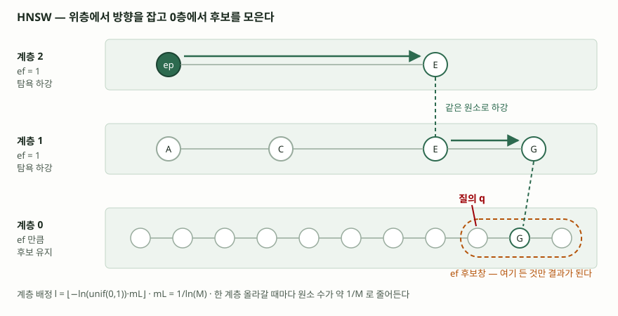

## 들어가며

의미 검색을 붙일 때 벡터 열에 색인을 하나 만든다. `USING hnsw (embedding vector_cosine_ops)`
라고 쓰면 `m = 16`, `ef_construction = 64`라는 숫자가 어디선가 딸려 온다. 문제는 결과가
이상할 때 생긴다. 분명 들어 있는 문서가 상위 10건에 안 나오는데, 같은 질의를 색인 없이
돌리면 나온다. 이때 **색인이 고장난 것이 아니라 설계대로 동작한 것**이라는 사실을 모르면
어느 손잡이를 돌려야 하는지 고를 수 없다. 애초에 왜 "근사"인가부터가 답안의 출발점이다.

> 계산으로 확인할 수 있는 주제이므로 논문의 식을 직접 돌려 검산했다. 수행 기록은
> [code/output.txt](code/output.txt)에 있다. 색인 구현 자체를 만들지는 않았다.

## 정의

**근사 최근접 이웃 탐색(K-ANNS)** 은 질의에 가장 가까운 K개를 정확히 찾는 조건을 완화해
**일정 수의 오답을 허용하는 대신 거리 계산 횟수를 줄이는 탐색 방식**이다. 품질은
**재현율**로 재며, 찾아낸 진짜 최근접의 개수를 K로 나눈 값이다. 원 논문이 이 정의를
그대로 쓴다.

**HNSW**는 저장 원소를 여러 계층의 근접 그래프로 나눠 쌓고, 원소가 속하는 최대 계층을
지수적으로 감소하는 확률분포로 뽑아 **연결의 거리 규모를 계층별로 분리한** K-ANNS 색인이다.
위 계층에서 탐욕 탐색으로 방향을 잡고 아래로 내려오므로 탐색 복잡도가 로그로 줄어든다.

## 등장 배경

왜 정확히 찾지 않는가. "느려서"가 아니라 **고차원에서는 정확 색인이 성립하지 않기
때문**이고, 근거가 둘 있다.

첫째, Beyer 외(1999)는 독립동일분포보다 훨씬 넓은 조건에서 **차원이 오르면 최근접점까지의
거리가 최원점까지의 거리에 가까워진다**는 것을 보였다. 실측에서는 10~15차원만 되어도
이 현상이 나타난다. 최근접이라는 개념 자체가 흐려지면, 가지를 쳐 낼 기준도 없어진다.

직접 재 보면 이렇게 나온다.

| 차원 `d` | `(Dmax−Dmin)/Dmin` 중앙값 | 읽는 법 |
|---|---|---|
| 2 | 81.599 | 최원점이 최근접보다 82배 멀다 |
| 8 | 3.764 | 아직 구분된다 |
| 16 | 1.672 | 최원점이 2.7배 |
| 32 | 0.948 | 2배 이내로 붙었다 |
| 128 | 0.366 | 1.4배 |
| 512 | 0.168 | 사실상 전부 같은 거리 |

> `[0,1]^d` 균등난수 1,000점에 질의 25개. 값은 [code/output.txt](code/output.txt) `[1]`에서 가져왔다.

둘째, Weber 외(1998)는 분할·군집 기반 색인이 고차원에서 선형 복잡도를 보이며,
**차원이 대략 10을 넘으면 평균적으로 단순 순차 주사에 진다**는 것을 형식적으로 보였다.
색인을 타고도 결국 전부 읽게 되면 색인을 유지할 이유가 없다.

정확성을 붙들고 있는 한 이 둘을 피할 방법이 없다. 그래서 조건을 바꾼다. 몇 건을 놓치는
것을 받아들이면 거리 계산 횟수를 데이터 크기와 거의 무관하게 만들 수 있다.

## 구성요소 — 4가지

논문은 알고리즘 5개(INSERT, SEARCH-LAYER, 이웃 선택 2종, K-NN-SEARCH)로 적지만,
답안에서는 아래 **4가지 구성요소**로 묶는 것이 세기 쉽다.

**① 계층 배정** — 원소마다 최대 계층 `l = ⌊−ln(unif(0,1))·mL⌋`를 뽑는다. 정규화 상수
`mL`이 계층이 얼마나 얇게 쪼개질지를 정한다. 논문은 `mL = 1/ln(M)`을 권하며, 이는 skip
list의 `p = 1/M`에 해당한다.

**② 계층별 근접 그래프** — 각 계층은 그 계층에 속한 원소들만의 그래프다. 원소당 연결 수는
`Mmax`로 제한하고, 0층만 `Mmax0`로 따로 둔다. 논문은 `Mmax0 = 2M`을 권한다.

**③ 계층 내 탐욕 탐색(SEARCH-LAYER)** — 후보 목록 `W`를 `ef`개로 유지하며, 목록에서 가장
가까운 미평가 원소의 이웃을 펼치기를 반복한다. **목록의 최원 원소보다 먼 후보가 나오면
멈춘다.** 거리 계산 횟수를 세어 끊는 방식과 달리, 이 조건은 가망 없는 후보를 애초에
목록에 넣지 않는다.

**④ 이웃 선택 휴리스틱** — 가까운 순으로 M개를 잇지 않는다. 후보를 가까운 것부터 훑되
**이미 연결한 어떤 이웃보다도 삽입 원소에 더 가까울 때만** 잇는다. 한쪽으로 몰린 연결
대신 방향이 갈라진 연결이 생기고, 군집이 뚜렷한 데이터에서 탐색이 군집 경계에서 멈추는
것을 막는다.

> **출처**: [Yu. A. Malkov, D. A. Yashunin, *Efficient and robust approximate nearest neighbor search using Hierarchical Navigable Small World graphs*, arXiv:1603.09320v4, 4절 알고리즘 1·2·5](https://arxiv.org/abs/1603.09320)

### 계층이 정말 `1/M`씩 줄어드는가

`M = 16`으로 원소 100만 개를 배정해 보면 계층별 원소 수가 이렇게 나온다.

| 계층 | 그 계층에 존재하는 원소 | 직전 계층 대비 |
|---|---|---|
| 5 | 1 | — |
| 4 | 20 | 0.0881 |
| 3 | 227 | 0.0583 |
| 2 | 3,892 | 0.0622 |
| 1 | 62,603 | 0.0626 |
| 0 | 1,000,000 | — |

`1/M = 0.0625`와 맞는다. 최상위 계층은 5로, `log₁₆(1,000,000) = 4.98`과 일치한다.
**탐색이 위에서 아래로 내려오는 횟수가 데이터 크기의 로그에 묶이는 근거가 여기다.**

한편 원소 하나가 들어가는 평균 계층 수는 `M = 16`에서 **1.0667개**다. 바닥함수 때문에
`mL + 1 = 1.36`이 아니라 `p/(1−p) + 1`이 되고, 둘째 자리까지 실측과 같다. 거의 모든
원소는 0층에만 존재하므로, **계층을 쌓는 비용은 0층 그래프 하나를 유지하는 비용과 거의
같다.** 위 계층은 방향을 잡는 용도로만 붙는다.

## 비교 — `mL`과 `Mmax0`를 어떻게 두느냐가 다른 구조를 만든다

논문 4.1절은 같은 알고리즘이 매개변수에 따라 이미 알려진 세 구조로 환원된다고 적는다.
답안에서 HNSW를 다른 그래프 색인과 대비할 때 이 표가 그대로 쓰인다.

| `mL` | `Mmax0` | 결과 구조 | 탐색 복잡도 |
|---|---|---|---|
| 0 | `M` | 유향 k-NN 그래프 | 거듭제곱 법칙 |
| 0 | 무한대 | NSW 그래프 | 다중로그 |
| 0이 아닌 값 | `2M` | HNSW | 로그 |

계층이 없으면(`mL = 0`) 연결의 거리 규모가 섞여서, 먼 곳에서 출발한 탐욕 탐색이
한 걸음에 얼마나 다가가는지를 보장할 수 없다. 계층을 두면 위층이 먼 규모의 연결만
가지므로 **몇 번의 도약으로 대략적인 위치를 잡고 내려온다.** 로그와 다중로그의 차이는
여기서 갈린다.

## 적용 시 고려사항 — 4가지

- **`ef`가 재현율의 손잡이이고, 후보창 밖은 돌려줄 방법이 없다.** `ef`는 0층에서 유지하는
  후보 목록의 크기이고, 결과 K개는 이 목록에서 나온다. `ef`를 키우면 재현율이 오르고
  지연이 는다. pgvector가 `hnsw.ef_search` 기본값을 40으로 두는 것이 이 자리다.
  **놓친 문서는 융합이나 재순위화로도 살아나지 않는다.** 뒤 단계는 앞 단계가 건넨 후보만
  다시 줄 세운다.
- **색인 품질과 질의 품질은 다른 매개변수가 정한다.** `efConstruction`은 그래프를 만들
  때의 후보창이고 색인을 다시 만들어야 바뀐다. `ef`는 질의할 때 정하며 즉시 바뀐다.
  재현율이 낮을 때 먼저 올릴 것은 `ef`다. 여기서 안 되면 그때 `M`과 `efConstruction`을
  올려 색인을 다시 만든다.
- **`M`은 그대로 메모리다.** 원소당 연결 수가 `Mmax0 + mL·Mmax`이므로, 링크를 4바이트로
  잡으면 `M = 16`에서 원소당 151바이트, 1억 원소면 그래프만 14.1 GiB다. `M = 48`이면
  40.4 GiB가 된다. 벡터 본체는 여기 들어가지도 않았다. 논문이 권하는 범위는 5~48이고,
  높은 재현율과 높은 차원일수록 큰 값이 낫다.
- **차원 수가 아니라 고유차원이 관건이다.** 임베딩 차원이 768이어도 실제 데이터가 낮은
  차원의 부분공간에 몰려 있으면 근사 탐색이 잘 듣는다. Beyer 외의 논문 자체가 거리 집중이
  일어나지 않는 고차원 워크로드가 있음을 함께 보였다. 반대로 데이터가 여러 군집으로
  뚜렷하게 갈라지면, 가까운 순으로만 이은 그래프는 군집 경계에서 탐색이 멈춘다.
  **이 경우가 이웃 선택 휴리스틱이 필요한 자리다.**

## 정리

암기 단서는 **"포기 1 · 매개변수 3 · 환원 3"**이다.

- 포기하는 것 **1개** — 정확성. 고차원에서 최근접과 최원점의 거리가 붙고(Beyer 1999),
  10차원만 넘으면 색인이 순차 주사에 지기 때문이다(Weber 1998)
- 매개변수 **3개** — `M`(연결 수, 메모리), `efConstruction`(색인 품질),
  `ef`(질의 품질, 재현율). 나머지 `mL = 1/ln(M)`과 `Mmax0 = 2M`은 `M`에서 따라 나온다
- 환원되는 구조 **3개** — `mL = 0`이면 k-NN 그래프(거듭제곱), `Mmax0`가 무한대면
  NSW(다중로그), 계층을 두면 HNSW(로그)
- 계층은 **한 층 올라갈 때마다 원소가 `1/M`로** 줄고, 최상위 계층은 `log_M(N)`이다
- 원소 하나가 평균 **1.07개 계층**에만 존재하므로, 계층을 쌓는 비용은 0층 그래프 값이다

> 기출 답안: [기출문제 — 어휘 검색과 의미 검색을 결합한 하이브리드 검색](../../exam/2026-09-22-hybrid-search-lexical-vector/index.md)

## 참고 자료

- [Yu. A. Malkov, D. A. Yashunin, *Efficient and robust approximate nearest neighbor search using Hierarchical Navigable Small World graphs*, arXiv:1603.09320v4 (2018)](https://arxiv.org/abs/1603.09320) — 알고리즘 1~5, 4.1절 매개변수(`mL = 1/ln(M)`, `Mmax0 = 2M`, `M` 5~48), 4.2절 복잡도와 메모리
- [K. Beyer, J. Goldstein, R. Ramakrishnan, U. Shaft, *When Is "Nearest Neighbor" Meaningful?*, ICDT 1999, pp. 217–235](https://link.springer.com/chapter/10.1007/3-540-49257-7_15) — 차원이 오르면 최근접 거리가 최원점 거리에 가까워진다
- [R. Weber, H.-J. Schek, S. Blott, *A Quantitative Analysis and Performance Study for Similarity-Search Methods in High-Dimensional Spaces*, VLDB 1998, pp. 194–205](https://dl.acm.org/doi/10.5555/645924.671192) — 10차원을 넘으면 순차 주사에 진다
- [Y. Malkov, A. Ponomarenko, A. Logvinov, V. Krylov, *Approximate nearest neighbor algorithm based on navigable small world graphs*, Information Systems 45, 2014](https://doi.org/10.1016/j.is.2013.10.006) — HNSW의 전신인 NSW
- [pgvector 0.8.6 README — HNSW 색인 옵션](https://github.com/pgvector/pgvector) — `m` 기본값 16, `ef_construction` 기본값 64, `hnsw.ef_search` 기본값 40
