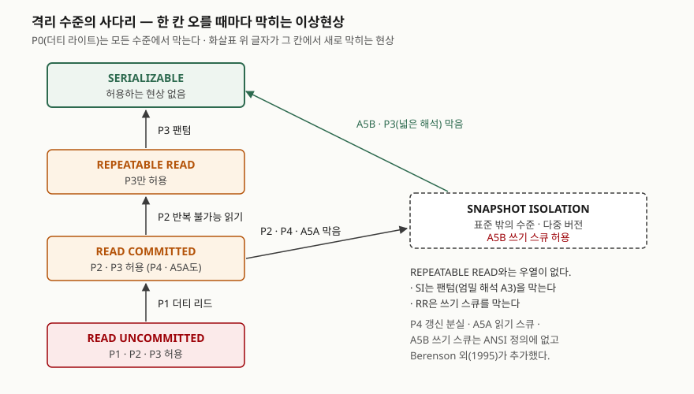

<!-- related:start -->
> **같은 기능을 다른 환경에서 다룬 글** (`transaction-isolation`)
> - [트랜잭션 격리 수준별로 실제 무슨 이상 현상이 보이는가](../../../Database/sqlite/2026-09-21-isolation-level-anomalies/index.md) — SQLite 3.49.1, Python 3.13.5
<!-- related:end -->

## 들어가며

트랜잭션 ACID는 데이터베이스 과목에서 가장 오래 출제된 주제이고, 요즘은 "격리 수준별로
허용되는 이상현상을 쓰라"는 식으로 한 단계 더 들어가 묻는다. 실무에서는 같은 이름의 격리
수준이 제품마다 다르게 동작한다는 점이 문제가 된다. 표준의 기본값은 `SERIALIZABLE`인데
PostgreSQL의 기본값은 `READ COMMITTED`이고, PostgreSQL의 `REPEATABLE READ`는 표준이
허용하는 팬텀을 막는 대신 표준에 이름도 없는 쓰기 스큐를 허용한다. 답안에서 점수가
갈리는 곳은 이 차이를 **이상현상의 이름으로** 설명할 수 있느냐다.

> 실행 검증 없음. 개념 정리 글이며 정의와 표는 PostgreSQL 16 공식 문서와 Berenson 외(1995)
> 원 논문을 근거로 했다. SQLite로 이상현상을 실제로 재현한 결과는
> [트랜잭션 격리 수준별로 실제 무슨 이상 현상이 보이는가](../../../Database/sqlite/2026-09-21-isolation-level-anomalies/index.md)에 있다.

## 정의

**ACID**는 동시에 실행되거나 오류·정전이 일어나도 데이터베이스의 올바름을 지키기 위해
트랜잭션이 갖춰야 할 네 가지 성질, 즉 **원자성·일관성·고립성·지속성**이다
(PostgreSQL 16 용어집). 이 네 성질을 ACID라는 두문자로 묶은 것은 Härder와 Reuter(1983)다.

**격리 수준**은 동시에 실행되는 트랜잭션 사이에서 **어떤 이상현상을 허용할지로 정의한
고립성의 단계**다. SQL 표준은 네 단계를 두고, 각 단계를 허용하지 않는 현상의 목록으로
구분한다(PostgreSQL 16 문서의 격리 수준 절이 표준의 표를 옮겨 싣는다).

## 등장 배경

트랜잭션이 막으려는 위협은 두 가지다. 하나는 **장애**로, 작업 도중 시스템이 멈추면
반쯤 반영된 결과가 남는다. 다른 하나는 **동시성**으로, 여러 트랜잭션이 같은 데이터를
엇갈려 읽고 쓰면 각자는 올바르게 동작해도 합친 결과가 틀린다. 원자성과 지속성이 앞의 것을,
고립성이 뒤의 것을 맡는다.

고립성을 완전하게 주는 방법은 트랜잭션을 **하나씩 차례로 실행한 것과 같은 결과**를
보장하는 것이다. 표준은 이것을 `SERIALIZABLE`로 정의한다. 문제는 비용이다. 잠금으로
구현하면 읽은 데이터에도 끝까지 잠금을 쥐어야 하므로 동시에 돌 수 있는 트랜잭션이 줄어든다.
그래서 표준은 **일부 이상현상을 감수하는 대신 동시성을 얻는** 낮은 단계를 함께 정의했다.

그런데 표준이 이상현상을 영어 문장으로 정의한 탓에 해석이 갈렸다. Berenson 외(1995)는
이 정의가 모호하고 불완전하다고 지적하면서, 표준 정의로는 막히지 않는 **더티 라이트(P0)**,
**갱신 분실(P4)**, **읽기 스큐(A5A)**, **쓰기 스큐(A5B)**를 새로 정의하고, 당시 상용 제품이
쓰던 **스냅숏 격리**를 이 틀 안에 배치했다. 오늘날 답안에서 쓰는 확장된 이상현상 목록은
이 논문에서 나왔다.

## 구성요소 — ACID 4가지와 보장 장치

성질마다 **무엇을 보장하는지**와 **DBMS의 어떤 장치가 그것을 맡는지**를 짝지어 외운다.

| 성질 | 보장하는 것 | 맡는 장치 |
|---|---|---|
| **A** 원자성 | 트랜잭션의 연산이 전부 반영되거나 하나도 반영되지 않는다. 장애 뒤 복구해도 일부만 반영된 결과는 보이지 않는다 | 로그를 이용한 취소(undo) |
| **C** 일관성 | 데이터가 항상 무결성 제약을 만족한다. 커밋 시점까지 해소되지 않은 위반이 있으면 롤백된다 | 제약 조건 검사 + 트랜잭션 로직 |
| **I** 고립성 | 트랜잭션의 결과가 커밋 전에는 동시 실행 중인 다른 트랜잭션에 보이지 않는다 | 잠금 또는 다중 버전(MVCC) |
| **D** 지속성 | 커밋된 변경은 시스템 장애 뒤에도 남는다 | 선행 기록 로그(WAL)와 재실행(redo) |

> 성질의 정의는 PostgreSQL 16 용어집의 각 항목을 따랐다. 지속성 장치는 같은 문서의 WAL 절이
> "데이터 파일의 변경은 그 변경이 로그에 기록된 뒤에만 쓴다"고 정하고, 장애 뒤에는 로그를
> 재실행해 복구한다고 적은 것을 근거로 했다.

일관성은 나머지 셋과 성격이 다르다. 원자성·고립성·지속성은 DBMS가 스스로 보장하지만,
일관성은 **각 트랜잭션이 혼자 실행될 때 제약을 지키도록 짜여 있어야** 성립한다. Berenson 외는
이것을 "트랜잭션은 일관된 상태에서 시작해 일관된 상태로 커밋해야 한다"는 조건으로 쓴다.
그리고 **고립성이 약하면, 혼자서는 제약을 지키는 트랜잭션 둘이 함께 돌며 제약을 깬다.**
뒤에 나오는 쓰기 스큐가 그 경우다. C가 I에 기대고 있다는 점이 답안에서 쓸 만한 관찰이다.

## 구성요소 — 이상현상 3가지와 격리 수준 4단계

표준이 정의하는 이상현상은 **3가지**다. PostgreSQL 16 문서의 정의를 옮긴다.

| 기호 | 이상현상 | 정의 |
|---|---|---|
| P1 | 더티 리드 | 커밋되지 않은 다른 트랜잭션이 쓴 데이터를 읽는다 |
| P2 | 반복 불가능 읽기 | 이미 읽은 데이터를 다시 읽었더니 다른 트랜잭션이 바꿔 놓았다 |
| P3 | 팬텀 | 같은 조건으로 다시 조회했더니 조건을 만족하는 행의 집합이 달라졌다 |

격리 수준은 **4단계**이고, 한 단계 오를 때마다 현상이 하나씩 막힌다.

> **출처**: 네 단계와 단계별로 막히는 현상은 [PostgreSQL 16 — 13.2 Transaction Isolation, Table 13.1](https://www.postgresql.org/docs/16/transaction-iso.html#MVCC-ISOLEVEL-TABLE)과
> [H. Berenson et al., *A Critique of ANSI SQL Isolation Levels*, SIGMOD 1995, Table 3](https://www.microsoft.com/en-us/research/publication/a-critique-of-ansi-sql-isolation-levels/)를,
> 스냅숏 격리의 위치와 막는 현상은 같은 논문 4.2절의 Remark 8~10과 Table 4를 따랐다.

도식을 읽는 순서는 아래에서 위다. `READ UNCOMMITTED`는 P1·P2·P3를 모두 허용한다. 한 칸
오르면 P1이, 또 한 칸 오르면 P2가, 마지막 칸에서 P3가 막힌다. 모든 단계에서 공통으로 막는
것이 **더티 라이트(P0)**다. 표준의 원래 표에는 P0가 없는데, Berenson 외는 P0를 허용하면 앞
트랜잭션이 롤백할 때 되돌릴 값을 정할 수 없으므로 **모든 수준에서 금지해야 한다**고 봤다.
실제 잠금 구현은 가장 낮은 수준에서도 쓰기 잠금을 커밋 때까지 쥐므로 P0가 나지 않는다.

오른쪽의 **스냅숏 격리**는 사다리 위에 놓이지 않는다. 트랜잭션이 시작 시점의 커밋된
스냅숏을 읽고, 커밋할 때 같은 데이터를 먼저 커밋한 트랜잭션이 있으면 나중 쪽을 중단시킨다
(논문의 표현으로 먼저 커밋한 쪽이 이긴다). 그래서 갱신 분실과 읽기 스큐가 안 생기고,
엄밀한 의미의 팬텀도 안 보인다. 그러나 **읽은 데이터와 쓰는 데이터가 다르면** 충돌로
잡지 못한다. 이것이 쓰기 스큐다. 결국 `REPEATABLE READ`와 스냅숏 격리는 서로 막는 것이
달라 **어느 쪽이 더 강하다고 할 수 없다**(논문 Remark 9).

## 비교 — 격리 수준별 허용 이상현상

### 확장된 이상현상 8가지로 본 대응표

Berenson 외 Table 4를 옮겼다. ○는 발생 가능, ✕는 발생 불가, △는 경우에 따라 발생이다.

| 격리 수준 | P0 더티 라이트 | P1 더티 리드 | P4C 커서 갱신 분실 | P4 갱신 분실 | P2 반복 불가능 읽기 | P3 팬텀 | A5A 읽기 스큐 | A5B 쓰기 스큐 |
|---|---|---|---|---|---|---|---|---|
| READ UNCOMMITTED | ✕ | ○ | ○ | ○ | ○ | ○ | ○ | ○ |
| READ COMMITTED | ✕ | ✕ | ○ | ○ | ○ | ○ | ○ | ○ |
| 커서 안정성 | ✕ | ✕ | ✕ | △ | △ | ○ | ○ | △ |
| REPEATABLE READ | ✕ | ✕ | ✕ | ✕ | ✕ | ○ | ✕ | ✕ |
| 스냅숏 격리 | ✕ | ✕ | ✕ | ✕ | ✕ | △ | ✕ | ○ |
| SERIALIZABLE | ✕ | ✕ | ✕ | ✕ | ✕ | ✕ | ✕ | ✕ |

추가된 현상의 뜻은 이렇다. **갱신 분실(P4)**은 T1이 읽은 값을 T2가 바꿔 커밋한 뒤, T1이
처음 읽은 값을 근거로 덮어써서 T2의 변경이 사라지는 것이다. **읽기 스큐(A5A)**는 T1이 x를
읽은 사이 T2가 x와 y를 함께 바꿔 커밋하고, T1이 새 y를 읽어 x와 y가 서로 맞지 않는 상태를
보는 것이다. **쓰기 스큐(A5B)**는 T1과 T2가 x와 y를 둘 다 읽은 뒤 각자 다른 쪽을 써서,
각자는 x와 y 사이의 제약을 지켰는데 합친 결과가 제약을 어기는 것이다.

### 표준 정의와 PostgreSQL 구현

같은 이름이 제품에서 다르게 동작하는 예로 PostgreSQL 16 문서의 Table 13.1을 옮긴다.
이 표에는 직렬화 이상이 네 번째 열로 들어 있는데, 성공적으로 커밋한 트랜잭션들의 결과가
그것들을 하나씩 실행한 어떤 순서와도 맞지 않는 경우를 뜻한다.

| 격리 수준 | 더티 리드 | 반복 불가능 읽기 | 팬텀 | 직렬화 이상 |
|---|---|---|---|---|
| READ UNCOMMITTED | 표준은 허용, PostgreSQL은 발생 안 함 | ○ | ○ | ○ |
| READ COMMITTED | ✕ | ○ | ○ | ○ |
| REPEATABLE READ | ✕ | ✕ | 표준은 허용, PostgreSQL은 발생 안 함 | ○ |
| SERIALIZABLE | ✕ | ✕ | ✕ | ✕ |

PostgreSQL의 `READ UNCOMMITTED`는 `READ COMMITTED`와 똑같이 동작하고, `REPEATABLE READ`는
스냅숏 격리로 구현했다고 문서가 밝힌다. 같은 문서는 표준이 각 수준에서 **일어나서는 안 되는**
현상만 정하고 그보다 강한 보장은 허용한다고 적는다. **더 막는 구현도 표준을 지키는 것이다.** 그래서 이름만으로는 동작을 알 수 없다.

## 적용 시 고려사항 — 4가지

- **기본값부터 확인한다.** 표준의 기본값은 `SERIALIZABLE`이지만 PostgreSQL의 기본값은
  `READ COMMITTED`다(`SET TRANSACTION` 문서의 호환성 절). 대부분의 애플리케이션은 격리 수준을
  지정하지 않으므로, 실제로는 P2·P3·P4가 허용되는 상태에서 돌고 있다.
- **이름이 아니라 막는 현상으로 판단한다.** 같은 `REPEATABLE READ`가 잠금 구현에서는 팬텀을
  허용하고 쓰기 스큐를 막으며, 스냅숏 구현에서는 반대다. 제품을 옮기거나 여러 제품을 함께
  쓸 때는 이상현상 대응표를 제품 문서에서 다시 확인한다.
- **여러 행에 걸친 제약은 격리 수준이 지켜 주지 않을 수 있다.** "당직자가 최소 한 명" 같은
  제약은 행 하나가 아니라 여러 행의 관계다. 스냅숏 격리에서는 두 트랜잭션이 서로 다른 행을
  바꾸므로 충돌로 잡히지 않는다(쓰기 스큐). `SERIALIZABLE`을 쓰거나, 제약이 걸린 행을
  읽을 때 잠금을 거는 명시적 수단을 쓴다. **일관성(C)이 고립성(I)에 기대는 자리다.**
- **높은 수준은 재시도를 전제로 한다.** PostgreSQL 문서는 `REPEATABLE READ`와 `SERIALIZABLE`을
  쓰는 애플리케이션이 직렬화 실패로 인한 트랜잭션 재시도를 준비해야 한다고 적는다. 격리 수준을
  올리는 것은 설정 한 줄이지만, 실패한 트랜잭션을 처음부터 다시 실행하는 코드가 함께 가야 한다.

## 정리

암기 단서는 **"성질 4 · 현상 3 · 수준 4, 그리고 확장 4"**다.

- 성질 **4가지** — 원자성(undo), 일관성(제약+로직), 고립성(잠금·MVCC), 지속성(WAL·redo)
- 표준 이상현상 **3가지** — P1 더티 리드, P2 반복 불가능 읽기, P3 팬텀
- 격리 수준 **4단계** — 한 칸 오를 때마다 P1 → P2 → P3 순서로 하나씩 막힌다
- Berenson 외가 추가한 현상 **4가지** — P0 더티 라이트(모든 수준에서 금지), P4 갱신 분실,
  A5A 읽기 스큐, A5B 쓰기 스큐. 커서 갱신 분실(P4C)을 따로 세면 5가지이고, 표준 3가지와 합친
  8가지가 대응표의 열이다
- 스냅숏 격리는 `REPEATABLE READ`와 우열이 없다. 팬텀을 막고 쓰기 스큐를 허용한다

> 실행 사례: [트랜잭션 격리 수준별로 실제 무슨 이상 현상이 보이는가 (SQLite 3.49.1)](../../../Database/sqlite/2026-09-21-isolation-level-anomalies/index.md)

## 참고 자료

- [PostgreSQL 16 — Glossary: ACID](https://www.postgresql.org/docs/16/glossary.html#GLOSSARY-ACID) — ACID와 원자성·일관성·고립성·지속성 각 항목의 정의
- [PostgreSQL 16 — 13.2 Transaction Isolation, Table 13.1](https://www.postgresql.org/docs/16/transaction-iso.html#MVCC-ISOLEVEL-TABLE) — 이상현상 4가지의 정의, 표준의 격리 수준 표와 PostgreSQL 구현 차이, `REPEATABLE READ`의 스냅숏 격리 구현, 재시도 필요성
- [PostgreSQL 16 — SET TRANSACTION](https://www.postgresql.org/docs/16/sql-set-transaction.html) — 호환성 절: 표준의 기본값 `SERIALIZABLE`, PostgreSQL의 기본값 `READ COMMITTED`
- [PostgreSQL 16 — 28.3 Write-Ahead Logging (WAL)](https://www.postgresql.org/docs/16/wal-intro.html) — 로그를 먼저 기록하고 장애 뒤 재실행해 복구하는 원리
- [H. Berenson, P. Bernstein, J. Gray, J. Melton, E. O'Neil, P. O'Neil, *A Critique of ANSI SQL Isolation Levels*, SIGMOD 1995](https://www.microsoft.com/en-us/research/publication/a-critique-of-ansi-sql-isolation-levels/) — 3절 P0와 넓은 해석 P1~P3, Table 3, 4.1절 P4·P4C, 4.2절 스냅숏 격리와 A5A·A5B, Remark 8~10, Table 4
- [T. Härder, A. Reuter, *Principles of Transaction-Oriented Database Recovery*, ACM Computing Surveys 15(4), 1983](https://dl.acm.org/doi/10.1145/289.291) — ACID 두문자의 출처
