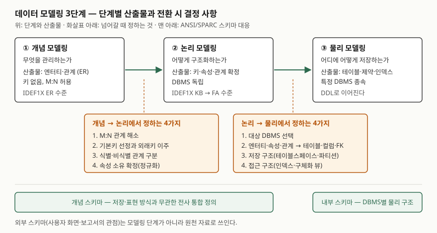

## 들어가며

데이터 모델링 3단계는 데이터베이스 과목에서 가장 기본이 되는 문항이고, 다른 문항의 배경으로도
자주 쓰인다. 실무에서는 단계가 뭉개지는 일이 흔하다. 업무 담당자와 엔터티를 합의하는 자리에
인덱스와 컬럼 타입이 먼저 올라오고, 반대로 DBMS를 바꿀 때 기준으로 삼을 DBMS 독립 모델이
없어 운영 DDL을 거꾸로 읽는다. 답안에서 점수가 갈리는 곳은 단계 이름이 아니라 **단계를 넘어갈
때 무엇이 정해지는가**다.

> 실행 검증 없음. 개념 정리 글이며 정의와 절차는 미국 연방 표준 FIPS PUB 184(IDEF1X)와
> Oracle 공식 문서를 근거로 했다.

## 정의

**데이터 모델링**은 조직이 관리할 데이터를 응용과 무관한 형태로 정의해 사용자의 검증을 받고,
이를 **물리 데이터베이스 설계로 변환**하는 과정이다. IDEF1X 표준은 목적 가운데 하나로
"사용자가 검증할 수 있고 물리 설계로 변환되는, 응용 독립적 데이터 관점을 정의하는 수단"을 든다
(FIPS 184 목적 항목 8.d).

3단계는 추상화 수준으로 나눈다.

- **개념 모델링** — 무엇을 관리하는가. 엔터티와 관계로 범위를 정한다
- **논리 모델링** — 어떻게 구조화하는가. 키와 속성을 확정하되 특정 DBMS에 묶이지 않는다.
  Oracle 문서는 논리 모델을 "구현과 무관한 전사 정보의 관점"으로 정의한다
- **물리 모델링** — 어디에 어떻게 저장하는가. 특정 DBMS의 테이블·인덱스·저장 구조로 옮긴다

## 등장 배경

IDEF1X 표준은 전통적인 시스템 구축이 데이터를 **두 관점**으로만 정의해 왔다고 적는다.
보고서·화면으로 본 사용자 관점(외부 스키마)과, 파일 구조로 본 컴퓨터 관점(내부 스키마)이다.
이 둘을 응용마다 따로 정의하다 보니 **같은 데이터가 중복되고 서로 어긋나게** 정의됐다.
DBMS를 도입해도 정의의 일관성은 보장되지 않았다(부속서 A2.2 세 스키마 개념).

ANSI/X3/SPARC 연구 그룹은 여기에 세 번째 관점, **개념 스키마**가 필요하다고 결론냈다. 어느 한
응용에도 치우치지 않고 저장·접근 방식과 무관한 **전사 통합 정의**다. 개념·논리 모델링은 이
개념 스키마를 만드는 작업이고, 물리 모델링은 그것을 DBMS의 내부 스키마로 옮기는 작업이다.

## 구성요소 — 3단계와 전환 결정 8가지

| 단계 | 답하는 질문 | 산출물 | 근거 |
|---|---|---|---|
| **① 개념** | 무엇을 관리하는가 | 엔터티와 관계. 키 없음, M:N 관계 허용 | IDEF1X ER 수준(3.10.1) |
| **② 논리** | 어떻게 구조화하는가 | 기본키·외래키·대체키, 식별/비식별 관계, 모든 비키 속성 | IDEF1X KB·FA 수준(3.10.1) |
| **③ 물리** | 어디에 어떻게 저장하는가 | 테이블·컬럼·제약, 테이블스페이스·파티션·인덱스 | Oracle DW 안내서 3.2절 |

**개념 → 논리에서 정하는 4가지.** IDEF1X는 ER 수준에 키를 두지 못하게 하고, 키 기반(KB) 수준부터
키를 요구한다. 그 사이에서 정해지는 것이 다음 넷이다.

1. **M:N 관계 해소** — KB 수준에서는 비특정(다대다) 관계가 금지되고 특정 관계로 바꿔야 한다(3.7.3).
   Oracle Data Modeler도 N:M 관계를 참조 테이블로 옮긴다
2. **기본키 선정과 외래키 이주** — 부모의 기본키가 자식으로 옮겨 가 외래키가 된다(3.9.1)
3. **식별·비식별 관계 구분** — 옮겨 온 키가 자식 기본키에 전부 들어가면 식별 관계다
4. **속성 소유 확정** — 속성마다 주인 엔터티를 하나로 정한다. 표준의 완전 함수 종속 규칙과
   이행 종속 금지 규칙은 각각 **2NF·3NF와 같다**고 표준이 적는다(부속서 A3.5)

**논리 → 물리에서 정하는 4가지.**

1. **대상 DBMS 선택** — 물리 모델은 DBMS 종류마다 따로 만든다. Data Modeler는 논리 모델 하나에
   관계형 모델 여럿, 관계형 모델 하나에 물리 모델 여럿을 둔다(1.3.1)
2. **이름 대응** — 엔터티는 테이블, 관계는 외래키 제약, 속성은 컬럼, 주식별자는 기본키 제약,
   식별자는 유일키 제약으로 옮긴다(Oracle DW 안내서 3.2절)
3. **저장 구조** — 테이블스페이스, 테이블·인덱스 파티션
4. **접근 구조** — 인덱스, 뷰, 구체화 뷰(materialized view)

## 도식

> **출처**: 단계별 산출물은 [FIPS PUB 184 IDEF1X §3.10 View Levels](https://www.idef.com/wp-content/uploads/2016/02/Idef1x.pdf),
> 개념→논리 결정은 같은 문서 §3.7.3·§3.9.1·부속서 A3.5, 스키마 대응은 부속서 A2.2 The Three Schema Concept,
> 논리→물리 결정은 [Oracle Database 19c Data Warehousing Guide §3.2 About Physical Design](https://docs.oracle.com/en/database/oracle/oracle-database/19/dwhsg/data-warehouse-physical-design.html#GUID-A04E2DCB-B5E4-43CD-8D24-37AD690667E7)
> 을 따랐다.

답안지에는 위쪽 세 칸을 화살표로 잇고, 화살표 아래에 **"4가지 + 4가지"** 두 상자를 그린다.
맨 아래 두 칸은 비교 문항이 나올 때만 덧붙인다.

## 비교 — 모델링 3단계와 ANSI/SPARC 3층 스키마

둘 다 "3"이고 "개념"이라는 말을 함께 써서 가장 자주 섞인다. 모델링 3단계는 **시간 순서로 밟는
작업 단계**이고, ANSI/SPARC 3층은 **완성된 DB에 동시에 존재하는 세 관점**이다.

| 구분 | 모델링 3단계 | ANSI/SPARC 3층 스키마 |
|---|---|---|
| 성격 | 설계 작업의 순서 | DB 구조를 보는 관점 |
| 구성 | 개념 → 논리 → 물리 | 외부 · 개념 · 내부 |
| "개념"의 뜻 | 키 없는 첫 단계 모델 | 저장·표현과 무관한 전사 통합 정의 |
| 대응 | 개념·논리 모두 개념 스키마를 만든다 | 물리 모델은 내부 스키마에 대응한다 |
| 외부 관점 | 단계에 없다. 보고서·화면을 원천 자료로 쓴다 | 외부 스키마로 존재한다 |

IDEF1X는 ER·KB·FA 세 수준을 모두 **"개념 스키마 수준"**이라 부른다(3.10). 수험서의 개념 모델과
논리 모델이 표준에서는 둘 다 개념 스키마라는 뜻이다. 용어도 자료마다 다르다.

| 수험서 3단계 | IDEF1X | Oracle Data Modeler |
|---|---|---|
| 개념 | ER 수준 (Phase 1~2) | 논리 모델 |
| 논리 | KB 수준 (Phase 3) → FA 수준 (Phase 4) | 논리 모델 + 관계형 모델 |
| 물리 | 표준 범위 밖 (표기법만 비공식적으로 빌려 쓴다) | 물리 모델 (DBMS별) |

IDEF1X는 절차를 **Phase 0~4, 5단계**로 둔다. 0 착수, 1 엔터티 정의, 2 관계 정의, 3 키 정의,
4 속성 정의다(부속서 A3). Oracle Data Modeler는 개념 모델을 따로 두지 않고, 논리 모델과 물리 모델
사이에 **관계형 모델**(테이블·컬럼, DBMS 독립)을 한 층 더 둔다.

## 적용 시 고려사항 — 4가지

- **개념 단계에서는 키를 그리지 않는다.** IDEF1X는 ER 수준에 기본키·외래키를 두지 못하게 한다.
  이 단계의 산출물은 업무 전문가가 검토하는 것이고, 표준은 단계마다 검토 묶음(kit)을 만들어
  전문가의 의견을 받게 한다(부속서 A4.2). 키와 타입이 섞이면 검토자가 볼 것이 흐려진다.
- **M:N 관계는 논리 단계에서 반드시 푼다.** KB 수준의 금지 규칙이다. 표준은 두 엔터티의 공통 자식이 되는
  세 번째 엔터티를 넣어 풀고, 이를 교차(intersection)·연관(associative) 엔터티라 부른다(3.7.1). 이 엔터티는
  자체 속성(배정일, 역할 등)을 가질 수 있으므로, 물리 단계에서 기계적으로 테이블을 만들기 전에
  논리 단계에서 엔터티로 정의해 둔다.
- **논리 모델을 DBMS와 떼어 유지한다.** 물리 설계는 주로 **질의 성능과 유지보수**가 이끈다고 Oracle 문서가
  적는다(DW 안내서 3.1절). 같은 논리 모델에서 DBMS별 물리 모델을 여럿 만들 수 있으므로, DBMS 이관이나 개발·운영
  환경 분리 때 논리 모델이 공통 원본이 된다.
- **모델은 원천 자료로 되짚을 수 있어야 한다.** 표준은 보고서(외부 스키마)와 파일 정의(내부 스키마)를
  원천 자료로 모으되, 완성된 모델이 그 원천으로 다시 대응돼야 한다고 적는다(부속서 A3.1.4).
  기존 시스템을 역공학할 때는 이 방향으로 읽는다.

## 정리

암기 단서는 **"무엇 · 어떻게 구조 · 어디 저장"과 "4 + 4"**다.

- 개념 **무엇** — 엔터티·관계, 키 없음 (IDEF1X ER 수준)
- 논리 **어떻게 구조** — 키·속성·정규화, DBMS 독립 (KB → FA 수준)
- 물리 **어디 저장** — 테이블·제약·인덱스·파티션, DBMS 종속
- 개념→논리 **4가지**: M:N 해소, 키 이주, 식별/비식별, 속성 소유(2NF·3NF)
- 논리→물리 **4가지**: DBMS 선택, 이름 대응, 저장 구조, 접근 구조
- ANSI/SPARC 3층(외부·개념·내부)은 작업 단계가 아니라 관점이다

> 개념 정리: [정규화 1NF부터 BCNF까지](../2026-09-23-normalization-1nf-to-bcnf/index.md)

## 참고 자료

- [NIST, FIPS PUB 184 — Integration Definition for Information Modeling (IDEF1X), 1993](https://www.idef.com/wp-content/uploads/2016/02/Idef1x.pdf) — 목적 항목 8.d, §2.59 세 스키마 정의, §3.7.3 비특정 관계 규칙, §3.9.1 외래키, §3.10 View Levels(ER·KB·FA), 부속서 A2.2 세 스키마 개념, A3 Phase 0~4, A3.5 속성 규칙과 2NF·3NF, A4.2 검토 묶음 (IDEF 사이트 게재본)
- [ISO/IEC/IEEE 31320-2:2012 — Syntax and Semantics for IDEF1X97](https://www.iso.org/standard/60614.html) — FIPS 184를 이어받은 국제 표준. key-style 언어가 FIPS 184와 하위 호환된다. 표준 원문은 유료라 확인하지 못했다
- [Oracle SQL Developer Data Modeler 23.1 User's Guide — Data Modeler Concepts and Usage](https://docs.oracle.com/en/database/oracle/sql-developer-data-modeler/23.1/dmdug/data-modeler-concepts-usage.html) — §1.3.1 설계 구성(논리 1 · 관계형 N · 물리 N), §1.3.4 논리 모델, §1.3.4.6 N:M 관계의 참조 테이블 대응, §1.3.6 물리 모델
- [Oracle Database 19c Data Warehousing Guide — §3.2 About Physical Design](https://docs.oracle.com/en/database/oracle/oracle-database/19/dwhsg/data-warehouse-physical-design.html#GUID-A04E2DCB-B5E4-43CD-8D24-37AD690667E7) — 논리 요소를 테이블·제약·컬럼으로 옮기는 대응과 물리 설계가 만드는 구조. 물리 설계를 이끄는 요인(질의 성능·유지보수)은 같은 장의 §3.1 Moving from Logical to Physical Design
