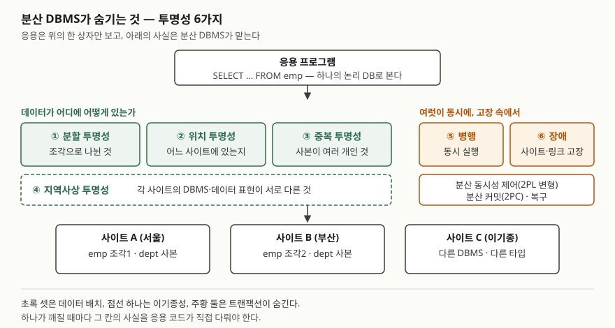

## 들어가며

분산 데이터베이스는 데이터베이스 과목의 단골 주제이고, 그중 "투명성의 종류를 쓰라"는 문항이
가장 자주 나온다. 실무에서도 같은 문제가 이름만 바꿔 돌아온다. 샤딩한 테이블을 조회하는
코드가 샤드 번호를 알아야 하는지, 읽기 복제본으로 보낸 질의가 방금 쓴 값을 못 보는 것을
누가 책임지는지가 전부 투명성의 문제다. 답안에서 점수가 갈리는 곳은 이름 여섯 개를 외웠느냐가
아니라, **각 투명성이 무엇을 누구에게서 숨기는지**를 쓸 수 있느냐다.

> 실행 검증 없음. 개념 정리 글이며 정의와 분류는 Özsu·Valduriez(1991) 논문, RM-ODP 표준을
> 소개한 Vallecillo의 논문, Oracle Database 공식 문서를 근거로 했다.

## 정의

**분산 데이터베이스**는 컴퓨터 네트워크에 흩어져 있으면서 논리적으로 서로 연관된 여러
데이터베이스의 모음이고, **분산 DBMS**는 이것을 관리하면서 **분산 사실을 사용자에게 투명하게
만드는** 소프트웨어다(Özsu·Valduriez 1991, 2절). Oracle 문서는 같은 것을 응용에게 **하나의 데이터
원천으로 보이는** 데이터베이스 집합으로 정의한다.

**투명성**은 시스템의 상위 의미를 하위 구현 문제와 분리하는 것이다. 분산 DBMS에서는 데이터가
여러 사이트에 나뉘고 복제되어 있어도 사용자가 **하나로 통합된 중앙 집중 DB처럼 접근**하게 하는
성질을 말한다(같은 논문 3.1절).

## 등장 배경

중앙 집중 DBMS는 데이터 정의와 관리를 응용 밖으로 빼내 **데이터 독립성**을 얻었다. 데이터의 논리·
물리 구조가 바뀌어도 응용 프로그램은 영향을 받지 않는다. 분산 DB 기술은 이 데이터 독립성을
**데이터가 네트워크로 연결된 여러 기계에 분산·복제된 환경까지 넓히려는** 것이고, 그 수단이
여러 형태의 투명성이다(Özsu·Valduriez 3.1절).

분산은 중앙 집중에 없던 사실을 새로 만든다. 데이터가 조각나고, 여러 곳에 있고, 사본이 생기고,
사이트마다 DBMS가 다를 수 있고, 한 곳이 고장 나도 나머지는 돈다. RM-ODP는 이런 걱정거리를
응용 설계에서 직접 풀 수도 있고, 표준 메커니즘에 맡길 수도 있다고 적는다. 맡기면 응용 설계자는
**그 걱정거리가 보이지 않는 세계**에서 일하게 되고, 그 메커니즘을 "분산 투명성을 제공한다"고
부른다(Vallecillo, 2.2.3절).

## 구성요소 — 투명성 6가지

국내 수험서가 묶는 6가지를 기준으로 쓴다. 이 6가지를 한 번에 제시한 1차 자료는 찾지 못했다.
각 항목의 근거는 표의 마지막 열에 따로 적었다.

| 투명성 | 숨기는 사실 | 깨지면 응용이 떠안는 일 | 근거 |
|---|---|---|---|
| **① 분할** | 테이블이 수평·수직 조각으로 나뉘어 있다 | 조각마다 질의를 따로 쓰고 결과를 합친다. 분할 기준이 바뀌면 코드를 고친다 | Özsu·Valduriez 3.1절 |
| **② 위치** | 데이터가 어느 사이트에 있다 | 사이트 이름을 코드에 적는다. 객체를 옮기면 응용을 고친다 | Özsu·Valduriez 3.1절(네트워크 투명성), Oracle 위치 투명성 |
| **③ 중복** | 같은 데이터의 사본이 여러 개다 | 어느 사본을 읽을지 고르고, 갱신을 모든 사본에 전파한다 | Özsu·Valduriez 3.1절, RM-ODP 복제 투명성 |
| **④ 지역사상** | 사이트마다 DBMS와 데이터 표현이 다르다 | 사이트별 SQL 방언과 타입 변환을 직접 처리한다 | RM-ODP 접근 투명성, Oracle 이기종 분산 DB |
| **⑤ 병행** | 여러 트랜잭션이 여러 사이트에서 동시에 돈다 | 사이트 사이의 잠금 순서와 충돌을 직접 조정한다 | Özsu·Valduriez 3.2절 |
| **⑥ 장애** | 사이트나 링크가 도중에 고장 날 수 있다 | 일부 사이트만 반영된 결과를 찾아 되돌리는 보상 로직을 짠다 | Özsu·Valduriez 3.2절, RM-ODP 장애 투명성, Oracle COMMIT 투명성 |

①~③은 **데이터를 어디에 어떻게 놓았는가**를 숨긴다. Özsu·Valduriez는 이 셋(네트워크·복제·분할)을
분산 환경에서 데이터 독립성을 주는 투명성으로 든다. 네트워크 투명성은 명칭 체계로 운영체제가
도울 수 있고 복제 투명성도 운영체제가 거들 수 있지만, **분할 투명성은 분산 DBMS의 몫**이라고 적는다.

④는 **이기종성**을 숨긴다. RM-ODP의 접근 투명성은 데이터 표현과 호출 방식의 차이를 가려
이기종 객체끼리 함께 동작하게 하는 것이다. Oracle 문서는 비 Oracle DB가 섞인 이기종 분산 DB가
응용에게는 **하나의 로컬 Oracle DB로 보이며**, 로컬 서버가 데이터의 분산과 이기종성을 숨긴다고 적는다.
수험서의 "지역사상"이라는 이름은 이 성질을 가리킨다.

⑤·⑥은 **트랜잭션**이 숨긴다. Özsu·Valduriez는 트랜잭션이 동시에 실행돼도 일관성을 지키는 성질을
병행 투명성, 장애가 나도 원자적으로 끝나는 성질을 장애 원자성이라 부른다. 사용자는 개별 로컬 DB
접근을 조정하거나 사이트·링크 장애를 걱정할 필요가 없다. 이것을 떠받치는 장치가 분산 동시성
제어(2단계 잠금의 변형)와 분산 커밋(2단계 커밋, 2PC)이다.

## 도식

> **출처**: ①~③의 묶음과 분산 DBMS의 역할은 [M. T. Özsu, P. Valduriez, *Distributed Database Systems: Where Are We Now?*, IEEE Computer 24(8), 1991 — 3.1 Transparent Management of Distributed and Replicated Data](https://cs.uwaterloo.ca/~tozsu/publications/distdb/short.pdf),
> ⑤·⑥과 2PL·2PC는 같은 논문의 3.2 Reliability Through Distributed Transactions,
> ④는 [Oracle Database 19c 관리자 안내서 — Heterogeneous Distributed Database Systems](https://docs.oracle.com/en/database/oracle/oracle-database/19/admin/distributed-database-concepts.html#GUID-15334E5B-01E7-46E6-99AA-FAC1BB9487C7)
> 를 따랐다. 사이트 구성은 설명용 예시다.

답안지에는 위쪽 응용 상자 하나, 가운데 투명성 여섯 칸, 아래 사이트 세 칸만 그리면 된다.
가운데 칸을 **배치 3 · 이기종 1 · 트랜잭션 2**로 나눠 그리면 채점자가 개수를 바로 센다.

## 비교 — 출처마다 다른 분류

같은 개념을 자료마다 다르게 묶는다. 시험에서는 6가지로 쓰되, 원 분류가 따로 있다는 것을 알면
"투명성의 종류"를 묻는 변형 문항에도 대응할 수 있다.

| 6가지 | Özsu·Valduriez (1991) | RM-ODP (ISO/IEC 10746) | Oracle 문서 |
|---|---|---|---|
| ① 분할 | 분할 투명성 | 해당 없음 | — |
| ② 위치 | 네트워크(분산) 투명성 | 위치·이주·재배치 투명성 | 위치 투명성(동의어·뷰·프로시저) |
| ③ 중복 | 복제 투명성 | 복제 투명성 | 복제 투명성 |
| ④ 지역사상 | — | 접근 투명성 | 이기종 분산 DB가 하나의 로컬 DB로 보임 |
| ⑤ 병행 | 병행 투명성 | 트랜잭션 투명성 | SQL·COMMIT 투명성 |
| ⑥ 장애 | 장애 원자성 | 장애 투명성 | SQL·COMMIT 투명성(2PC, 자동 해결) |
| — | — | 영속성 투명성 | — |

RM-ODP는 데이터베이스가 아니라 **분산 처리 전반**의 참조 모델이라 "분할"이 없고, 대신 객체가 옮겨
다니는 경우를 이주·재배치로 나눈다. Oracle 문서는 표준 SQL 문장과 `COMMIT`·`ROLLBACK`이 분산 환경에서도
그대로 동작하는 것을 한 항목으로 묶고, 커밋 도중 장애가 나도 복구 뒤 모든 노드가 같이 커밋하거나
같이 롤백한다고 적는다. ⑤와 ⑥이 제품에서는 하나의 장치로 구현된다는 뜻이다.

## 적용 시 고려사항 — 4가지

- **완전한 투명성이 늘 목표는 아니다.** Özsu·Valduriez는 Gray(1989)의 반론을 인용한다. 지리적으로
  떨어진 DB에 투명하게 접근하도록 짠 응용은 관리성·모듈성·메시지 성능이 나쁘다는 것이다. Gray는
  사용자가 특정 DBMS에 요청을 보내는 원격 호출 방식을 제안했다. 저자들은 관리가 어려워진다는 데는
  동의하면서도, 그 책임은 응용이 아니라 분산 DBMS가 져야 한다고 본다. **투명성을 어디까지 줄지는
  성능과 개발 부담 사이의 선택이다.**
- **위치 투명성은 이름 한 겹으로 만든다.** Oracle 문서는 동의어·뷰·저장 프로시저로 원격 객체의
  위치를 숨기면, 관리자가 객체를 옮겨도 사용자와 기존 응용에 영향이 없다고 적는다. 반대로 원격 DB
  링크 이름을 SQL에 직접 적으면 그 순간 ②가 깨지고, 객체를 옮길 때마다 응용 배포가 따라간다.
- **중복 투명성은 갱신 비용과 맞바꾼다.** 복제는 한 사이트가 멈춰도 다른 사본으로 읽게 해 가용성을
  높인다(Özsu·Valduriez 3.2절). 그러나 사본을 모두 맞춰 두려면 갱신이 모든 사본에 가야 한다.
  사본 전파를 비동기로 풀면 방금 쓴 값을 다른 사본에서 못 읽는 순간이 생기고, 그 틈은 응용이 안다.
- **장애 투명성은 2PC에 기대고, 2PC는 자율성과 부딪친다.** Oracle 문서는 사이트 자율성을 각 서버가
  다른 DB와 독립적으로 관리되는 것으로 정의한다. 한편 2PC는 참여한 모든 서버가 같이 커밋하거나 같이
  롤백하도록 묶는다. 커밋 도중 장애로 결과가 정해지지 않은(in-doubt) 트랜잭션이 생기면, 복구 프로세스가
  해결할 때까지 그 데이터는 **읽기와 쓰기 모두 잠긴다**고 같은 문서가 적는다. 장애를 응용에게서
  숨기는 대가로, 다른 사이트의 고장이 이 사이트의 데이터 사용을 막는 것이다.

## 정리

암기 단서는 **"배치 3 · 이기종 1 · 트랜잭션 2 = 6"**이다.

- 배치 **3가지** — ① 분할, ② 위치, ③ 중복. 데이터 독립성을 분산 환경으로 넓힌 것이다
- 이기종 **1가지** — ④ 지역사상. 사이트마다 다른 DBMS와 표현을 숨긴다
- 트랜잭션 **2가지** — ⑤ 병행, ⑥ 장애. 분산 동시성 제어와 2PC가 떠받친다
- 투명성 하나가 깨지면 **그 칸의 사실을 응용 코드가 떠안는다.** 답안의 각 항목에 "깨지면"을
  한 줄씩 붙이면 정의 나열보다 점수가 난다
- 분류는 출처마다 다르다. RM-ODP는 8가지(접근·장애·위치·이주·재배치·복제·영속성·트랜잭션)다

## 참고 자료

- [M. T. Özsu, P. Valduriez, *Distributed Database Systems: Where Are We Now?*, IEEE Computer 24(8), 1991](https://cs.uwaterloo.ca/~tozsu/publications/distdb/short.pdf) — 2절 분산 DB와 분산 DBMS의 정의, 3.1절 네트워크·복제·분할 투명성과 Gray의 반론, 3.2절 병행 투명성·장애 원자성·2PL·2PC (저자 사이트 게재본)
- [A. Vallecillo, *RM-ODP: The ISO Reference Model for Open Distributed Processing*](https://www2.isye.gatech.edu/~lfm/8851/Sources/RefModels/RM-ODP.pdf) — 2.2.3 Distribution transparencies: RM-ODP(ISO/IEC 10746-3, ITU-T X.903)의 투명성 8가지 요약. 표준 원문은 확인하지 못했다
- [Oracle Database 19c 관리자 안내서 — Distributed Database Concepts](https://docs.oracle.com/en/database/oracle/oracle-database/19/admin/distributed-database-concepts.html#GUID-15334E5B-01E7-46E6-99AA-FAC1BB9487C7) — 분산 DB의 정의, 이기종 분산 DB가 하나의 로컬 DB로 보이는 방식, 사이트 자율성, 2단계 커밋
- [Oracle Database 19c 관리자 안내서 — Distributed Transactions Concepts: About In-Doubt Transactions](https://docs.oracle.com/en/database/oracle/oracle-database/19/admin/distributed-transactions-concepts.html#GUID-364CA7BD-A02E-4A74-AF72-45021CAC3E3C) — 결과가 정해지지 않은 분산 트랜잭션의 데이터가 해결 전까지 읽기·쓰기 모두 잠긴다는 설명
- [Oracle Database 11g Release 2 관리자 안내서 — Transparency in a Distributed Database System](https://docs.oracle.com/html/E25494_01/ds_concepts005.htm#i1009082) — 위치 투명성(동의어·뷰·프로시저)과 SQL·COMMIT 투명성. 19c 문서에서 해당 절을 확인하지 못해 11g R2판을 인용한다
