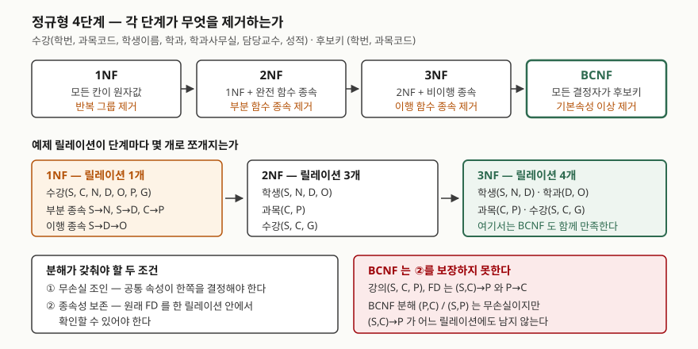

## 들어가며

시험에서 정규화는 두 가지 형태로 나온다. 하나는 "제3정규형을 정의하고 예를 들어 설명하시오"
같은 정의형이고, 다른 하나는 릴레이션과 함수 종속을 주고 "어느 정규형까지 만족하는지
판정하고 BCNF까지 분해하시오"라는 계산형이다. 앞쪽은 외워서 쓰지만 뒤쪽은 외워서 못 쓴다.

실무에서도 같은 판단을 한다. 테이블 하나에 담았던 것을 몇 개로 쪼갤지, 쪼개면 조인 비용이
얼마나 늘지를 정할 때 쓰는 기준이 정규형이다. 정의만 외운 상태로는 "이 컬럼이 왜 여기
있으면 안 되는가"를 설명할 수 없다.

각 정규형이 **어떤 함수 종속을 제거하는가**로 정리하면 정의형과 계산형이 한꺼번에 풀린다.
아래 내용은 함수 종속 계산과 SQLite 실행으로 직접 검산했다.

## 정의

- **함수 종속(FD)** — 릴레이션 R의 속성 집합 X, Y에 대해 X의 값이 같은 두 튜플은 Y의 값도
  항상 같을 때 `X → Y`로 쓰고 "Y가 X에 함수적으로 종속한다"고 한다. X를 **결정자**라 한다.
- **제1정규형(1NF)** — 모든 속성의 도메인이 원자값만 갖는 릴레이션. Codd가 1970년 논문에서
  관계 모델의 전제로 제시한 형태다.
- **제2정규형(2NF)** — 1NF이면서, 모든 **비기본속성**이 각 후보키에 **완전 함수 종속**하는
  릴레이션. 후보키의 일부에만 종속하는 부분 함수 종속이 없다.
- **제3정규형(3NF)** — 2NF이면서, 모든 비기본속성이 각 후보키에 **이행적으로 종속하지 않는**
  릴레이션. 2NF·3NF는 Codd가 1971년에 정의했다.
- **보이스-코드 정규형(BCNF)** — 릴레이션의 **모든 자명하지 않은 함수 종속의 결정자가
  후보키**인 릴레이션. 3NF가 비기본속성만 따지느라 놓치는 경우를 막는다.

**기본속성**은 어느 후보키에든 속하는 속성, **비기본속성**은 어느 후보키에도 속하지 않는
속성이다. 이 구분이 3NF와 BCNF를 가른다.

## 등장 배경

1NF만 만족하는 릴레이션은 같은 사실을 여러 행에 중복해 담는다. 그래서 세 가지 이상현상이
생긴다. Codd가 2NF·3NF를 정의한 목적이 이 셋을 없애는 것이었다.

예제 릴레이션으로 직접 확인했다. `수강(학번 S, 과목코드 C, 학생이름 N, 학과 D, 학과사무실 O,
담당교수 P, 성적 G)`에 5행을 넣고 돌린 결과다.

```text
갱신 이상: 컴퓨터학과 사무실 한 곳을 옮기면 고쳐야 할 행 4개
  1행만 고치자 컴퓨터학과 사무실이 둘로 갈렸다: [('3층 301호',), ('5층 501호',)]
삭제 이상: 박도윤의 수강 1건을 지우자 전자학과가 남은 행 0개
삽입 이상: 수강 과목 없는 학생 등록 -> IntegrityError: NOT NULL constraint failed: enrollment.course_id
```

- **갱신 이상** — 학과사무실이 4행에 중복돼 있어 한 행만 고치면 값이 갈린다
- **삭제 이상** — 마지막 수강 기록을 지우면 학과 정보까지 함께 사라진다
- **삽입 이상** — 아직 수강 과목이 없는 학생은 기본키의 일부가 비어 등록할 수 없다

## 구성요소 / 절차 — 4단계

각 정규형이 제거하는 함수 종속은 다음 **4가지**다.

| 단계 | 제거 대상 | 판정 기준 |
|---|---|---|
| 1NF | 반복 그룹·다치 속성 | 모든 칸이 원자값인가 |
| 2NF | 부분 함수 종속 | 비기본속성이 후보키 **전체**에 종속하는가 |
| 3NF | 이행 함수 종속 | 비기본속성이 다른 비기본속성을 거쳐 종속하지 않는가 |
| BCNF | 결정자가 후보키가 아닌 종속 | **모든** 결정자가 후보키인가 |

분해할 때 지켜야 할 조건은 **2가지**다.

1. **무손실 조인 분해** — 쪼갠 릴레이션을 다시 조인하면 원래 릴레이션이 나와야 한다.
   두 조각으로 나눌 때는 Heath의 조건으로 판정한다. 공통 속성이 어느 한쪽 전체를 결정하면
   무손실이다.
2. **종속성 보존** — 원래 함수 종속을 릴레이션 하나 안에서 확인할 수 있어야 한다.
   깨지면 제약을 응용에서 검사하거나 조인해 가며 확인해야 한다.

## 도식



> **출처**: 1NF는 E. F. Codd, "A Relational Model of Data for Large Shared Data Banks",
> [CACM 13(6), 1970](https://dl.acm.org/doi/10.1145/362384.362685). 2NF·3NF는 E. F. Codd,
> "Normalized Data Base Structure: A Brief Tutorial",
> [ACM SIGFIDET Workshop, 1971](https://dl.acm.org/doi/10.1145/1734714.1734716).
> 무손실 분해 조건은 I. J. Heath, "Unacceptable File Operations in a Relational Data Base",
> [같은 워크숍, 1971](https://dl.acm.org/doi/10.1145/1734714.1734717). BCNF는 E. F. Codd,
> "Recent Investigations in Relational Data Base Systems", IFIP Congress, 1974에서 정의됐다.
> 그림의 릴레이션 개수(1 → 3 → 4)와 BCNF 분해에서 `(S,C) → P`가 사라진다는 것은
> 아래 판정 결과에서 나온 값이다.

## 검산 — 정규형 판정과 분해

함수 종속 집합에서 속성 폐포와 후보키를 계산해 위반을 찾았다. 전체 소스:
[`code/normal_forms.py`](code/normal_forms.py), 실행 기록: [`code/output.txt`](code/output.txt)

```text
--- 정규화 전 수강 (CDGNOPS) ---
  FD  C -> P / D -> O / S -> N / S -> D / CS -> G
  후보키   ['CS']
  기본속성 CS · 비기본속성 DGNOP
  2NF 위반(부분 함수 종속)      ['C -> P', 'S -> N', 'S -> D']
  3NF 위반(이행 함수 종속)      ['D -> O']
  BCNF 위반(결정자가 비 슈퍼키) ['C -> P', 'D -> O', 'S -> N', 'S -> D']
```

후보키가 `(학번, 과목코드)`이므로 `학번 → 이름`과 `과목코드 → 담당교수`는 후보키의 일부에만
종속하는 **부분 함수 종속**이다. `학과 → 학과사무실`은 `학번 → 학과 → 학과사무실`을 타는
**이행 함수 종속**이다.

2NF로 분해하면 `학생(S,N,D,O)` · `과목(C,P)` · `수강(S,C,G)` 세 개가 된다. 여기서
**학생 릴레이션은 여전히 3NF를 위반한다.**

```text
--- 학생 (DNOS) ---
  2NF 위반(부분 함수 종속)      없음
  3NF 위반(이행 함수 종속)      ['D -> O']
```

`학생(S,N,D)` · `학과(D,O)`로 한 번 더 쪼개면 네 릴레이션 모두 3NF와 BCNF를 동시에 만족한다.
분해는 두 번 다 무손실이고, 종속성도 모두 보존됐다.

## 비교 — 3NF와 BCNF는 어디서 갈리는가

3NF는 **비기본속성**의 이행 종속만 막는다. 그래서 결정자가 후보키가 아닌데 우변이
기본속성이면 3NF는 통과한다. 이것이 시험에서 가장 자주 묻는 지점이다.

`강의(학생 S, 과목 C, 교수 P)`에 `(S,C) → P`와 `P → C`가 성립한다고 하자.
교수 한 명이 과목 하나만 맡는 상황이다.

```text
--- 강의 (CPS) ---
  후보키   ['CS', 'PS']
  기본속성 CPS · 비기본속성 (없음)
  2NF 위반(부분 함수 종속)      없음
  3NF 위반(이행 함수 종속)      없음
  BCNF 위반(결정자가 비 슈퍼키) ['P -> C']
```

비기본속성이 하나도 없으므로 2NF·3NF는 자동으로 만족한다. 그런데 `P → C`의 결정자 `P`는
후보키가 아니다. BCNF만 이것을 잡아낸다.

| 항목 | 3NF | BCNF |
|---|---|---|
| 판정 대상 | 비기본속성의 종속만 | 모든 자명하지 않은 종속 |
| 결정자 조건 | 후보키이거나, 우변이 기본속성이면 통과 | 반드시 후보키 |
| 무손실 분해 | 항상 가능 | 항상 가능 |
| 종속성 보존 | 항상 가능 | **보장되지 않는다** |
| 위 예제 판정 | 만족 | 위반 (`P → C`) |

여기서 BCNF의 대가가 드러난다. `(P,C)` / `(S,P)`로 분해하면 무손실이지만 원래 종속
`(S,C) → P`가 어느 릴레이션에도 남지 않는다.

```text
=== BCNF 분해 ===
  CP / PS  공통 P -> 폐포 CP  [무손실]
  종속성 보존: 깨진 FD ['CS -> P']
```

분해 뒤에는 "한 학생이 한 과목에서 교수를 한 명만 갖는다"를 두 릴레이션을 조인하지 않고는
확인할 수 없다. **3NF는 무손실과 종속성 보존을 둘 다 항상 얻을 수 있지만, BCNF는 종속성
보존을 포기해야 하는 경우가 있다.** 실무에서 3NF까지만 하고 멈추는 근거가 이것이다.

## 적용 시 고려사항

1. **어디까지 정규화할지는 갱신 빈도로 정한다.** 갱신이 잦은 마스터성 데이터는 중복이
   곧 불일치이므로 3NF 이상으로 간다. 거의 읽기만 하는 이력·로그성 데이터는 조인 비용이
   더 비싸므로 의도적으로 반정규화한다. **반정규화는 정규화를 안 한 것과 다르다.**
   정규형을 알고 깬 뒤 중복을 유지할 장치(트리거·배치·제약)를 함께 두는 것이다.
2. **BCNF로 올릴지는 종속성 보존을 확인한 뒤 정한다.** 위 예제처럼 보존이 깨지면 제약을
   응용 코드로 옮겨야 한다. 그 비용이 중복 제거의 이득보다 크면 3NF에서 멈추는 것이 맞다.
3. **후보키를 먼저 전부 찾는다.** 후보키가 둘 이상일 때 기본속성이 늘어나고, 그러면 3NF는
   쉽게 통과하면서 BCNF만 위반하는 상황이 생긴다. 후보키를 하나로 단정하면 이 경우를 놓친다.
4. **정규화는 함수 종속까지만 다룬다.** 다치 종속으로 생기는 중복은 4NF, 조인 종속은 5NF의
   영역이다. 함수 종속만 보고 "더 쪼갤 것이 없다"고 결론 내리지 않는다.
5. **분해할 때마다 무손실인지 확인한다.** 공통 속성이 어느 한쪽을 결정하지 못하면 다시
   조인했을 때 원래 없던 튜플이 생긴다. 이건 성능 문제가 아니라 데이터가 틀리는 문제다.

## 정리

- 정규형은 **제거하는 함수 종속**으로 외운다. 1NF 반복 그룹 → 2NF 부분 종속 →
  3NF 이행 종속 → BCNF 결정자 조건.
- 두문자: **"원·부·이·결"** (원자값 · 부분 종속 · 이행 종속 · 결정자).
- 이상현상은 **3가지**다. 삽입·갱신·삭제. 셋 다 같은 원인, 같은 사실의 중복 저장에서 온다.
- 분해 조건은 **2가지**다. 무손실 조인과 종속성 보존. 3NF는 둘 다 얻을 수 있고,
  **BCNF는 종속성 보존이 보장되지 않는다.**
- 3NF와 BCNF의 차이는 **비기본속성만 보느냐 전부 보느냐**다. 후보키가 여럿이고 서로 겹칠 때
  둘의 판정이 갈린다.

## 참고 자료

- E. F. Codd, "A Relational Model of Data for Large Shared Data Banks", [CACM 13(6), 1970](https://dl.acm.org/doi/10.1145/362384.362685) — 관계 모델과 정규화된 형태(1NF)를 제시한 원 논문
- E. F. Codd, "Normalized Data Base Structure: A Brief Tutorial", [ACM SIGFIDET Workshop, 1971](https://dl.acm.org/doi/10.1145/1734714.1734716) — 2NF·3NF의 정의와 삽입·갱신·삭제 이상을 없애려는 목적
- I. J. Heath, "Unacceptable File Operations in a Relational Data Base", [ACM SIGFIDET Workshop, 1971](https://dl.acm.org/doi/10.1145/1734714.1734717) — 두 조각 분해가 무손실이 되는 조건
- W. Kent, "A Simple Guide to Five Normal Forms in Relational Database Theory", [CACM 26(2), 1983](https://www.bkent.net/Doc/simple5.htm) — 1NF~5NF를 예제 중심으로 정리한 고전. 2NF·3NF를 "키 전체에 대한 사실이어야 한다"로 요약한다
- P. A. Bernstein, "Synthesizing Third Normal Form Relations from Functional Dependencies", [ACM TODS 1(4), 1976](https://dl.acm.org/doi/10.1145/320493.320489) — 함수 종속 집합에서 종속성을 보존하는 3NF 스키마를 합성하는 알고리즘
- E. F. Codd, "Recent Investigations in Relational Data Base Systems", IFIP Congress, 1974 — BCNF가 정의된 논문
