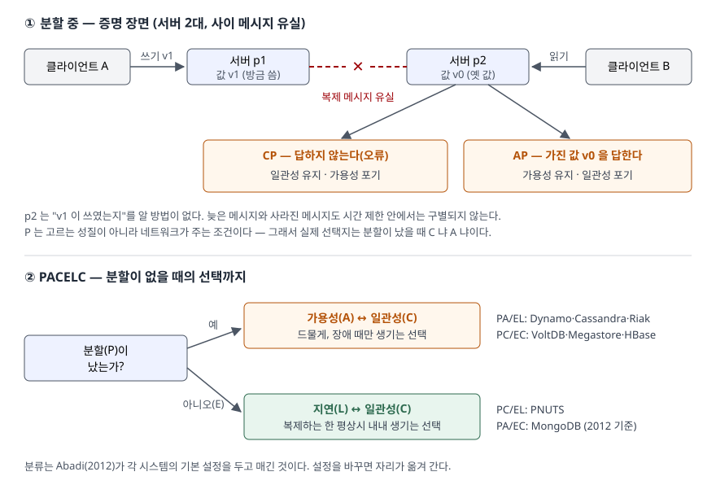

> 정의는 Brewer의 PODC 2000 기조연설 슬라이드와 Gilbert·Lynch(2012)를, BASE는 같은 슬라이드를, PACELC는 Abadi(2012)를 근거로 했다.
> 정족수 겹침과 분할 장면은 예제 코드([`code/cap_simulation.py`](code/cap_simulation.py), 실행 기록 [`code/output.txt`](code/output.txt))를
> 돌려 확인했다. 분할 장면은 논문의 증명을 코드로 옮긴 것이지 실제 DB의 측정이 아니다. 성능 수치는 싣지 않는다.

## 들어가며

분산 DB 문항에서 CAP는 "셋 중 둘만 고를 수 있다"는 한 줄로 외워지는 경우가 많다. 그러면 "CA 시스템을 고르면 된다"는
답이 나오는데, 채점에서 갈리는 곳이 바로 여기다. 네트워크로 묶인 시스템에서 P는 고를 수 있는 성질이 아니고,
그래서 실제 선택은 **분할이 났을 때 C냐 A냐**로 좁혀진다. 실무에서는 복제 DB의 쓰기 확인을 기다릴지,
읽기 복제본의 옛 값을 허용할지를 정하는 설정으로 같은 문제가 돌아온다.

## 정의

> **CAP 정리**: 통신 장애가 생길 수 있는 네트워크에서는 어떤 서비스도 원자적 읽기·쓰기 공유 메모리를
> 구현하면서 **모든 요청에 응답을 보장할 수 없다**. — Gilbert·Lynch(2012) 2절의 서술

Brewer는 2000년 PODC 기조연설에서 이것을 "공유 데이터 시스템은 일관성(C)·가용성(A)·네트워크 분할 내성(P) 중
**최대 둘**만 가질 수 있다"는 추측으로 제시했고, Gilbert·Lynch가 2002년에 증명했다.

세 성질의 뜻은 Gilbert·Lynch(2012) 2절을 따른다.

| 성질 | 뜻 | 성격 |
|---|---|---|
| **C** 일관성 | 모든 연산이 요청과 응답 사이 한 순간에 일어난 것처럼 보인다(원자적 일관성). 서버 하나가 순서대로 처리한 것과 같다 | 안전성 — 나쁜 일이 절대 일어나지 않는다 |
| **A** 가용성 | 모든 요청이 **결국** 응답을 받는다 | 활동성 — 좋은 일이 결국 일어난다 |
| **P** 분할 내성 | 서버 사이 통신이 믿을 수 없다. 메시지가 늦거나 영영 사라질 수 있다 | 시스템이 아니라 **네트워크에 대한 진술** |

**BASE**는 Brewer가 같은 연설에서 ACID의 반대편 끝으로 제시한 설계 성향이다.
**B**asically **A**vailable(기본적으로 가용), **S**oft-state(유연한 상태), **E**ventual consistency(최종 일관성)의 **3요소**다.
최종 일관성은 "새 갱신이 없으면 결국 모든 접근이 마지막 갱신 값을 돌려준다"는 약한 일관성의 한 형태다(Vogels 2008).

## 등장 배경

ACID는 단일 사이트에서 정립됐다. Brewer는 DBMS 연구가 대부분 ACID를 다루지만, 인터넷 서비스는 가용성과
성능을 위해 C와 I를 포기한다고 보고 이 맞교환이 근본적이라고 적었다. 분산 커밋(2PC)으로 ACID를 넓히면
한 사이트의 장애가 다른 사이트를 막는다([2PC 글](../2026-10-06-two-phase-commit-blocking-window/index.md)).
여러 데이터센터에 복제하는 서비스가 늘면서, **통신이 끊긴 순간 무엇을 내줄지**를 미리 정해야 했다.

## 구성요소 — 왜 P는 버릴 수 없는가

### 증명 장면 3단계

Gilbert·Lynch(2012) 2절의 증명은 세 단계로 끝난다.

1. 서버를 {p1}과 {p2, …}로 나눈다. p1에서 p2로 가는 메시지는 전부 사라진다
2. p1에 v1을 쓰고 ok를 받는다. 이어서 p2에 읽기가 온다
3. p2는 쓰기가 있었는지 알 수 없다. **답하지 않거나(A 포기) 옛 값을 답한다(C 포기)**

예제의 2부가 이 장면을 그대로 옮긴 것이다.

```text
[CP] 분할 중 p1 에 v1 쓰기 → 응답 없음 (오류 반환)  (p1=v0, p2=v0)
[CP] 분할 중 p2 읽기 → 응답 없음 (오류 반환)
[AP] 분할 중 p1 에 v1 쓰기 → ok  (p1=v1, p2=v0)
[AP] 분할 중 p2 읽기 → v0
[AP] 완료된 쓰기 뒤에 옛 값을 읽었는가 → True
[AP] 분할 해소 후 p2 읽기 → v1
```

AP는 분할이 풀린 뒤 v1으로 수렴했다. 이것이 최종 일관성이다.

### P를 버릴 수 없는 이유 3가지

- **① P는 네트워크의 성질이다.** Gilbert·Lynch는 P를 다른 둘과 달리 "기반 시스템에 대한 진술"로 본다.
  설계로 분할을 없앨 수 없으므로, P를 포기한다는 것은 "분할이 나면 어떻게 될지 정하지 않는다"는 뜻이 된다
- **② 늦은 메시지와 사라진 메시지는 구별되지 않는다.** 비동기 네트워크에서는 실제 분할이 없어도 메시지가 충분히 늦으면
  p2는 분할로 판단해야 한다(같은 논문). Brewer(2012)는 분할을 **통신의 시간 제한**으로 정의하고, 시간 안에 일관성을 못 맞추면
  그것이 분할이라고 적는다. 예제 3부에서 시간 제한 t3까지 두 실행의 p2 기록이 같았다

  ```text
  메시지가 t5 에 도착할 실행 : t0:- t1:- t2:- t3:-
  메시지가 사라진 실행       : t0:- t1:- t2:- t3:-
  두 기록이 같은가           : True
  ```
- **③ CA는 분할이 없는 곳에서만 성립한다.** Brewer(2000)가 "분할 포기"의 예로 든 것은 단일 사이트 DB와 클러스터 DB이고,
  특징으로 2PC를 들었다. 네트워크를 건너는 순간 이 전제가 깨진다

### 분할 관리 3단계

Brewer(2012)는 "셋 중 둘"이 오해를 부른다며, 분할은 드무니 평상시에는 C와 A를 모두 지키고 분할 때만 고르라고 한다. 그 절차가 **3단계**다.

1. **분할 감지** — 시간 제한으로 분할 시작을 알아챈다
2. **분할 모드** — 일부 연산을 제한하거나 기록해 두며 계속 동작한다
3. **분할 복구** — 통신이 돌아오면 양쪽 상태를 맞추고, 분할 중 어긴 불변식을 보상한다

## 도식



> **출처**: 증명 장면은 [S. Gilbert, N. Lynch, *Perspectives on the CAP Theorem*, IEEE Computer 45(2), 2012 — §2 The CAP Theorem](https://groups.csail.mit.edu/tds/papers/Gilbert/Brewer2.pdf),
> PACELC와 시스템 분류는 [D. J. Abadi, *Consistency Tradeoffs in Modern Distributed Database System Design*, IEEE Computer 45(2), 2012 — PACELC 절](https://www.cs.umd.edu/~abadi/papers/abadi-pacelc.pdf)을 따랐다.

답안에는 서버 두 칸과 끊긴 선, 그 아래 CP·AP 두 칸만 그리면 된다. PACELC 문항이면 아래 판단 상자를 붙인다.

## 비교

### ACID와 BASE

Brewer(2000) 슬라이드의 대비다. 그는 둘을 양자택일이 아니라 **스펙트럼**으로 본다.

| | ACID | BASE |
|---|---|---|
| 일관성 | 강한 일관성 | 약한 일관성 — 옛 데이터 허용 |
| 우선순위 | 커밋에 집중, 격리 | 가용성 우선, 최선 노력 |
| 태도 | 보수적(비관적) | 공격적(낙관적) |
| 결과 | 근사치 불허 | 근사치 허용, 더 단순하고 빠름 |
| 변경 | 스키마 진화가 어렵다 | 진화가 쉽다 |

주의할 점은 **두 C가 다르다**는 것이다. Brewer(2012)는 CAP의 C가 단일 사본 일관성만 가리키며 ACID의 C(데이터베이스 규칙 유지)의
부분집합이라고 적는다.

### CAP와 PACELC

| | CAP | PACELC |
|---|---|---|
| 다루는 때 | 분할이 났을 때 | 분할이 났을 때(PAC) + 평상시(ELC) |
| 맞교환 | 가용성 ↔ 일관성 | 위에 더해 지연 ↔ 일관성 |
| 분류 | CP · AP (CA는 분할 없는 곳) | PA/EL · PC/EC · PA/EC · PC/EL **4가지** |

Abadi(2012)는 지연·일관성 맞교환이 복제하는 시스템에서 **평상시 내내** 있으므로 CAP보다 설계에 더 큰 영향을 줬다고 본다.
Dynamo·Cassandra·Riak 기본 설정은 PA/EL, VoltDB·Megastore·HBase는 PC/EC, PNUTS는 PC/EL, MongoDB는 PA/EC로 분류했다.

### 정족수 W+R>N

복제본 N개 중 W개에 쓰고 R개에서 읽을 때, Vogels(2008)는 W+R>N이면 읽기와 쓰기 집합이 항상 겹쳐 강한 일관성을 보장한다고 적는다.
예제 1부에서 N=3의 모든 조합을 세었다.

```text
  W | R | W+R>N | 조합 수 | 겹치지 않는 조합
  1 | 1 | 아니오  |      9 | 6
  1 | 2 | 아니오  |      9 | 3
  2 | 1 | 아니오  |      9 | 3
  2 | 2 | 예    |      9 | 0
```

W+R>N인 조합은 전부 0이었다. 다만 Abadi는 R+W>N으로도 Gilbert·Lynch가 정의한 완전한 일관성에는 이르지 못한다고 적는다.
겹침은 필요조건이고, 동시 쓰기의 순서 결정 같은 장치가 따로 필요하다.

## 적용 시 고려사항

- **데이터마다 다른 자리를 고른다.** Brewer(2000)는 실제 인터넷 시스템이 ACID와 BASE 하위 시스템을 섞으며, 매출이 걸린 사용자
  정보와 로그에는 ACID를 쓴다고 적었다. Gilbert·Lynch(2012)도 데이터·연산 단위로 나눠 각자 다른 맞교환을 고르는 설계를 든다
- **분할 복구를 먼저 설계한다.** AP를 고르면 분할 중 갈라진 상태를 합치는 코드와, 어긴 불변식을 되돌리는 보상이 필요하다.
  Abadi는 Dynamo·Cassandra·Riak이 복제본이 갈라진 것을 감지하면 도는 조정 코드를 갖고 있다고 적는다
- **시간 제한이 곧 C·A 선택이다.** 시간 제한을 짧게 잡으면 분할 판정이 잦아지고 그때마다 오류 반환이나 옛 값 응답이 늘어난다
- **평상시 지연 비용을 같이 본다.** Abadi는 주 복제본을 두는 방식에서 일관된 읽기가 쓰기를 맡은 주 복제본으로 가야 하고,
  읽는 곳이 주 복제본에서 멀수록 그 지연이 드러난다고 적는다. PACELC의 ELC가 이것이다

## 정리

암기 단서는 **"3·3·3·4"** 다.

- CAP **3성질** — C(원자적 일관성·안전성), A(모든 요청에 응답·활동성), P(네트워크가 메시지를 잃을 수 있다는 조건)
- BASE **3요소** — Basically Available, Soft-state, Eventual consistency
- 분할 관리 **3단계** — 감지 → 분할 모드 → 복구(보상 포함)
- PACELC **4분류** — PA/EL, PC/EC, PA/EC, PC/EL
- P를 못 버리는 이유: 네트워크의 성질이고, 늦은 메시지와 잃은 메시지가 구별되지 않는다. 그래서 선택은 **분할 시 C냐 A냐**다

관련 글: [분산 데이터베이스 — 투명성 6가지](../2026-09-23-distributed-database-transparency/index.md),
[트랜잭션 ACID와 2단계 커밋(2PC)](../2026-10-06-two-phase-commit-blocking-window/index.md)

## 참고 자료

- [E. A. Brewer, *Towards Robust Distributed Systems*, PODC 2000 기조연설 슬라이드](https://people.eecs.berkeley.edu/~brewer/cs262b-2004/PODC-keynote.pdf) — ACID vs. BASE, The CAP Theorem, Forfeit Partitions·Availability·Consistency, These Tradeoffs are Real
- [S. Gilbert, N. Lynch, *Perspectives on the CAP Theorem*, IEEE Computer 45(2), 2012](https://groups.csail.mit.edu/tds/papers/Gilbert/Brewer2.pdf) — §2 세 성질의 정의와 증명 개요, §3.1 안전성·활동성, §4 분할을 다루는 설계 (저자 그룹 게재본)
- S. Gilbert, N. Lynch, *Brewer's Conjecture and the Feasibility of Consistent, Available, Partition-Tolerant Web Services*, ACM SIGACT News 33(2), 2002 — 원 증명. 원문은 열람하지 못했고 위 2012년 논문의 재서술을 따랐다
- [E. Brewer, *CAP Twelve Years Later: How the "Rules" Have Changed*, IEEE Computer 45(2), 2012 (InfoQ 게재본)](https://www.infoq.com/articles/cap-twelve-years-later-how-the-rules-have-changed/) — "셋 중 둘"이 오해를 부르는 이유, CAP의 C와 ACID의 C, 시간 제한과 분할, 분할 관리 3단계
- [D. J. Abadi, *Consistency Tradeoffs in Modern Distributed Database System Design*, IEEE Computer 45(2), 2012](https://www.cs.umd.edu/~abadi/papers/abadi-pacelc.pdf) — PACELC 정의와 시스템 분류
- [W. Vogels, *Eventually Consistent — Revisited*, 2008](https://www.allthingsdistributed.com/2008/12/eventually_consistent.html) — 최종 일관성의 정의, 불일치 구간, W+R>N
