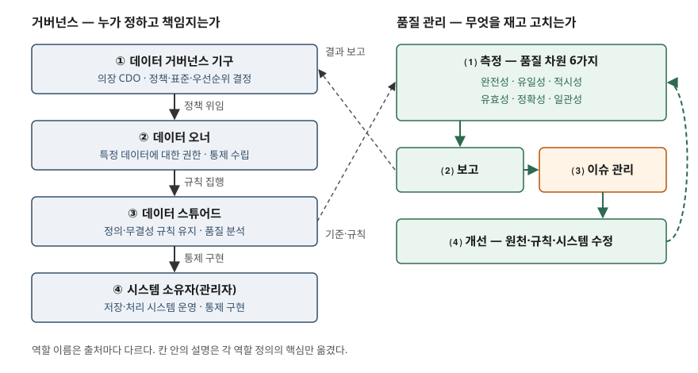

> **실행 검증 없음.** 이 글은 표준·정부 발간물·전문 단체 문서의 정의와 분류를 정리한 개념 글이다.
> 실행 예제가 없고, 도입 효과 수치는 싣지 않았다. 본문의 백분율은 원문 예시의 계산을 옮긴 것이다.

## 들어가며

품질 문제는 대개 "같은 고객이 두 번 들어가 있다", "주소가 비었다" 같은 개별 결함으로 드러난다.
결함을 고치는 일은 쉽지만, **누가 그 데이터의 기준을 정하고 고칠 권한이 있는지**가 정해져
있지 않으면 같은 결함이 다음 달에 다시 나온다. 그래서 시험은 품질 지표만 묻지 않고
**거버넌스 체계와 역할을 함께** 묻는다. 답안에는 지표 6개, 활동 6개, 역할 4계층을 개수와 함께
쓰고, 셋이 어떻게 이어지는지를 보여야 한다.

## 정의

**데이터 거버넌스**는 DAMA-DMBOK2의 정의가 가장 널리 인용된다. **데이터 자산의 관리에 대해
권한·통제·공동 의사결정(계획·감시·집행)을 행사하는 것**이다. 미국 연방 데이터 전략 플레이북은
같은 대상을 **데이터를 전략 자산으로 관리·활용하기 위한 우선순위를 정하고 집행하는 과정**으로
정의한다. 앞의 것은 권한의 행사를, 뒤의 것은 우선순위 결정을 앞세운다. 답안에는 DMBOK2
정의를 쓰고 "의사결정 권한과 책임의 체계"라고 한 줄로 풀면 된다.

**데이터 품질**은 ISO/IEC 25012가 **명시된 조건에서 사용될 때 데이터의 특성이 명시적·묵시적
요구를 만족시키는 정도**로 정의한다. 품질은 데이터 자체의 성질이 아니라 **요구 대비 정도**라는 점이 핵심이다.

## 등장 배경

데이터 관리 기술(DB, 웨어하우스, 마스터 데이터)은 데이터를 저장하고 옮기는 방법을 준다.
그러나 **어떤 값이 맞는지, 누가 그것을 정하는지**는 기술이 답하지 않는다. 이 공백에서 세
문제가 생긴다.

- 부서마다 같은 용어를 다르게 정의해, 시스템을 이으면 값이 서로 어긋난다
- 결함을 발견한 사람은 있는데 원천을 고칠 권한을 가진 사람이 없다
- 품질을 재는 기준이 없어 "데이터가 나쁘다"는 말이 측정 없이 오간다

DAMA UK 작업반은 2013년 백서에서 품질 차원이 **전문가 사이에서도 합의돼 있지 않아** 혼란이
크다는 점을 작성 동기로 적었다. 거버넌스는 권한을, 품질 차원은 측정 기준을 정해 이 공백을 메운다.

## 구성요소

### 거버넌스 활동 — 6가지

미국 연방 데이터 전략 플레이북은 데이터 거버넌스의 핵심 활동을 **6가지**로 든다.

| 활동 | 하는 일 |
|---|---|
| ① 식별 | 데이터 자산을 찾고 메타데이터를 갖춘 목록(인벤토리)을 만든다 |
| ② 정책 | 데이터의 생성·획득·프라이버시·무결성·보안·품질·사용을 다루는 기본 규칙을 정한다 |
| ③ 이슈 관리 | 데이터 활용을 막는 장애를 찾아 해결하는 절차를 둔다 |
| ④ 평가 | 데이터의 품질·효용·영향을 측정하는 절차를 둔다 |
| ⑤ 감독 | 데이터 자산과 개선 조치를 감시한다 |
| ⑥ 소통 | 직원·관리자에게 정보가 흐르는 경로를 만든다 |

### 품질 차원 — 6가지

DAMA UK 백서(2013)가 정리하고 영국 정부 데이터 품질 프레임워크(2020)가 그대로 채택한
**6가지** 차원이다. 차원마다 **측정 단위**가 정해져 있다는 점이 답안에서 점수가 된다.

| 차원 | 정의 | 측정 단위 |
|---|---|---|
| ① 완전성 | 저장된 데이터가 "100% 완전"이라는 잠재치에 대해 차지하는 비율 | 백분율 |
| ② 유일성 | 식별 기준상 같은 대상이 두 번 이상 기록되지 않음 | 백분율 |
| ③ 적시성 | 요구된 시점의 현실을 데이터가 나타내는 정도 | 시간(차이) |
| ④ 유효성 | 정의된 구문(형식·타입·범위)을 따르는 정도 | 유효 항목 비율 |
| ⑤ 정확성 | 기술 대상인 현실의 객체·사건을 올바르게 기술하는 정도 | 정확성 규칙 통과 비율 |
| ⑥ 일관성 | 한 대상의 둘 이상의 표현을 정의와 비교했을 때 차이가 없음 | 백분율 |

백서는 계산 예도 싣는다. 학생 300명 중 비상 연락처가 채워진 기록이 294건이면 완전성은
294/300 = 98%다. 실제 학생은 500명인데 기록이 520건이면 유일성은 500/520 ≈ 96.2%다.

### 역할 — 4계층

| 계층 | 역할 | 근거 정의 |
|---|---|---|
| ① 결정 | 데이터 거버넌스 기구 | 기관장이 승인하고 **CDO가 의장**을 맡는다. 정책·절차·역할을 정하고 자원 배분 우선순위를 정한다(연방 데이터 전략) |
| ② 책임 | 데이터 오너 | 특정 정보에 법적·운영상 권한을 갖고, 그 정보의 생성·수집·처리·배포·폐기 통제를 정하는 책임자(NIST의 information owner 정의) |
| ③ 집행 | 데이터 스튜어드 | 정책을 집행하고, 데이터 정의와 무결성 규칙을 유지하며 품질을 분석한다(CNSSI 4009) |
| ④ 구현 | 시스템 소유자(관리자) | 정보시스템의 조달·개발·통합·운영·유지보수 전체를 책임진다(NIST) |

역할 이름은 출처마다 다르다. 업계에서는 ④를 **데이터 관리자(custodian)** 라고 부르는 경우가
많지만, 이 이름의 표준 정의는 찾지 못해 NIST의 정보시스템 소유자 정의로 대신했다.

## 도식

> **출처**: [Federal Data Strategy Data Governance Playbook (2020-07)](https://resources.data.gov/assets/documents/fds-data-governance-playbook.pdf) Play 1 Step 1(거버넌스 기구와 6가지 활동), [NIST CSRC Glossary — information owner](https://csrc.nist.gov/glossary/term/information_owner) · [data steward](https://csrc.nist.gov/glossary/term/data_steward) · [information system owner](https://csrc.nist.gov/glossary/term/information_system_owner), [DAMA UK — The Six Primary Dimensions for Data Quality Assessment (2013-10)](https://files.fluxicon.com/Cafe/The-Six-Primary-Dimensions-for-Data-Quality-Assessment.pdf)을 합쳐 그렸다.

왼쪽은 권한이 위에서 아래로 위임되는 경로이고, 오른쪽은 품질이 측정되고 고쳐지는 순환이다.
둘을 잇는 것이 **스튜어드**다. 스튜어드가 정한 규칙이 측정의 기준(유효성의 형식, 완전성의
"100%")이 되고, 측정 결과는 거버넌스 기구로 보고되어 다음 정책을 바꾼다.

## 비교

### DAMA UK 6차원과 ISO/IEC 25012 15특성

| 구분 | DAMA UK 6차원 | ISO/IEC 25012 |
|---|---|---|
| 개수 | 6 | 15 (고유 5 · 고유·시스템 의존 7 · 시스템 의존 3) |
| 관점 | 데이터 값과 기록을 **측정**하는 실무 지표 | 데이터와 그것을 담은 **시스템**까지 포함한 품질 모델 |
| 같은 이름 | 완전성·정확성·일관성 | 완전성·정확성·일관성 (고유 특성) |
| 비슷한 개념 | 적시성 | 현재성(currentness) |
| 같은 이름이 없음 | 유일성·유효성 | 신뢰성·접근성·기밀성·가용성·복구성 등 |

25012의 상세 분류는 [ISO/IEC 5259 글](../../data-analysis/2026-09-30-iso-iec-5259-data-quality-series/index.md)에 정리했다.
답안에서 "품질 지표 6가지"를 물으면 DAMA UK를, "품질 특성"이나 "표준"을 물으면 25012를 쓴다.

### 오너·스튜어드·시스템 소유자

| | 데이터 오너 | 데이터 스튜어드 | 시스템 소유자 |
|---|---|---|---|
| 묻는 것 | 이 데이터를 어떻게 통제할 것인가 | 규칙대로 관리되고 있는가 | 시스템이 통제를 구현하는가 |
| 성격 | 권한·책임 | 정의·규칙·품질 | 기술 운영 |
| 주로 속한 곳 | 업무 부서 | 업무와 IT 사이 | IT 부서 |

## 적용 시 고려사항

- **핵심 데이터부터 잰다.** DAMA UK는 완전성을 **중요 데이터부터** 측정하라고 적는다. 업무에
  중요하지 않은 항목의 결측은 문제가 되지 않을 수 있다. 전 항목을 한 번에 재면 결과가 많아도
  우선순위가 서지 않는다.
- **"100%"의 기준은 업무 규칙이 정한다.** 완전성의 기준도, 유효성의 형식·범위도 메타데이터와
  업무 규칙에서 나온다. 규칙을 정하는 스튜어드가 없으면 지표는 계산되지 않는다.
- **차원 하나로 판단하지 않는다.** 필수 항목이면 완전성은 100%가 되지만, 채워진 값이 맞는지는
  유효성·정확성을 따로 봐야 한다. 백서는 유효성이나 정확성 없이도 일관성은 성립할 수 있다고 적는다.
- **생명주기 단계마다 측정한다.** 영국 프레임워크는 계획 → 수집 → 준비·저장 → 사용 → 공유 →
  보관·폐기의 **6단계** 생명주기 전반에서 품질을 평가하라고 한다. 적재 시점에만 재면 사용
  단계에서 생긴 결함을 놓친다.
- **성숙도 평가로 시작한다.** 연방 데이터 전략은 성숙도 평가를 거버넌스 기구가 가장 먼저
  할 활동 가운데 하나로 둔다. 기구를 세우는 데는 몇 달이면 되지만 결정을 일상 업무에 녹이는 데는 몇 년이 걸릴 수
  있다고 적는다.

## 정리

- 정의: 거버넌스는 데이터 자산 관리에 대한 **권한·통제·공동 의사결정의 행사**(DMBOK2),
  품질은 특성이 **요구를 만족시키는 정도**(ISO/IEC 25012).
- 품질 차원 **6가지 "완·유·적·효·정·일"** — 완전성, 유일성, 적시성, 유효성, 정확성, 일관성.
  측정 단위는 적시성만 **시간**, 나머지는 **비율**.
- 거버넌스 활동 **6가지** — 식별, 정책, 이슈 관리, 평가, 감독, 소통.
- 역할 **4계층 "결·책·집·구"** — 기구(CDO) 결정, 오너 책임, 스튜어드 집행, 시스템 소유자 구현.
- 둘을 잇는 고리는 **스튜어드**다. 규칙을 정해 측정을 가능하게 하고, 측정 결과를 위로 올린다.

> 관련 개념: [ISO/IEC 5259 — 분석·머신러닝용 데이터 품질 표준 시리즈](../../data-analysis/2026-09-30-iso-iec-5259-data-quality-series/index.md)

## 참고 자료

- [DAMA International — DAMA-DMBOK: Data Management Body of Knowledge, 2nd Edition (2017)](https://www.dama.org/cpages/body-of-knowledge) — 3장 Data Governance
- [DAMA UK Working Group — The Six Primary Dimensions for Data Quality Assessment (2013-10)](https://files.fluxicon.com/Cafe/The-Six-Primary-Dimensions-for-Data-Quality-Assessment.pdf) (제3자 게재본)
- [UK Government — The Government Data Quality Framework (2020-12-03)](https://www.gov.uk/government/publications/the-government-data-quality-framework/the-government-data-quality-framework)
- [Federal Data Strategy — Data Governance Playbook (2020-07)](https://resources.data.gov/assets/documents/fds-data-governance-playbook.pdf)
- [ISO/IEC 25012:2008, SQuaRE — Data quality model](https://www.iso.org/standard/35736.html)
- [NIST CSRC Glossary — information owner](https://csrc.nist.gov/glossary/term/information_owner) · [data steward (CNSSI 4009-2022)](https://csrc.nist.gov/glossary/term/data_steward) · [information system owner](https://csrc.nist.gov/glossary/term/information_system_owner)
